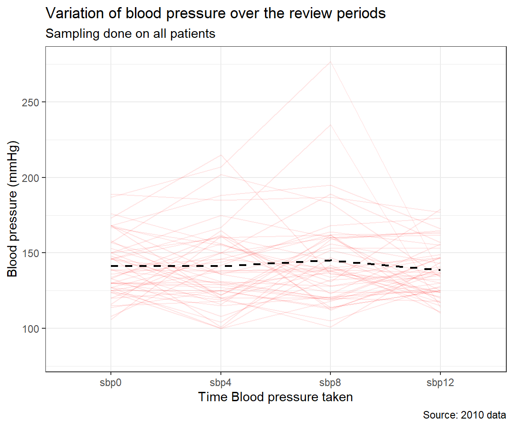

# Analysis of Variance


## Introduction
Hypertension, an elevated blood pressure beyond normal, is a very common medical 
condition, especially in adults. To treat this condition, persons with hypertension 
are often given blood pressure-lowering drugs. There are many types of this drug, 
with varying blood pressure-lowering effects when taken. In a study to identify 
the blood pressure-lowering effect, four drugs, here called A, B, C and D 
were randomly administered to persons with hypertension.
Their systolic blood pressure (SBP) was measured before and after administration 
of the drugs.

The drop in SBP was then recorded. The data `systolic.txt` was captured from this 
study. The variables in the data include `drug`, the drug administered with 1, 2, 
3, and 4 representing drugs A, B, C and D, respectively. The other variables in 
the data are `disease` representing other diseases present in the patient with 1, 
2, 3 representing Asthma, Diabetes Mellitus (DM) and Obesity, and systolic 
representing the drop in systolic blood pressure a week after starting the drug.

We first read the data and summarise it.


```r
df_syst <- 
    read.table(".\\Data\\systolic.txt") %>% 
    mutate(
        drug = factor(drug, levels = 1:4, labels = c("A", "B", "C", "D")),
        disease = factor(
            disease, levels = 1:3, 
            labels = c("Asthma", "DM", "Obesity")
        )
    )
```


```r
df_syst %>% summarytools::dfSummary(graph.col = F)
Data Frame Summary  
df_syst  
Dimensions: 58 x 3  
Duplicates: 3  

------------------------------------------------------------------------------------
No   Variable    Stats / Values            Freqs (% of Valid)   Valid      Missing  
---- ----------- ------------------------- -------------------- ---------- ---------
1    drug        1. A                      15 (25.9%)           58         0        
     [factor]    2. B                      15 (25.9%)           (100.0%)   (0.0%)   
                 3. C                      12 (20.7%)                               
                 4. D                      16 (27.6%)                               

2    disease     1. Asthma                 19 (32.8%)           58         0        
     [factor]    2. DM                     19 (32.8%)           (100.0%)   (0.0%)   
                 3. Obesity                20 (34.5%)                               

3    systolic    Mean (sd) : 18.9 (12.8)   32 distinct values   58         0        
     [integer]   min < med < max:                               (100.0%)   (0.0%)   
                 -6 < 21 < 44                                                       
                 IQR (CV) : 19 (0.7)                                                
------------------------------------------------------------------------------------
```


As the data analyst, the investigator asks you to determine from the data which 
drug has the highest blood pressure-lowering effect and the best and worst 
performing drugs. Recollect that if there were only two drugs we would most 
likely to performing a Student t-test for this.

However, we have four categories and cannot answer these questions with 
the t-test. This is where the Analysis of Variance (ANOVA) in its simplest form 
kicks in. First, we visualize the distribution of the SBP-lowering effect in all 
four drugs in the boxplot below:


```r
df_syst %>% 
    ggplot(aes(x = drug, y = systolic, color = drug)) +
    geom_boxplot()+
    labs(title = "Decrease in systolic BP for the various drugs",
         x = "Drug", color = "Drug", 
         y = "Change in SBP (mmHg)")+
    theme_bw()
```


Summarizing the change in SBP by the drugs administered we have


```r
df_syst %>% 
    group_by(drug) %>% 
    rstatix::get_summary_stats(type = "common")
```


```{=html}
<table class="huxtable" style="border-collapse: collapse; border: 0px; margin-bottom: 2em; margin-top: 2em; ; margin-left: auto; margin-right: auto;  " id="tab:unnamed-chunk-6">
<caption style="caption-side: top; text-align: center;">(#tab:unnamed-chunk-6) </caption><col><col><col><col><col><col><col><col><col><col><col><tr>
<th style="vertical-align: top; text-align: left; white-space: normal; border-style: solid solid solid solid; border-width: 0.4pt 0pt 0.4pt 0pt;    padding: 2pt 6pt 2pt 0pt; font-weight: bold; font-family: Arial, Times New Roman, Times, Serif; font-size: 11pt;">drug</th><th style="vertical-align: top; text-align: left; white-space: normal; border-style: solid solid solid solid; border-width: 0.4pt 0pt 0.4pt 0pt;    padding: 2pt 6pt 2pt 6pt; font-weight: bold; font-family: Arial, Times New Roman, Times, Serif; font-size: 11pt;">variable</th><th style="vertical-align: top; text-align: right; white-space: normal; border-style: solid solid solid solid; border-width: 0.4pt 0pt 0.4pt 0pt;    padding: 2pt 6pt 2pt 6pt; font-weight: bold; font-family: Arial, Times New Roman, Times, Serif; font-size: 11pt;">n</th><th style="vertical-align: top; text-align: right; white-space: normal; border-style: solid solid solid solid; border-width: 0.4pt 0pt 0.4pt 0pt;    padding: 2pt 6pt 2pt 6pt; font-weight: bold; font-family: Arial, Times New Roman, Times, Serif; font-size: 11pt;">min</th><th style="vertical-align: top; text-align: right; white-space: normal; border-style: solid solid solid solid; border-width: 0.4pt 0pt 0.4pt 0pt;    padding: 2pt 6pt 2pt 6pt; font-weight: bold; font-family: Arial, Times New Roman, Times, Serif; font-size: 11pt;">max</th><th style="vertical-align: top; text-align: right; white-space: normal; border-style: solid solid solid solid; border-width: 0.4pt 0pt 0.4pt 0pt;    padding: 2pt 6pt 2pt 6pt; font-weight: bold; font-family: Arial, Times New Roman, Times, Serif; font-size: 11pt;">median</th><th style="vertical-align: top; text-align: right; white-space: normal; border-style: solid solid solid solid; border-width: 0.4pt 0pt 0.4pt 0pt;    padding: 2pt 6pt 2pt 6pt; font-weight: bold; font-family: Arial, Times New Roman, Times, Serif; font-size: 11pt;">iqr</th><th style="vertical-align: top; text-align: right; white-space: normal; border-style: solid solid solid solid; border-width: 0.4pt 0pt 0.4pt 0pt;    padding: 2pt 6pt 2pt 6pt; font-weight: bold; font-family: Arial, Times New Roman, Times, Serif; font-size: 11pt;">mean</th><th style="vertical-align: top; text-align: right; white-space: normal; border-style: solid solid solid solid; border-width: 0.4pt 0pt 0.4pt 0pt;    padding: 2pt 6pt 2pt 6pt; font-weight: bold; font-family: Arial, Times New Roman, Times, Serif; font-size: 11pt;">sd</th><th style="vertical-align: top; text-align: right; white-space: normal; border-style: solid solid solid solid; border-width: 0.4pt 0pt 0.4pt 0pt;    padding: 2pt 6pt 2pt 6pt; font-weight: bold; font-family: Arial, Times New Roman, Times, Serif; font-size: 11pt;">se</th><th style="vertical-align: top; text-align: right; white-space: normal; border-style: solid solid solid solid; border-width: 0.4pt 0pt 0.4pt 0pt;    padding: 2pt 0pt 2pt 6pt; font-weight: bold; font-family: Arial, Times New Roman, Times, Serif; font-size: 11pt;">ci</th></tr>
<tr>
<td style="vertical-align: top; text-align: left; white-space: normal; border-style: solid solid solid solid; border-width: 0.4pt 0pt 0pt 0pt;    padding: 2pt 6pt 2pt 0pt; font-weight: normal; font-family: Arial, Times New Roman, Times, Serif; font-size: 11pt;">A</td><td style="vertical-align: top; text-align: left; white-space: normal; border-style: solid solid solid solid; border-width: 0.4pt 0pt 0pt 0pt;    padding: 2pt 6pt 2pt 6pt; font-weight: normal; font-family: Arial, Times New Roman, Times, Serif; font-size: 11pt;">systolic</td><td style="vertical-align: top; text-align: right; white-space: normal; border-style: solid solid solid solid; border-width: 0.4pt 0pt 0pt 0pt;    padding: 2pt 6pt 2pt 6pt; font-weight: normal; font-family: Arial, Times New Roman, Times, Serif; font-size: 11pt;">15</td><td style="vertical-align: top; text-align: right; white-space: normal; border-style: solid solid solid solid; border-width: 0.4pt 0pt 0pt 0pt;    padding: 2pt 6pt 2pt 6pt; font-weight: normal; font-family: Arial, Times New Roman, Times, Serif; font-size: 11pt;">-3</td><td style="vertical-align: top; text-align: right; white-space: normal; border-style: solid solid solid solid; border-width: 0.4pt 0pt 0pt 0pt;    padding: 2pt 6pt 2pt 6pt; font-weight: normal; font-family: Arial, Times New Roman, Times, Serif; font-size: 11pt;">44</td><td style="vertical-align: top; text-align: right; white-space: normal; border-style: solid solid solid solid; border-width: 0.4pt 0pt 0pt 0pt;    padding: 2pt 6pt 2pt 6pt; font-weight: normal; font-family: Arial, Times New Roman, Times, Serif; font-size: 11pt;">25&nbsp;&nbsp;</td><td style="vertical-align: top; text-align: right; white-space: normal; border-style: solid solid solid solid; border-width: 0.4pt 0pt 0pt 0pt;    padding: 2pt 6pt 2pt 6pt; font-weight: normal; font-family: Arial, Times New Roman, Times, Serif; font-size: 11pt;">11.5</td><td style="vertical-align: top; text-align: right; white-space: normal; border-style: solid solid solid solid; border-width: 0.4pt 0pt 0pt 0pt;    padding: 2pt 6pt 2pt 6pt; font-weight: normal; font-family: Arial, Times New Roman, Times, Serif; font-size: 11pt;">26.1&nbsp;</td><td style="vertical-align: top; text-align: right; white-space: normal; border-style: solid solid solid solid; border-width: 0.4pt 0pt 0pt 0pt;    padding: 2pt 6pt 2pt 6pt; font-weight: normal; font-family: Arial, Times New Roman, Times, Serif; font-size: 11pt;">11.7&nbsp;</td><td style="vertical-align: top; text-align: right; white-space: normal; border-style: solid solid solid solid; border-width: 0.4pt 0pt 0pt 0pt;    padding: 2pt 6pt 2pt 6pt; font-weight: normal; font-family: Arial, Times New Roman, Times, Serif; font-size: 11pt;">3.02</td><td style="vertical-align: top; text-align: right; white-space: normal; border-style: solid solid solid solid; border-width: 0.4pt 0pt 0pt 0pt;    padding: 2pt 0pt 2pt 6pt; font-weight: normal; font-family: Arial, Times New Roman, Times, Serif; font-size: 11pt;">6.47</td></tr>
<tr>
<td style="vertical-align: top; text-align: left; white-space: normal; border-style: solid solid solid solid; border-width: 0pt 0pt 0pt 0pt;    padding: 2pt 6pt 2pt 0pt; font-weight: normal; font-family: Arial, Times New Roman, Times, Serif; font-size: 11pt;">B</td><td style="vertical-align: top; text-align: left; white-space: normal; border-style: solid solid solid solid; border-width: 0pt 0pt 0pt 0pt;    padding: 2pt 6pt 2pt 6pt; font-weight: normal; font-family: Arial, Times New Roman, Times, Serif; font-size: 11pt;">systolic</td><td style="vertical-align: top; text-align: right; white-space: normal; border-style: solid solid solid solid; border-width: 0pt 0pt 0pt 0pt;    padding: 2pt 6pt 2pt 6pt; font-weight: normal; font-family: Arial, Times New Roman, Times, Serif; font-size: 11pt;">15</td><td style="vertical-align: top; text-align: right; white-space: normal; border-style: solid solid solid solid; border-width: 0pt 0pt 0pt 0pt;    padding: 2pt 6pt 2pt 6pt; font-weight: normal; font-family: Arial, Times New Roman, Times, Serif; font-size: 11pt;">3</td><td style="vertical-align: top; text-align: right; white-space: normal; border-style: solid solid solid solid; border-width: 0pt 0pt 0pt 0pt;    padding: 2pt 6pt 2pt 6pt; font-weight: normal; font-family: Arial, Times New Roman, Times, Serif; font-size: 11pt;">42</td><td style="vertical-align: top; text-align: right; white-space: normal; border-style: solid solid solid solid; border-width: 0pt 0pt 0pt 0pt;    padding: 2pt 6pt 2pt 6pt; font-weight: normal; font-family: Arial, Times New Roman, Times, Serif; font-size: 11pt;">28&nbsp;&nbsp;</td><td style="vertical-align: top; text-align: right; white-space: normal; border-style: solid solid solid solid; border-width: 0pt 0pt 0pt 0pt;    padding: 2pt 6pt 2pt 6pt; font-weight: normal; font-family: Arial, Times New Roman, Times, Serif; font-size: 11pt;">14&nbsp;&nbsp;</td><td style="vertical-align: top; text-align: right; white-space: normal; border-style: solid solid solid solid; border-width: 0pt 0pt 0pt 0pt;    padding: 2pt 6pt 2pt 6pt; font-weight: normal; font-family: Arial, Times New Roman, Times, Serif; font-size: 11pt;">25.5&nbsp;</td><td style="vertical-align: top; text-align: right; white-space: normal; border-style: solid solid solid solid; border-width: 0pt 0pt 0pt 0pt;    padding: 2pt 6pt 2pt 6pt; font-weight: normal; font-family: Arial, Times New Roman, Times, Serif; font-size: 11pt;">11.6&nbsp;</td><td style="vertical-align: top; text-align: right; white-space: normal; border-style: solid solid solid solid; border-width: 0pt 0pt 0pt 0pt;    padding: 2pt 6pt 2pt 6pt; font-weight: normal; font-family: Arial, Times New Roman, Times, Serif; font-size: 11pt;">3&nbsp;&nbsp;&nbsp;</td><td style="vertical-align: top; text-align: right; white-space: normal; border-style: solid solid solid solid; border-width: 0pt 0pt 0pt 0pt;    padding: 2pt 0pt 2pt 6pt; font-weight: normal; font-family: Arial, Times New Roman, Times, Serif; font-size: 11pt;">6.43</td></tr>
<tr>
<td style="vertical-align: top; text-align: left; white-space: normal; border-style: solid solid solid solid; border-width: 0pt 0pt 0pt 0pt;    padding: 2pt 6pt 2pt 0pt; font-weight: normal; font-family: Arial, Times New Roman, Times, Serif; font-size: 11pt;">C</td><td style="vertical-align: top; text-align: left; white-space: normal; border-style: solid solid solid solid; border-width: 0pt 0pt 0pt 0pt;    padding: 2pt 6pt 2pt 6pt; font-weight: normal; font-family: Arial, Times New Roman, Times, Serif; font-size: 11pt;">systolic</td><td style="vertical-align: top; text-align: right; white-space: normal; border-style: solid solid solid solid; border-width: 0pt 0pt 0pt 0pt;    padding: 2pt 6pt 2pt 6pt; font-weight: normal; font-family: Arial, Times New Roman, Times, Serif; font-size: 11pt;">12</td><td style="vertical-align: top; text-align: right; white-space: normal; border-style: solid solid solid solid; border-width: 0pt 0pt 0pt 0pt;    padding: 2pt 6pt 2pt 6pt; font-weight: normal; font-family: Arial, Times New Roman, Times, Serif; font-size: 11pt;">-6</td><td style="vertical-align: top; text-align: right; white-space: normal; border-style: solid solid solid solid; border-width: 0pt 0pt 0pt 0pt;    padding: 2pt 6pt 2pt 6pt; font-weight: normal; font-family: Arial, Times New Roman, Times, Serif; font-size: 11pt;">29</td><td style="vertical-align: top; text-align: right; white-space: normal; border-style: solid solid solid solid; border-width: 0pt 0pt 0pt 0pt;    padding: 2pt 6pt 2pt 6pt; font-weight: normal; font-family: Arial, Times New Roman, Times, Serif; font-size: 11pt;">8&nbsp;&nbsp;</td><td style="vertical-align: top; text-align: right; white-space: normal; border-style: solid solid solid solid; border-width: 0pt 0pt 0pt 0pt;    padding: 2pt 6pt 2pt 6pt; font-weight: normal; font-family: Arial, Times New Roman, Times, Serif; font-size: 11pt;">12&nbsp;&nbsp;</td><td style="vertical-align: top; text-align: right; white-space: normal; border-style: solid solid solid solid; border-width: 0pt 0pt 0pt 0pt;    padding: 2pt 6pt 2pt 6pt; font-weight: normal; font-family: Arial, Times New Roman, Times, Serif; font-size: 11pt;">8.75</td><td style="vertical-align: top; text-align: right; white-space: normal; border-style: solid solid solid solid; border-width: 0pt 0pt 0pt 0pt;    padding: 2pt 6pt 2pt 6pt; font-weight: normal; font-family: Arial, Times New Roman, Times, Serif; font-size: 11pt;">10&nbsp;&nbsp;&nbsp;</td><td style="vertical-align: top; text-align: right; white-space: normal; border-style: solid solid solid solid; border-width: 0pt 0pt 0pt 0pt;    padding: 2pt 6pt 2pt 6pt; font-weight: normal; font-family: Arial, Times New Roman, Times, Serif; font-size: 11pt;">2.89</td><td style="vertical-align: top; text-align: right; white-space: normal; border-style: solid solid solid solid; border-width: 0pt 0pt 0pt 0pt;    padding: 2pt 0pt 2pt 6pt; font-weight: normal; font-family: Arial, Times New Roman, Times, Serif; font-size: 11pt;">6.37</td></tr>
<tr>
<td style="vertical-align: top; text-align: left; white-space: normal; border-style: solid solid solid solid; border-width: 0pt 0pt 0.4pt 0pt;    padding: 2pt 6pt 2pt 0pt; font-weight: normal; font-family: Arial, Times New Roman, Times, Serif; font-size: 11pt;">D</td><td style="vertical-align: top; text-align: left; white-space: normal; border-style: solid solid solid solid; border-width: 0pt 0pt 0.4pt 0pt;    padding: 2pt 6pt 2pt 6pt; font-weight: normal; font-family: Arial, Times New Roman, Times, Serif; font-size: 11pt;">systolic</td><td style="vertical-align: top; text-align: right; white-space: normal; border-style: solid solid solid solid; border-width: 0pt 0pt 0.4pt 0pt;    padding: 2pt 6pt 2pt 6pt; font-weight: normal; font-family: Arial, Times New Roman, Times, Serif; font-size: 11pt;">16</td><td style="vertical-align: top; text-align: right; white-space: normal; border-style: solid solid solid solid; border-width: 0pt 0pt 0.4pt 0pt;    padding: 2pt 6pt 2pt 6pt; font-weight: normal; font-family: Arial, Times New Roman, Times, Serif; font-size: 11pt;">-5</td><td style="vertical-align: top; text-align: right; white-space: normal; border-style: solid solid solid solid; border-width: 0pt 0pt 0.4pt 0pt;    padding: 2pt 6pt 2pt 6pt; font-weight: normal; font-family: Arial, Times New Roman, Times, Serif; font-size: 11pt;">27</td><td style="vertical-align: top; text-align: right; white-space: normal; border-style: solid solid solid solid; border-width: 0pt 0pt 0.4pt 0pt;    padding: 2pt 6pt 2pt 6pt; font-weight: normal; font-family: Arial, Times New Roman, Times, Serif; font-size: 11pt;">13.5</td><td style="vertical-align: top; text-align: right; white-space: normal; border-style: solid solid solid solid; border-width: 0pt 0pt 0.4pt 0pt;    padding: 2pt 6pt 2pt 6pt; font-weight: normal; font-family: Arial, Times New Roman, Times, Serif; font-size: 11pt;">13.5</td><td style="vertical-align: top; text-align: right; white-space: normal; border-style: solid solid solid solid; border-width: 0pt 0pt 0.4pt 0pt;    padding: 2pt 6pt 2pt 6pt; font-weight: normal; font-family: Arial, Times New Roman, Times, Serif; font-size: 11pt;">13.5&nbsp;</td><td style="vertical-align: top; text-align: right; white-space: normal; border-style: solid solid solid solid; border-width: 0pt 0pt 0.4pt 0pt;    padding: 2pt 6pt 2pt 6pt; font-weight: normal; font-family: Arial, Times New Roman, Times, Serif; font-size: 11pt;">9.32</td><td style="vertical-align: top; text-align: right; white-space: normal; border-style: solid solid solid solid; border-width: 0pt 0pt 0.4pt 0pt;    padding: 2pt 6pt 2pt 6pt; font-weight: normal; font-family: Arial, Times New Roman, Times, Serif; font-size: 11pt;">2.33</td><td style="vertical-align: top; text-align: right; white-space: normal; border-style: solid solid solid solid; border-width: 0pt 0pt 0.4pt 0pt;    padding: 2pt 0pt 2pt 6pt; font-weight: normal; font-family: Arial, Times New Roman, Times, Serif; font-size: 11pt;">4.97</td></tr>
</table>

```


From the figure and the summary above it is obvious the drug with the greatest 
lowering effect appears to be A, followed by B, D and C in that order. How do we 
know if we can say for sure that B is better than A, which in turn is better 
than D etc? To answer this question we perform an ANOVA.

## One-way analysis of variance
The analysis of variance is a parametric test used to compare means for more 
than two groups. It tests the null hypothesis

> **H0**: The population means of all the groups are the same.
> **Ha**: At least one of the population means differ from the rest.

Before we do proper ANOVA we summarise the change in SBP for the different drugs, 
presenting the data with the confidence interval of the mean.

It is apparent from the confidence intervals of the mean change in systolic 
blood pressures that the effect of drug A is quite similar to that of B. 
Also, both A and B are quite different from C and D. C and D on the other hand 
have similar effects. With this preliminary finding at the back of our minds, we 
fit a linear regression model as below.


```r
df_syst %>% 
    aov(systolic ~ drug, data = .) %>% 
    broom::tidy()
```


```{=html}
<table class="huxtable" style="border-collapse: collapse; border: 0px; margin-bottom: 2em; margin-top: 2em; ; margin-left: auto; margin-right: auto;  " id="tab:unnamed-chunk-7">
<caption style="caption-side: top; text-align: center;">(#tab:unnamed-chunk-7) </caption><col><col><col><col><col><col><tr>
<th style="vertical-align: top; text-align: left; white-space: normal; border-style: solid solid solid solid; border-width: 0.4pt 0pt 0.4pt 0pt;    padding: 2pt 6pt 2pt 0pt; font-weight: bold; font-family: Arial, Times New Roman, Times, Serif; font-size: 11pt;">term</th><th style="vertical-align: top; text-align: right; white-space: normal; border-style: solid solid solid solid; border-width: 0.4pt 0pt 0.4pt 0pt;    padding: 2pt 6pt 2pt 6pt; font-weight: bold; font-family: Arial, Times New Roman, Times, Serif; font-size: 11pt;">df</th><th style="vertical-align: top; text-align: right; white-space: normal; border-style: solid solid solid solid; border-width: 0.4pt 0pt 0.4pt 0pt;    padding: 2pt 6pt 2pt 6pt; font-weight: bold; font-family: Arial, Times New Roman, Times, Serif; font-size: 11pt;">sumsq</th><th style="vertical-align: top; text-align: right; white-space: normal; border-style: solid solid solid solid; border-width: 0.4pt 0pt 0.4pt 0pt;    padding: 2pt 6pt 2pt 6pt; font-weight: bold; font-family: Arial, Times New Roman, Times, Serif; font-size: 11pt;">meansq</th><th style="vertical-align: top; text-align: right; white-space: normal; border-style: solid solid solid solid; border-width: 0.4pt 0pt 0.4pt 0pt;    padding: 2pt 6pt 2pt 6pt; font-weight: bold; font-family: Arial, Times New Roman, Times, Serif; font-size: 11pt;">statistic</th><th style="vertical-align: top; text-align: right; white-space: normal; border-style: solid solid solid solid; border-width: 0.4pt 0pt 0.4pt 0pt;    padding: 2pt 0pt 2pt 6pt; font-weight: bold; font-family: Arial, Times New Roman, Times, Serif; font-size: 11pt;">p.value</th></tr>
<tr>
<td style="vertical-align: top; text-align: left; white-space: normal; border-style: solid solid solid solid; border-width: 0.4pt 0pt 0pt 0pt;    padding: 2pt 6pt 2pt 0pt; font-weight: normal; font-family: Arial, Times New Roman, Times, Serif; font-size: 11pt;">drug</td><td style="vertical-align: top; text-align: right; white-space: normal; border-style: solid solid solid solid; border-width: 0.4pt 0pt 0pt 0pt;    padding: 2pt 6pt 2pt 6pt; font-weight: normal; font-family: Arial, Times New Roman, Times, Serif; font-size: 11pt;">3</td><td style="vertical-align: top; text-align: right; white-space: normal; border-style: solid solid solid solid; border-width: 0.4pt 0pt 0pt 0pt;    padding: 2pt 6pt 2pt 6pt; font-weight: normal; font-family: Arial, Times New Roman, Times, Serif; font-size: 11pt;">3.13e+03</td><td style="vertical-align: top; text-align: right; white-space: normal; border-style: solid solid solid solid; border-width: 0.4pt 0pt 0pt 0pt;    padding: 2pt 6pt 2pt 6pt; font-weight: normal; font-family: Arial, Times New Roman, Times, Serif; font-size: 11pt;">1.04e+03</td><td style="vertical-align: top; text-align: right; white-space: normal; border-style: solid solid solid solid; border-width: 0.4pt 0pt 0pt 0pt;    padding: 2pt 6pt 2pt 6pt; font-weight: normal; font-family: Arial, Times New Roman, Times, Serif; font-size: 11pt;">9.09</td><td style="vertical-align: top; text-align: right; white-space: normal; border-style: solid solid solid solid; border-width: 0.4pt 0pt 0pt 0pt;    padding: 2pt 0pt 2pt 6pt; font-weight: normal; font-family: Arial, Times New Roman, Times, Serif; font-size: 11pt;">5.75e-05</td></tr>
<tr>
<td style="vertical-align: top; text-align: left; white-space: normal; border-style: solid solid solid solid; border-width: 0pt 0pt 0.4pt 0pt;    padding: 2pt 6pt 2pt 0pt; font-weight: normal; font-family: Arial, Times New Roman, Times, Serif; font-size: 11pt;">Residuals</td><td style="vertical-align: top; text-align: right; white-space: normal; border-style: solid solid solid solid; border-width: 0pt 0pt 0.4pt 0pt;    padding: 2pt 6pt 2pt 6pt; font-weight: normal; font-family: Arial, Times New Roman, Times, Serif; font-size: 11pt;">54</td><td style="vertical-align: top; text-align: right; white-space: normal; border-style: solid solid solid solid; border-width: 0pt 0pt 0.4pt 0pt;    padding: 2pt 6pt 2pt 6pt; font-weight: normal; font-family: Arial, Times New Roman, Times, Serif; font-size: 11pt;">6.21e+03</td><td style="vertical-align: top; text-align: right; white-space: normal; border-style: solid solid solid solid; border-width: 0pt 0pt 0.4pt 0pt;    padding: 2pt 6pt 2pt 6pt; font-weight: normal; font-family: Arial, Times New Roman, Times, Serif; font-size: 11pt;">115&nbsp;&nbsp;&nbsp;&nbsp;&nbsp;&nbsp;&nbsp;</td><td style="vertical-align: top; text-align: right; white-space: normal; border-style: solid solid solid solid; border-width: 0pt 0pt 0.4pt 0pt;    padding: 2pt 6pt 2pt 6pt; font-weight: normal; font-family: Arial, Times New Roman, Times, Serif; font-size: 11pt;">&nbsp;&nbsp;&nbsp;</td><td style="vertical-align: top; text-align: right; white-space: normal; border-style: solid solid solid solid; border-width: 0pt 0pt 0.4pt 0pt;    padding: 2pt 0pt 2pt 6pt; font-weight: normal; font-family: Arial, Times New Roman, Times, Serif; font-size: 11pt;">&nbsp;&nbsp;&nbsp;&nbsp;&nbsp;&nbsp;&nbsp;</td></tr>
</table>

```


From the ANOVA output above we have a p-value of the order 0.000057! This is 
very small indicating at least one of our means significantly differs from the 
rest.

### Postestimation pairwise comparison
We have made the point that ANOVA only tell us at least one of the means is 
significantly different from the others. To pick up which drug's mean effect(s) 
differ from the others we use post-estimation tests. An example is the 
Pairwise t-test.

So why don't we just do multiple T-tests and present the results as such? This 
is because the t-test is not designed for this. The significance level is only 
set up for single comparisons not multiple meaning the p-values obtained for 
such comparison will be invalid. Many authors have come up with ways of 
correcting these p-values with the common one implemented in R listed below. The 
following is an extract from the help page of function` p.adjust()`.

>"The adjustment methods include the Bonferroni correction ("Bonferroni") in which
the p-values are multiplied by the number of comparisons. Less conservative cor-
reactions are also included by Holm (1979) ("Holm"), Hochberg (1988) ("Hochberg"),
Hommel (1988) ("hommel"), Benjamini & Hochberg (1995) ("BH" or its alias "fdr"),
and Benjamini & Yekutieli (2001) ("BY"), respectively. A pass-through option
("none") is also included."

Below we determine the p-values for the multiple comparisons of the various drugs 
using the "holm" method


```r
df_syst %$% 
    pairwise.t.test(
        x = systolic, g = drug, data = ., p.adjust.methods = "holm"
        ) %>% 
    broom::tidy()
```


```{=html}
<table class="huxtable" style="border-collapse: collapse; border: 0px; margin-bottom: 2em; margin-top: 2em; ; margin-left: auto; margin-right: auto;  " id="tab:unnamed-chunk-8">
<caption style="caption-side: top; text-align: center;">(#tab:unnamed-chunk-8) </caption><col><col><col><tr>
<th style="vertical-align: top; text-align: left; white-space: normal; border-style: solid solid solid solid; border-width: 0.4pt 0pt 0.4pt 0pt;    padding: 2pt 6pt 2pt 0pt; font-weight: bold; font-family: Arial, Times New Roman, Times, Serif; font-size: 11pt;">group1</th><th style="vertical-align: top; text-align: left; white-space: normal; border-style: solid solid solid solid; border-width: 0.4pt 0pt 0.4pt 0pt;    padding: 2pt 6pt 2pt 6pt; font-weight: bold; font-family: Arial, Times New Roman, Times, Serif; font-size: 11pt;">group2</th><th style="vertical-align: top; text-align: right; white-space: normal; border-style: solid solid solid solid; border-width: 0.4pt 0pt 0.4pt 0pt;    padding: 2pt 0pt 2pt 6pt; font-weight: bold; font-family: Arial, Times New Roman, Times, Serif; font-size: 11pt;">p.value</th></tr>
<tr>
<td style="vertical-align: top; text-align: left; white-space: normal; border-style: solid solid solid solid; border-width: 0.4pt 0pt 0pt 0pt;    padding: 2pt 6pt 2pt 0pt; font-weight: normal; font-family: Arial, Times New Roman, Times, Serif; font-size: 11pt;">B</td><td style="vertical-align: top; text-align: left; white-space: normal; border-style: solid solid solid solid; border-width: 0.4pt 0pt 0pt 0pt;    padding: 2pt 6pt 2pt 6pt; font-weight: normal; font-family: Arial, Times New Roman, Times, Serif; font-size: 11pt;">A</td><td style="vertical-align: top; text-align: right; white-space: normal; border-style: solid solid solid solid; border-width: 0.4pt 0pt 0pt 0pt;    padding: 2pt 0pt 2pt 6pt; font-weight: normal; font-family: Arial, Times New Roman, Times, Serif; font-size: 11pt;">0.892&nbsp;&nbsp;&nbsp;</td></tr>
<tr>
<td style="vertical-align: top; text-align: left; white-space: normal; border-style: solid solid solid solid; border-width: 0pt 0pt 0pt 0pt;    padding: 2pt 6pt 2pt 0pt; font-weight: normal; font-family: Arial, Times New Roman, Times, Serif; font-size: 11pt;">C</td><td style="vertical-align: top; text-align: left; white-space: normal; border-style: solid solid solid solid; border-width: 0pt 0pt 0pt 0pt;    padding: 2pt 6pt 2pt 6pt; font-weight: normal; font-family: Arial, Times New Roman, Times, Serif; font-size: 11pt;">A</td><td style="vertical-align: top; text-align: right; white-space: normal; border-style: solid solid solid solid; border-width: 0pt 0pt 0pt 0pt;    padding: 2pt 0pt 2pt 6pt; font-weight: normal; font-family: Arial, Times New Roman, Times, Serif; font-size: 11pt;">0.000665</td></tr>
<tr>
<td style="vertical-align: top; text-align: left; white-space: normal; border-style: solid solid solid solid; border-width: 0pt 0pt 0pt 0pt;    padding: 2pt 6pt 2pt 0pt; font-weight: normal; font-family: Arial, Times New Roman, Times, Serif; font-size: 11pt;">C</td><td style="vertical-align: top; text-align: left; white-space: normal; border-style: solid solid solid solid; border-width: 0pt 0pt 0pt 0pt;    padding: 2pt 6pt 2pt 6pt; font-weight: normal; font-family: Arial, Times New Roman, Times, Serif; font-size: 11pt;">B</td><td style="vertical-align: top; text-align: right; white-space: normal; border-style: solid solid solid solid; border-width: 0pt 0pt 0pt 0pt;    padding: 2pt 0pt 2pt 6pt; font-weight: normal; font-family: Arial, Times New Roman, Times, Serif; font-size: 11pt;">0.000846</td></tr>
<tr>
<td style="vertical-align: top; text-align: left; white-space: normal; border-style: solid solid solid solid; border-width: 0pt 0pt 0pt 0pt;    padding: 2pt 6pt 2pt 0pt; font-weight: normal; font-family: Arial, Times New Roman, Times, Serif; font-size: 11pt;">D</td><td style="vertical-align: top; text-align: left; white-space: normal; border-style: solid solid solid solid; border-width: 0pt 0pt 0pt 0pt;    padding: 2pt 6pt 2pt 6pt; font-weight: normal; font-family: Arial, Times New Roman, Times, Serif; font-size: 11pt;">A</td><td style="vertical-align: top; text-align: right; white-space: normal; border-style: solid solid solid solid; border-width: 0pt 0pt 0pt 0pt;    padding: 2pt 0pt 2pt 6pt; font-weight: normal; font-family: Arial, Times New Roman, Times, Serif; font-size: 11pt;">0.00769&nbsp;</td></tr>
<tr>
<td style="vertical-align: top; text-align: left; white-space: normal; border-style: solid solid solid solid; border-width: 0pt 0pt 0pt 0pt;    padding: 2pt 6pt 2pt 0pt; font-weight: normal; font-family: Arial, Times New Roman, Times, Serif; font-size: 11pt;">D</td><td style="vertical-align: top; text-align: left; white-space: normal; border-style: solid solid solid solid; border-width: 0pt 0pt 0pt 0pt;    padding: 2pt 6pt 2pt 6pt; font-weight: normal; font-family: Arial, Times New Roman, Times, Serif; font-size: 11pt;">B</td><td style="vertical-align: top; text-align: right; white-space: normal; border-style: solid solid solid solid; border-width: 0pt 0pt 0pt 0pt;    padding: 2pt 0pt 2pt 6pt; font-weight: normal; font-family: Arial, Times New Roman, Times, Serif; font-size: 11pt;">0.00863&nbsp;</td></tr>
<tr>
<td style="vertical-align: top; text-align: left; white-space: normal; border-style: solid solid solid solid; border-width: 0pt 0pt 0.4pt 0pt;    padding: 2pt 6pt 2pt 0pt; font-weight: normal; font-family: Arial, Times New Roman, Times, Serif; font-size: 11pt;">D</td><td style="vertical-align: top; text-align: left; white-space: normal; border-style: solid solid solid solid; border-width: 0pt 0pt 0.4pt 0pt;    padding: 2pt 6pt 2pt 6pt; font-weight: normal; font-family: Arial, Times New Roman, Times, Serif; font-size: 11pt;">C</td><td style="vertical-align: top; text-align: right; white-space: normal; border-style: solid solid solid solid; border-width: 0pt 0pt 0.4pt 0pt;    padding: 2pt 0pt 2pt 6pt; font-weight: normal; font-family: Arial, Times New Roman, Times, Serif; font-size: 11pt;">0.502&nbsp;&nbsp;&nbsp;</td></tr>
</table>

```


The analysis output generated above are p-values of pairwise comparison of the 
means of the decrease in SBP for the various drugs. It can be inferred that the 
difference in the reduction between A and B is not significant (p-value: 0.89214). 
In other words, the reduction obtained for the two drugs can be said to be 
comparable. However, there is a significant difference between both A and C, A 
and D, B and C, and B and D. Also there isn't a significant difference between C 
and D (p-value: 0.50216). An arguably more informative way of showing these 
pairwise differences can be obtained in R by the use of Tukey's 
post-estimation test. 


```r
df_syst %>% 
    aov(systolic ~ drug, data = .) %>% 
    TukeyHSD() %>% 
    broom::tidy()
```


```{=html}
<table class="huxtable" style="border-collapse: collapse; border: 0px; margin-bottom: 2em; margin-top: 2em; ; margin-left: auto; margin-right: auto;  " id="tab:unnamed-chunk-9">
<caption style="caption-side: top; text-align: center;">(#tab:unnamed-chunk-9) </caption><col><col><col><col><col><col><col><tr>
<th style="vertical-align: top; text-align: left; white-space: normal; border-style: solid solid solid solid; border-width: 0.4pt 0pt 0.4pt 0pt;    padding: 2pt 6pt 2pt 0pt; font-weight: bold; font-family: Arial, Times New Roman, Times, Serif; font-size: 11pt;">term</th><th style="vertical-align: top; text-align: left; white-space: normal; border-style: solid solid solid solid; border-width: 0.4pt 0pt 0.4pt 0pt;    padding: 2pt 6pt 2pt 6pt; font-weight: bold; font-family: Arial, Times New Roman, Times, Serif; font-size: 11pt;">contrast</th><th style="vertical-align: top; text-align: right; white-space: normal; border-style: solid solid solid solid; border-width: 0.4pt 0pt 0.4pt 0pt;    padding: 2pt 6pt 2pt 6pt; font-weight: bold; font-family: Arial, Times New Roman, Times, Serif; font-size: 11pt;">null.value</th><th style="vertical-align: top; text-align: right; white-space: normal; border-style: solid solid solid solid; border-width: 0.4pt 0pt 0.4pt 0pt;    padding: 2pt 6pt 2pt 6pt; font-weight: bold; font-family: Arial, Times New Roman, Times, Serif; font-size: 11pt;">estimate</th><th style="vertical-align: top; text-align: right; white-space: normal; border-style: solid solid solid solid; border-width: 0.4pt 0pt 0.4pt 0pt;    padding: 2pt 6pt 2pt 6pt; font-weight: bold; font-family: Arial, Times New Roman, Times, Serif; font-size: 11pt;">conf.low</th><th style="vertical-align: top; text-align: right; white-space: normal; border-style: solid solid solid solid; border-width: 0.4pt 0pt 0.4pt 0pt;    padding: 2pt 6pt 2pt 6pt; font-weight: bold; font-family: Arial, Times New Roman, Times, Serif; font-size: 11pt;">conf.high</th><th style="vertical-align: top; text-align: right; white-space: normal; border-style: solid solid solid solid; border-width: 0.4pt 0pt 0.4pt 0pt;    padding: 2pt 0pt 2pt 6pt; font-weight: bold; font-family: Arial, Times New Roman, Times, Serif; font-size: 11pt;">adj.p.value</th></tr>
<tr>
<td style="vertical-align: top; text-align: left; white-space: normal; border-style: solid solid solid solid; border-width: 0.4pt 0pt 0pt 0pt;    padding: 2pt 6pt 2pt 0pt; font-weight: normal; font-family: Arial, Times New Roman, Times, Serif; font-size: 11pt;">drug</td><td style="vertical-align: top; text-align: left; white-space: normal; border-style: solid solid solid solid; border-width: 0.4pt 0pt 0pt 0pt;    padding: 2pt 6pt 2pt 6pt; font-weight: normal; font-family: Arial, Times New Roman, Times, Serif; font-size: 11pt;">B-A</td><td style="vertical-align: top; text-align: right; white-space: normal; border-style: solid solid solid solid; border-width: 0.4pt 0pt 0pt 0pt;    padding: 2pt 6pt 2pt 6pt; font-weight: normal; font-family: Arial, Times New Roman, Times, Serif; font-size: 11pt;">0</td><td style="vertical-align: top; text-align: right; white-space: normal; border-style: solid solid solid solid; border-width: 0.4pt 0pt 0pt 0pt;    padding: 2pt 6pt 2pt 6pt; font-weight: normal; font-family: Arial, Times New Roman, Times, Serif; font-size: 11pt;">-0.533</td><td style="vertical-align: top; text-align: right; white-space: normal; border-style: solid solid solid solid; border-width: 0.4pt 0pt 0pt 0pt;    padding: 2pt 6pt 2pt 6pt; font-weight: normal; font-family: Arial, Times New Roman, Times, Serif; font-size: 11pt;">-10.9</td><td style="vertical-align: top; text-align: right; white-space: normal; border-style: solid solid solid solid; border-width: 0.4pt 0pt 0pt 0pt;    padding: 2pt 6pt 2pt 6pt; font-weight: normal; font-family: Arial, Times New Roman, Times, Serif; font-size: 11pt;">9.84</td><td style="vertical-align: top; text-align: right; white-space: normal; border-style: solid solid solid solid; border-width: 0.4pt 0pt 0pt 0pt;    padding: 2pt 0pt 2pt 6pt; font-weight: normal; font-family: Arial, Times New Roman, Times, Serif; font-size: 11pt;">0.999&nbsp;&nbsp;&nbsp;</td></tr>
<tr>
<td style="vertical-align: top; text-align: left; white-space: normal; border-style: solid solid solid solid; border-width: 0pt 0pt 0pt 0pt;    padding: 2pt 6pt 2pt 0pt; font-weight: normal; font-family: Arial, Times New Roman, Times, Serif; font-size: 11pt;">drug</td><td style="vertical-align: top; text-align: left; white-space: normal; border-style: solid solid solid solid; border-width: 0pt 0pt 0pt 0pt;    padding: 2pt 6pt 2pt 6pt; font-weight: normal; font-family: Arial, Times New Roman, Times, Serif; font-size: 11pt;">C-A</td><td style="vertical-align: top; text-align: right; white-space: normal; border-style: solid solid solid solid; border-width: 0pt 0pt 0pt 0pt;    padding: 2pt 6pt 2pt 6pt; font-weight: normal; font-family: Arial, Times New Roman, Times, Serif; font-size: 11pt;">0</td><td style="vertical-align: top; text-align: right; white-space: normal; border-style: solid solid solid solid; border-width: 0pt 0pt 0pt 0pt;    padding: 2pt 6pt 2pt 6pt; font-weight: normal; font-family: Arial, Times New Roman, Times, Serif; font-size: 11pt;">-17.3&nbsp;&nbsp;</td><td style="vertical-align: top; text-align: right; white-space: normal; border-style: solid solid solid solid; border-width: 0pt 0pt 0pt 0pt;    padding: 2pt 6pt 2pt 6pt; font-weight: normal; font-family: Arial, Times New Roman, Times, Serif; font-size: 11pt;">-28.3</td><td style="vertical-align: top; text-align: right; white-space: normal; border-style: solid solid solid solid; border-width: 0pt 0pt 0pt 0pt;    padding: 2pt 6pt 2pt 6pt; font-weight: normal; font-family: Arial, Times New Roman, Times, Serif; font-size: 11pt;">-6.31</td><td style="vertical-align: top; text-align: right; white-space: normal; border-style: solid solid solid solid; border-width: 0pt 0pt 0pt 0pt;    padding: 2pt 0pt 2pt 6pt; font-weight: normal; font-family: Arial, Times New Roman, Times, Serif; font-size: 11pt;">0.000626</td></tr>
<tr>
<td style="vertical-align: top; text-align: left; white-space: normal; border-style: solid solid solid solid; border-width: 0pt 0pt 0pt 0pt;    padding: 2pt 6pt 2pt 0pt; font-weight: normal; font-family: Arial, Times New Roman, Times, Serif; font-size: 11pt;">drug</td><td style="vertical-align: top; text-align: left; white-space: normal; border-style: solid solid solid solid; border-width: 0pt 0pt 0pt 0pt;    padding: 2pt 6pt 2pt 6pt; font-weight: normal; font-family: Arial, Times New Roman, Times, Serif; font-size: 11pt;">D-A</td><td style="vertical-align: top; text-align: right; white-space: normal; border-style: solid solid solid solid; border-width: 0pt 0pt 0pt 0pt;    padding: 2pt 6pt 2pt 6pt; font-weight: normal; font-family: Arial, Times New Roman, Times, Serif; font-size: 11pt;">0</td><td style="vertical-align: top; text-align: right; white-space: normal; border-style: solid solid solid solid; border-width: 0pt 0pt 0pt 0pt;    padding: 2pt 6pt 2pt 6pt; font-weight: normal; font-family: Arial, Times New Roman, Times, Serif; font-size: 11pt;">-12.6&nbsp;&nbsp;</td><td style="vertical-align: top; text-align: right; white-space: normal; border-style: solid solid solid solid; border-width: 0pt 0pt 0pt 0pt;    padding: 2pt 6pt 2pt 6pt; font-weight: normal; font-family: Arial, Times New Roman, Times, Serif; font-size: 11pt;">-22.8</td><td style="vertical-align: top; text-align: right; white-space: normal; border-style: solid solid solid solid; border-width: 0pt 0pt 0pt 0pt;    padding: 2pt 6pt 2pt 6pt; font-weight: normal; font-family: Arial, Times New Roman, Times, Serif; font-size: 11pt;">-2.35</td><td style="vertical-align: top; text-align: right; white-space: normal; border-style: solid solid solid solid; border-width: 0pt 0pt 0pt 0pt;    padding: 2pt 0pt 2pt 6pt; font-weight: normal; font-family: Arial, Times New Roman, Times, Serif; font-size: 11pt;">0.0101&nbsp;&nbsp;</td></tr>
<tr>
<td style="vertical-align: top; text-align: left; white-space: normal; border-style: solid solid solid solid; border-width: 0pt 0pt 0pt 0pt;    padding: 2pt 6pt 2pt 0pt; font-weight: normal; font-family: Arial, Times New Roman, Times, Serif; font-size: 11pt;">drug</td><td style="vertical-align: top; text-align: left; white-space: normal; border-style: solid solid solid solid; border-width: 0pt 0pt 0pt 0pt;    padding: 2pt 6pt 2pt 6pt; font-weight: normal; font-family: Arial, Times New Roman, Times, Serif; font-size: 11pt;">C-B</td><td style="vertical-align: top; text-align: right; white-space: normal; border-style: solid solid solid solid; border-width: 0pt 0pt 0pt 0pt;    padding: 2pt 6pt 2pt 6pt; font-weight: normal; font-family: Arial, Times New Roman, Times, Serif; font-size: 11pt;">0</td><td style="vertical-align: top; text-align: right; white-space: normal; border-style: solid solid solid solid; border-width: 0pt 0pt 0pt 0pt;    padding: 2pt 6pt 2pt 6pt; font-weight: normal; font-family: Arial, Times New Roman, Times, Serif; font-size: 11pt;">-16.8&nbsp;&nbsp;</td><td style="vertical-align: top; text-align: right; white-space: normal; border-style: solid solid solid solid; border-width: 0pt 0pt 0pt 0pt;    padding: 2pt 6pt 2pt 6pt; font-weight: normal; font-family: Arial, Times New Roman, Times, Serif; font-size: 11pt;">-27.8</td><td style="vertical-align: top; text-align: right; white-space: normal; border-style: solid solid solid solid; border-width: 0pt 0pt 0pt 0pt;    padding: 2pt 6pt 2pt 6pt; font-weight: normal; font-family: Arial, Times New Roman, Times, Serif; font-size: 11pt;">-5.78</td><td style="vertical-align: top; text-align: right; white-space: normal; border-style: solid solid solid solid; border-width: 0pt 0pt 0pt 0pt;    padding: 2pt 0pt 2pt 6pt; font-weight: normal; font-family: Arial, Times New Roman, Times, Serif; font-size: 11pt;">0.000949</td></tr>
<tr>
<td style="vertical-align: top; text-align: left; white-space: normal; border-style: solid solid solid solid; border-width: 0pt 0pt 0pt 0pt;    padding: 2pt 6pt 2pt 0pt; font-weight: normal; font-family: Arial, Times New Roman, Times, Serif; font-size: 11pt;">drug</td><td style="vertical-align: top; text-align: left; white-space: normal; border-style: solid solid solid solid; border-width: 0pt 0pt 0pt 0pt;    padding: 2pt 6pt 2pt 6pt; font-weight: normal; font-family: Arial, Times New Roman, Times, Serif; font-size: 11pt;">D-B</td><td style="vertical-align: top; text-align: right; white-space: normal; border-style: solid solid solid solid; border-width: 0pt 0pt 0pt 0pt;    padding: 2pt 6pt 2pt 6pt; font-weight: normal; font-family: Arial, Times New Roman, Times, Serif; font-size: 11pt;">0</td><td style="vertical-align: top; text-align: right; white-space: normal; border-style: solid solid solid solid; border-width: 0pt 0pt 0pt 0pt;    padding: 2pt 6pt 2pt 6pt; font-weight: normal; font-family: Arial, Times New Roman, Times, Serif; font-size: 11pt;">-12&nbsp;&nbsp;&nbsp;&nbsp;</td><td style="vertical-align: top; text-align: right; white-space: normal; border-style: solid solid solid solid; border-width: 0pt 0pt 0pt 0pt;    padding: 2pt 6pt 2pt 6pt; font-weight: normal; font-family: Arial, Times New Roman, Times, Serif; font-size: 11pt;">-22.2</td><td style="vertical-align: top; text-align: right; white-space: normal; border-style: solid solid solid solid; border-width: 0pt 0pt 0pt 0pt;    padding: 2pt 6pt 2pt 6pt; font-weight: normal; font-family: Arial, Times New Roman, Times, Serif; font-size: 11pt;">-1.82</td><td style="vertical-align: top; text-align: right; white-space: normal; border-style: solid solid solid solid; border-width: 0pt 0pt 0pt 0pt;    padding: 2pt 0pt 2pt 6pt; font-weight: normal; font-family: Arial, Times New Roman, Times, Serif; font-size: 11pt;">0.0148&nbsp;&nbsp;</td></tr>
<tr>
<td style="vertical-align: top; text-align: left; white-space: normal; border-style: solid solid solid solid; border-width: 0pt 0pt 0.4pt 0pt;    padding: 2pt 6pt 2pt 0pt; font-weight: normal; font-family: Arial, Times New Roman, Times, Serif; font-size: 11pt;">drug</td><td style="vertical-align: top; text-align: left; white-space: normal; border-style: solid solid solid solid; border-width: 0pt 0pt 0.4pt 0pt;    padding: 2pt 6pt 2pt 6pt; font-weight: normal; font-family: Arial, Times New Roman, Times, Serif; font-size: 11pt;">D-C</td><td style="vertical-align: top; text-align: right; white-space: normal; border-style: solid solid solid solid; border-width: 0pt 0pt 0.4pt 0pt;    padding: 2pt 6pt 2pt 6pt; font-weight: normal; font-family: Arial, Times New Roman, Times, Serif; font-size: 11pt;">0</td><td style="vertical-align: top; text-align: right; white-space: normal; border-style: solid solid solid solid; border-width: 0pt 0pt 0.4pt 0pt;    padding: 2pt 6pt 2pt 6pt; font-weight: normal; font-family: Arial, Times New Roman, Times, Serif; font-size: 11pt;">4.75&nbsp;</td><td style="vertical-align: top; text-align: right; white-space: normal; border-style: solid solid solid solid; border-width: 0pt 0pt 0.4pt 0pt;    padding: 2pt 6pt 2pt 6pt; font-weight: normal; font-family: Arial, Times New Roman, Times, Serif; font-size: 11pt;">-6.1</td><td style="vertical-align: top; text-align: right; white-space: normal; border-style: solid solid solid solid; border-width: 0pt 0pt 0.4pt 0pt;    padding: 2pt 6pt 2pt 6pt; font-weight: normal; font-family: Arial, Times New Roman, Times, Serif; font-size: 11pt;">15.6&nbsp;</td><td style="vertical-align: top; text-align: right; white-space: normal; border-style: solid solid solid solid; border-width: 0pt 0pt 0.4pt 0pt;    padding: 2pt 0pt 2pt 6pt; font-weight: normal; font-family: Arial, Times New Roman, Times, Serif; font-size: 11pt;">0.654&nbsp;&nbsp;&nbsp;</td></tr>
</table>

```


The output above shows the pairwise differences, the 95%CI of the differences 
and Tukey's adjusted p-values. Comparing the two methods, Holms and Tukey 
we observe the multiple comparison p-values differ slightly. However, the 
conclusions remain the same.

**Conclusion**: The drugs with the highest SBP lowering effect are A and B with 
no evidence that one does better than the other. C and D on the other hand have 
significantly smaller SBP lowering effects compared to A and B. Drugs C and D 
don't perform significantly differently from each other.

## Two-Way Analysis of Variance
In the above data, the are two possible independent variables that may explain the BP-lowering effect obtained. These are the `disease` and `drug` administered. For a Two-way analysis of variance, we primarily come up with three hypotheses:

> **H0**: The population means of all who took the various drugs are the same.

> **H0**: The population means of all who had the various diseases are the same.

> **H0**: There is no significant interaction between the drug taken and the disease of the study participant in determining the mean BP change. 

To evaluate this hypothesis, we perform a two-way analysis of variance with interaction. 


```r
df_syst %>% 
    aov(systolic ~ drug*disease, data = .) %>% 
    broom::tidy()
```


```{=html}
<table class="huxtable" style="border-collapse: collapse; border: 0px; margin-bottom: 2em; margin-top: 2em; ; margin-left: auto; margin-right: auto;  " id="tab:unnamed-chunk-10">
<caption style="caption-side: top; text-align: center;">(#tab:unnamed-chunk-10) </caption><col><col><col><col><col><col><tr>
<th style="vertical-align: top; text-align: left; white-space: normal; border-style: solid solid solid solid; border-width: 0.4pt 0pt 0.4pt 0pt;    padding: 2pt 6pt 2pt 0pt; font-weight: bold; font-family: Arial, Times New Roman, Times, Serif; font-size: 11pt;">term</th><th style="vertical-align: top; text-align: right; white-space: normal; border-style: solid solid solid solid; border-width: 0.4pt 0pt 0.4pt 0pt;    padding: 2pt 6pt 2pt 6pt; font-weight: bold; font-family: Arial, Times New Roman, Times, Serif; font-size: 11pt;">df</th><th style="vertical-align: top; text-align: right; white-space: normal; border-style: solid solid solid solid; border-width: 0.4pt 0pt 0.4pt 0pt;    padding: 2pt 6pt 2pt 6pt; font-weight: bold; font-family: Arial, Times New Roman, Times, Serif; font-size: 11pt;">sumsq</th><th style="vertical-align: top; text-align: right; white-space: normal; border-style: solid solid solid solid; border-width: 0.4pt 0pt 0.4pt 0pt;    padding: 2pt 6pt 2pt 6pt; font-weight: bold; font-family: Arial, Times New Roman, Times, Serif; font-size: 11pt;">meansq</th><th style="vertical-align: top; text-align: right; white-space: normal; border-style: solid solid solid solid; border-width: 0.4pt 0pt 0.4pt 0pt;    padding: 2pt 6pt 2pt 6pt; font-weight: bold; font-family: Arial, Times New Roman, Times, Serif; font-size: 11pt;">statistic</th><th style="vertical-align: top; text-align: right; white-space: normal; border-style: solid solid solid solid; border-width: 0.4pt 0pt 0.4pt 0pt;    padding: 2pt 0pt 2pt 6pt; font-weight: bold; font-family: Arial, Times New Roman, Times, Serif; font-size: 11pt;">p.value</th></tr>
<tr>
<td style="vertical-align: top; text-align: left; white-space: normal; border-style: solid solid solid solid; border-width: 0.4pt 0pt 0pt 0pt;    padding: 2pt 6pt 2pt 0pt; font-weight: normal; font-family: Arial, Times New Roman, Times, Serif; font-size: 11pt;">drug</td><td style="vertical-align: top; text-align: right; white-space: normal; border-style: solid solid solid solid; border-width: 0.4pt 0pt 0pt 0pt;    padding: 2pt 6pt 2pt 6pt; font-weight: normal; font-family: Arial, Times New Roman, Times, Serif; font-size: 11pt;">3</td><td style="vertical-align: top; text-align: right; white-space: normal; border-style: solid solid solid solid; border-width: 0.4pt 0pt 0pt 0pt;    padding: 2pt 6pt 2pt 6pt; font-weight: normal; font-family: Arial, Times New Roman, Times, Serif; font-size: 11pt;">3.13e+03</td><td style="vertical-align: top; text-align: right; white-space: normal; border-style: solid solid solid solid; border-width: 0.4pt 0pt 0pt 0pt;    padding: 2pt 6pt 2pt 6pt; font-weight: normal; font-family: Arial, Times New Roman, Times, Serif; font-size: 11pt;">1.04e+03</td><td style="vertical-align: top; text-align: right; white-space: normal; border-style: solid solid solid solid; border-width: 0.4pt 0pt 0pt 0pt;    padding: 2pt 6pt 2pt 6pt; font-weight: normal; font-family: Arial, Times New Roman, Times, Serif; font-size: 11pt;">9.46</td><td style="vertical-align: top; text-align: right; white-space: normal; border-style: solid solid solid solid; border-width: 0.4pt 0pt 0pt 0pt;    padding: 2pt 0pt 2pt 6pt; font-weight: normal; font-family: Arial, Times New Roman, Times, Serif; font-size: 11pt;">5.58e-05</td></tr>
<tr>
<td style="vertical-align: top; text-align: left; white-space: normal; border-style: solid solid solid solid; border-width: 0pt 0pt 0pt 0pt;    padding: 2pt 6pt 2pt 0pt; font-weight: normal; font-family: Arial, Times New Roman, Times, Serif; font-size: 11pt;">disease</td><td style="vertical-align: top; text-align: right; white-space: normal; border-style: solid solid solid solid; border-width: 0pt 0pt 0pt 0pt;    padding: 2pt 6pt 2pt 6pt; font-weight: normal; font-family: Arial, Times New Roman, Times, Serif; font-size: 11pt;">2</td><td style="vertical-align: top; text-align: right; white-space: normal; border-style: solid solid solid solid; border-width: 0pt 0pt 0pt 0pt;    padding: 2pt 6pt 2pt 6pt; font-weight: normal; font-family: Arial, Times New Roman, Times, Serif; font-size: 11pt;">419&nbsp;&nbsp;&nbsp;&nbsp;&nbsp;&nbsp;&nbsp;</td><td style="vertical-align: top; text-align: right; white-space: normal; border-style: solid solid solid solid; border-width: 0pt 0pt 0pt 0pt;    padding: 2pt 6pt 2pt 6pt; font-weight: normal; font-family: Arial, Times New Roman, Times, Serif; font-size: 11pt;">209&nbsp;&nbsp;&nbsp;&nbsp;&nbsp;&nbsp;&nbsp;</td><td style="vertical-align: top; text-align: right; white-space: normal; border-style: solid solid solid solid; border-width: 0pt 0pt 0pt 0pt;    padding: 2pt 6pt 2pt 6pt; font-weight: normal; font-family: Arial, Times New Roman, Times, Serif; font-size: 11pt;">1.9&nbsp;</td><td style="vertical-align: top; text-align: right; white-space: normal; border-style: solid solid solid solid; border-width: 0pt 0pt 0pt 0pt;    padding: 2pt 0pt 2pt 6pt; font-weight: normal; font-family: Arial, Times New Roman, Times, Serif; font-size: 11pt;">0.162&nbsp;&nbsp;&nbsp;</td></tr>
<tr>
<td style="vertical-align: top; text-align: left; white-space: normal; border-style: solid solid solid solid; border-width: 0pt 0pt 0pt 0pt;    padding: 2pt 6pt 2pt 0pt; font-weight: normal; font-family: Arial, Times New Roman, Times, Serif; font-size: 11pt;">drug:disease</td><td style="vertical-align: top; text-align: right; white-space: normal; border-style: solid solid solid solid; border-width: 0pt 0pt 0pt 0pt;    padding: 2pt 6pt 2pt 6pt; font-weight: normal; font-family: Arial, Times New Roman, Times, Serif; font-size: 11pt;">6</td><td style="vertical-align: top; text-align: right; white-space: normal; border-style: solid solid solid solid; border-width: 0pt 0pt 0pt 0pt;    padding: 2pt 6pt 2pt 6pt; font-weight: normal; font-family: Arial, Times New Roman, Times, Serif; font-size: 11pt;">707&nbsp;&nbsp;&nbsp;&nbsp;&nbsp;&nbsp;&nbsp;</td><td style="vertical-align: top; text-align: right; white-space: normal; border-style: solid solid solid solid; border-width: 0pt 0pt 0pt 0pt;    padding: 2pt 6pt 2pt 6pt; font-weight: normal; font-family: Arial, Times New Roman, Times, Serif; font-size: 11pt;">118&nbsp;&nbsp;&nbsp;&nbsp;&nbsp;&nbsp;&nbsp;</td><td style="vertical-align: top; text-align: right; white-space: normal; border-style: solid solid solid solid; border-width: 0pt 0pt 0pt 0pt;    padding: 2pt 6pt 2pt 6pt; font-weight: normal; font-family: Arial, Times New Roman, Times, Serif; font-size: 11pt;">1.07</td><td style="vertical-align: top; text-align: right; white-space: normal; border-style: solid solid solid solid; border-width: 0pt 0pt 0pt 0pt;    padding: 2pt 0pt 2pt 6pt; font-weight: normal; font-family: Arial, Times New Roman, Times, Serif; font-size: 11pt;">0.396&nbsp;&nbsp;&nbsp;</td></tr>
<tr>
<td style="vertical-align: top; text-align: left; white-space: normal; border-style: solid solid solid solid; border-width: 0pt 0pt 0.4pt 0pt;    padding: 2pt 6pt 2pt 0pt; font-weight: normal; font-family: Arial, Times New Roman, Times, Serif; font-size: 11pt;">Residuals</td><td style="vertical-align: top; text-align: right; white-space: normal; border-style: solid solid solid solid; border-width: 0pt 0pt 0.4pt 0pt;    padding: 2pt 6pt 2pt 6pt; font-weight: normal; font-family: Arial, Times New Roman, Times, Serif; font-size: 11pt;">46</td><td style="vertical-align: top; text-align: right; white-space: normal; border-style: solid solid solid solid; border-width: 0pt 0pt 0.4pt 0pt;    padding: 2pt 6pt 2pt 6pt; font-weight: normal; font-family: Arial, Times New Roman, Times, Serif; font-size: 11pt;">5.08e+03</td><td style="vertical-align: top; text-align: right; white-space: normal; border-style: solid solid solid solid; border-width: 0pt 0pt 0.4pt 0pt;    padding: 2pt 6pt 2pt 6pt; font-weight: normal; font-family: Arial, Times New Roman, Times, Serif; font-size: 11pt;">110&nbsp;&nbsp;&nbsp;&nbsp;&nbsp;&nbsp;&nbsp;</td><td style="vertical-align: top; text-align: right; white-space: normal; border-style: solid solid solid solid; border-width: 0pt 0pt 0.4pt 0pt;    padding: 2pt 6pt 2pt 6pt; font-weight: normal; font-family: Arial, Times New Roman, Times, Serif; font-size: 11pt;">&nbsp;&nbsp;&nbsp;</td><td style="vertical-align: top; text-align: right; white-space: normal; border-style: solid solid solid solid; border-width: 0pt 0pt 0.4pt 0pt;    padding: 2pt 0pt 2pt 6pt; font-weight: normal; font-family: Arial, Times New Roman, Times, Serif; font-size: 11pt;">&nbsp;&nbsp;&nbsp;&nbsp;&nbsp;&nbsp;&nbsp;</td></tr>
</table>

```


The analysis output indicates there is a significant difference in the means for the various drugs but not for the various diseases present in the study subjects. Also, there is no significant interaction between the drug and the disease type.  For a visual look at this effect, we plot the means below:


```r
df_syst %>% 
    aov(systolic ~ drug*disease, data = .) %>% 
    ggeffects::ggeffect(terms = c("drug","disease")) %>% 
    plot()
```


The plot above indicates that the systolic blood pressure among the groups of disease conditions does not seem to vary significantly for each drug given. This is reflected in the high p-value for the interaction between the drug and disease. 

## Repeated measure analysis of variance
Often in research, the investigator desires to determine the change in an outcome over repeated measures, often after a specific time interval. This involves measuring the outcome in the same study participant multiple times. Since these measurements are not independent, the methodology for the analysis is not the same as that described above. When only two measurements are made, the paired T-test suffices to use here. however, if you have more than 2 measurements on the same study participant. This is where a repeated measure is used. 

For this subsection, we will use the data that involves a set of hypertension patients, whose blood pressures were measured every 2 months for a year. 


```r
set.seed(7)
df_sbp <- 
    readxl::read_xlsx("./Data/sbp_longitudinal.xlsx") %>% 
    sample_n(50)
```

Next, we select the required variables


```r
df_sbp_selected <-
    df_sbp %>%  
    select(sid, sbp0, sbp4, sbp8, sbp12)
```

And then view the data


```r
df_sbp_selected %>% summarytools::dfSummary()
Data Frame Summary  
df_sbp_selected  
Dimensions: 50 x 5  
Duplicates: 0  

-----------------------------------------------------------------------------------------------------------
No   Variable      Stats / Values             Freqs (% of Valid)   Graph               Valid      Missing  
---- ------------- -------------------------- -------------------- ------------------- ---------- ---------
1    sid           1. AA0991KAB                1 ( 2.0%)                               50         0        
     [character]   2. AB1053KAA                1 ( 2.0%)                               (100.0%)   (0.0%)   
                   3. AC0162AGB                1 ( 2.0%)                                                   
                   4. AD0510KAB                1 ( 2.0%)                                                   
                   5. AD1208KAB                1 ( 2.0%)                                                   
                   6. AF0129APA                1 ( 2.0%)                                                   
                   7. AF0217KAB                1 ( 2.0%)                                                   
                   8. AF0347TTB                1 ( 2.0%)                                                   
                   9. AH0084TTB                1 ( 2.0%)                                                   
                   10. AJ0478APB               1 ( 2.0%)                                                   
                   [ 40 others ]              40 (80.0%)           IIIIIIIIIIIIIIII                        

2    sbp0          Mean (sd) : 141.3 (20)     28 distinct values       :               50         0        
     [numeric]     min < med < max:                                    :   :           (100.0%)   (0.0%)   
                   106 < 139 < 189                                     : . :                               
                   IQR (CV) : 25.2 (0.1)                             : : : : . :                           
                                                                   : : : : : : : : :                       

3    sbp4          Mean (sd) : 141.3 (27.1)   35 distinct values     :                 50         0        
     [numeric]     min < med < max:                                : : .               (100.0%)   (0.0%)   
                   100 < 136.5 < 215                               : : :                                   
                   IQR (CV) : 34 (0.2)                             : : : :                                 
                                                                   : : : : . :                             

4    sbp8          Mean (sd) : 145.2 (32.1)   37 distinct values     :                 50         0        
     [numeric]     min < med < max:                                . :                 (100.0%)   (0.0%)   
                   101 < 138.5 < 277                               : : :                                   
                   IQR (CV) : 38.5 (0.2)                           : : : .                                 
                                                                   : : : : :   .   .                       

5    sbp12         Mean (sd) : 138.5 (17.9)   37 distinct values     :                 50         0        
     [numeric]     min < med < max:                                . : : .             (100.0%)   (0.0%)   
                   110 < 136 < 179                                 : : : :                                 
                   IQR (CV) : 23.5 (0.1)                           : : : : . :                             
                                                                   : : : : : : :                           
-----------------------------------------------------------------------------------------------------------
```


Next, we need to convert the data into a long format and view the first 6 records.


```r
df_sbp_long <- 
    df_sbp_selected %>% 
    pivot_longer(
        cols = sbp0:sbp12, values_to = "bp", names_to = "period") %>% 
    mutate(
        period = factor(period, levels = c("sbp0", "sbp4", "sbp8", "sbp12")))

df_sbp_long %>% head()
```


```{=html}
<table class="huxtable" style="border-collapse: collapse; border: 0px; margin-bottom: 2em; margin-top: 2em; ; margin-left: auto; margin-right: auto;  " id="tab:unnamed-chunk-17">
<caption style="caption-side: top; text-align: center;">(#tab:unnamed-chunk-17) </caption><col><col><col><tr>
<th style="vertical-align: top; text-align: left; white-space: normal; border-style: solid solid solid solid; border-width: 0.4pt 0pt 0.4pt 0pt;    padding: 2pt 6pt 2pt 0pt; font-weight: bold; font-family: Arial, Times New Roman, Times, Serif; font-size: 11pt;">sid</th><th style="vertical-align: top; text-align: left; white-space: normal; border-style: solid solid solid solid; border-width: 0.4pt 0pt 0.4pt 0pt;    padding: 2pt 6pt 2pt 6pt; font-weight: bold; font-family: Arial, Times New Roman, Times, Serif; font-size: 11pt;">period</th><th style="vertical-align: top; text-align: right; white-space: normal; border-style: solid solid solid solid; border-width: 0.4pt 0pt 0.4pt 0pt;    padding: 2pt 0pt 2pt 6pt; font-weight: bold; font-family: Arial, Times New Roman, Times, Serif; font-size: 11pt;">bp</th></tr>
<tr>
<td style="vertical-align: top; text-align: left; white-space: normal; border-style: solid solid solid solid; border-width: 0.4pt 0pt 0pt 0pt;    padding: 2pt 6pt 2pt 0pt; font-weight: normal; font-family: Arial, Times New Roman, Times, Serif; font-size: 11pt;">NG0200AGB</td><td style="vertical-align: top; text-align: left; white-space: normal; border-style: solid solid solid solid; border-width: 0.4pt 0pt 0pt 0pt;    padding: 2pt 6pt 2pt 6pt; font-weight: normal; font-family: Arial, Times New Roman, Times, Serif; font-size: 11pt;">sbp0</td><td style="vertical-align: top; text-align: right; white-space: normal; border-style: solid solid solid solid; border-width: 0.4pt 0pt 0pt 0pt;    padding: 2pt 0pt 2pt 6pt; font-weight: normal; font-family: Arial, Times New Roman, Times, Serif; font-size: 11pt;">130</td></tr>
<tr>
<td style="vertical-align: top; text-align: left; white-space: normal; border-style: solid solid solid solid; border-width: 0pt 0pt 0pt 0pt;    padding: 2pt 6pt 2pt 0pt; font-weight: normal; font-family: Arial, Times New Roman, Times, Serif; font-size: 11pt;">NG0200AGB</td><td style="vertical-align: top; text-align: left; white-space: normal; border-style: solid solid solid solid; border-width: 0pt 0pt 0pt 0pt;    padding: 2pt 6pt 2pt 6pt; font-weight: normal; font-family: Arial, Times New Roman, Times, Serif; font-size: 11pt;">sbp4</td><td style="vertical-align: top; text-align: right; white-space: normal; border-style: solid solid solid solid; border-width: 0pt 0pt 0pt 0pt;    padding: 2pt 0pt 2pt 6pt; font-weight: normal; font-family: Arial, Times New Roman, Times, Serif; font-size: 11pt;">127</td></tr>
<tr>
<td style="vertical-align: top; text-align: left; white-space: normal; border-style: solid solid solid solid; border-width: 0pt 0pt 0pt 0pt;    padding: 2pt 6pt 2pt 0pt; font-weight: normal; font-family: Arial, Times New Roman, Times, Serif; font-size: 11pt;">NG0200AGB</td><td style="vertical-align: top; text-align: left; white-space: normal; border-style: solid solid solid solid; border-width: 0pt 0pt 0pt 0pt;    padding: 2pt 6pt 2pt 6pt; font-weight: normal; font-family: Arial, Times New Roman, Times, Serif; font-size: 11pt;">sbp8</td><td style="vertical-align: top; text-align: right; white-space: normal; border-style: solid solid solid solid; border-width: 0pt 0pt 0pt 0pt;    padding: 2pt 0pt 2pt 6pt; font-weight: normal; font-family: Arial, Times New Roman, Times, Serif; font-size: 11pt;">119</td></tr>
<tr>
<td style="vertical-align: top; text-align: left; white-space: normal; border-style: solid solid solid solid; border-width: 0pt 0pt 0pt 0pt;    padding: 2pt 6pt 2pt 0pt; font-weight: normal; font-family: Arial, Times New Roman, Times, Serif; font-size: 11pt;">NG0200AGB</td><td style="vertical-align: top; text-align: left; white-space: normal; border-style: solid solid solid solid; border-width: 0pt 0pt 0pt 0pt;    padding: 2pt 6pt 2pt 6pt; font-weight: normal; font-family: Arial, Times New Roman, Times, Serif; font-size: 11pt;">sbp12</td><td style="vertical-align: top; text-align: right; white-space: normal; border-style: solid solid solid solid; border-width: 0pt 0pt 0pt 0pt;    padding: 2pt 0pt 2pt 6pt; font-weight: normal; font-family: Arial, Times New Roman, Times, Serif; font-size: 11pt;">147</td></tr>
<tr>
<td style="vertical-align: top; text-align: left; white-space: normal; border-style: solid solid solid solid; border-width: 0pt 0pt 0pt 0pt;    padding: 2pt 6pt 2pt 0pt; font-weight: normal; font-family: Arial, Times New Roman, Times, Serif; font-size: 11pt;">RA0112KAA</td><td style="vertical-align: top; text-align: left; white-space: normal; border-style: solid solid solid solid; border-width: 0pt 0pt 0pt 0pt;    padding: 2pt 6pt 2pt 6pt; font-weight: normal; font-family: Arial, Times New Roman, Times, Serif; font-size: 11pt;">sbp0</td><td style="vertical-align: top; text-align: right; white-space: normal; border-style: solid solid solid solid; border-width: 0pt 0pt 0pt 0pt;    padding: 2pt 0pt 2pt 6pt; font-weight: normal; font-family: Arial, Times New Roman, Times, Serif; font-size: 11pt;">187</td></tr>
<tr>
<td style="vertical-align: top; text-align: left; white-space: normal; border-style: solid solid solid solid; border-width: 0pt 0pt 0.4pt 0pt;    padding: 2pt 6pt 2pt 0pt; font-weight: normal; font-family: Arial, Times New Roman, Times, Serif; font-size: 11pt;">RA0112KAA</td><td style="vertical-align: top; text-align: left; white-space: normal; border-style: solid solid solid solid; border-width: 0pt 0pt 0.4pt 0pt;    padding: 2pt 6pt 2pt 6pt; font-weight: normal; font-family: Arial, Times New Roman, Times, Serif; font-size: 11pt;">sbp4</td><td style="vertical-align: top; text-align: right; white-space: normal; border-style: solid solid solid solid; border-width: 0pt 0pt 0.4pt 0pt;    padding: 2pt 0pt 2pt 6pt; font-weight: normal; font-family: Arial, Times New Roman, Times, Serif; font-size: 11pt;">207</td></tr>
</table>

```


We first summarize the blood pressures for the four periods of measurement.


```r
df_sbp_long %>% 
    group_by(period) %>% 
    summarize(Mean = mean(bp), SD = sd(bp))
```


```{=html}
<table class="huxtable" style="border-collapse: collapse; border: 0px; margin-bottom: 2em; margin-top: 2em; ; margin-left: auto; margin-right: auto;  " id="tab:unnamed-chunk-18">
<caption style="caption-side: top; text-align: center;">(#tab:unnamed-chunk-18) </caption><col><col><col><tr>
<th style="vertical-align: top; text-align: left; white-space: normal; border-style: solid solid solid solid; border-width: 0.4pt 0pt 0.4pt 0pt;    padding: 2pt 6pt 2pt 0pt; font-weight: bold; font-family: Arial, Times New Roman, Times, Serif; font-size: 11pt;">period</th><th style="vertical-align: top; text-align: right; white-space: normal; border-style: solid solid solid solid; border-width: 0.4pt 0pt 0.4pt 0pt;    padding: 2pt 6pt 2pt 6pt; font-weight: bold; font-family: Arial, Times New Roman, Times, Serif; font-size: 11pt;">Mean</th><th style="vertical-align: top; text-align: right; white-space: normal; border-style: solid solid solid solid; border-width: 0.4pt 0pt 0.4pt 0pt;    padding: 2pt 0pt 2pt 6pt; font-weight: bold; font-family: Arial, Times New Roman, Times, Serif; font-size: 11pt;">SD</th></tr>
<tr>
<td style="vertical-align: top; text-align: left; white-space: normal; border-style: solid solid solid solid; border-width: 0.4pt 0pt 0pt 0pt;    padding: 2pt 6pt 2pt 0pt; font-weight: normal; font-family: Arial, Times New Roman, Times, Serif; font-size: 11pt;">sbp0</td><td style="vertical-align: top; text-align: right; white-space: normal; border-style: solid solid solid solid; border-width: 0.4pt 0pt 0pt 0pt;    padding: 2pt 6pt 2pt 6pt; font-weight: normal; font-family: Arial, Times New Roman, Times, Serif; font-size: 11pt;">141</td><td style="vertical-align: top; text-align: right; white-space: normal; border-style: solid solid solid solid; border-width: 0.4pt 0pt 0pt 0pt;    padding: 2pt 0pt 2pt 6pt; font-weight: normal; font-family: Arial, Times New Roman, Times, Serif; font-size: 11pt;">20&nbsp;&nbsp;</td></tr>
<tr>
<td style="vertical-align: top; text-align: left; white-space: normal; border-style: solid solid solid solid; border-width: 0pt 0pt 0pt 0pt;    padding: 2pt 6pt 2pt 0pt; font-weight: normal; font-family: Arial, Times New Roman, Times, Serif; font-size: 11pt;">sbp4</td><td style="vertical-align: top; text-align: right; white-space: normal; border-style: solid solid solid solid; border-width: 0pt 0pt 0pt 0pt;    padding: 2pt 6pt 2pt 6pt; font-weight: normal; font-family: Arial, Times New Roman, Times, Serif; font-size: 11pt;">141</td><td style="vertical-align: top; text-align: right; white-space: normal; border-style: solid solid solid solid; border-width: 0pt 0pt 0pt 0pt;    padding: 2pt 0pt 2pt 6pt; font-weight: normal; font-family: Arial, Times New Roman, Times, Serif; font-size: 11pt;">27.1</td></tr>
<tr>
<td style="vertical-align: top; text-align: left; white-space: normal; border-style: solid solid solid solid; border-width: 0pt 0pt 0pt 0pt;    padding: 2pt 6pt 2pt 0pt; font-weight: normal; font-family: Arial, Times New Roman, Times, Serif; font-size: 11pt;">sbp8</td><td style="vertical-align: top; text-align: right; white-space: normal; border-style: solid solid solid solid; border-width: 0pt 0pt 0pt 0pt;    padding: 2pt 6pt 2pt 6pt; font-weight: normal; font-family: Arial, Times New Roman, Times, Serif; font-size: 11pt;">145</td><td style="vertical-align: top; text-align: right; white-space: normal; border-style: solid solid solid solid; border-width: 0pt 0pt 0pt 0pt;    padding: 2pt 0pt 2pt 6pt; font-weight: normal; font-family: Arial, Times New Roman, Times, Serif; font-size: 11pt;">32.1</td></tr>
<tr>
<td style="vertical-align: top; text-align: left; white-space: normal; border-style: solid solid solid solid; border-width: 0pt 0pt 0.4pt 0pt;    padding: 2pt 6pt 2pt 0pt; font-weight: normal; font-family: Arial, Times New Roman, Times, Serif; font-size: 11pt;">sbp12</td><td style="vertical-align: top; text-align: right; white-space: normal; border-style: solid solid solid solid; border-width: 0pt 0pt 0.4pt 0pt;    padding: 2pt 6pt 2pt 6pt; font-weight: normal; font-family: Arial, Times New Roman, Times, Serif; font-size: 11pt;">139</td><td style="vertical-align: top; text-align: right; white-space: normal; border-style: solid solid solid solid; border-width: 0pt 0pt 0.4pt 0pt;    padding: 2pt 0pt 2pt 6pt; font-weight: normal; font-family: Arial, Times New Roman, Times, Serif; font-size: 11pt;">17.9</td></tr>
</table>

```


We observe that there are differences between the four means. Further, we show this graphically.


```r
df_sbp_long %>% 
ggplot(aes(x = period, y = bp, group = sid)) +
    geom_line(alpha =.1, col = "red") +
    stat_summary(
        fun.data = mean_sdl, 
        geom="line", 
        colour = "black", 
        linewidth = .8, 
        group=1, linetype = 2) +
    labs(x = "Time Blood pressure taken",
         y = "Blood pressure (mmHg)",
         title = "Variation of blood pressure over the review periods",
         subtitle = "Sampling done on all patients",
         caption = "Source: 2010 data")+
    theme_bw()
```



There may be an insignificant drop in BP over the period. Next, we perform a repeated measure ANOVA to determine differences between the means for the various review periods.


```r
aov(bp ~ period + Error(sid/period), data = df_sbp_long) %>% broom::tidy()
```


```{=html}
<table class="huxtable" style="border-collapse: collapse; border: 0px; margin-bottom: 2em; margin-top: 2em; ; margin-left: auto; margin-right: auto;  " id="tab:unnamed-chunk-20">
<caption style="caption-side: top; text-align: center;">(#tab:unnamed-chunk-20) </caption><col><col><col><col><col><col><col><tr>
<th style="vertical-align: top; text-align: left; white-space: normal; border-style: solid solid solid solid; border-width: 0.4pt 0pt 0.4pt 0pt;    padding: 2pt 6pt 2pt 0pt; font-weight: bold; font-family: Arial, Times New Roman, Times, Serif; font-size: 11pt;">stratum</th><th style="vertical-align: top; text-align: left; white-space: normal; border-style: solid solid solid solid; border-width: 0.4pt 0pt 0.4pt 0pt;    padding: 2pt 6pt 2pt 6pt; font-weight: bold; font-family: Arial, Times New Roman, Times, Serif; font-size: 11pt;">term</th><th style="vertical-align: top; text-align: right; white-space: normal; border-style: solid solid solid solid; border-width: 0.4pt 0pt 0.4pt 0pt;    padding: 2pt 6pt 2pt 6pt; font-weight: bold; font-family: Arial, Times New Roman, Times, Serif; font-size: 11pt;">df</th><th style="vertical-align: top; text-align: right; white-space: normal; border-style: solid solid solid solid; border-width: 0.4pt 0pt 0.4pt 0pt;    padding: 2pt 6pt 2pt 6pt; font-weight: bold; font-family: Arial, Times New Roman, Times, Serif; font-size: 11pt;">sumsq</th><th style="vertical-align: top; text-align: right; white-space: normal; border-style: solid solid solid solid; border-width: 0.4pt 0pt 0.4pt 0pt;    padding: 2pt 6pt 2pt 6pt; font-weight: bold; font-family: Arial, Times New Roman, Times, Serif; font-size: 11pt;">meansq</th><th style="vertical-align: top; text-align: right; white-space: normal; border-style: solid solid solid solid; border-width: 0.4pt 0pt 0.4pt 0pt;    padding: 2pt 6pt 2pt 6pt; font-weight: bold; font-family: Arial, Times New Roman, Times, Serif; font-size: 11pt;">statistic</th><th style="vertical-align: top; text-align: right; white-space: normal; border-style: solid solid solid solid; border-width: 0.4pt 0pt 0.4pt 0pt;    padding: 2pt 0pt 2pt 6pt; font-weight: bold; font-family: Arial, Times New Roman, Times, Serif; font-size: 11pt;">p.value</th></tr>
<tr>
<td style="vertical-align: top; text-align: left; white-space: normal; border-style: solid solid solid solid; border-width: 0.4pt 0pt 0pt 0pt;    padding: 2pt 6pt 2pt 0pt; font-weight: normal; font-family: Arial, Times New Roman, Times, Serif; font-size: 11pt;">sid</td><td style="vertical-align: top; text-align: left; white-space: normal; border-style: solid solid solid solid; border-width: 0.4pt 0pt 0pt 0pt;    padding: 2pt 6pt 2pt 6pt; font-weight: normal; font-family: Arial, Times New Roman, Times, Serif; font-size: 11pt;">Residuals</td><td style="vertical-align: top; text-align: right; white-space: normal; border-style: solid solid solid solid; border-width: 0.4pt 0pt 0pt 0pt;    padding: 2pt 6pt 2pt 6pt; font-weight: normal; font-family: Arial, Times New Roman, Times, Serif; font-size: 11pt;">49</td><td style="vertical-align: top; text-align: right; white-space: normal; border-style: solid solid solid solid; border-width: 0.4pt 0pt 0pt 0pt;    padding: 2pt 6pt 2pt 6pt; font-weight: normal; font-family: Arial, Times New Roman, Times, Serif; font-size: 11pt;">6.2e+04&nbsp;</td><td style="vertical-align: top; text-align: right; white-space: normal; border-style: solid solid solid solid; border-width: 0.4pt 0pt 0pt 0pt;    padding: 2pt 6pt 2pt 6pt; font-weight: normal; font-family: Arial, Times New Roman, Times, Serif; font-size: 11pt;">1.26e+03</td><td style="vertical-align: top; text-align: right; white-space: normal; border-style: solid solid solid solid; border-width: 0.4pt 0pt 0pt 0pt;    padding: 2pt 6pt 2pt 6pt; font-weight: normal; font-family: Arial, Times New Roman, Times, Serif; font-size: 11pt;">&nbsp;&nbsp;&nbsp;&nbsp;</td><td style="vertical-align: top; text-align: right; white-space: normal; border-style: solid solid solid solid; border-width: 0.4pt 0pt 0pt 0pt;    padding: 2pt 0pt 2pt 6pt; font-weight: normal; font-family: Arial, Times New Roman, Times, Serif; font-size: 11pt;">&nbsp;&nbsp;&nbsp;&nbsp;</td></tr>
<tr>
<td style="vertical-align: top; text-align: left; white-space: normal; border-style: solid solid solid solid; border-width: 0pt 0pt 0pt 0pt;    padding: 2pt 6pt 2pt 0pt; font-weight: normal; font-family: Arial, Times New Roman, Times, Serif; font-size: 11pt;">sid:period</td><td style="vertical-align: top; text-align: left; white-space: normal; border-style: solid solid solid solid; border-width: 0pt 0pt 0pt 0pt;    padding: 2pt 6pt 2pt 6pt; font-weight: normal; font-family: Arial, Times New Roman, Times, Serif; font-size: 11pt;">period</td><td style="vertical-align: top; text-align: right; white-space: normal; border-style: solid solid solid solid; border-width: 0pt 0pt 0pt 0pt;    padding: 2pt 6pt 2pt 6pt; font-weight: normal; font-family: Arial, Times New Roman, Times, Serif; font-size: 11pt;">3</td><td style="vertical-align: top; text-align: right; white-space: normal; border-style: solid solid solid solid; border-width: 0pt 0pt 0pt 0pt;    padding: 2pt 6pt 2pt 6pt; font-weight: normal; font-family: Arial, Times New Roman, Times, Serif; font-size: 11pt;">1.13e+03</td><td style="vertical-align: top; text-align: right; white-space: normal; border-style: solid solid solid solid; border-width: 0pt 0pt 0pt 0pt;    padding: 2pt 6pt 2pt 6pt; font-weight: normal; font-family: Arial, Times New Roman, Times, Serif; font-size: 11pt;">377&nbsp;&nbsp;&nbsp;&nbsp;&nbsp;&nbsp;&nbsp;</td><td style="vertical-align: top; text-align: right; white-space: normal; border-style: solid solid solid solid; border-width: 0pt 0pt 0pt 0pt;    padding: 2pt 6pt 2pt 6pt; font-weight: normal; font-family: Arial, Times New Roman, Times, Serif; font-size: 11pt;">0.924</td><td style="vertical-align: top; text-align: right; white-space: normal; border-style: solid solid solid solid; border-width: 0pt 0pt 0pt 0pt;    padding: 2pt 0pt 2pt 6pt; font-weight: normal; font-family: Arial, Times New Roman, Times, Serif; font-size: 11pt;">0.431</td></tr>
<tr>
<td style="vertical-align: top; text-align: left; white-space: normal; border-style: solid solid solid solid; border-width: 0pt 0pt 0.4pt 0pt;    padding: 2pt 6pt 2pt 0pt; font-weight: normal; font-family: Arial, Times New Roman, Times, Serif; font-size: 11pt;">sid:period</td><td style="vertical-align: top; text-align: left; white-space: normal; border-style: solid solid solid solid; border-width: 0pt 0pt 0.4pt 0pt;    padding: 2pt 6pt 2pt 6pt; font-weight: normal; font-family: Arial, Times New Roman, Times, Serif; font-size: 11pt;">Residuals</td><td style="vertical-align: top; text-align: right; white-space: normal; border-style: solid solid solid solid; border-width: 0pt 0pt 0.4pt 0pt;    padding: 2pt 6pt 2pt 6pt; font-weight: normal; font-family: Arial, Times New Roman, Times, Serif; font-size: 11pt;">147</td><td style="vertical-align: top; text-align: right; white-space: normal; border-style: solid solid solid solid; border-width: 0pt 0pt 0.4pt 0pt;    padding: 2pt 6pt 2pt 6pt; font-weight: normal; font-family: Arial, Times New Roman, Times, Serif; font-size: 11pt;">6e+04&nbsp;&nbsp;&nbsp;&nbsp;&nbsp;&nbsp;&nbsp;</td><td style="vertical-align: top; text-align: right; white-space: normal; border-style: solid solid solid solid; border-width: 0pt 0pt 0.4pt 0pt;    padding: 2pt 6pt 2pt 6pt; font-weight: normal; font-family: Arial, Times New Roman, Times, Serif; font-size: 11pt;">408&nbsp;&nbsp;&nbsp;&nbsp;&nbsp;&nbsp;&nbsp;</td><td style="vertical-align: top; text-align: right; white-space: normal; border-style: solid solid solid solid; border-width: 0pt 0pt 0.4pt 0pt;    padding: 2pt 6pt 2pt 6pt; font-weight: normal; font-family: Arial, Times New Roman, Times, Serif; font-size: 11pt;">&nbsp;&nbsp;&nbsp;&nbsp;</td><td style="vertical-align: top; text-align: right; white-space: normal; border-style: solid solid solid solid; border-width: 0pt 0pt 0.4pt 0pt;    padding: 2pt 0pt 2pt 6pt; font-weight: normal; font-family: Arial, Times New Roman, Times, Serif; font-size: 11pt;">&nbsp;&nbsp;&nbsp;&nbsp;</td></tr>
</table>

```


## Kruskal Wallis Test
At the beginning of this section, we noted that ANOVA is a parametric test. Therefore it requires approximately normally distributed dependent data to workmwith. So what if the data deviates significantly from normality or any of the assumptions under which the ANOVA can be used? Under those conditions we use the Kruskal-Wallis test, the non-parametric equivalent of the one-way ANOVA. This tests the null hypothesis 

> H0: The population distribution (or centre) of all the groups is the same.

> Ha: At least one of the population distributions (or centre) differs from the 
rest.

Below we use this on the systolic blood pressure and drug used before


```r
df_syst %$% kruskal.test(systolic, drug) %>% broom::tidy()
```


```{=html}
<table class="huxtable" style="border-collapse: collapse; border: 0px; margin-bottom: 2em; margin-top: 2em; ; margin-left: auto; margin-right: auto;  " id="tab:unnamed-chunk-21">
<caption style="caption-side: top; text-align: center;">(#tab:unnamed-chunk-21) </caption><col><col><col><col><tr>
<th style="vertical-align: top; text-align: right; white-space: normal; border-style: solid solid solid solid; border-width: 0.4pt 0pt 0.4pt 0pt;    padding: 2pt 6pt 2pt 0pt; font-weight: bold; font-family: Arial, Times New Roman, Times, Serif; font-size: 11pt;">statistic</th><th style="vertical-align: top; text-align: right; white-space: normal; border-style: solid solid solid solid; border-width: 0.4pt 0pt 0.4pt 0pt;    padding: 2pt 6pt 2pt 6pt; font-weight: bold; font-family: Arial, Times New Roman, Times, Serif; font-size: 11pt;">p.value</th><th style="vertical-align: top; text-align: right; white-space: normal; border-style: solid solid solid solid; border-width: 0.4pt 0pt 0.4pt 0pt;    padding: 2pt 6pt 2pt 6pt; font-weight: bold; font-family: Arial, Times New Roman, Times, Serif; font-size: 11pt;">parameter</th><th style="vertical-align: top; text-align: left; white-space: normal; border-style: solid solid solid solid; border-width: 0.4pt 0pt 0.4pt 0pt;    padding: 2pt 0pt 2pt 6pt; font-weight: bold; font-family: Arial, Times New Roman, Times, Serif; font-size: 11pt;">method</th></tr>
<tr>
<td style="vertical-align: top; text-align: right; white-space: normal; border-style: solid solid solid solid; border-width: 0.4pt 0pt 0.4pt 0pt;    padding: 2pt 6pt 2pt 0pt; font-weight: normal; font-family: Arial, Times New Roman, Times, Serif; font-size: 11pt;">20.5</td><td style="vertical-align: top; text-align: right; white-space: normal; border-style: solid solid solid solid; border-width: 0.4pt 0pt 0.4pt 0pt;    padding: 2pt 6pt 2pt 6pt; font-weight: normal; font-family: Arial, Times New Roman, Times, Serif; font-size: 11pt;">0.000136</td><td style="vertical-align: top; text-align: right; white-space: normal; border-style: solid solid solid solid; border-width: 0.4pt 0pt 0.4pt 0pt;    padding: 2pt 6pt 2pt 6pt; font-weight: normal; font-family: Arial, Times New Roman, Times, Serif; font-size: 11pt;">3</td><td style="vertical-align: top; text-align: left; white-space: normal; border-style: solid solid solid solid; border-width: 0.4pt 0pt 0.4pt 0pt;    padding: 2pt 0pt 2pt 6pt; font-weight: normal; font-family: Arial, Times New Roman, Times, Serif; font-size: 11pt;">Kruskal-Wallis rank sum test</td></tr>
</table>

```


With the small p-value, we conclude that the centre of at least one of the effects 
of the drug is significantly different from the others. This conclusion is not 
different from that derived from the analysis of variance. At least the centre 
of one of the systolic blood pressure is significantly different from another


## Assumptions


