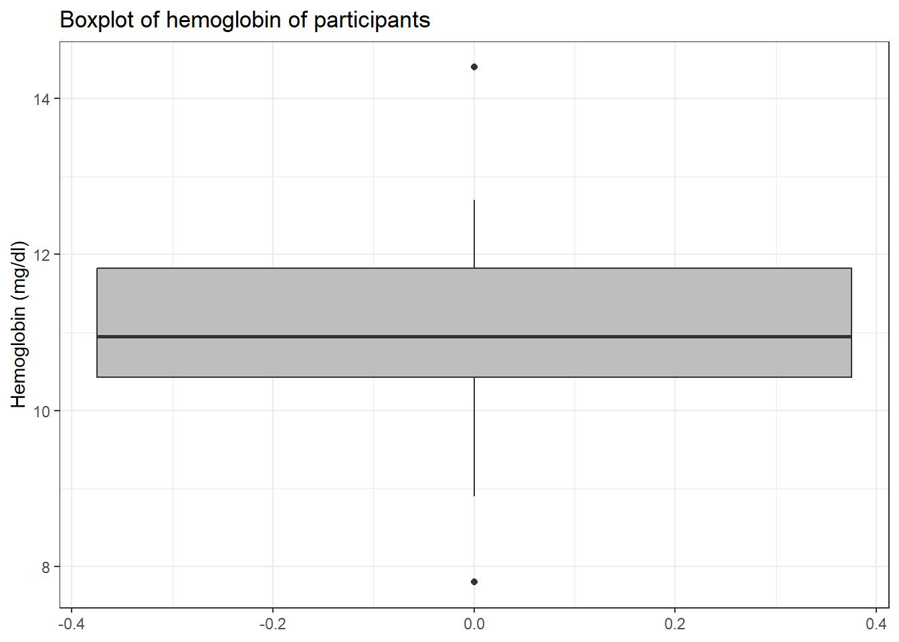

# Data Cleaning
Data to be analysed has to be ”cleaned” first of abnormal or invalid values. This 
should be done with the understanding of the data at hand, how it was collected 
in the first place and with very little prejudice or bias. This is a critical 
stage of the analysis where any arbitrary deletion or insertion of data could 
significantly alter the conclusions.

It, therefore, goes without saying that all modifications done at the data 
cleaning stage must have sound statistical, clinical as well as commonsensical 
reasons to it. Also, the whole process of data cleaning should be well 
documented and appropriately stored for future reference. In this regard, it is 
not good practice to edit the data in software such as Microsoft Excel though 
it may appear easy and tempting. This is because such software does not keep an 
audit trail.

## Data dictionary or codebook

For well-collected and managed data, there should always be a dictionary. The 
dictionary outlines for every variable in the dataset its variable name, the 
meaning of the variable, the source of the variable (from the questionnaire, data 
collection sheet, etc.), the valid ranges or codes and the format. This is an 
invaluable tool for determining wrong and abnormal entries. It is also sometimes 
referred to as the codebook. 

A typical example is the one below. This is the data dictionary for the 
**blood_donors_3.dta** file we are going to use.

{width=75%}

## Importing the data into **R**
The first step in analysis is to read or import the data into the data analysis 
software where a general overview can be obtained. We begin by importing the 
`blood_donors_3.dta` into **R** and calling it `blood3`. 


```r
blood3 <- readxl::read_xls("./Data/blood_donors_2.xls")
```

## Visualising the data in **R**
Next, we visualize the data


```r
blood3
# A tibble: 25 × 6
      id    hb   hct   sex bldgrp pdonor
   <dbl> <dbl> <dbl> <dbl>  <dbl>  <dbl>
 1     1 10.5   31.8     1      3      3
 2     2 11.9   37.2     1      4      0
 3     3  1     26       1      1      1
 4     4  8.90  26.8     1      1      3
 5     5  7.80  24.2     1      1      2
 6     6 10     30.9     1      2      1
 7     7 10.4   33.9     1      2      0
 8     8 11.3   35       1      3      1
 9     9 16.4   NA       1      4      1
10    10 14.4   43.6     1      4      1
# ℹ 15 more rows
```

To visualise all the data we can use the `print()` or `View()` functions. Note 
that this might not be the best if you have relatively big data. Below I 
use the `as.data.frame()` function to display the whole data. 


```r
blood3 %>% as.data.frame()
   id   hb  hct sex bldgrp pdonor
1   1 10.5 31.8   1      3      3
2   2 11.9 37.2   1      4      0
3   3  1.0 26.0   1      1      1
4   4  8.9 26.8   1      1      3
5   5  7.8 24.2   1      1      2
6   6 10.0 30.9   1      2      1
7   7 10.4 33.9   1      2      0
8   8 11.3 35.0   1      3      1
9   9 16.4   NA   1      4      1
10 10 14.4 43.6   1      4      1
11 11 11.2 33.2   0      3     99
12 12 11.5 35.5   0      3      1
13 13 10.5 33.7   0      3      2
14 14 12.2 36.8   0      4      1
15 14 16.4 48.8   0      5      2
16 16 12.7 99.0   0      4      0
17 17  9.8 30.5   0      1      4
18 18 10.9 33.8   0      3      0
19 19 11.6 35.4   0      3      3
20 20 10.6 34.9   0      9      2
21 21  9.1 28.0   9      1      3
22 22 11.9 36.1   9      4      3
23 23 10.5 34.2   9      3      2
24 24 12.3 38.2   9      4      2
25 25 11.0 35.7   9      3      2
```


## Describing or summarizing the data

We first use the `glimpse()` function to have a basic view of variable names and variable types


```r
blood3 %>% glimpse()
Rows: 25
Columns: 6
$ id     <dbl> 1, 2, 3, 4, 5, 6, 7, 8, 9, 10, 11, 12, 13, …
$ hb     <dbl> 10.5, 11.9, 1.0, 8.9, 7.8, 10.0, 10.4, 11.3…
$ hct    <dbl> 31.8, 37.2, 26.0, 26.8, 24.2, 30.9, 33.9, 3…
$ sex    <dbl> 1, 1, 1, 1, 1, 1, 1, 1, 1, 1, 0, 0, 0, 0, 0…
$ bldgrp <dbl> 3, 4, 1, 1, 1, 2, 2, 3, 4, 4, 3, 3, 3, 4, 5…
$ pdonor <dbl> 3, 0, 1, 3, 2, 1, 0, 1, 1, 1, 99, 1, 2, 1, …
```

We can also use the `dfSummary()` function from the `summarytools` package to 
give a more comprehensive output for each variable.


```r
blood3 %>% summarytools::dfSummary()
Data Frame Summary  
blood3  
Dimensions: 25 x 6  
Duplicates: 0  

--------------------------------------------------------------------------------------------------------
No   Variable    Stats / Values            Freqs (% of Valid)   Graph               Valid      Missing  
---- ----------- ------------------------- -------------------- ------------------- ---------- ---------
1    id          Mean (sd) : 13 (7.4)      24 distinct values   : : : : :           25         0        
     [numeric]   min < med < max:                               : : : : :           (100.0%)   (0.0%)   
                 1 < 13 < 25                                    : : : : :                               
                 IQR (CV) : 12 (0.6)                            : : : : :                               
                                                                : : : : :                               

2    hb          Mean (sd) : 11 (2.9)      21 distinct values             :         25         0        
     [numeric]   min < med < max:                                         :         (100.0%)   (0.0%)   
                 1 < 11 < 16.4                                            :                             
                 IQR (CV) : 1.5 (0.3)                                   . :                             
                                                                .     . : : : . :                       

3    hct         Mean (sd) : 36.8 (14.3)   24 distinct values     :                 24         1        
     [numeric]   min < med < max:                                 :                 (96.0%)    (4.0%)   
                 24.2 < 34.6 < 99                                 :                                     
                 IQR (CV) : 4.7 (0.4)                             :                                     
                                                                : : .         .                         

4    sex         Mean (sd) : 2.2 (3.5)     0 : 10 (40.0%)       IIIIIIII            25         0        
     [numeric]   min < med < max:          1 : 10 (40.0%)       IIIIIIII            (100.0%)   (0.0%)   
                 0 < 1 < 9                 9 :  5 (20.0%)       IIII                                    
                 IQR (CV) : 1 (1.6)                                                                     

5    bldgrp      Mean (sd) : 3.1 (1.7)     1 : 5 (20.0%)        IIII                25         0        
     [numeric]   min < med < max:          2 : 2 ( 8.0%)        I                   (100.0%)   (0.0%)   
                 1 < 3 < 9                 3 : 9 (36.0%)        IIIIIII                                 
                 IQR (CV) : 2 (0.5)        4 : 7 (28.0%)        IIIII                                   
                                           5 : 1 ( 4.0%)                                                
                                           9 : 1 ( 4.0%)                                                

6    pdonor      Mean (sd) : 5.6 (19.5)    0 : 4 (16.0%)        III                 25         0        
     [numeric]   min < med < max:          1 : 7 (28.0%)        IIIII               (100.0%)   (0.0%)   
                 0 < 2 < 99                2 : 7 (28.0%)        IIIII                                   
                 IQR (CV) : 2 (3.5)        3 : 5 (20.0%)        IIII                                    
                                           4 : 1 ( 4.0%)                                                
                                           99 : 1 ( 4.0%)                                               
--------------------------------------------------------------------------------------------------------
```

## Cleaning individual variables
We note that all the variables are of type "double". `sex` and `bldgrp` 
however, should be factors. This is done and subsequently summarized below.


```r
blood3 <-  
    blood3 %>% 
    mutate(sex = factor(sex, 
                        levels = c(0,1,9),
                        labels = c("Female", "Male", "Missing")),
           bldgrp= factor(bldgrp, 
                          levels = c(1, 2, 3, 4, 9),
                          labels = c("A", "B", "O", "AB", "Missing"))) 

blood3 %>% summarytools::dfSummary()
Data Frame Summary  
blood3  
Dimensions: 25 x 6  
Duplicates: 0  

--------------------------------------------------------------------------------------------------------
No   Variable    Stats / Values            Freqs (% of Valid)   Graph               Valid      Missing  
---- ----------- ------------------------- -------------------- ------------------- ---------- ---------
1    id          Mean (sd) : 13 (7.4)      24 distinct values   : : : : :           25         0        
     [numeric]   min < med < max:                               : : : : :           (100.0%)   (0.0%)   
                 1 < 13 < 25                                    : : : : :                               
                 IQR (CV) : 12 (0.6)                            : : : : :                               
                                                                : : : : :                               

2    hb          Mean (sd) : 11 (2.9)      21 distinct values             :         25         0        
     [numeric]   min < med < max:                                         :         (100.0%)   (0.0%)   
                 1 < 11 < 16.4                                            :                             
                 IQR (CV) : 1.5 (0.3)                                   . :                             
                                                                .     . : : : . :                       

3    hct         Mean (sd) : 36.8 (14.3)   24 distinct values     :                 24         1        
     [numeric]   min < med < max:                                 :                 (96.0%)    (4.0%)   
                 24.2 < 34.6 < 99                                 :                                     
                 IQR (CV) : 4.7 (0.4)                             :                                     
                                                                : : .         .                         

4    sex         1. Female                 10 (40.0%)           IIIIIIII            25         0        
     [factor]    2. Male                   10 (40.0%)           IIIIIIII            (100.0%)   (0.0%)   
                 3. Missing                 5 (20.0%)           IIII                                    

5    bldgrp      1. A                      5 (20.8%)            IIII                24         1        
     [factor]    2. B                      2 ( 8.3%)            I                   (96.0%)    (4.0%)   
                 3. O                      9 (37.5%)            IIIIIII                                 
                 4. AB                     7 (29.2%)            IIIII                                   
                 5. Missing                1 ( 4.2%)                                                    

6    pdonor      Mean (sd) : 5.6 (19.5)    0 : 4 (16.0%)        III                 25         0        
     [numeric]   min < med < max:          1 : 7 (28.0%)        IIIII               (100.0%)   (0.0%)   
                 0 < 2 < 99                2 : 7 (28.0%)        IIIII                                   
                 IQR (CV) : 2 (3.5)        3 : 5 (20.0%)        IIII                                    
                                           4 : 1 ( 4.0%)                                                
                                           99 : 1 ( 4.0%)                                               
--------------------------------------------------------------------------------------------------------
```
## Checking for duplicated records
We begin official data cleaning by checking if we have duplicate records in our
data


```r
blood3 %>% janitor::get_dupes()
No variable names specified - using all columns.
No duplicate combinations found of: id, hb, hct, sex, bldgrp, pdonor
# A tibble: 0 × 7
# ℹ 7 variables: id <dbl>, hb <dbl>, hct <dbl>, sex <fct>,
#   bldgrp <fct>, pdonor <dbl>, dupe_count <int>
```

## Cleaning individual variables
Next, we begin to sort the variables one by one. We begin with the study id 
variable. We begin by looking for duplicated study ids.


```r
blood3 %>% janitor::get_dupes(id)
# A tibble: 2 × 7
     id dupe_count    hb   hct sex    bldgrp pdonor
  <dbl>      <int> <dbl> <dbl> <fct>  <fct>   <dbl>
1    14          2  12.2  36.8 Female AB          1
2    14          2  16.4  48.8 Female <NA>        2
```

Study id 14 is duplicated! Next, we visually inspect the study ids


```r
blood3$id
 [1]  1  2  3  4  5  6  7  8  9 10 11 12 13 14 14 16 17 18
[19] 19 20 21 22 23 24 25
```

It looks like the study ids are in numeric order from 1 to 25 but 14 is duplicated while 15 is
missing. We solve this by writing a new study id variable. Afterwards, we check to see if there are
any more duplicates.


```r
blood3 <- 
    blood3 %>% 
    mutate(id = 1:25) 

blood3 %>% janitor::get_dupes(id)
No duplicate combinations found of: id
# A tibble: 0 × 7
# ℹ 7 variables: id <int>, dupe_count <int>, hb <dbl>,
#   hct <dbl>, sex <fct>, bldgrp <fct>, pdonor <dbl>
```

Next, we inspect the `hb` variable with a summary and a boxplot. We observe from 
the summary none of the haemoglobin observations is missing. The boxplot of 
the `hb` is as shown in A below. We observe 4 are outliers and one looks very
extreme.


```r
blood3 %$% summary(hb)
   Min. 1st Qu.  Median    Mean 3rd Qu.    Max. 
   1.00   10.40   11.00   10.99   11.90   16.40 
```


```r
A <-
    blood3 %>% 
    ggplot(aes(y = hb)) +
    geom_boxplot(fill = "grey") +
    labs(y = "Hemoglobin (mg/dl)",
         title = "Boxplot of hemoglobin of participants 
         with outliers") +
    theme_bw()
```

We convert this observation to missing as below. 


```r
blood3 <- 
    blood3 %>% 
    mutate(hb = ifelse(hb < 4, NA, hb))
```


```r
B <-
    blood3 %>% 
    ggplot(aes(y = hb)) +
    geom_boxplot(fill = "grey") +
    labs(y = "Hemoglobin (mg/dl)",
         title = "Boxplot of hemoglobin of participants 
         after outlier removed") +
    theme_bw()

A + B + plot_annotation(tag_levels = 'A')
Warning: Removed 1 rows containing non-finite values
(`stat_boxplot()`).
```


And redraw the boxplot without the outlier.


```r
blood3 %>% 
    drop_na() %>% 
    ggplot(aes(y = hb)) +
    geom_boxplot(fill ="grey") +
    labs(y = "Hemoglobin (mg/dl)",
         title = "Boxplot of hemoglobin of participants") +
    theme_bw()
```



Next, we focus on the `hct` variable. It is of note that it has *99* which represents 'missing'. We
therefore remove that as below


```r
blood3 <- 
    blood3 %>% 
    mutate(hct = ifelse(hct >90, NA, hct))
```

And draw the boxplot below


```r
blood3 %>% 
    drop_na(hct) %>% 
    ggplot(aes(y = hct)) + 
    geom_boxplot(fill = "grey")+ 
    labs(y = "Hematocrit (%)",
         title = "Boxplot of hematocrit of participants") +
    theme_bw()
```


Because we know the hematocrit has a relationship with the haemoglobin, we use a scatter plot to
visualise and possibly pick up suspicious data.


```r
blood3 %>% 
    drop_na(hb, hct) %>% 
    ggplot(aes(x = hct, y = hb)) + 
    geom_point(col = "red") + 
    labs(x = "Hematocrit (%)",
         y = "Hemoglobin (mg/dl)",
         title = "Scatterplot showing the relationship 
         between the hematocrit and hemoglobin")+
    theme_bw()
```


Next, we inspect the `sex` variable


```r
blood3 %>% 
    count(sex)
# A tibble: 3 × 2
  sex         n
  <fct>   <int>
1 Female     10
2 Male       10
3 Missing     5
```

We then convert the *"Missing"* category to `NA`


```r
blood3 <- 
    blood3 %>% 
    mutate(sex = fct_recode(sex, NULL = "Missing"))
```

And then check


```r
blood3 %>% 
    count(sex)
# A tibble: 3 × 2
  sex        n
  <fct>  <int>
1 Female    10
2 Male      10
3 <NA>       5
```

Next, we sort out the `bldgrp` variable


```r
blood3 %>% 
    count(bldgrp)
# A tibble: 6 × 2
  bldgrp      n
  <fct>   <int>
1 A           5
2 B           2
3 O           9
4 AB          7
5 Missing     1
6 <NA>        1
```

We convert *Missing* to `NA` and visualize the variable


```r
blood3 <-
    blood3 %>% 
    mutate(bldgrp = fct_recode(bldgrp, NULL = "Missing"))

blood3 %>% count(bldgrp)
# A tibble: 5 × 2
  bldgrp     n
  <fct>  <int>
1 A          5
2 B          2
3 O          9
4 AB         7
5 <NA>       2
```

Next, we sort out the `pdonor`


```r
blood3 <- 
    blood3 %>% 
    mutate(pdonor = ifelse(pdonor == 99, NA, pdonor))
```

## Visualising the cleaned data

Finally, we summarize the data below


```r
blood3 %>% 
    summarytools::dfSummary()
Data Frame Summary  
blood3  
Dimensions: 25 x 6  
Duplicates: 0  

--------------------------------------------------------------------------------------------------
No   Variable    Stats / Values           Freqs (% of Valid)   Graph          Valid      Missing  
---- ----------- ------------------------ -------------------- -------------- ---------- ---------
1    id          Mean (sd) : 13 (7.4)     25 distinct values   : : : : :      25         0        
     [integer]   min < med < max:         (Integer sequence)   : : : : :      (100.0%)   (0.0%)   
                 1 < 13 < 25                                   : : : : :                          
                 IQR (CV) : 12 (0.6)                           : : : : :                          
                                                               : : : : :                          

2    hb          Mean (sd) : 11.4 (2)     20 distinct values       :          24         1        
     [numeric]   min < med < max:                                  :          (96.0%)    (4.0%)   
                 7.8 < 11.1 < 16.4                                 :                              
                 IQR (CV) : 1.5 (0.2)                            . :                              
                                                               . : : : . :                        

3    hct         Mean (sd) : 34.1 (5.4)   23 distinct values       :          23         2        
     [numeric]   min < med < max:                                  : .        (92.0%)    (8.0%)   
                 24.2 < 34.2 < 48.8                                : :                            
                 IQR (CV) : 4.6 (0.2)                            . : :                            
                                                               . : : : . .                        

4    sex         1. Female                10 (50.0%)           IIIIIIIIII     20         5        
     [factor]    2. Male                  10 (50.0%)           IIIIIIIIII     (80.0%)    (20.0%)  

5    bldgrp      1. A                     5 (21.7%)            IIII           23         2        
     [factor]    2. B                     2 ( 8.7%)            I              (92.0%)    (8.0%)   
                 3. O                     9 (39.1%)            IIIIIII                            
                 4. AB                    7 (30.4%)            IIIIII                             

6    pdonor      Mean (sd) : 1.7 (1.1)    0 : 4 (16.7%)        III            24         1        
     [numeric]   min < med < max:         1 : 7 (29.2%)        IIIII          (96.0%)    (4.0%)   
                 0 < 2 < 4                2 : 7 (29.2%)        IIIII                              
                 IQR (CV) : 1.2 (0.7)     3 : 5 (20.8%)        IIII                               
                                          4 : 1 ( 4.2%)                                           
--------------------------------------------------------------------------------------------------
```
## Generating new variables
Often after cleaning individual variables a data analyst will be required to 
generate new variables from the old ones. We will put this into practice by 
generating the presence of Anemia if the hb is less than 11g/dl. 


```r
blood3 <-
    blood3 %>% 
    mutate(anemia = case_when(hb < 11 ~ "Yes", hb >= 11 ~ "No") %>% factor())

summarytools::dfSummary(blood3)
Data Frame Summary  
blood3  
Dimensions: 25 x 7  
Duplicates: 0  

--------------------------------------------------------------------------------------------------
No   Variable    Stats / Values           Freqs (% of Valid)   Graph          Valid      Missing  
---- ----------- ------------------------ -------------------- -------------- ---------- ---------
1    id          Mean (sd) : 13 (7.4)     25 distinct values   : : : : :      25         0        
     [integer]   min < med < max:         (Integer sequence)   : : : : :      (100.0%)   (0.0%)   
                 1 < 13 < 25                                   : : : : :                          
                 IQR (CV) : 12 (0.6)                           : : : : :                          
                                                               : : : : :                          

2    hb          Mean (sd) : 11.4 (2)     20 distinct values       :          24         1        
     [numeric]   min < med < max:                                  :          (96.0%)    (4.0%)   
                 7.8 < 11.1 < 16.4                                 :                              
                 IQR (CV) : 1.5 (0.2)                            . :                              
                                                               . : : : . :                        

3    hct         Mean (sd) : 34.1 (5.4)   23 distinct values       :          23         2        
     [numeric]   min < med < max:                                  : .        (92.0%)    (8.0%)   
                 24.2 < 34.2 < 48.8                                : :                            
                 IQR (CV) : 4.6 (0.2)                            . : :                            
                                                               . : : : . .                        

4    sex         1. Female                10 (50.0%)           IIIIIIIIII     20         5        
     [factor]    2. Male                  10 (50.0%)           IIIIIIIIII     (80.0%)    (20.0%)  

5    bldgrp      1. A                     5 (21.7%)            IIII           23         2        
     [factor]    2. B                     2 ( 8.7%)            I              (92.0%)    (8.0%)   
                 3. O                     9 (39.1%)            IIIIIII                            
                 4. AB                    7 (30.4%)            IIIIII                             

6    pdonor      Mean (sd) : 1.7 (1.1)    0 : 4 (16.7%)        III            24         1        
     [numeric]   min < med < max:         1 : 7 (29.2%)        IIIII          (96.0%)    (4.0%)   
                 0 < 2 < 4                2 : 7 (29.2%)        IIIII                              
                 IQR (CV) : 1.2 (0.7)     3 : 5 (20.8%)        IIII                               
                                          4 : 1 ( 4.2%)                                           

7    anemia      1. No                    13 (54.2%)           IIIIIIIIII     24         1        
     [factor]    2. Yes                   11 (45.8%)           IIIIIIIII      (96.0%)    (4.0%)   
--------------------------------------------------------------------------------------------------
```
