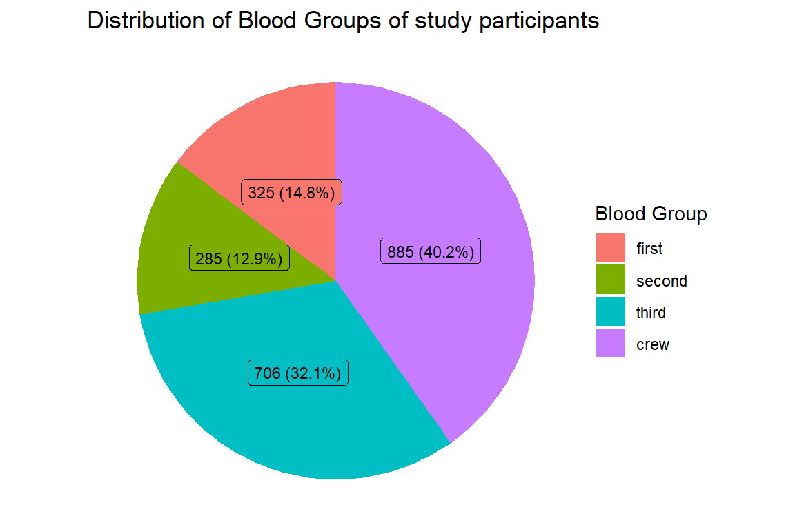

# Descriptive Statistics: Categorical


For this section we use the __Titanic__ data set. The lines below imports into R the data and converts some of the variables to factors. 
 

```r
titanic2 <-  
    haven::read_dta("./Data/titanic2.dta") %>% 
    mutate(sex  = haven::as_factor(sex),
           died = haven::as_factor(died),
           age  = haven::as_factor(age),
           class = haven::as_factor(class)) %>% 
    haven::zap_labels()
```

We begin by visualizing the first 6 rows of the data 


```r
titanic2 %>% head()
```


```{=html}
<table class="huxtable" style="border-collapse: collapse; border: 0px; margin-bottom: 2em; margin-top: 2em; ; margin-left: auto; margin-right: auto;  " id="tab:unnamed-chunk-4">
<caption style="caption-side: top; text-align: center;">(#tab:unnamed-chunk-4) </caption><col><col><col><col><tr>
<th style="vertical-align: top; text-align: left; white-space: normal; border-style: solid solid solid solid; border-width: 0.4pt 0pt 0.4pt 0pt;    padding: 2pt 6pt 2pt 0pt; font-weight: bold; font-family: Arial, Times New Roman, Times, Serif; font-size: 11pt;">class</th><th style="vertical-align: top; text-align: left; white-space: normal; border-style: solid solid solid solid; border-width: 0.4pt 0pt 0.4pt 0pt;    padding: 2pt 6pt 2pt 6pt; font-weight: bold; font-family: Arial, Times New Roman, Times, Serif; font-size: 11pt;">age</th><th style="vertical-align: top; text-align: left; white-space: normal; border-style: solid solid solid solid; border-width: 0.4pt 0pt 0.4pt 0pt;    padding: 2pt 6pt 2pt 6pt; font-weight: bold; font-family: Arial, Times New Roman, Times, Serif; font-size: 11pt;">sex</th><th style="vertical-align: top; text-align: left; white-space: normal; border-style: solid solid solid solid; border-width: 0.4pt 0pt 0.4pt 0pt;    padding: 2pt 0pt 2pt 6pt; font-weight: bold; font-family: Arial, Times New Roman, Times, Serif; font-size: 11pt;">died</th></tr>
<tr>
<td style="vertical-align: top; text-align: left; white-space: normal; border-style: solid solid solid solid; border-width: 0.4pt 0pt 0pt 0pt;    padding: 2pt 6pt 2pt 0pt; font-weight: normal; font-family: Arial, Times New Roman, Times, Serif; font-size: 11pt;">first</td><td style="vertical-align: top; text-align: left; white-space: normal; border-style: solid solid solid solid; border-width: 0.4pt 0pt 0pt 0pt;    padding: 2pt 6pt 2pt 6pt; font-weight: normal; font-family: Arial, Times New Roman, Times, Serif; font-size: 11pt;">adult</td><td style="vertical-align: top; text-align: left; white-space: normal; border-style: solid solid solid solid; border-width: 0.4pt 0pt 0pt 0pt;    padding: 2pt 6pt 2pt 6pt; font-weight: normal; font-family: Arial, Times New Roman, Times, Serif; font-size: 11pt;">male</td><td style="vertical-align: top; text-align: left; white-space: normal; border-style: solid solid solid solid; border-width: 0.4pt 0pt 0pt 0pt;    padding: 2pt 0pt 2pt 6pt; font-weight: normal; font-family: Arial, Times New Roman, Times, Serif; font-size: 11pt;">No</td></tr>
<tr>
<td style="vertical-align: top; text-align: left; white-space: normal; border-style: solid solid solid solid; border-width: 0pt 0pt 0pt 0pt;    padding: 2pt 6pt 2pt 0pt; font-weight: normal; font-family: Arial, Times New Roman, Times, Serif; font-size: 11pt;">first</td><td style="vertical-align: top; text-align: left; white-space: normal; border-style: solid solid solid solid; border-width: 0pt 0pt 0pt 0pt;    padding: 2pt 6pt 2pt 6pt; font-weight: normal; font-family: Arial, Times New Roman, Times, Serif; font-size: 11pt;">adult</td><td style="vertical-align: top; text-align: left; white-space: normal; border-style: solid solid solid solid; border-width: 0pt 0pt 0pt 0pt;    padding: 2pt 6pt 2pt 6pt; font-weight: normal; font-family: Arial, Times New Roman, Times, Serif; font-size: 11pt;">male</td><td style="vertical-align: top; text-align: left; white-space: normal; border-style: solid solid solid solid; border-width: 0pt 0pt 0pt 0pt;    padding: 2pt 0pt 2pt 6pt; font-weight: normal; font-family: Arial, Times New Roman, Times, Serif; font-size: 11pt;">No</td></tr>
<tr>
<td style="vertical-align: top; text-align: left; white-space: normal; border-style: solid solid solid solid; border-width: 0pt 0pt 0pt 0pt;    padding: 2pt 6pt 2pt 0pt; font-weight: normal; font-family: Arial, Times New Roman, Times, Serif; font-size: 11pt;">first</td><td style="vertical-align: top; text-align: left; white-space: normal; border-style: solid solid solid solid; border-width: 0pt 0pt 0pt 0pt;    padding: 2pt 6pt 2pt 6pt; font-weight: normal; font-family: Arial, Times New Roman, Times, Serif; font-size: 11pt;">adult</td><td style="vertical-align: top; text-align: left; white-space: normal; border-style: solid solid solid solid; border-width: 0pt 0pt 0pt 0pt;    padding: 2pt 6pt 2pt 6pt; font-weight: normal; font-family: Arial, Times New Roman, Times, Serif; font-size: 11pt;">male</td><td style="vertical-align: top; text-align: left; white-space: normal; border-style: solid solid solid solid; border-width: 0pt 0pt 0pt 0pt;    padding: 2pt 0pt 2pt 6pt; font-weight: normal; font-family: Arial, Times New Roman, Times, Serif; font-size: 11pt;">No</td></tr>
<tr>
<td style="vertical-align: top; text-align: left; white-space: normal; border-style: solid solid solid solid; border-width: 0pt 0pt 0pt 0pt;    padding: 2pt 6pt 2pt 0pt; font-weight: normal; font-family: Arial, Times New Roman, Times, Serif; font-size: 11pt;">first</td><td style="vertical-align: top; text-align: left; white-space: normal; border-style: solid solid solid solid; border-width: 0pt 0pt 0pt 0pt;    padding: 2pt 6pt 2pt 6pt; font-weight: normal; font-family: Arial, Times New Roman, Times, Serif; font-size: 11pt;">adult</td><td style="vertical-align: top; text-align: left; white-space: normal; border-style: solid solid solid solid; border-width: 0pt 0pt 0pt 0pt;    padding: 2pt 6pt 2pt 6pt; font-weight: normal; font-family: Arial, Times New Roman, Times, Serif; font-size: 11pt;">male</td><td style="vertical-align: top; text-align: left; white-space: normal; border-style: solid solid solid solid; border-width: 0pt 0pt 0pt 0pt;    padding: 2pt 0pt 2pt 6pt; font-weight: normal; font-family: Arial, Times New Roman, Times, Serif; font-size: 11pt;">No</td></tr>
<tr>
<td style="vertical-align: top; text-align: left; white-space: normal; border-style: solid solid solid solid; border-width: 0pt 0pt 0pt 0pt;    padding: 2pt 6pt 2pt 0pt; font-weight: normal; font-family: Arial, Times New Roman, Times, Serif; font-size: 11pt;">first</td><td style="vertical-align: top; text-align: left; white-space: normal; border-style: solid solid solid solid; border-width: 0pt 0pt 0pt 0pt;    padding: 2pt 6pt 2pt 6pt; font-weight: normal; font-family: Arial, Times New Roman, Times, Serif; font-size: 11pt;">adult</td><td style="vertical-align: top; text-align: left; white-space: normal; border-style: solid solid solid solid; border-width: 0pt 0pt 0pt 0pt;    padding: 2pt 6pt 2pt 6pt; font-weight: normal; font-family: Arial, Times New Roman, Times, Serif; font-size: 11pt;">male</td><td style="vertical-align: top; text-align: left; white-space: normal; border-style: solid solid solid solid; border-width: 0pt 0pt 0pt 0pt;    padding: 2pt 0pt 2pt 6pt; font-weight: normal; font-family: Arial, Times New Roman, Times, Serif; font-size: 11pt;">No</td></tr>
<tr>
<td style="vertical-align: top; text-align: left; white-space: normal; border-style: solid solid solid solid; border-width: 0pt 0pt 0.4pt 0pt;    padding: 2pt 6pt 2pt 0pt; font-weight: normal; font-family: Arial, Times New Roman, Times, Serif; font-size: 11pt;">first</td><td style="vertical-align: top; text-align: left; white-space: normal; border-style: solid solid solid solid; border-width: 0pt 0pt 0.4pt 0pt;    padding: 2pt 6pt 2pt 6pt; font-weight: normal; font-family: Arial, Times New Roman, Times, Serif; font-size: 11pt;">adult</td><td style="vertical-align: top; text-align: left; white-space: normal; border-style: solid solid solid solid; border-width: 0pt 0pt 0.4pt 0pt;    padding: 2pt 6pt 2pt 6pt; font-weight: normal; font-family: Arial, Times New Roman, Times, Serif; font-size: 11pt;">male</td><td style="vertical-align: top; text-align: left; white-space: normal; border-style: solid solid solid solid; border-width: 0pt 0pt 0.4pt 0pt;    padding: 2pt 0pt 2pt 6pt; font-weight: normal; font-family: Arial, Times New Roman, Times, Serif; font-size: 11pt;">No</td></tr>
</table>

```


And then summarize the entire  data


```r
titanic2 %>% summary()
    class        age           sex        died     
 first :325   child: 109   female: 470   No : 711  
 second:285   adult:2092   male  :1731   Yes:1490  
 third :706                                        
 crew  :885                                        
```

## Single Categorical Variable

### Frequencies & Proportions

The most common modality for presenting a single categorical variables is tabulating the observations, and subsequently expressing these frequencies as proportions or percentages. This is done below   


```r
titanic2 %>% 
    gtsummary::tbl_summary(
        include = class,
        digits = class ~ c(0,1)
    ) %>% 
    gtsummary::bold_labels()
```


```{=html}
<div id="ndeapftweg" style="padding-left:0px;padding-right:0px;padding-top:10px;padding-bottom:10px;overflow-x:auto;overflow-y:auto;width:auto;height:auto;">
<style>#ndeapftweg table {
  font-family: system-ui, 'Segoe UI', Roboto, Helvetica, Arial, sans-serif, 'Apple Color Emoji', 'Segoe UI Emoji', 'Segoe UI Symbol', 'Noto Color Emoji';
  -webkit-font-smoothing: antialiased;
  -moz-osx-font-smoothing: grayscale;
}

#ndeapftweg thead, #ndeapftweg tbody, #ndeapftweg tfoot, #ndeapftweg tr, #ndeapftweg td, #ndeapftweg th {
  border-style: none;
}

#ndeapftweg p {
  margin: 0;
  padding: 0;
}

#ndeapftweg .gt_table {
  display: table;
  border-collapse: collapse;
  line-height: normal;
  margin-left: auto;
  margin-right: auto;
  color: #333333;
  font-size: 16px;
  font-weight: normal;
  font-style: normal;
  background-color: #FFFFFF;
  width: auto;
  border-top-style: solid;
  border-top-width: 2px;
  border-top-color: #A8A8A8;
  border-right-style: none;
  border-right-width: 2px;
  border-right-color: #D3D3D3;
  border-bottom-style: solid;
  border-bottom-width: 2px;
  border-bottom-color: #A8A8A8;
  border-left-style: none;
  border-left-width: 2px;
  border-left-color: #D3D3D3;
}

#ndeapftweg .gt_caption {
  padding-top: 4px;
  padding-bottom: 4px;
}

#ndeapftweg .gt_title {
  color: #333333;
  font-size: 125%;
  font-weight: initial;
  padding-top: 4px;
  padding-bottom: 4px;
  padding-left: 5px;
  padding-right: 5px;
  border-bottom-color: #FFFFFF;
  border-bottom-width: 0;
}

#ndeapftweg .gt_subtitle {
  color: #333333;
  font-size: 85%;
  font-weight: initial;
  padding-top: 3px;
  padding-bottom: 5px;
  padding-left: 5px;
  padding-right: 5px;
  border-top-color: #FFFFFF;
  border-top-width: 0;
}

#ndeapftweg .gt_heading {
  background-color: #FFFFFF;
  text-align: center;
  border-bottom-color: #FFFFFF;
  border-left-style: none;
  border-left-width: 1px;
  border-left-color: #D3D3D3;
  border-right-style: none;
  border-right-width: 1px;
  border-right-color: #D3D3D3;
}

#ndeapftweg .gt_bottom_border {
  border-bottom-style: solid;
  border-bottom-width: 2px;
  border-bottom-color: #D3D3D3;
}

#ndeapftweg .gt_col_headings {
  border-top-style: solid;
  border-top-width: 2px;
  border-top-color: #D3D3D3;
  border-bottom-style: solid;
  border-bottom-width: 2px;
  border-bottom-color: #D3D3D3;
  border-left-style: none;
  border-left-width: 1px;
  border-left-color: #D3D3D3;
  border-right-style: none;
  border-right-width: 1px;
  border-right-color: #D3D3D3;
}

#ndeapftweg .gt_col_heading {
  color: #333333;
  background-color: #FFFFFF;
  font-size: 100%;
  font-weight: normal;
  text-transform: inherit;
  border-left-style: none;
  border-left-width: 1px;
  border-left-color: #D3D3D3;
  border-right-style: none;
  border-right-width: 1px;
  border-right-color: #D3D3D3;
  vertical-align: bottom;
  padding-top: 5px;
  padding-bottom: 6px;
  padding-left: 5px;
  padding-right: 5px;
  overflow-x: hidden;
}

#ndeapftweg .gt_column_spanner_outer {
  color: #333333;
  background-color: #FFFFFF;
  font-size: 100%;
  font-weight: normal;
  text-transform: inherit;
  padding-top: 0;
  padding-bottom: 0;
  padding-left: 4px;
  padding-right: 4px;
}

#ndeapftweg .gt_column_spanner_outer:first-child {
  padding-left: 0;
}

#ndeapftweg .gt_column_spanner_outer:last-child {
  padding-right: 0;
}

#ndeapftweg .gt_column_spanner {
  border-bottom-style: solid;
  border-bottom-width: 2px;
  border-bottom-color: #D3D3D3;
  vertical-align: bottom;
  padding-top: 5px;
  padding-bottom: 5px;
  overflow-x: hidden;
  display: inline-block;
  width: 100%;
}

#ndeapftweg .gt_spanner_row {
  border-bottom-style: hidden;
}

#ndeapftweg .gt_group_heading {
  padding-top: 8px;
  padding-bottom: 8px;
  padding-left: 5px;
  padding-right: 5px;
  color: #333333;
  background-color: #FFFFFF;
  font-size: 100%;
  font-weight: initial;
  text-transform: inherit;
  border-top-style: solid;
  border-top-width: 2px;
  border-top-color: #D3D3D3;
  border-bottom-style: solid;
  border-bottom-width: 2px;
  border-bottom-color: #D3D3D3;
  border-left-style: none;
  border-left-width: 1px;
  border-left-color: #D3D3D3;
  border-right-style: none;
  border-right-width: 1px;
  border-right-color: #D3D3D3;
  vertical-align: middle;
  text-align: left;
}

#ndeapftweg .gt_empty_group_heading {
  padding: 0.5px;
  color: #333333;
  background-color: #FFFFFF;
  font-size: 100%;
  font-weight: initial;
  border-top-style: solid;
  border-top-width: 2px;
  border-top-color: #D3D3D3;
  border-bottom-style: solid;
  border-bottom-width: 2px;
  border-bottom-color: #D3D3D3;
  vertical-align: middle;
}

#ndeapftweg .gt_from_md > :first-child {
  margin-top: 0;
}

#ndeapftweg .gt_from_md > :last-child {
  margin-bottom: 0;
}

#ndeapftweg .gt_row {
  padding-top: 8px;
  padding-bottom: 8px;
  padding-left: 5px;
  padding-right: 5px;
  margin: 10px;
  border-top-style: solid;
  border-top-width: 1px;
  border-top-color: #D3D3D3;
  border-left-style: none;
  border-left-width: 1px;
  border-left-color: #D3D3D3;
  border-right-style: none;
  border-right-width: 1px;
  border-right-color: #D3D3D3;
  vertical-align: middle;
  overflow-x: hidden;
}

#ndeapftweg .gt_stub {
  color: #333333;
  background-color: #FFFFFF;
  font-size: 100%;
  font-weight: initial;
  text-transform: inherit;
  border-right-style: solid;
  border-right-width: 2px;
  border-right-color: #D3D3D3;
  padding-left: 5px;
  padding-right: 5px;
}

#ndeapftweg .gt_stub_row_group {
  color: #333333;
  background-color: #FFFFFF;
  font-size: 100%;
  font-weight: initial;
  text-transform: inherit;
  border-right-style: solid;
  border-right-width: 2px;
  border-right-color: #D3D3D3;
  padding-left: 5px;
  padding-right: 5px;
  vertical-align: top;
}

#ndeapftweg .gt_row_group_first td {
  border-top-width: 2px;
}

#ndeapftweg .gt_row_group_first th {
  border-top-width: 2px;
}

#ndeapftweg .gt_summary_row {
  color: #333333;
  background-color: #FFFFFF;
  text-transform: inherit;
  padding-top: 8px;
  padding-bottom: 8px;
  padding-left: 5px;
  padding-right: 5px;
}

#ndeapftweg .gt_first_summary_row {
  border-top-style: solid;
  border-top-color: #D3D3D3;
}

#ndeapftweg .gt_first_summary_row.thick {
  border-top-width: 2px;
}

#ndeapftweg .gt_last_summary_row {
  padding-top: 8px;
  padding-bottom: 8px;
  padding-left: 5px;
  padding-right: 5px;
  border-bottom-style: solid;
  border-bottom-width: 2px;
  border-bottom-color: #D3D3D3;
}

#ndeapftweg .gt_grand_summary_row {
  color: #333333;
  background-color: #FFFFFF;
  text-transform: inherit;
  padding-top: 8px;
  padding-bottom: 8px;
  padding-left: 5px;
  padding-right: 5px;
}

#ndeapftweg .gt_first_grand_summary_row {
  padding-top: 8px;
  padding-bottom: 8px;
  padding-left: 5px;
  padding-right: 5px;
  border-top-style: double;
  border-top-width: 6px;
  border-top-color: #D3D3D3;
}

#ndeapftweg .gt_last_grand_summary_row_top {
  padding-top: 8px;
  padding-bottom: 8px;
  padding-left: 5px;
  padding-right: 5px;
  border-bottom-style: double;
  border-bottom-width: 6px;
  border-bottom-color: #D3D3D3;
}

#ndeapftweg .gt_striped {
  background-color: rgba(128, 128, 128, 0.05);
}

#ndeapftweg .gt_table_body {
  border-top-style: solid;
  border-top-width: 2px;
  border-top-color: #D3D3D3;
  border-bottom-style: solid;
  border-bottom-width: 2px;
  border-bottom-color: #D3D3D3;
}

#ndeapftweg .gt_footnotes {
  color: #333333;
  background-color: #FFFFFF;
  border-bottom-style: none;
  border-bottom-width: 2px;
  border-bottom-color: #D3D3D3;
  border-left-style: none;
  border-left-width: 2px;
  border-left-color: #D3D3D3;
  border-right-style: none;
  border-right-width: 2px;
  border-right-color: #D3D3D3;
}

#ndeapftweg .gt_footnote {
  margin: 0px;
  font-size: 90%;
  padding-top: 4px;
  padding-bottom: 4px;
  padding-left: 5px;
  padding-right: 5px;
}

#ndeapftweg .gt_sourcenotes {
  color: #333333;
  background-color: #FFFFFF;
  border-bottom-style: none;
  border-bottom-width: 2px;
  border-bottom-color: #D3D3D3;
  border-left-style: none;
  border-left-width: 2px;
  border-left-color: #D3D3D3;
  border-right-style: none;
  border-right-width: 2px;
  border-right-color: #D3D3D3;
}

#ndeapftweg .gt_sourcenote {
  font-size: 90%;
  padding-top: 4px;
  padding-bottom: 4px;
  padding-left: 5px;
  padding-right: 5px;
}

#ndeapftweg .gt_left {
  text-align: left;
}

#ndeapftweg .gt_center {
  text-align: center;
}

#ndeapftweg .gt_right {
  text-align: right;
  font-variant-numeric: tabular-nums;
}

#ndeapftweg .gt_font_normal {
  font-weight: normal;
}

#ndeapftweg .gt_font_bold {
  font-weight: bold;
}

#ndeapftweg .gt_font_italic {
  font-style: italic;
}

#ndeapftweg .gt_super {
  font-size: 65%;
}

#ndeapftweg .gt_footnote_marks {
  font-size: 75%;
  vertical-align: 0.4em;
  position: initial;
}

#ndeapftweg .gt_asterisk {
  font-size: 100%;
  vertical-align: 0;
}

#ndeapftweg .gt_indent_1 {
  text-indent: 5px;
}

#ndeapftweg .gt_indent_2 {
  text-indent: 10px;
}

#ndeapftweg .gt_indent_3 {
  text-indent: 15px;
}

#ndeapftweg .gt_indent_4 {
  text-indent: 20px;
}

#ndeapftweg .gt_indent_5 {
  text-indent: 25px;
}
</style>
<table class="gt_table" data-quarto-disable-processing="false" data-quarto-bootstrap="false">
  <thead>
    
    <tr class="gt_col_headings">
      <th class="gt_col_heading gt_columns_bottom_border gt_left" rowspan="1" colspan="1" scope="col" id="&lt;strong&gt;Characteristic&lt;/strong&gt;"><strong>Characteristic</strong></th>
      <th class="gt_col_heading gt_columns_bottom_border gt_center" rowspan="1" colspan="1" scope="col" id="&lt;strong&gt;N = 2,201&lt;/strong&gt;&lt;span class=&quot;gt_footnote_marks&quot; style=&quot;white-space:nowrap;font-style:italic;font-weight:normal;&quot;&gt;&lt;sup&gt;1&lt;/sup&gt;&lt;/span&gt;"><strong>N = 2,201</strong><span class="gt_footnote_marks" style="white-space:nowrap;font-style:italic;font-weight:normal;"><sup>1</sup></span></th>
    </tr>
  </thead>
  <tbody class="gt_table_body">
    <tr><td headers="label" class="gt_row gt_left" style="font-weight: bold;">Passenger's cabin class</td>
<td headers="stat_0" class="gt_row gt_center"></td></tr>
    <tr><td headers="label" class="gt_row gt_left">    first</td>
<td headers="stat_0" class="gt_row gt_center">325 (14.8%)</td></tr>
    <tr><td headers="label" class="gt_row gt_left">    second</td>
<td headers="stat_0" class="gt_row gt_center">285 (12.9%)</td></tr>
    <tr><td headers="label" class="gt_row gt_left">    third</td>
<td headers="stat_0" class="gt_row gt_center">706 (32.1%)</td></tr>
    <tr><td headers="label" class="gt_row gt_left">    crew</td>
<td headers="stat_0" class="gt_row gt_center">885 (40.2%)</td></tr>
  </tbody>
  
  <tfoot class="gt_footnotes">
    <tr>
      <td class="gt_footnote" colspan="2"><span class="gt_footnote_marks" style="white-space:nowrap;font-style:italic;font-weight:normal;"><sup>1</sup></span> n (%)</td>
    </tr>
  </tfoot>
</table>
</div>
```


### Graph - Barchart

We first summarize the data


```r
bar_data <-
    titanic2 %>% 
    drop_na(class) %>% 
    count(class) %>% 
    mutate(perc = `n` / sum(`n`)) %>% 
    arrange(perc) %>%
    mutate(labels = paste(n, " (", scales::percent(perc), ")", sep=""))

bar_data
```


```{=html}
<table class="huxtable" style="border-collapse: collapse; border: 0px; margin-bottom: 2em; margin-top: 2em; ; margin-left: auto; margin-right: auto;  " id="tab:unnamed-chunk-7">
<caption style="caption-side: top; text-align: center;">(#tab:unnamed-chunk-7) </caption><col><col><col><col><tr>
<th style="vertical-align: top; text-align: left; white-space: normal; border-style: solid solid solid solid; border-width: 0.4pt 0pt 0.4pt 0pt;    padding: 2pt 6pt 2pt 0pt; font-weight: bold; font-family: Arial, Times New Roman, Times, Serif; font-size: 11pt;">class</th><th style="vertical-align: top; text-align: right; white-space: normal; border-style: solid solid solid solid; border-width: 0.4pt 0pt 0.4pt 0pt;    padding: 2pt 6pt 2pt 6pt; font-weight: bold; font-family: Arial, Times New Roman, Times, Serif; font-size: 11pt;">n</th><th style="vertical-align: top; text-align: right; white-space: normal; border-style: solid solid solid solid; border-width: 0.4pt 0pt 0.4pt 0pt;    padding: 2pt 6pt 2pt 6pt; font-weight: bold; font-family: Arial, Times New Roman, Times, Serif; font-size: 11pt;">perc</th><th style="vertical-align: top; text-align: left; white-space: normal; border-style: solid solid solid solid; border-width: 0.4pt 0pt 0.4pt 0pt;    padding: 2pt 0pt 2pt 6pt; font-weight: bold; font-family: Arial, Times New Roman, Times, Serif; font-size: 11pt;">labels</th></tr>
<tr>
<td style="vertical-align: top; text-align: left; white-space: normal; border-style: solid solid solid solid; border-width: 0.4pt 0pt 0pt 0pt;    padding: 2pt 6pt 2pt 0pt; font-weight: normal; font-family: Arial, Times New Roman, Times, Serif; font-size: 11pt;">second</td><td style="vertical-align: top; text-align: right; white-space: normal; border-style: solid solid solid solid; border-width: 0.4pt 0pt 0pt 0pt;    padding: 2pt 6pt 2pt 6pt; font-weight: normal; font-family: Arial, Times New Roman, Times, Serif; font-size: 11pt;">285</td><td style="vertical-align: top; text-align: right; white-space: normal; border-style: solid solid solid solid; border-width: 0.4pt 0pt 0pt 0pt;    padding: 2pt 6pt 2pt 6pt; font-weight: normal; font-family: Arial, Times New Roman, Times, Serif; font-size: 11pt;">0.129</td><td style="vertical-align: top; text-align: left; white-space: normal; border-style: solid solid solid solid; border-width: 0.4pt 0pt 0pt 0pt;    padding: 2pt 0pt 2pt 6pt; font-weight: normal; font-family: Arial, Times New Roman, Times, Serif; font-size: 11pt;">285 (12.9%)</td></tr>
<tr>
<td style="vertical-align: top; text-align: left; white-space: normal; border-style: solid solid solid solid; border-width: 0pt 0pt 0pt 0pt;    padding: 2pt 6pt 2pt 0pt; font-weight: normal; font-family: Arial, Times New Roman, Times, Serif; font-size: 11pt;">first</td><td style="vertical-align: top; text-align: right; white-space: normal; border-style: solid solid solid solid; border-width: 0pt 0pt 0pt 0pt;    padding: 2pt 6pt 2pt 6pt; font-weight: normal; font-family: Arial, Times New Roman, Times, Serif; font-size: 11pt;">325</td><td style="vertical-align: top; text-align: right; white-space: normal; border-style: solid solid solid solid; border-width: 0pt 0pt 0pt 0pt;    padding: 2pt 6pt 2pt 6pt; font-weight: normal; font-family: Arial, Times New Roman, Times, Serif; font-size: 11pt;">0.148</td><td style="vertical-align: top; text-align: left; white-space: normal; border-style: solid solid solid solid; border-width: 0pt 0pt 0pt 0pt;    padding: 2pt 0pt 2pt 6pt; font-weight: normal; font-family: Arial, Times New Roman, Times, Serif; font-size: 11pt;">325 (14.8%)</td></tr>
<tr>
<td style="vertical-align: top; text-align: left; white-space: normal; border-style: solid solid solid solid; border-width: 0pt 0pt 0pt 0pt;    padding: 2pt 6pt 2pt 0pt; font-weight: normal; font-family: Arial, Times New Roman, Times, Serif; font-size: 11pt;">third</td><td style="vertical-align: top; text-align: right; white-space: normal; border-style: solid solid solid solid; border-width: 0pt 0pt 0pt 0pt;    padding: 2pt 6pt 2pt 6pt; font-weight: normal; font-family: Arial, Times New Roman, Times, Serif; font-size: 11pt;">706</td><td style="vertical-align: top; text-align: right; white-space: normal; border-style: solid solid solid solid; border-width: 0pt 0pt 0pt 0pt;    padding: 2pt 6pt 2pt 6pt; font-weight: normal; font-family: Arial, Times New Roman, Times, Serif; font-size: 11pt;">0.321</td><td style="vertical-align: top; text-align: left; white-space: normal; border-style: solid solid solid solid; border-width: 0pt 0pt 0pt 0pt;    padding: 2pt 0pt 2pt 6pt; font-weight: normal; font-family: Arial, Times New Roman, Times, Serif; font-size: 11pt;">706 (32.1%)</td></tr>
<tr>
<td style="vertical-align: top; text-align: left; white-space: normal; border-style: solid solid solid solid; border-width: 0pt 0pt 0.4pt 0pt;    padding: 2pt 6pt 2pt 0pt; font-weight: normal; font-family: Arial, Times New Roman, Times, Serif; font-size: 11pt;">crew</td><td style="vertical-align: top; text-align: right; white-space: normal; border-style: solid solid solid solid; border-width: 0pt 0pt 0.4pt 0pt;    padding: 2pt 6pt 2pt 6pt; font-weight: normal; font-family: Arial, Times New Roman, Times, Serif; font-size: 11pt;">885</td><td style="vertical-align: top; text-align: right; white-space: normal; border-style: solid solid solid solid; border-width: 0pt 0pt 0.4pt 0pt;    padding: 2pt 6pt 2pt 6pt; font-weight: normal; font-family: Arial, Times New Roman, Times, Serif; font-size: 11pt;">0.402</td><td style="vertical-align: top; text-align: left; white-space: normal; border-style: solid solid solid solid; border-width: 0pt 0pt 0.4pt 0pt;    padding: 2pt 0pt 2pt 6pt; font-weight: normal; font-family: Arial, Times New Roman, Times, Serif; font-size: 11pt;">885 (40.2%)</td></tr>
</table>

```


And the plot the barplot


```r
bar_data %>% 
    ggplot() +
    geom_bar(stat = "identity", 
             aes(y = n, x = class, fill = class), 
             col = "black", 
             show.legend = F) +
    geom_label(aes(y = n, label = labels, x = class), 
               vjust = 1.2,
               show.legend = FALSE, size=3.5) +
    labs(x = NULL, 
         y = "Count", 
         title = "Distribution of Class of passenger") +
    theme_bw()
```


#### Pie Chart

To do this we use the previously summarized data. Then we draw a customised Pie Chart


```r
bar_data %>% 
    ggplot(aes(x = "", y = perc, fill = class)) +
    geom_col() +
    geom_label(aes(label = labels),
               position = position_stack(vjust = 0.5),
               show.legend = FALSE, size =3) +
    coord_polar(theta = "y", start=0) +
    labs(title = "Distribution of Blood Groups of study participants",
         fill = "Blood Group") +
    theme_void()
```




### Two categorical Variables

#### Frequencies & Proportions


```r
titanic2 %>% 
    tbl_cross(row = sex, col = died) %>% 
    bold_labels()
```


```{=html}
<div id="pdldziaaln" style="padding-left:0px;padding-right:0px;padding-top:10px;padding-bottom:10px;overflow-x:auto;overflow-y:auto;width:auto;height:auto;">
<style>#pdldziaaln table {
  font-family: system-ui, 'Segoe UI', Roboto, Helvetica, Arial, sans-serif, 'Apple Color Emoji', 'Segoe UI Emoji', 'Segoe UI Symbol', 'Noto Color Emoji';
  -webkit-font-smoothing: antialiased;
  -moz-osx-font-smoothing: grayscale;
}

#pdldziaaln thead, #pdldziaaln tbody, #pdldziaaln tfoot, #pdldziaaln tr, #pdldziaaln td, #pdldziaaln th {
  border-style: none;
}

#pdldziaaln p {
  margin: 0;
  padding: 0;
}

#pdldziaaln .gt_table {
  display: table;
  border-collapse: collapse;
  line-height: normal;
  margin-left: auto;
  margin-right: auto;
  color: #333333;
  font-size: 16px;
  font-weight: normal;
  font-style: normal;
  background-color: #FFFFFF;
  width: auto;
  border-top-style: solid;
  border-top-width: 2px;
  border-top-color: #A8A8A8;
  border-right-style: none;
  border-right-width: 2px;
  border-right-color: #D3D3D3;
  border-bottom-style: solid;
  border-bottom-width: 2px;
  border-bottom-color: #A8A8A8;
  border-left-style: none;
  border-left-width: 2px;
  border-left-color: #D3D3D3;
}

#pdldziaaln .gt_caption {
  padding-top: 4px;
  padding-bottom: 4px;
}

#pdldziaaln .gt_title {
  color: #333333;
  font-size: 125%;
  font-weight: initial;
  padding-top: 4px;
  padding-bottom: 4px;
  padding-left: 5px;
  padding-right: 5px;
  border-bottom-color: #FFFFFF;
  border-bottom-width: 0;
}

#pdldziaaln .gt_subtitle {
  color: #333333;
  font-size: 85%;
  font-weight: initial;
  padding-top: 3px;
  padding-bottom: 5px;
  padding-left: 5px;
  padding-right: 5px;
  border-top-color: #FFFFFF;
  border-top-width: 0;
}

#pdldziaaln .gt_heading {
  background-color: #FFFFFF;
  text-align: center;
  border-bottom-color: #FFFFFF;
  border-left-style: none;
  border-left-width: 1px;
  border-left-color: #D3D3D3;
  border-right-style: none;
  border-right-width: 1px;
  border-right-color: #D3D3D3;
}

#pdldziaaln .gt_bottom_border {
  border-bottom-style: solid;
  border-bottom-width: 2px;
  border-bottom-color: #D3D3D3;
}

#pdldziaaln .gt_col_headings {
  border-top-style: solid;
  border-top-width: 2px;
  border-top-color: #D3D3D3;
  border-bottom-style: solid;
  border-bottom-width: 2px;
  border-bottom-color: #D3D3D3;
  border-left-style: none;
  border-left-width: 1px;
  border-left-color: #D3D3D3;
  border-right-style: none;
  border-right-width: 1px;
  border-right-color: #D3D3D3;
}

#pdldziaaln .gt_col_heading {
  color: #333333;
  background-color: #FFFFFF;
  font-size: 100%;
  font-weight: normal;
  text-transform: inherit;
  border-left-style: none;
  border-left-width: 1px;
  border-left-color: #D3D3D3;
  border-right-style: none;
  border-right-width: 1px;
  border-right-color: #D3D3D3;
  vertical-align: bottom;
  padding-top: 5px;
  padding-bottom: 6px;
  padding-left: 5px;
  padding-right: 5px;
  overflow-x: hidden;
}

#pdldziaaln .gt_column_spanner_outer {
  color: #333333;
  background-color: #FFFFFF;
  font-size: 100%;
  font-weight: normal;
  text-transform: inherit;
  padding-top: 0;
  padding-bottom: 0;
  padding-left: 4px;
  padding-right: 4px;
}

#pdldziaaln .gt_column_spanner_outer:first-child {
  padding-left: 0;
}

#pdldziaaln .gt_column_spanner_outer:last-child {
  padding-right: 0;
}

#pdldziaaln .gt_column_spanner {
  border-bottom-style: solid;
  border-bottom-width: 2px;
  border-bottom-color: #D3D3D3;
  vertical-align: bottom;
  padding-top: 5px;
  padding-bottom: 5px;
  overflow-x: hidden;
  display: inline-block;
  width: 100%;
}

#pdldziaaln .gt_spanner_row {
  border-bottom-style: hidden;
}

#pdldziaaln .gt_group_heading {
  padding-top: 8px;
  padding-bottom: 8px;
  padding-left: 5px;
  padding-right: 5px;
  color: #333333;
  background-color: #FFFFFF;
  font-size: 100%;
  font-weight: initial;
  text-transform: inherit;
  border-top-style: solid;
  border-top-width: 2px;
  border-top-color: #D3D3D3;
  border-bottom-style: solid;
  border-bottom-width: 2px;
  border-bottom-color: #D3D3D3;
  border-left-style: none;
  border-left-width: 1px;
  border-left-color: #D3D3D3;
  border-right-style: none;
  border-right-width: 1px;
  border-right-color: #D3D3D3;
  vertical-align: middle;
  text-align: left;
}

#pdldziaaln .gt_empty_group_heading {
  padding: 0.5px;
  color: #333333;
  background-color: #FFFFFF;
  font-size: 100%;
  font-weight: initial;
  border-top-style: solid;
  border-top-width: 2px;
  border-top-color: #D3D3D3;
  border-bottom-style: solid;
  border-bottom-width: 2px;
  border-bottom-color: #D3D3D3;
  vertical-align: middle;
}

#pdldziaaln .gt_from_md > :first-child {
  margin-top: 0;
}

#pdldziaaln .gt_from_md > :last-child {
  margin-bottom: 0;
}

#pdldziaaln .gt_row {
  padding-top: 8px;
  padding-bottom: 8px;
  padding-left: 5px;
  padding-right: 5px;
  margin: 10px;
  border-top-style: solid;
  border-top-width: 1px;
  border-top-color: #D3D3D3;
  border-left-style: none;
  border-left-width: 1px;
  border-left-color: #D3D3D3;
  border-right-style: none;
  border-right-width: 1px;
  border-right-color: #D3D3D3;
  vertical-align: middle;
  overflow-x: hidden;
}

#pdldziaaln .gt_stub {
  color: #333333;
  background-color: #FFFFFF;
  font-size: 100%;
  font-weight: initial;
  text-transform: inherit;
  border-right-style: solid;
  border-right-width: 2px;
  border-right-color: #D3D3D3;
  padding-left: 5px;
  padding-right: 5px;
}

#pdldziaaln .gt_stub_row_group {
  color: #333333;
  background-color: #FFFFFF;
  font-size: 100%;
  font-weight: initial;
  text-transform: inherit;
  border-right-style: solid;
  border-right-width: 2px;
  border-right-color: #D3D3D3;
  padding-left: 5px;
  padding-right: 5px;
  vertical-align: top;
}

#pdldziaaln .gt_row_group_first td {
  border-top-width: 2px;
}

#pdldziaaln .gt_row_group_first th {
  border-top-width: 2px;
}

#pdldziaaln .gt_summary_row {
  color: #333333;
  background-color: #FFFFFF;
  text-transform: inherit;
  padding-top: 8px;
  padding-bottom: 8px;
  padding-left: 5px;
  padding-right: 5px;
}

#pdldziaaln .gt_first_summary_row {
  border-top-style: solid;
  border-top-color: #D3D3D3;
}

#pdldziaaln .gt_first_summary_row.thick {
  border-top-width: 2px;
}

#pdldziaaln .gt_last_summary_row {
  padding-top: 8px;
  padding-bottom: 8px;
  padding-left: 5px;
  padding-right: 5px;
  border-bottom-style: solid;
  border-bottom-width: 2px;
  border-bottom-color: #D3D3D3;
}

#pdldziaaln .gt_grand_summary_row {
  color: #333333;
  background-color: #FFFFFF;
  text-transform: inherit;
  padding-top: 8px;
  padding-bottom: 8px;
  padding-left: 5px;
  padding-right: 5px;
}

#pdldziaaln .gt_first_grand_summary_row {
  padding-top: 8px;
  padding-bottom: 8px;
  padding-left: 5px;
  padding-right: 5px;
  border-top-style: double;
  border-top-width: 6px;
  border-top-color: #D3D3D3;
}

#pdldziaaln .gt_last_grand_summary_row_top {
  padding-top: 8px;
  padding-bottom: 8px;
  padding-left: 5px;
  padding-right: 5px;
  border-bottom-style: double;
  border-bottom-width: 6px;
  border-bottom-color: #D3D3D3;
}

#pdldziaaln .gt_striped {
  background-color: rgba(128, 128, 128, 0.05);
}

#pdldziaaln .gt_table_body {
  border-top-style: solid;
  border-top-width: 2px;
  border-top-color: #D3D3D3;
  border-bottom-style: solid;
  border-bottom-width: 2px;
  border-bottom-color: #D3D3D3;
}

#pdldziaaln .gt_footnotes {
  color: #333333;
  background-color: #FFFFFF;
  border-bottom-style: none;
  border-bottom-width: 2px;
  border-bottom-color: #D3D3D3;
  border-left-style: none;
  border-left-width: 2px;
  border-left-color: #D3D3D3;
  border-right-style: none;
  border-right-width: 2px;
  border-right-color: #D3D3D3;
}

#pdldziaaln .gt_footnote {
  margin: 0px;
  font-size: 90%;
  padding-top: 4px;
  padding-bottom: 4px;
  padding-left: 5px;
  padding-right: 5px;
}

#pdldziaaln .gt_sourcenotes {
  color: #333333;
  background-color: #FFFFFF;
  border-bottom-style: none;
  border-bottom-width: 2px;
  border-bottom-color: #D3D3D3;
  border-left-style: none;
  border-left-width: 2px;
  border-left-color: #D3D3D3;
  border-right-style: none;
  border-right-width: 2px;
  border-right-color: #D3D3D3;
}

#pdldziaaln .gt_sourcenote {
  font-size: 90%;
  padding-top: 4px;
  padding-bottom: 4px;
  padding-left: 5px;
  padding-right: 5px;
}

#pdldziaaln .gt_left {
  text-align: left;
}

#pdldziaaln .gt_center {
  text-align: center;
}

#pdldziaaln .gt_right {
  text-align: right;
  font-variant-numeric: tabular-nums;
}

#pdldziaaln .gt_font_normal {
  font-weight: normal;
}

#pdldziaaln .gt_font_bold {
  font-weight: bold;
}

#pdldziaaln .gt_font_italic {
  font-style: italic;
}

#pdldziaaln .gt_super {
  font-size: 65%;
}

#pdldziaaln .gt_footnote_marks {
  font-size: 75%;
  vertical-align: 0.4em;
  position: initial;
}

#pdldziaaln .gt_asterisk {
  font-size: 100%;
  vertical-align: 0;
}

#pdldziaaln .gt_indent_1 {
  text-indent: 5px;
}

#pdldziaaln .gt_indent_2 {
  text-indent: 10px;
}

#pdldziaaln .gt_indent_3 {
  text-indent: 15px;
}

#pdldziaaln .gt_indent_4 {
  text-indent: 20px;
}

#pdldziaaln .gt_indent_5 {
  text-indent: 25px;
}
</style>
<table class="gt_table" data-quarto-disable-processing="false" data-quarto-bootstrap="false">
  <thead>
    
    <tr class="gt_col_headings gt_spanner_row">
      <th class="gt_col_heading gt_columns_bottom_border gt_left" rowspan="2" colspan="1" scope="col" id=""></th>
      <th class="gt_center gt_columns_top_border gt_column_spanner_outer" rowspan="1" colspan="2" scope="colgroup" id="&lt;strong&gt;Died at sea&lt;/strong&gt;">
        <span class="gt_column_spanner"><strong>Died at sea</strong></span>
      </th>
      <th class="gt_col_heading gt_columns_bottom_border gt_center" rowspan="2" colspan="1" scope="col" id="&lt;strong&gt;Total&lt;/strong&gt;"><strong>Total</strong></th>
    </tr>
    <tr class="gt_col_headings">
      <th class="gt_col_heading gt_columns_bottom_border gt_center" rowspan="1" colspan="1" scope="col" id="No">No</th>
      <th class="gt_col_heading gt_columns_bottom_border gt_center" rowspan="1" colspan="1" scope="col" id="Yes">Yes</th>
    </tr>
  </thead>
  <tbody class="gt_table_body">
    <tr><td headers="label" class="gt_row gt_left" style="font-weight: bold;">Sex of passenger</td>
<td headers="stat_1" class="gt_row gt_center"></td>
<td headers="stat_2" class="gt_row gt_center"></td>
<td headers="stat_0" class="gt_row gt_center"></td></tr>
    <tr><td headers="label" class="gt_row gt_left">    female</td>
<td headers="stat_1" class="gt_row gt_center">344</td>
<td headers="stat_2" class="gt_row gt_center">126</td>
<td headers="stat_0" class="gt_row gt_center">470</td></tr>
    <tr><td headers="label" class="gt_row gt_left">    male</td>
<td headers="stat_1" class="gt_row gt_center">367</td>
<td headers="stat_2" class="gt_row gt_center">1,364</td>
<td headers="stat_0" class="gt_row gt_center">1,731</td></tr>
    <tr><td headers="label" class="gt_row gt_left" style="font-weight: bold;">Total</td>
<td headers="stat_1" class="gt_row gt_center">711</td>
<td headers="stat_2" class="gt_row gt_center">1,490</td>
<td headers="stat_0" class="gt_row gt_center">2,201</td></tr>
  </tbody>
  
  
</table>
</div>
```


#### Row percentages


```r
titanic2 %>% 
    tbl_cross(row = sex, col = died, percent = "row", digits = c(0,1)) %>% 
    bold_labels()
```


```{=html}
<div id="wuwcwuntcs" style="padding-left:0px;padding-right:0px;padding-top:10px;padding-bottom:10px;overflow-x:auto;overflow-y:auto;width:auto;height:auto;">
<style>#wuwcwuntcs table {
  font-family: system-ui, 'Segoe UI', Roboto, Helvetica, Arial, sans-serif, 'Apple Color Emoji', 'Segoe UI Emoji', 'Segoe UI Symbol', 'Noto Color Emoji';
  -webkit-font-smoothing: antialiased;
  -moz-osx-font-smoothing: grayscale;
}

#wuwcwuntcs thead, #wuwcwuntcs tbody, #wuwcwuntcs tfoot, #wuwcwuntcs tr, #wuwcwuntcs td, #wuwcwuntcs th {
  border-style: none;
}

#wuwcwuntcs p {
  margin: 0;
  padding: 0;
}

#wuwcwuntcs .gt_table {
  display: table;
  border-collapse: collapse;
  line-height: normal;
  margin-left: auto;
  margin-right: auto;
  color: #333333;
  font-size: 16px;
  font-weight: normal;
  font-style: normal;
  background-color: #FFFFFF;
  width: auto;
  border-top-style: solid;
  border-top-width: 2px;
  border-top-color: #A8A8A8;
  border-right-style: none;
  border-right-width: 2px;
  border-right-color: #D3D3D3;
  border-bottom-style: solid;
  border-bottom-width: 2px;
  border-bottom-color: #A8A8A8;
  border-left-style: none;
  border-left-width: 2px;
  border-left-color: #D3D3D3;
}

#wuwcwuntcs .gt_caption {
  padding-top: 4px;
  padding-bottom: 4px;
}

#wuwcwuntcs .gt_title {
  color: #333333;
  font-size: 125%;
  font-weight: initial;
  padding-top: 4px;
  padding-bottom: 4px;
  padding-left: 5px;
  padding-right: 5px;
  border-bottom-color: #FFFFFF;
  border-bottom-width: 0;
}

#wuwcwuntcs .gt_subtitle {
  color: #333333;
  font-size: 85%;
  font-weight: initial;
  padding-top: 3px;
  padding-bottom: 5px;
  padding-left: 5px;
  padding-right: 5px;
  border-top-color: #FFFFFF;
  border-top-width: 0;
}

#wuwcwuntcs .gt_heading {
  background-color: #FFFFFF;
  text-align: center;
  border-bottom-color: #FFFFFF;
  border-left-style: none;
  border-left-width: 1px;
  border-left-color: #D3D3D3;
  border-right-style: none;
  border-right-width: 1px;
  border-right-color: #D3D3D3;
}

#wuwcwuntcs .gt_bottom_border {
  border-bottom-style: solid;
  border-bottom-width: 2px;
  border-bottom-color: #D3D3D3;
}

#wuwcwuntcs .gt_col_headings {
  border-top-style: solid;
  border-top-width: 2px;
  border-top-color: #D3D3D3;
  border-bottom-style: solid;
  border-bottom-width: 2px;
  border-bottom-color: #D3D3D3;
  border-left-style: none;
  border-left-width: 1px;
  border-left-color: #D3D3D3;
  border-right-style: none;
  border-right-width: 1px;
  border-right-color: #D3D3D3;
}

#wuwcwuntcs .gt_col_heading {
  color: #333333;
  background-color: #FFFFFF;
  font-size: 100%;
  font-weight: normal;
  text-transform: inherit;
  border-left-style: none;
  border-left-width: 1px;
  border-left-color: #D3D3D3;
  border-right-style: none;
  border-right-width: 1px;
  border-right-color: #D3D3D3;
  vertical-align: bottom;
  padding-top: 5px;
  padding-bottom: 6px;
  padding-left: 5px;
  padding-right: 5px;
  overflow-x: hidden;
}

#wuwcwuntcs .gt_column_spanner_outer {
  color: #333333;
  background-color: #FFFFFF;
  font-size: 100%;
  font-weight: normal;
  text-transform: inherit;
  padding-top: 0;
  padding-bottom: 0;
  padding-left: 4px;
  padding-right: 4px;
}

#wuwcwuntcs .gt_column_spanner_outer:first-child {
  padding-left: 0;
}

#wuwcwuntcs .gt_column_spanner_outer:last-child {
  padding-right: 0;
}

#wuwcwuntcs .gt_column_spanner {
  border-bottom-style: solid;
  border-bottom-width: 2px;
  border-bottom-color: #D3D3D3;
  vertical-align: bottom;
  padding-top: 5px;
  padding-bottom: 5px;
  overflow-x: hidden;
  display: inline-block;
  width: 100%;
}

#wuwcwuntcs .gt_spanner_row {
  border-bottom-style: hidden;
}

#wuwcwuntcs .gt_group_heading {
  padding-top: 8px;
  padding-bottom: 8px;
  padding-left: 5px;
  padding-right: 5px;
  color: #333333;
  background-color: #FFFFFF;
  font-size: 100%;
  font-weight: initial;
  text-transform: inherit;
  border-top-style: solid;
  border-top-width: 2px;
  border-top-color: #D3D3D3;
  border-bottom-style: solid;
  border-bottom-width: 2px;
  border-bottom-color: #D3D3D3;
  border-left-style: none;
  border-left-width: 1px;
  border-left-color: #D3D3D3;
  border-right-style: none;
  border-right-width: 1px;
  border-right-color: #D3D3D3;
  vertical-align: middle;
  text-align: left;
}

#wuwcwuntcs .gt_empty_group_heading {
  padding: 0.5px;
  color: #333333;
  background-color: #FFFFFF;
  font-size: 100%;
  font-weight: initial;
  border-top-style: solid;
  border-top-width: 2px;
  border-top-color: #D3D3D3;
  border-bottom-style: solid;
  border-bottom-width: 2px;
  border-bottom-color: #D3D3D3;
  vertical-align: middle;
}

#wuwcwuntcs .gt_from_md > :first-child {
  margin-top: 0;
}

#wuwcwuntcs .gt_from_md > :last-child {
  margin-bottom: 0;
}

#wuwcwuntcs .gt_row {
  padding-top: 8px;
  padding-bottom: 8px;
  padding-left: 5px;
  padding-right: 5px;
  margin: 10px;
  border-top-style: solid;
  border-top-width: 1px;
  border-top-color: #D3D3D3;
  border-left-style: none;
  border-left-width: 1px;
  border-left-color: #D3D3D3;
  border-right-style: none;
  border-right-width: 1px;
  border-right-color: #D3D3D3;
  vertical-align: middle;
  overflow-x: hidden;
}

#wuwcwuntcs .gt_stub {
  color: #333333;
  background-color: #FFFFFF;
  font-size: 100%;
  font-weight: initial;
  text-transform: inherit;
  border-right-style: solid;
  border-right-width: 2px;
  border-right-color: #D3D3D3;
  padding-left: 5px;
  padding-right: 5px;
}

#wuwcwuntcs .gt_stub_row_group {
  color: #333333;
  background-color: #FFFFFF;
  font-size: 100%;
  font-weight: initial;
  text-transform: inherit;
  border-right-style: solid;
  border-right-width: 2px;
  border-right-color: #D3D3D3;
  padding-left: 5px;
  padding-right: 5px;
  vertical-align: top;
}

#wuwcwuntcs .gt_row_group_first td {
  border-top-width: 2px;
}

#wuwcwuntcs .gt_row_group_first th {
  border-top-width: 2px;
}

#wuwcwuntcs .gt_summary_row {
  color: #333333;
  background-color: #FFFFFF;
  text-transform: inherit;
  padding-top: 8px;
  padding-bottom: 8px;
  padding-left: 5px;
  padding-right: 5px;
}

#wuwcwuntcs .gt_first_summary_row {
  border-top-style: solid;
  border-top-color: #D3D3D3;
}

#wuwcwuntcs .gt_first_summary_row.thick {
  border-top-width: 2px;
}

#wuwcwuntcs .gt_last_summary_row {
  padding-top: 8px;
  padding-bottom: 8px;
  padding-left: 5px;
  padding-right: 5px;
  border-bottom-style: solid;
  border-bottom-width: 2px;
  border-bottom-color: #D3D3D3;
}

#wuwcwuntcs .gt_grand_summary_row {
  color: #333333;
  background-color: #FFFFFF;
  text-transform: inherit;
  padding-top: 8px;
  padding-bottom: 8px;
  padding-left: 5px;
  padding-right: 5px;
}

#wuwcwuntcs .gt_first_grand_summary_row {
  padding-top: 8px;
  padding-bottom: 8px;
  padding-left: 5px;
  padding-right: 5px;
  border-top-style: double;
  border-top-width: 6px;
  border-top-color: #D3D3D3;
}

#wuwcwuntcs .gt_last_grand_summary_row_top {
  padding-top: 8px;
  padding-bottom: 8px;
  padding-left: 5px;
  padding-right: 5px;
  border-bottom-style: double;
  border-bottom-width: 6px;
  border-bottom-color: #D3D3D3;
}

#wuwcwuntcs .gt_striped {
  background-color: rgba(128, 128, 128, 0.05);
}

#wuwcwuntcs .gt_table_body {
  border-top-style: solid;
  border-top-width: 2px;
  border-top-color: #D3D3D3;
  border-bottom-style: solid;
  border-bottom-width: 2px;
  border-bottom-color: #D3D3D3;
}

#wuwcwuntcs .gt_footnotes {
  color: #333333;
  background-color: #FFFFFF;
  border-bottom-style: none;
  border-bottom-width: 2px;
  border-bottom-color: #D3D3D3;
  border-left-style: none;
  border-left-width: 2px;
  border-left-color: #D3D3D3;
  border-right-style: none;
  border-right-width: 2px;
  border-right-color: #D3D3D3;
}

#wuwcwuntcs .gt_footnote {
  margin: 0px;
  font-size: 90%;
  padding-top: 4px;
  padding-bottom: 4px;
  padding-left: 5px;
  padding-right: 5px;
}

#wuwcwuntcs .gt_sourcenotes {
  color: #333333;
  background-color: #FFFFFF;
  border-bottom-style: none;
  border-bottom-width: 2px;
  border-bottom-color: #D3D3D3;
  border-left-style: none;
  border-left-width: 2px;
  border-left-color: #D3D3D3;
  border-right-style: none;
  border-right-width: 2px;
  border-right-color: #D3D3D3;
}

#wuwcwuntcs .gt_sourcenote {
  font-size: 90%;
  padding-top: 4px;
  padding-bottom: 4px;
  padding-left: 5px;
  padding-right: 5px;
}

#wuwcwuntcs .gt_left {
  text-align: left;
}

#wuwcwuntcs .gt_center {
  text-align: center;
}

#wuwcwuntcs .gt_right {
  text-align: right;
  font-variant-numeric: tabular-nums;
}

#wuwcwuntcs .gt_font_normal {
  font-weight: normal;
}

#wuwcwuntcs .gt_font_bold {
  font-weight: bold;
}

#wuwcwuntcs .gt_font_italic {
  font-style: italic;
}

#wuwcwuntcs .gt_super {
  font-size: 65%;
}

#wuwcwuntcs .gt_footnote_marks {
  font-size: 75%;
  vertical-align: 0.4em;
  position: initial;
}

#wuwcwuntcs .gt_asterisk {
  font-size: 100%;
  vertical-align: 0;
}

#wuwcwuntcs .gt_indent_1 {
  text-indent: 5px;
}

#wuwcwuntcs .gt_indent_2 {
  text-indent: 10px;
}

#wuwcwuntcs .gt_indent_3 {
  text-indent: 15px;
}

#wuwcwuntcs .gt_indent_4 {
  text-indent: 20px;
}

#wuwcwuntcs .gt_indent_5 {
  text-indent: 25px;
}
</style>
<table class="gt_table" data-quarto-disable-processing="false" data-quarto-bootstrap="false">
  <thead>
    
    <tr class="gt_col_headings gt_spanner_row">
      <th class="gt_col_heading gt_columns_bottom_border gt_left" rowspan="2" colspan="1" scope="col" id=""></th>
      <th class="gt_center gt_columns_top_border gt_column_spanner_outer" rowspan="1" colspan="2" scope="colgroup" id="&lt;strong&gt;Died at sea&lt;/strong&gt;">
        <span class="gt_column_spanner"><strong>Died at sea</strong></span>
      </th>
      <th class="gt_col_heading gt_columns_bottom_border gt_center" rowspan="2" colspan="1" scope="col" id="&lt;strong&gt;Total&lt;/strong&gt;"><strong>Total</strong></th>
    </tr>
    <tr class="gt_col_headings">
      <th class="gt_col_heading gt_columns_bottom_border gt_center" rowspan="1" colspan="1" scope="col" id="No">No</th>
      <th class="gt_col_heading gt_columns_bottom_border gt_center" rowspan="1" colspan="1" scope="col" id="Yes">Yes</th>
    </tr>
  </thead>
  <tbody class="gt_table_body">
    <tr><td headers="label" class="gt_row gt_left" style="font-weight: bold;">Sex of passenger</td>
<td headers="stat_1" class="gt_row gt_center"></td>
<td headers="stat_2" class="gt_row gt_center"></td>
<td headers="stat_0" class="gt_row gt_center"></td></tr>
    <tr><td headers="label" class="gt_row gt_left">    female</td>
<td headers="stat_1" class="gt_row gt_center">344 (73.2%)</td>
<td headers="stat_2" class="gt_row gt_center">126 (26.8%)</td>
<td headers="stat_0" class="gt_row gt_center">470 (100.0%)</td></tr>
    <tr><td headers="label" class="gt_row gt_left">    male</td>
<td headers="stat_1" class="gt_row gt_center">367 (21.2%)</td>
<td headers="stat_2" class="gt_row gt_center">1,364 (78.8%)</td>
<td headers="stat_0" class="gt_row gt_center">1,731 (100.0%)</td></tr>
    <tr><td headers="label" class="gt_row gt_left" style="font-weight: bold;">Total</td>
<td headers="stat_1" class="gt_row gt_center">711 (32.3%)</td>
<td headers="stat_2" class="gt_row gt_center">1,490 (67.7%)</td>
<td headers="stat_0" class="gt_row gt_center">2,201 (100.0%)</td></tr>
  </tbody>
  
  
</table>
</div>
```


#### Column percentages


```r
titanic2 %>% 
    tbl_cross(row = sex, col = died, percent = "col", digits = c(0,1)) %>% 
    bold_labels()
```


```{=html}
<div id="nfqvhaamxb" style="padding-left:0px;padding-right:0px;padding-top:10px;padding-bottom:10px;overflow-x:auto;overflow-y:auto;width:auto;height:auto;">
<style>#nfqvhaamxb table {
  font-family: system-ui, 'Segoe UI', Roboto, Helvetica, Arial, sans-serif, 'Apple Color Emoji', 'Segoe UI Emoji', 'Segoe UI Symbol', 'Noto Color Emoji';
  -webkit-font-smoothing: antialiased;
  -moz-osx-font-smoothing: grayscale;
}

#nfqvhaamxb thead, #nfqvhaamxb tbody, #nfqvhaamxb tfoot, #nfqvhaamxb tr, #nfqvhaamxb td, #nfqvhaamxb th {
  border-style: none;
}

#nfqvhaamxb p {
  margin: 0;
  padding: 0;
}

#nfqvhaamxb .gt_table {
  display: table;
  border-collapse: collapse;
  line-height: normal;
  margin-left: auto;
  margin-right: auto;
  color: #333333;
  font-size: 16px;
  font-weight: normal;
  font-style: normal;
  background-color: #FFFFFF;
  width: auto;
  border-top-style: solid;
  border-top-width: 2px;
  border-top-color: #A8A8A8;
  border-right-style: none;
  border-right-width: 2px;
  border-right-color: #D3D3D3;
  border-bottom-style: solid;
  border-bottom-width: 2px;
  border-bottom-color: #A8A8A8;
  border-left-style: none;
  border-left-width: 2px;
  border-left-color: #D3D3D3;
}

#nfqvhaamxb .gt_caption {
  padding-top: 4px;
  padding-bottom: 4px;
}

#nfqvhaamxb .gt_title {
  color: #333333;
  font-size: 125%;
  font-weight: initial;
  padding-top: 4px;
  padding-bottom: 4px;
  padding-left: 5px;
  padding-right: 5px;
  border-bottom-color: #FFFFFF;
  border-bottom-width: 0;
}

#nfqvhaamxb .gt_subtitle {
  color: #333333;
  font-size: 85%;
  font-weight: initial;
  padding-top: 3px;
  padding-bottom: 5px;
  padding-left: 5px;
  padding-right: 5px;
  border-top-color: #FFFFFF;
  border-top-width: 0;
}

#nfqvhaamxb .gt_heading {
  background-color: #FFFFFF;
  text-align: center;
  border-bottom-color: #FFFFFF;
  border-left-style: none;
  border-left-width: 1px;
  border-left-color: #D3D3D3;
  border-right-style: none;
  border-right-width: 1px;
  border-right-color: #D3D3D3;
}

#nfqvhaamxb .gt_bottom_border {
  border-bottom-style: solid;
  border-bottom-width: 2px;
  border-bottom-color: #D3D3D3;
}

#nfqvhaamxb .gt_col_headings {
  border-top-style: solid;
  border-top-width: 2px;
  border-top-color: #D3D3D3;
  border-bottom-style: solid;
  border-bottom-width: 2px;
  border-bottom-color: #D3D3D3;
  border-left-style: none;
  border-left-width: 1px;
  border-left-color: #D3D3D3;
  border-right-style: none;
  border-right-width: 1px;
  border-right-color: #D3D3D3;
}

#nfqvhaamxb .gt_col_heading {
  color: #333333;
  background-color: #FFFFFF;
  font-size: 100%;
  font-weight: normal;
  text-transform: inherit;
  border-left-style: none;
  border-left-width: 1px;
  border-left-color: #D3D3D3;
  border-right-style: none;
  border-right-width: 1px;
  border-right-color: #D3D3D3;
  vertical-align: bottom;
  padding-top: 5px;
  padding-bottom: 6px;
  padding-left: 5px;
  padding-right: 5px;
  overflow-x: hidden;
}

#nfqvhaamxb .gt_column_spanner_outer {
  color: #333333;
  background-color: #FFFFFF;
  font-size: 100%;
  font-weight: normal;
  text-transform: inherit;
  padding-top: 0;
  padding-bottom: 0;
  padding-left: 4px;
  padding-right: 4px;
}

#nfqvhaamxb .gt_column_spanner_outer:first-child {
  padding-left: 0;
}

#nfqvhaamxb .gt_column_spanner_outer:last-child {
  padding-right: 0;
}

#nfqvhaamxb .gt_column_spanner {
  border-bottom-style: solid;
  border-bottom-width: 2px;
  border-bottom-color: #D3D3D3;
  vertical-align: bottom;
  padding-top: 5px;
  padding-bottom: 5px;
  overflow-x: hidden;
  display: inline-block;
  width: 100%;
}

#nfqvhaamxb .gt_spanner_row {
  border-bottom-style: hidden;
}

#nfqvhaamxb .gt_group_heading {
  padding-top: 8px;
  padding-bottom: 8px;
  padding-left: 5px;
  padding-right: 5px;
  color: #333333;
  background-color: #FFFFFF;
  font-size: 100%;
  font-weight: initial;
  text-transform: inherit;
  border-top-style: solid;
  border-top-width: 2px;
  border-top-color: #D3D3D3;
  border-bottom-style: solid;
  border-bottom-width: 2px;
  border-bottom-color: #D3D3D3;
  border-left-style: none;
  border-left-width: 1px;
  border-left-color: #D3D3D3;
  border-right-style: none;
  border-right-width: 1px;
  border-right-color: #D3D3D3;
  vertical-align: middle;
  text-align: left;
}

#nfqvhaamxb .gt_empty_group_heading {
  padding: 0.5px;
  color: #333333;
  background-color: #FFFFFF;
  font-size: 100%;
  font-weight: initial;
  border-top-style: solid;
  border-top-width: 2px;
  border-top-color: #D3D3D3;
  border-bottom-style: solid;
  border-bottom-width: 2px;
  border-bottom-color: #D3D3D3;
  vertical-align: middle;
}

#nfqvhaamxb .gt_from_md > :first-child {
  margin-top: 0;
}

#nfqvhaamxb .gt_from_md > :last-child {
  margin-bottom: 0;
}

#nfqvhaamxb .gt_row {
  padding-top: 8px;
  padding-bottom: 8px;
  padding-left: 5px;
  padding-right: 5px;
  margin: 10px;
  border-top-style: solid;
  border-top-width: 1px;
  border-top-color: #D3D3D3;
  border-left-style: none;
  border-left-width: 1px;
  border-left-color: #D3D3D3;
  border-right-style: none;
  border-right-width: 1px;
  border-right-color: #D3D3D3;
  vertical-align: middle;
  overflow-x: hidden;
}

#nfqvhaamxb .gt_stub {
  color: #333333;
  background-color: #FFFFFF;
  font-size: 100%;
  font-weight: initial;
  text-transform: inherit;
  border-right-style: solid;
  border-right-width: 2px;
  border-right-color: #D3D3D3;
  padding-left: 5px;
  padding-right: 5px;
}

#nfqvhaamxb .gt_stub_row_group {
  color: #333333;
  background-color: #FFFFFF;
  font-size: 100%;
  font-weight: initial;
  text-transform: inherit;
  border-right-style: solid;
  border-right-width: 2px;
  border-right-color: #D3D3D3;
  padding-left: 5px;
  padding-right: 5px;
  vertical-align: top;
}

#nfqvhaamxb .gt_row_group_first td {
  border-top-width: 2px;
}

#nfqvhaamxb .gt_row_group_first th {
  border-top-width: 2px;
}

#nfqvhaamxb .gt_summary_row {
  color: #333333;
  background-color: #FFFFFF;
  text-transform: inherit;
  padding-top: 8px;
  padding-bottom: 8px;
  padding-left: 5px;
  padding-right: 5px;
}

#nfqvhaamxb .gt_first_summary_row {
  border-top-style: solid;
  border-top-color: #D3D3D3;
}

#nfqvhaamxb .gt_first_summary_row.thick {
  border-top-width: 2px;
}

#nfqvhaamxb .gt_last_summary_row {
  padding-top: 8px;
  padding-bottom: 8px;
  padding-left: 5px;
  padding-right: 5px;
  border-bottom-style: solid;
  border-bottom-width: 2px;
  border-bottom-color: #D3D3D3;
}

#nfqvhaamxb .gt_grand_summary_row {
  color: #333333;
  background-color: #FFFFFF;
  text-transform: inherit;
  padding-top: 8px;
  padding-bottom: 8px;
  padding-left: 5px;
  padding-right: 5px;
}

#nfqvhaamxb .gt_first_grand_summary_row {
  padding-top: 8px;
  padding-bottom: 8px;
  padding-left: 5px;
  padding-right: 5px;
  border-top-style: double;
  border-top-width: 6px;
  border-top-color: #D3D3D3;
}

#nfqvhaamxb .gt_last_grand_summary_row_top {
  padding-top: 8px;
  padding-bottom: 8px;
  padding-left: 5px;
  padding-right: 5px;
  border-bottom-style: double;
  border-bottom-width: 6px;
  border-bottom-color: #D3D3D3;
}

#nfqvhaamxb .gt_striped {
  background-color: rgba(128, 128, 128, 0.05);
}

#nfqvhaamxb .gt_table_body {
  border-top-style: solid;
  border-top-width: 2px;
  border-top-color: #D3D3D3;
  border-bottom-style: solid;
  border-bottom-width: 2px;
  border-bottom-color: #D3D3D3;
}

#nfqvhaamxb .gt_footnotes {
  color: #333333;
  background-color: #FFFFFF;
  border-bottom-style: none;
  border-bottom-width: 2px;
  border-bottom-color: #D3D3D3;
  border-left-style: none;
  border-left-width: 2px;
  border-left-color: #D3D3D3;
  border-right-style: none;
  border-right-width: 2px;
  border-right-color: #D3D3D3;
}

#nfqvhaamxb .gt_footnote {
  margin: 0px;
  font-size: 90%;
  padding-top: 4px;
  padding-bottom: 4px;
  padding-left: 5px;
  padding-right: 5px;
}

#nfqvhaamxb .gt_sourcenotes {
  color: #333333;
  background-color: #FFFFFF;
  border-bottom-style: none;
  border-bottom-width: 2px;
  border-bottom-color: #D3D3D3;
  border-left-style: none;
  border-left-width: 2px;
  border-left-color: #D3D3D3;
  border-right-style: none;
  border-right-width: 2px;
  border-right-color: #D3D3D3;
}

#nfqvhaamxb .gt_sourcenote {
  font-size: 90%;
  padding-top: 4px;
  padding-bottom: 4px;
  padding-left: 5px;
  padding-right: 5px;
}

#nfqvhaamxb .gt_left {
  text-align: left;
}

#nfqvhaamxb .gt_center {
  text-align: center;
}

#nfqvhaamxb .gt_right {
  text-align: right;
  font-variant-numeric: tabular-nums;
}

#nfqvhaamxb .gt_font_normal {
  font-weight: normal;
}

#nfqvhaamxb .gt_font_bold {
  font-weight: bold;
}

#nfqvhaamxb .gt_font_italic {
  font-style: italic;
}

#nfqvhaamxb .gt_super {
  font-size: 65%;
}

#nfqvhaamxb .gt_footnote_marks {
  font-size: 75%;
  vertical-align: 0.4em;
  position: initial;
}

#nfqvhaamxb .gt_asterisk {
  font-size: 100%;
  vertical-align: 0;
}

#nfqvhaamxb .gt_indent_1 {
  text-indent: 5px;
}

#nfqvhaamxb .gt_indent_2 {
  text-indent: 10px;
}

#nfqvhaamxb .gt_indent_3 {
  text-indent: 15px;
}

#nfqvhaamxb .gt_indent_4 {
  text-indent: 20px;
}

#nfqvhaamxb .gt_indent_5 {
  text-indent: 25px;
}
</style>
<table class="gt_table" data-quarto-disable-processing="false" data-quarto-bootstrap="false">
  <thead>
    
    <tr class="gt_col_headings gt_spanner_row">
      <th class="gt_col_heading gt_columns_bottom_border gt_left" rowspan="2" colspan="1" scope="col" id=""></th>
      <th class="gt_center gt_columns_top_border gt_column_spanner_outer" rowspan="1" colspan="2" scope="colgroup" id="&lt;strong&gt;Died at sea&lt;/strong&gt;">
        <span class="gt_column_spanner"><strong>Died at sea</strong></span>
      </th>
      <th class="gt_col_heading gt_columns_bottom_border gt_center" rowspan="2" colspan="1" scope="col" id="&lt;strong&gt;Total&lt;/strong&gt;"><strong>Total</strong></th>
    </tr>
    <tr class="gt_col_headings">
      <th class="gt_col_heading gt_columns_bottom_border gt_center" rowspan="1" colspan="1" scope="col" id="No">No</th>
      <th class="gt_col_heading gt_columns_bottom_border gt_center" rowspan="1" colspan="1" scope="col" id="Yes">Yes</th>
    </tr>
  </thead>
  <tbody class="gt_table_body">
    <tr><td headers="label" class="gt_row gt_left" style="font-weight: bold;">Sex of passenger</td>
<td headers="stat_1" class="gt_row gt_center"></td>
<td headers="stat_2" class="gt_row gt_center"></td>
<td headers="stat_0" class="gt_row gt_center"></td></tr>
    <tr><td headers="label" class="gt_row gt_left">    female</td>
<td headers="stat_1" class="gt_row gt_center">344 (48.4%)</td>
<td headers="stat_2" class="gt_row gt_center">126 (8.5%)</td>
<td headers="stat_0" class="gt_row gt_center">470 (21.4%)</td></tr>
    <tr><td headers="label" class="gt_row gt_left">    male</td>
<td headers="stat_1" class="gt_row gt_center">367 (51.6%)</td>
<td headers="stat_2" class="gt_row gt_center">1,364 (91.5%)</td>
<td headers="stat_0" class="gt_row gt_center">1,731 (78.6%)</td></tr>
    <tr><td headers="label" class="gt_row gt_left" style="font-weight: bold;">Total</td>
<td headers="stat_1" class="gt_row gt_center">711 (100.0%)</td>
<td headers="stat_2" class="gt_row gt_center">1,490 (100.0%)</td>
<td headers="stat_0" class="gt_row gt_center">2,201 (100.0%)</td></tr>
  </tbody>
  
  
</table>
</div>
```


#### Table Total Percentages

```r
titanic2 %>% 
    tbl_cross(
        row = sex, 
        col = died, 
        percent = c("cell"), 
        digits = c(0,1)) %>% 
    bold_labels()
```


```{=html}
<div id="yvlnfinesc" style="padding-left:0px;padding-right:0px;padding-top:10px;padding-bottom:10px;overflow-x:auto;overflow-y:auto;width:auto;height:auto;">
<style>#yvlnfinesc table {
  font-family: system-ui, 'Segoe UI', Roboto, Helvetica, Arial, sans-serif, 'Apple Color Emoji', 'Segoe UI Emoji', 'Segoe UI Symbol', 'Noto Color Emoji';
  -webkit-font-smoothing: antialiased;
  -moz-osx-font-smoothing: grayscale;
}

#yvlnfinesc thead, #yvlnfinesc tbody, #yvlnfinesc tfoot, #yvlnfinesc tr, #yvlnfinesc td, #yvlnfinesc th {
  border-style: none;
}

#yvlnfinesc p {
  margin: 0;
  padding: 0;
}

#yvlnfinesc .gt_table {
  display: table;
  border-collapse: collapse;
  line-height: normal;
  margin-left: auto;
  margin-right: auto;
  color: #333333;
  font-size: 16px;
  font-weight: normal;
  font-style: normal;
  background-color: #FFFFFF;
  width: auto;
  border-top-style: solid;
  border-top-width: 2px;
  border-top-color: #A8A8A8;
  border-right-style: none;
  border-right-width: 2px;
  border-right-color: #D3D3D3;
  border-bottom-style: solid;
  border-bottom-width: 2px;
  border-bottom-color: #A8A8A8;
  border-left-style: none;
  border-left-width: 2px;
  border-left-color: #D3D3D3;
}

#yvlnfinesc .gt_caption {
  padding-top: 4px;
  padding-bottom: 4px;
}

#yvlnfinesc .gt_title {
  color: #333333;
  font-size: 125%;
  font-weight: initial;
  padding-top: 4px;
  padding-bottom: 4px;
  padding-left: 5px;
  padding-right: 5px;
  border-bottom-color: #FFFFFF;
  border-bottom-width: 0;
}

#yvlnfinesc .gt_subtitle {
  color: #333333;
  font-size: 85%;
  font-weight: initial;
  padding-top: 3px;
  padding-bottom: 5px;
  padding-left: 5px;
  padding-right: 5px;
  border-top-color: #FFFFFF;
  border-top-width: 0;
}

#yvlnfinesc .gt_heading {
  background-color: #FFFFFF;
  text-align: center;
  border-bottom-color: #FFFFFF;
  border-left-style: none;
  border-left-width: 1px;
  border-left-color: #D3D3D3;
  border-right-style: none;
  border-right-width: 1px;
  border-right-color: #D3D3D3;
}

#yvlnfinesc .gt_bottom_border {
  border-bottom-style: solid;
  border-bottom-width: 2px;
  border-bottom-color: #D3D3D3;
}

#yvlnfinesc .gt_col_headings {
  border-top-style: solid;
  border-top-width: 2px;
  border-top-color: #D3D3D3;
  border-bottom-style: solid;
  border-bottom-width: 2px;
  border-bottom-color: #D3D3D3;
  border-left-style: none;
  border-left-width: 1px;
  border-left-color: #D3D3D3;
  border-right-style: none;
  border-right-width: 1px;
  border-right-color: #D3D3D3;
}

#yvlnfinesc .gt_col_heading {
  color: #333333;
  background-color: #FFFFFF;
  font-size: 100%;
  font-weight: normal;
  text-transform: inherit;
  border-left-style: none;
  border-left-width: 1px;
  border-left-color: #D3D3D3;
  border-right-style: none;
  border-right-width: 1px;
  border-right-color: #D3D3D3;
  vertical-align: bottom;
  padding-top: 5px;
  padding-bottom: 6px;
  padding-left: 5px;
  padding-right: 5px;
  overflow-x: hidden;
}

#yvlnfinesc .gt_column_spanner_outer {
  color: #333333;
  background-color: #FFFFFF;
  font-size: 100%;
  font-weight: normal;
  text-transform: inherit;
  padding-top: 0;
  padding-bottom: 0;
  padding-left: 4px;
  padding-right: 4px;
}

#yvlnfinesc .gt_column_spanner_outer:first-child {
  padding-left: 0;
}

#yvlnfinesc .gt_column_spanner_outer:last-child {
  padding-right: 0;
}

#yvlnfinesc .gt_column_spanner {
  border-bottom-style: solid;
  border-bottom-width: 2px;
  border-bottom-color: #D3D3D3;
  vertical-align: bottom;
  padding-top: 5px;
  padding-bottom: 5px;
  overflow-x: hidden;
  display: inline-block;
  width: 100%;
}

#yvlnfinesc .gt_spanner_row {
  border-bottom-style: hidden;
}

#yvlnfinesc .gt_group_heading {
  padding-top: 8px;
  padding-bottom: 8px;
  padding-left: 5px;
  padding-right: 5px;
  color: #333333;
  background-color: #FFFFFF;
  font-size: 100%;
  font-weight: initial;
  text-transform: inherit;
  border-top-style: solid;
  border-top-width: 2px;
  border-top-color: #D3D3D3;
  border-bottom-style: solid;
  border-bottom-width: 2px;
  border-bottom-color: #D3D3D3;
  border-left-style: none;
  border-left-width: 1px;
  border-left-color: #D3D3D3;
  border-right-style: none;
  border-right-width: 1px;
  border-right-color: #D3D3D3;
  vertical-align: middle;
  text-align: left;
}

#yvlnfinesc .gt_empty_group_heading {
  padding: 0.5px;
  color: #333333;
  background-color: #FFFFFF;
  font-size: 100%;
  font-weight: initial;
  border-top-style: solid;
  border-top-width: 2px;
  border-top-color: #D3D3D3;
  border-bottom-style: solid;
  border-bottom-width: 2px;
  border-bottom-color: #D3D3D3;
  vertical-align: middle;
}

#yvlnfinesc .gt_from_md > :first-child {
  margin-top: 0;
}

#yvlnfinesc .gt_from_md > :last-child {
  margin-bottom: 0;
}

#yvlnfinesc .gt_row {
  padding-top: 8px;
  padding-bottom: 8px;
  padding-left: 5px;
  padding-right: 5px;
  margin: 10px;
  border-top-style: solid;
  border-top-width: 1px;
  border-top-color: #D3D3D3;
  border-left-style: none;
  border-left-width: 1px;
  border-left-color: #D3D3D3;
  border-right-style: none;
  border-right-width: 1px;
  border-right-color: #D3D3D3;
  vertical-align: middle;
  overflow-x: hidden;
}

#yvlnfinesc .gt_stub {
  color: #333333;
  background-color: #FFFFFF;
  font-size: 100%;
  font-weight: initial;
  text-transform: inherit;
  border-right-style: solid;
  border-right-width: 2px;
  border-right-color: #D3D3D3;
  padding-left: 5px;
  padding-right: 5px;
}

#yvlnfinesc .gt_stub_row_group {
  color: #333333;
  background-color: #FFFFFF;
  font-size: 100%;
  font-weight: initial;
  text-transform: inherit;
  border-right-style: solid;
  border-right-width: 2px;
  border-right-color: #D3D3D3;
  padding-left: 5px;
  padding-right: 5px;
  vertical-align: top;
}

#yvlnfinesc .gt_row_group_first td {
  border-top-width: 2px;
}

#yvlnfinesc .gt_row_group_first th {
  border-top-width: 2px;
}

#yvlnfinesc .gt_summary_row {
  color: #333333;
  background-color: #FFFFFF;
  text-transform: inherit;
  padding-top: 8px;
  padding-bottom: 8px;
  padding-left: 5px;
  padding-right: 5px;
}

#yvlnfinesc .gt_first_summary_row {
  border-top-style: solid;
  border-top-color: #D3D3D3;
}

#yvlnfinesc .gt_first_summary_row.thick {
  border-top-width: 2px;
}

#yvlnfinesc .gt_last_summary_row {
  padding-top: 8px;
  padding-bottom: 8px;
  padding-left: 5px;
  padding-right: 5px;
  border-bottom-style: solid;
  border-bottom-width: 2px;
  border-bottom-color: #D3D3D3;
}

#yvlnfinesc .gt_grand_summary_row {
  color: #333333;
  background-color: #FFFFFF;
  text-transform: inherit;
  padding-top: 8px;
  padding-bottom: 8px;
  padding-left: 5px;
  padding-right: 5px;
}

#yvlnfinesc .gt_first_grand_summary_row {
  padding-top: 8px;
  padding-bottom: 8px;
  padding-left: 5px;
  padding-right: 5px;
  border-top-style: double;
  border-top-width: 6px;
  border-top-color: #D3D3D3;
}

#yvlnfinesc .gt_last_grand_summary_row_top {
  padding-top: 8px;
  padding-bottom: 8px;
  padding-left: 5px;
  padding-right: 5px;
  border-bottom-style: double;
  border-bottom-width: 6px;
  border-bottom-color: #D3D3D3;
}

#yvlnfinesc .gt_striped {
  background-color: rgba(128, 128, 128, 0.05);
}

#yvlnfinesc .gt_table_body {
  border-top-style: solid;
  border-top-width: 2px;
  border-top-color: #D3D3D3;
  border-bottom-style: solid;
  border-bottom-width: 2px;
  border-bottom-color: #D3D3D3;
}

#yvlnfinesc .gt_footnotes {
  color: #333333;
  background-color: #FFFFFF;
  border-bottom-style: none;
  border-bottom-width: 2px;
  border-bottom-color: #D3D3D3;
  border-left-style: none;
  border-left-width: 2px;
  border-left-color: #D3D3D3;
  border-right-style: none;
  border-right-width: 2px;
  border-right-color: #D3D3D3;
}

#yvlnfinesc .gt_footnote {
  margin: 0px;
  font-size: 90%;
  padding-top: 4px;
  padding-bottom: 4px;
  padding-left: 5px;
  padding-right: 5px;
}

#yvlnfinesc .gt_sourcenotes {
  color: #333333;
  background-color: #FFFFFF;
  border-bottom-style: none;
  border-bottom-width: 2px;
  border-bottom-color: #D3D3D3;
  border-left-style: none;
  border-left-width: 2px;
  border-left-color: #D3D3D3;
  border-right-style: none;
  border-right-width: 2px;
  border-right-color: #D3D3D3;
}

#yvlnfinesc .gt_sourcenote {
  font-size: 90%;
  padding-top: 4px;
  padding-bottom: 4px;
  padding-left: 5px;
  padding-right: 5px;
}

#yvlnfinesc .gt_left {
  text-align: left;
}

#yvlnfinesc .gt_center {
  text-align: center;
}

#yvlnfinesc .gt_right {
  text-align: right;
  font-variant-numeric: tabular-nums;
}

#yvlnfinesc .gt_font_normal {
  font-weight: normal;
}

#yvlnfinesc .gt_font_bold {
  font-weight: bold;
}

#yvlnfinesc .gt_font_italic {
  font-style: italic;
}

#yvlnfinesc .gt_super {
  font-size: 65%;
}

#yvlnfinesc .gt_footnote_marks {
  font-size: 75%;
  vertical-align: 0.4em;
  position: initial;
}

#yvlnfinesc .gt_asterisk {
  font-size: 100%;
  vertical-align: 0;
}

#yvlnfinesc .gt_indent_1 {
  text-indent: 5px;
}

#yvlnfinesc .gt_indent_2 {
  text-indent: 10px;
}

#yvlnfinesc .gt_indent_3 {
  text-indent: 15px;
}

#yvlnfinesc .gt_indent_4 {
  text-indent: 20px;
}

#yvlnfinesc .gt_indent_5 {
  text-indent: 25px;
}
</style>
<table class="gt_table" data-quarto-disable-processing="false" data-quarto-bootstrap="false">
  <thead>
    
    <tr class="gt_col_headings gt_spanner_row">
      <th class="gt_col_heading gt_columns_bottom_border gt_left" rowspan="2" colspan="1" scope="col" id=""></th>
      <th class="gt_center gt_columns_top_border gt_column_spanner_outer" rowspan="1" colspan="2" scope="colgroup" id="&lt;strong&gt;Died at sea&lt;/strong&gt;">
        <span class="gt_column_spanner"><strong>Died at sea</strong></span>
      </th>
      <th class="gt_col_heading gt_columns_bottom_border gt_center" rowspan="2" colspan="1" scope="col" id="&lt;strong&gt;Total&lt;/strong&gt;"><strong>Total</strong></th>
    </tr>
    <tr class="gt_col_headings">
      <th class="gt_col_heading gt_columns_bottom_border gt_center" rowspan="1" colspan="1" scope="col" id="No">No</th>
      <th class="gt_col_heading gt_columns_bottom_border gt_center" rowspan="1" colspan="1" scope="col" id="Yes">Yes</th>
    </tr>
  </thead>
  <tbody class="gt_table_body">
    <tr><td headers="label" class="gt_row gt_left" style="font-weight: bold;">Sex of passenger</td>
<td headers="stat_1" class="gt_row gt_center"></td>
<td headers="stat_2" class="gt_row gt_center"></td>
<td headers="stat_0" class="gt_row gt_center"></td></tr>
    <tr><td headers="label" class="gt_row gt_left">    female</td>
<td headers="stat_1" class="gt_row gt_center">344 (15.6%)</td>
<td headers="stat_2" class="gt_row gt_center">126 (5.7%)</td>
<td headers="stat_0" class="gt_row gt_center">470 (21.4%)</td></tr>
    <tr><td headers="label" class="gt_row gt_left">    male</td>
<td headers="stat_1" class="gt_row gt_center">367 (16.7%)</td>
<td headers="stat_2" class="gt_row gt_center">1,364 (62.0%)</td>
<td headers="stat_0" class="gt_row gt_center">1,731 (78.6%)</td></tr>
    <tr><td headers="label" class="gt_row gt_left" style="font-weight: bold;">Total</td>
<td headers="stat_1" class="gt_row gt_center">711 (32.3%)</td>
<td headers="stat_2" class="gt_row gt_center">1,490 (67.7%)</td>
<td headers="stat_0" class="gt_row gt_center">2,201 (100.0%)</td></tr>
  </tbody>
  
  
</table>
</div>
```


#### Bar Chart


```r
titanic2 %>% 
    ggplot(aes(x = class, fill = died)) +
    geom_bar(position = position_dodge(), col = "black") +
    labs(y = "Count", x = "Class", fill = "Died",
          title = "Bar plot of outcome of passengers for each class") +
    theme_bw()
```


