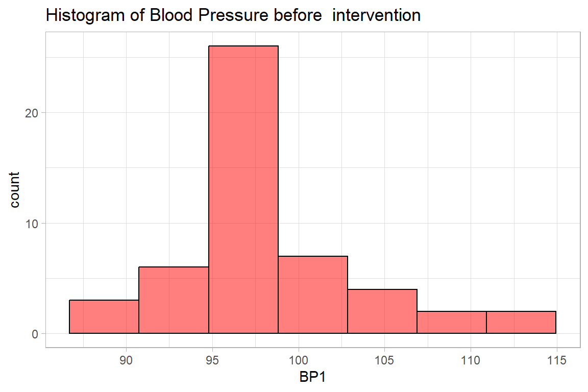
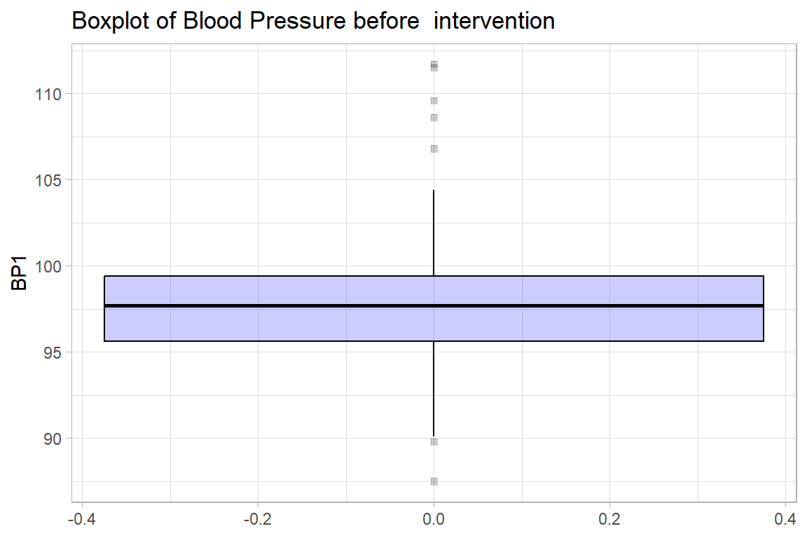
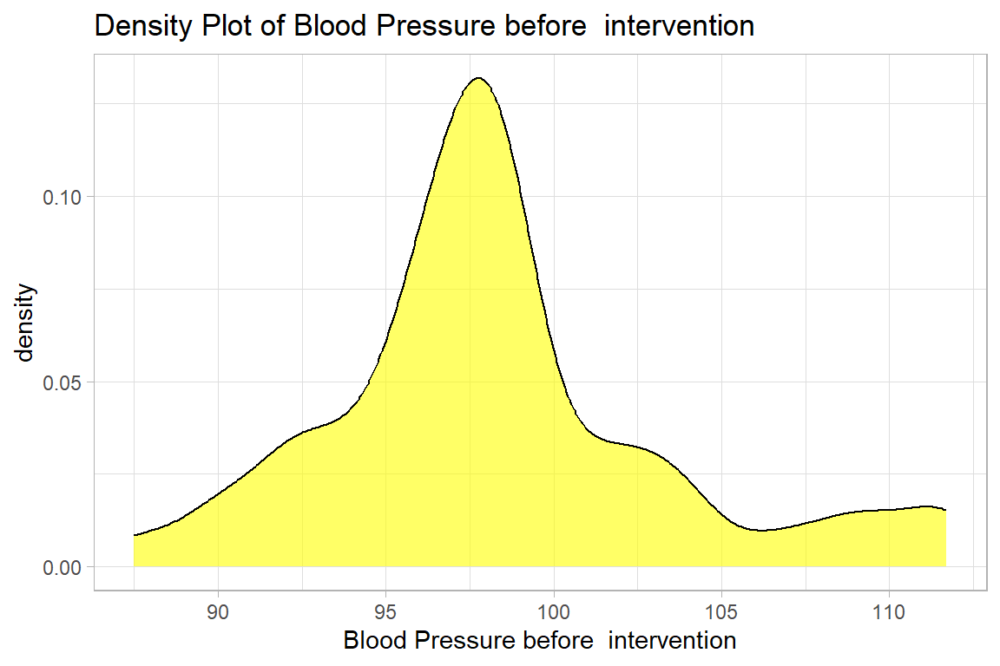
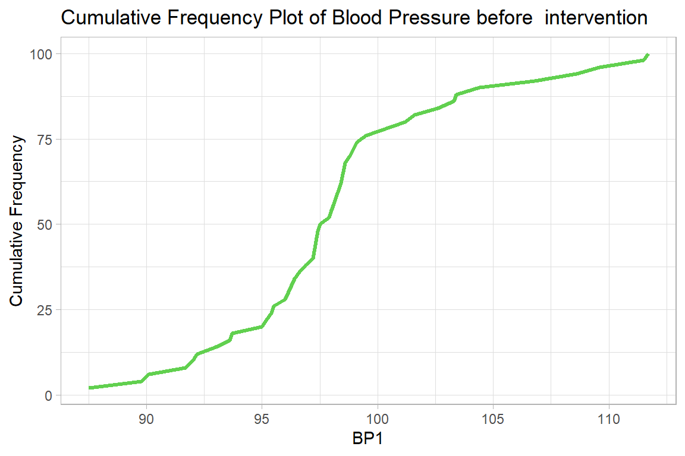
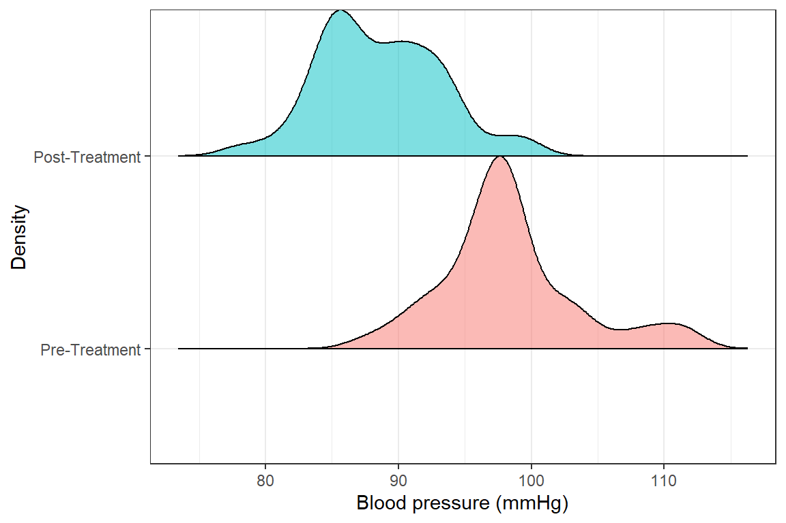
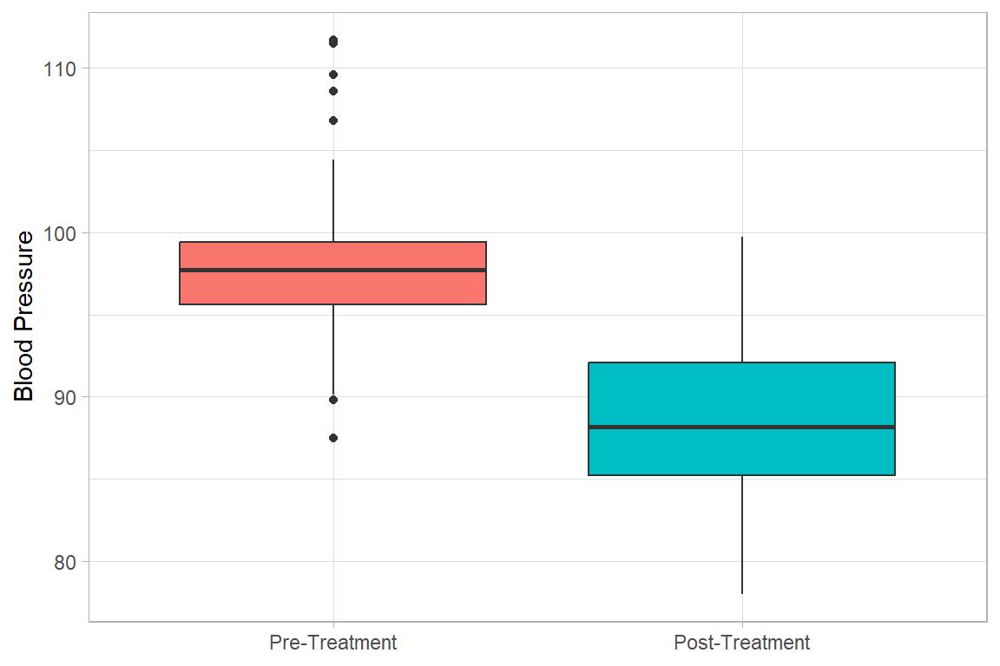
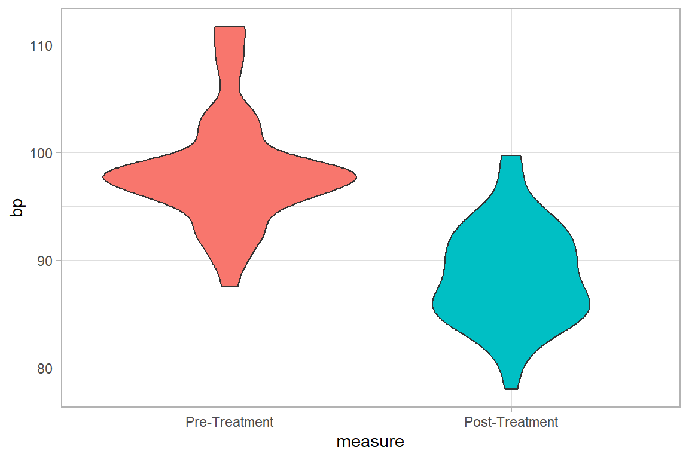
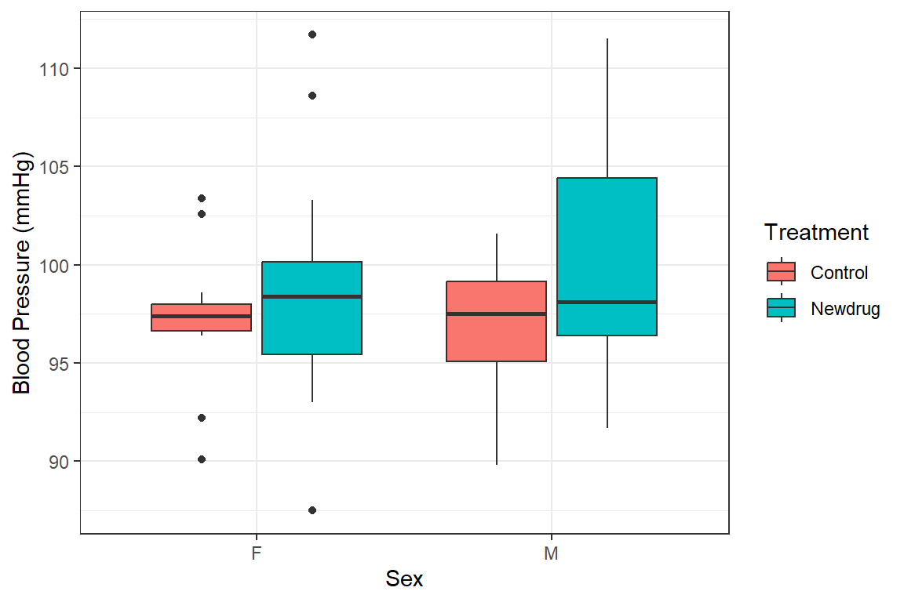

# Descriptive Statistics: Numeric

For this section, we will use the `NewDrug_clean.dta` dataset


```r
newdrug <-  
    haven::read_dta("./Data/NewDrug_clean.dta") %>% 
    mutate(sex  = haven::as_factor(sex), treat = haven::as_factor(treat)) %>% 
    haven::zap_labels() 

newdrug %>% summary()
      id                treat         age        sex   
 Length:50          Control:22   Min.   :45.00   F:26  
 Class :character   Newdrug:28   1st Qu.:57.25   M:24  
 Mode  :character                Median :63.00         
                                 Mean   :61.48         
                                 3rd Qu.:65.00         
                                 Max.   :75.00         
      bp1              bp2            bpdiff      
 Min.   : 87.50   Min.   :78.00   Min.   : 0.500  
 1st Qu.: 95.62   1st Qu.:85.22   1st Qu.: 4.800  
 Median : 97.70   Median :88.15   Median : 8.250  
 Mean   : 98.30   Mean   :88.60   Mean   : 9.704  
 3rd Qu.: 99.40   3rd Qu.:92.10   3rd Qu.:13.700  
 Max.   :111.70   Max.   :99.70   Max.   :26.300  
```


### Single continuous variable

#### Measures of Central Tendency & Dispersion

These include mean and median and are displayed below


```r
newdrug %>% 
    summarise(
        mean.bp1 = mean(bp1), 
        median.bp1 = median(bp1), 
        sd.bp1 = sd(bp1), 
        min.bp1 = min(bp1), 
        max.bp1 = max(bp1),
        iqr = IQR(bp1)
    ) 
```


```{=html}
<table class="huxtable" style="border-collapse: collapse; border: 0px; margin-bottom: 2em; margin-top: 2em; ; margin-left: auto; margin-right: auto;  " id="tab:unnamed-chunk-3">
<caption style="caption-side: top; text-align: center;">(#tab:unnamed-chunk-3) </caption><col><col><col><col><col><col><tr>
<th style="vertical-align: top; text-align: right; white-space: normal; border-style: solid solid solid solid; border-width: 0.4pt 0pt 0.4pt 0pt;    padding: 2pt 6pt 2pt 0pt; font-weight: bold; font-family: Arial, Times New Roman, Times, Serif; font-size: 11pt;">mean.bp1</th><th style="vertical-align: top; text-align: right; white-space: normal; border-style: solid solid solid solid; border-width: 0.4pt 0pt 0.4pt 0pt;    padding: 2pt 6pt 2pt 6pt; font-weight: bold; font-family: Arial, Times New Roman, Times, Serif; font-size: 11pt;">median.bp1</th><th style="vertical-align: top; text-align: right; white-space: normal; border-style: solid solid solid solid; border-width: 0.4pt 0pt 0.4pt 0pt;    padding: 2pt 6pt 2pt 6pt; font-weight: bold; font-family: Arial, Times New Roman, Times, Serif; font-size: 11pt;">sd.bp1</th><th style="vertical-align: top; text-align: right; white-space: normal; border-style: solid solid solid solid; border-width: 0.4pt 0pt 0.4pt 0pt;    padding: 2pt 6pt 2pt 6pt; font-weight: bold; font-family: Arial, Times New Roman, Times, Serif; font-size: 11pt;">min.bp1</th><th style="vertical-align: top; text-align: right; white-space: normal; border-style: solid solid solid solid; border-width: 0.4pt 0pt 0.4pt 0pt;    padding: 2pt 6pt 2pt 6pt; font-weight: bold; font-family: Arial, Times New Roman, Times, Serif; font-size: 11pt;">max.bp1</th><th style="vertical-align: top; text-align: right; white-space: normal; border-style: solid solid solid solid; border-width: 0.4pt 0pt 0.4pt 0pt;    padding: 2pt 0pt 2pt 6pt; font-weight: bold; font-family: Arial, Times New Roman, Times, Serif; font-size: 11pt;">iqr</th></tr>
<tr>
<td style="vertical-align: top; text-align: right; white-space: normal; border-style: solid solid solid solid; border-width: 0.4pt 0pt 0.4pt 0pt;    padding: 2pt 6pt 2pt 0pt; font-weight: normal; font-family: Arial, Times New Roman, Times, Serif; font-size: 11pt;">98.3</td><td style="vertical-align: top; text-align: right; white-space: normal; border-style: solid solid solid solid; border-width: 0.4pt 0pt 0.4pt 0pt;    padding: 2pt 6pt 2pt 6pt; font-weight: normal; font-family: Arial, Times New Roman, Times, Serif; font-size: 11pt;">97.7</td><td style="vertical-align: top; text-align: right; white-space: normal; border-style: solid solid solid solid; border-width: 0.4pt 0pt 0.4pt 0pt;    padding: 2pt 6pt 2pt 6pt; font-weight: normal; font-family: Arial, Times New Roman, Times, Serif; font-size: 11pt;">5.17</td><td style="vertical-align: top; text-align: right; white-space: normal; border-style: solid solid solid solid; border-width: 0.4pt 0pt 0.4pt 0pt;    padding: 2pt 6pt 2pt 6pt; font-weight: normal; font-family: Arial, Times New Roman, Times, Serif; font-size: 11pt;">87.5</td><td style="vertical-align: top; text-align: right; white-space: normal; border-style: solid solid solid solid; border-width: 0.4pt 0pt 0.4pt 0pt;    padding: 2pt 6pt 2pt 6pt; font-weight: normal; font-family: Arial, Times New Roman, Times, Serif; font-size: 11pt;">112</td><td style="vertical-align: top; text-align: right; white-space: normal; border-style: solid solid solid solid; border-width: 0.4pt 0pt 0.4pt 0pt;    padding: 2pt 0pt 2pt 6pt; font-weight: normal; font-family: Arial, Times New Roman, Times, Serif; font-size: 11pt;">3.78</td></tr>
</table>

```


Alternatively


```r
newdrug %$% 
    psych::describe(bp1)
```


```{=html}
<table class="huxtable" style="border-collapse: collapse; border: 0px; margin-bottom: 2em; margin-top: 2em; ; margin-left: auto; margin-right: auto;  " id="tab:unnamed-chunk-4">
<caption style="caption-side: top; text-align: center;">(#tab:unnamed-chunk-4) </caption><col><col><col><col><col><col><col><col><col><col><col><col><col><tr>
<th style="vertical-align: top; text-align: right; white-space: normal; border-style: solid solid solid solid; border-width: 0.4pt 0pt 0.4pt 0pt;    padding: 2pt 6pt 2pt 0pt; font-weight: bold; font-family: Arial, Times New Roman, Times, Serif; font-size: 11pt;">vars</th><th style="vertical-align: top; text-align: right; white-space: normal; border-style: solid solid solid solid; border-width: 0.4pt 0pt 0.4pt 0pt;    padding: 2pt 6pt 2pt 6pt; font-weight: bold; font-family: Arial, Times New Roman, Times, Serif; font-size: 11pt;">n</th><th style="vertical-align: top; text-align: right; white-space: normal; border-style: solid solid solid solid; border-width: 0.4pt 0pt 0.4pt 0pt;    padding: 2pt 6pt 2pt 6pt; font-weight: bold; font-family: Arial, Times New Roman, Times, Serif; font-size: 11pt;">mean</th><th style="vertical-align: top; text-align: right; white-space: normal; border-style: solid solid solid solid; border-width: 0.4pt 0pt 0.4pt 0pt;    padding: 2pt 6pt 2pt 6pt; font-weight: bold; font-family: Arial, Times New Roman, Times, Serif; font-size: 11pt;">sd</th><th style="vertical-align: top; text-align: right; white-space: normal; border-style: solid solid solid solid; border-width: 0.4pt 0pt 0.4pt 0pt;    padding: 2pt 6pt 2pt 6pt; font-weight: bold; font-family: Arial, Times New Roman, Times, Serif; font-size: 11pt;">median</th><th style="vertical-align: top; text-align: right; white-space: normal; border-style: solid solid solid solid; border-width: 0.4pt 0pt 0.4pt 0pt;    padding: 2pt 6pt 2pt 6pt; font-weight: bold; font-family: Arial, Times New Roman, Times, Serif; font-size: 11pt;">trimmed</th><th style="vertical-align: top; text-align: right; white-space: normal; border-style: solid solid solid solid; border-width: 0.4pt 0pt 0.4pt 0pt;    padding: 2pt 6pt 2pt 6pt; font-weight: bold; font-family: Arial, Times New Roman, Times, Serif; font-size: 11pt;">mad</th><th style="vertical-align: top; text-align: right; white-space: normal; border-style: solid solid solid solid; border-width: 0.4pt 0pt 0.4pt 0pt;    padding: 2pt 6pt 2pt 6pt; font-weight: bold; font-family: Arial, Times New Roman, Times, Serif; font-size: 11pt;">min</th><th style="vertical-align: top; text-align: right; white-space: normal; border-style: solid solid solid solid; border-width: 0.4pt 0pt 0.4pt 0pt;    padding: 2pt 6pt 2pt 6pt; font-weight: bold; font-family: Arial, Times New Roman, Times, Serif; font-size: 11pt;">max</th><th style="vertical-align: top; text-align: right; white-space: normal; border-style: solid solid solid solid; border-width: 0.4pt 0pt 0.4pt 0pt;    padding: 2pt 6pt 2pt 6pt; font-weight: bold; font-family: Arial, Times New Roman, Times, Serif; font-size: 11pt;">range</th><th style="vertical-align: top; text-align: right; white-space: normal; border-style: solid solid solid solid; border-width: 0.4pt 0pt 0.4pt 0pt;    padding: 2pt 6pt 2pt 6pt; font-weight: bold; font-family: Arial, Times New Roman, Times, Serif; font-size: 11pt;">skew</th><th style="vertical-align: top; text-align: right; white-space: normal; border-style: solid solid solid solid; border-width: 0.4pt 0pt 0.4pt 0pt;    padding: 2pt 6pt 2pt 6pt; font-weight: bold; font-family: Arial, Times New Roman, Times, Serif; font-size: 11pt;">kurtosis</th><th style="vertical-align: top; text-align: right; white-space: normal; border-style: solid solid solid solid; border-width: 0.4pt 0pt 0.4pt 0pt;    padding: 2pt 0pt 2pt 6pt; font-weight: bold; font-family: Arial, Times New Roman, Times, Serif; font-size: 11pt;">se</th></tr>
<tr>
<td style="vertical-align: top; text-align: right; white-space: normal; border-style: solid solid solid solid; border-width: 0.4pt 0pt 0.4pt 0pt;    padding: 2pt 6pt 2pt 0pt; font-weight: normal; font-family: Arial, Times New Roman, Times, Serif; font-size: 11pt;">1</td><td style="vertical-align: top; text-align: right; white-space: normal; border-style: solid solid solid solid; border-width: 0.4pt 0pt 0.4pt 0pt;    padding: 2pt 6pt 2pt 6pt; font-weight: normal; font-family: Arial, Times New Roman, Times, Serif; font-size: 11pt;">50</td><td style="vertical-align: top; text-align: right; white-space: normal; border-style: solid solid solid solid; border-width: 0.4pt 0pt 0.4pt 0pt;    padding: 2pt 6pt 2pt 6pt; font-weight: normal; font-family: Arial, Times New Roman, Times, Serif; font-size: 11pt;">98.3</td><td style="vertical-align: top; text-align: right; white-space: normal; border-style: solid solid solid solid; border-width: 0.4pt 0pt 0.4pt 0pt;    padding: 2pt 6pt 2pt 6pt; font-weight: normal; font-family: Arial, Times New Roman, Times, Serif; font-size: 11pt;">5.17</td><td style="vertical-align: top; text-align: right; white-space: normal; border-style: solid solid solid solid; border-width: 0.4pt 0pt 0.4pt 0pt;    padding: 2pt 6pt 2pt 6pt; font-weight: normal; font-family: Arial, Times New Roman, Times, Serif; font-size: 11pt;">97.7</td><td style="vertical-align: top; text-align: right; white-space: normal; border-style: solid solid solid solid; border-width: 0.4pt 0pt 0.4pt 0pt;    padding: 2pt 6pt 2pt 6pt; font-weight: normal; font-family: Arial, Times New Roman, Times, Serif; font-size: 11pt;">97.9</td><td style="vertical-align: top; text-align: right; white-space: normal; border-style: solid solid solid solid; border-width: 0.4pt 0pt 0.4pt 0pt;    padding: 2pt 6pt 2pt 6pt; font-weight: normal; font-family: Arial, Times New Roman, Times, Serif; font-size: 11pt;">2.97</td><td style="vertical-align: top; text-align: right; white-space: normal; border-style: solid solid solid solid; border-width: 0.4pt 0pt 0.4pt 0pt;    padding: 2pt 6pt 2pt 6pt; font-weight: normal; font-family: Arial, Times New Roman, Times, Serif; font-size: 11pt;">87.5</td><td style="vertical-align: top; text-align: right; white-space: normal; border-style: solid solid solid solid; border-width: 0.4pt 0pt 0.4pt 0pt;    padding: 2pt 6pt 2pt 6pt; font-weight: normal; font-family: Arial, Times New Roman, Times, Serif; font-size: 11pt;">112</td><td style="vertical-align: top; text-align: right; white-space: normal; border-style: solid solid solid solid; border-width: 0.4pt 0pt 0.4pt 0pt;    padding: 2pt 6pt 2pt 6pt; font-weight: normal; font-family: Arial, Times New Roman, Times, Serif; font-size: 11pt;">24.2</td><td style="vertical-align: top; text-align: right; white-space: normal; border-style: solid solid solid solid; border-width: 0.4pt 0pt 0.4pt 0pt;    padding: 2pt 6pt 2pt 6pt; font-weight: normal; font-family: Arial, Times New Roman, Times, Serif; font-size: 11pt;">0.696</td><td style="vertical-align: top; text-align: right; white-space: normal; border-style: solid solid solid solid; border-width: 0.4pt 0pt 0.4pt 0pt;    padding: 2pt 6pt 2pt 6pt; font-weight: normal; font-family: Arial, Times New Roman, Times, Serif; font-size: 11pt;">0.617</td><td style="vertical-align: top; text-align: right; white-space: normal; border-style: solid solid solid solid; border-width: 0.4pt 0pt 0.4pt 0pt;    padding: 2pt 0pt 2pt 6pt; font-weight: normal; font-family: Arial, Times New Roman, Times, Serif; font-size: 11pt;">0.731</td></tr>
</table>

```


And to show the interquartile range we do the following.


```r
newdrug %$% 
    psych::describe(bp1, IQR = TRUE,quant = c(.25, .75))
```


```{=html}
<table class="huxtable" style="border-collapse: collapse; border: 0px; margin-bottom: 2em; margin-top: 2em; ; margin-left: auto; margin-right: auto;  " id="tab:unnamed-chunk-5">
<caption style="caption-side: top; text-align: center;">(#tab:unnamed-chunk-5) </caption><col><col><col><col><col><col><col><col><col><col><col><col><col><col><col><col><tr>
<th style="vertical-align: top; text-align: right; white-space: normal; border-style: solid solid solid solid; border-width: 0.4pt 0pt 0.4pt 0pt;    padding: 2pt 6pt 2pt 0pt; font-weight: bold; font-family: Arial, Times New Roman, Times, Serif; font-size: 11pt;">vars</th><th style="vertical-align: top; text-align: right; white-space: normal; border-style: solid solid solid solid; border-width: 0.4pt 0pt 0.4pt 0pt;    padding: 2pt 6pt 2pt 6pt; font-weight: bold; font-family: Arial, Times New Roman, Times, Serif; font-size: 11pt;">n</th><th style="vertical-align: top; text-align: right; white-space: normal; border-style: solid solid solid solid; border-width: 0.4pt 0pt 0.4pt 0pt;    padding: 2pt 6pt 2pt 6pt; font-weight: bold; font-family: Arial, Times New Roman, Times, Serif; font-size: 11pt;">mean</th><th style="vertical-align: top; text-align: right; white-space: normal; border-style: solid solid solid solid; border-width: 0.4pt 0pt 0.4pt 0pt;    padding: 2pt 6pt 2pt 6pt; font-weight: bold; font-family: Arial, Times New Roman, Times, Serif; font-size: 11pt;">sd</th><th style="vertical-align: top; text-align: right; white-space: normal; border-style: solid solid solid solid; border-width: 0.4pt 0pt 0.4pt 0pt;    padding: 2pt 6pt 2pt 6pt; font-weight: bold; font-family: Arial, Times New Roman, Times, Serif; font-size: 11pt;">median</th><th style="vertical-align: top; text-align: right; white-space: normal; border-style: solid solid solid solid; border-width: 0.4pt 0pt 0.4pt 0pt;    padding: 2pt 6pt 2pt 6pt; font-weight: bold; font-family: Arial, Times New Roman, Times, Serif; font-size: 11pt;">trimmed</th><th style="vertical-align: top; text-align: right; white-space: normal; border-style: solid solid solid solid; border-width: 0.4pt 0pt 0.4pt 0pt;    padding: 2pt 6pt 2pt 6pt; font-weight: bold; font-family: Arial, Times New Roman, Times, Serif; font-size: 11pt;">mad</th><th style="vertical-align: top; text-align: right; white-space: normal; border-style: solid solid solid solid; border-width: 0.4pt 0pt 0.4pt 0pt;    padding: 2pt 6pt 2pt 6pt; font-weight: bold; font-family: Arial, Times New Roman, Times, Serif; font-size: 11pt;">min</th><th style="vertical-align: top; text-align: right; white-space: normal; border-style: solid solid solid solid; border-width: 0.4pt 0pt 0.4pt 0pt;    padding: 2pt 6pt 2pt 6pt; font-weight: bold; font-family: Arial, Times New Roman, Times, Serif; font-size: 11pt;">max</th><th style="vertical-align: top; text-align: right; white-space: normal; border-style: solid solid solid solid; border-width: 0.4pt 0pt 0.4pt 0pt;    padding: 2pt 6pt 2pt 6pt; font-weight: bold; font-family: Arial, Times New Roman, Times, Serif; font-size: 11pt;">range</th><th style="vertical-align: top; text-align: right; white-space: normal; border-style: solid solid solid solid; border-width: 0.4pt 0pt 0.4pt 0pt;    padding: 2pt 6pt 2pt 6pt; font-weight: bold; font-family: Arial, Times New Roman, Times, Serif; font-size: 11pt;">skew</th><th style="vertical-align: top; text-align: right; white-space: normal; border-style: solid solid solid solid; border-width: 0.4pt 0pt 0.4pt 0pt;    padding: 2pt 6pt 2pt 6pt; font-weight: bold; font-family: Arial, Times New Roman, Times, Serif; font-size: 11pt;">kurtosis</th><th style="vertical-align: top; text-align: right; white-space: normal; border-style: solid solid solid solid; border-width: 0.4pt 0pt 0.4pt 0pt;    padding: 2pt 6pt 2pt 6pt; font-weight: bold; font-family: Arial, Times New Roman, Times, Serif; font-size: 11pt;">se</th><th style="vertical-align: top; text-align: right; white-space: normal; border-style: solid solid solid solid; border-width: 0.4pt 0pt 0.4pt 0pt;    padding: 2pt 6pt 2pt 6pt; font-weight: bold; font-family: Arial, Times New Roman, Times, Serif; font-size: 11pt;">IQR</th><th style="vertical-align: top; text-align: right; white-space: normal; border-style: solid solid solid solid; border-width: 0.4pt 0pt 0.4pt 0pt;    padding: 2pt 6pt 2pt 6pt; font-weight: bold; font-family: Arial, Times New Roman, Times, Serif; font-size: 11pt;">Q0.25</th><th style="vertical-align: top; text-align: right; white-space: normal; border-style: solid solid solid solid; border-width: 0.4pt 0pt 0.4pt 0pt;    padding: 2pt 0pt 2pt 6pt; font-weight: bold; font-family: Arial, Times New Roman, Times, Serif; font-size: 11pt;">Q0.75</th></tr>
<tr>
<td style="vertical-align: top; text-align: right; white-space: normal; border-style: solid solid solid solid; border-width: 0.4pt 0pt 0.4pt 0pt;    padding: 2pt 6pt 2pt 0pt; font-weight: normal; font-family: Arial, Times New Roman, Times, Serif; font-size: 11pt;">1</td><td style="vertical-align: top; text-align: right; white-space: normal; border-style: solid solid solid solid; border-width: 0.4pt 0pt 0.4pt 0pt;    padding: 2pt 6pt 2pt 6pt; font-weight: normal; font-family: Arial, Times New Roman, Times, Serif; font-size: 11pt;">50</td><td style="vertical-align: top; text-align: right; white-space: normal; border-style: solid solid solid solid; border-width: 0.4pt 0pt 0.4pt 0pt;    padding: 2pt 6pt 2pt 6pt; font-weight: normal; font-family: Arial, Times New Roman, Times, Serif; font-size: 11pt;">98.3</td><td style="vertical-align: top; text-align: right; white-space: normal; border-style: solid solid solid solid; border-width: 0.4pt 0pt 0.4pt 0pt;    padding: 2pt 6pt 2pt 6pt; font-weight: normal; font-family: Arial, Times New Roman, Times, Serif; font-size: 11pt;">5.17</td><td style="vertical-align: top; text-align: right; white-space: normal; border-style: solid solid solid solid; border-width: 0.4pt 0pt 0.4pt 0pt;    padding: 2pt 6pt 2pt 6pt; font-weight: normal; font-family: Arial, Times New Roman, Times, Serif; font-size: 11pt;">97.7</td><td style="vertical-align: top; text-align: right; white-space: normal; border-style: solid solid solid solid; border-width: 0.4pt 0pt 0.4pt 0pt;    padding: 2pt 6pt 2pt 6pt; font-weight: normal; font-family: Arial, Times New Roman, Times, Serif; font-size: 11pt;">97.9</td><td style="vertical-align: top; text-align: right; white-space: normal; border-style: solid solid solid solid; border-width: 0.4pt 0pt 0.4pt 0pt;    padding: 2pt 6pt 2pt 6pt; font-weight: normal; font-family: Arial, Times New Roman, Times, Serif; font-size: 11pt;">2.97</td><td style="vertical-align: top; text-align: right; white-space: normal; border-style: solid solid solid solid; border-width: 0.4pt 0pt 0.4pt 0pt;    padding: 2pt 6pt 2pt 6pt; font-weight: normal; font-family: Arial, Times New Roman, Times, Serif; font-size: 11pt;">87.5</td><td style="vertical-align: top; text-align: right; white-space: normal; border-style: solid solid solid solid; border-width: 0.4pt 0pt 0.4pt 0pt;    padding: 2pt 6pt 2pt 6pt; font-weight: normal; font-family: Arial, Times New Roman, Times, Serif; font-size: 11pt;">112</td><td style="vertical-align: top; text-align: right; white-space: normal; border-style: solid solid solid solid; border-width: 0.4pt 0pt 0.4pt 0pt;    padding: 2pt 6pt 2pt 6pt; font-weight: normal; font-family: Arial, Times New Roman, Times, Serif; font-size: 11pt;">24.2</td><td style="vertical-align: top; text-align: right; white-space: normal; border-style: solid solid solid solid; border-width: 0.4pt 0pt 0.4pt 0pt;    padding: 2pt 6pt 2pt 6pt; font-weight: normal; font-family: Arial, Times New Roman, Times, Serif; font-size: 11pt;">0.696</td><td style="vertical-align: top; text-align: right; white-space: normal; border-style: solid solid solid solid; border-width: 0.4pt 0pt 0.4pt 0pt;    padding: 2pt 6pt 2pt 6pt; font-weight: normal; font-family: Arial, Times New Roman, Times, Serif; font-size: 11pt;">0.617</td><td style="vertical-align: top; text-align: right; white-space: normal; border-style: solid solid solid solid; border-width: 0.4pt 0pt 0.4pt 0pt;    padding: 2pt 6pt 2pt 6pt; font-weight: normal; font-family: Arial, Times New Roman, Times, Serif; font-size: 11pt;">0.731</td><td style="vertical-align: top; text-align: right; white-space: normal; border-style: solid solid solid solid; border-width: 0.4pt 0pt 0.4pt 0pt;    padding: 2pt 6pt 2pt 6pt; font-weight: normal; font-family: Arial, Times New Roman, Times, Serif; font-size: 11pt;">3.78</td><td style="vertical-align: top; text-align: right; white-space: normal; border-style: solid solid solid solid; border-width: 0.4pt 0pt 0.4pt 0pt;    padding: 2pt 6pt 2pt 6pt; font-weight: normal; font-family: Arial, Times New Roman, Times, Serif; font-size: 11pt;">95.6</td><td style="vertical-align: top; text-align: right; white-space: normal; border-style: solid solid solid solid; border-width: 0.4pt 0pt 0.4pt 0pt;    padding: 2pt 0pt 2pt 6pt; font-weight: normal; font-family: Arial, Times New Roman, Times, Serif; font-size: 11pt;">99.4</td></tr>
</table>

```


#### Graphs - Histogram 

```r
newdrug %>% 
    ggplot(aes(x = bp1)) + 
    geom_histogram(bins = 7, col="black", alpha = .5, fill = "red") +
    labs(title = "Histogram of Blood Pressure before  intervention",
         x= "BP1")+
    theme_light()
```



#### Graphs - Boxplot and violin plot 


```r
newdrug %>% 
    ggplot(aes(y = bp1)) + 
    geom_boxplot(col="black",  
                 alpha = .2, 
                 fill = "blue", 
                 outlier.fill = "black",
                 outlier.shape = 22) +
    labs(title = "Boxplot of Blood Pressure before  intervention",
         y = "BP1")+
    theme_light()
```



#### Graphs - Density plot

```r
newdrug %>% 
    ggplot(aes(y = bp1)) + 
    geom_density(col="black", fill = "yellow", alpha=.6) +
    labs(title = "Density Plot of Blood Pressure before  intervention",
         y = "Blood Pressure before  intervention")+
    coord_flip() +
    theme_light()
```



#### Graphs - Cumulative Frequency plot


```r
newdrug %>% 
    group_by(bp1) %>% 
    summarize(n = n()) %>% 
    ungroup() %>% 
    mutate(cum = cumsum(n)/sum(n)*100) %>% 
    ggplot(aes(y = cum, x = bp1)) +
    geom_line(col=3, linewidth=1.2)+
    labs(
        title = "Cumulative Frequency Plot of Blood Pressure before  intervention",
        x = "BP1",
        y = "Cumulative Frequency")+
    theme_light() 
```



### Multiple Continuous variables

#### Measures of Central tendency & Dispersion


```r
newdrug %>% 
    select(where(is.numeric)) %>% 
    psych::describe()
```


```{=html}
<table class="huxtable" style="border-collapse: collapse; border: 0px; margin-bottom: 2em; margin-top: 2em; ; margin-left: auto; margin-right: auto;  " id="tab:unnamed-chunk-10">
<caption style="caption-side: top; text-align: center;">(#tab:unnamed-chunk-10) </caption><col><col><col><col><col><col><col><col><col><col><col><col><col><tr>
<th style="vertical-align: top; text-align: right; white-space: normal; border-style: solid solid solid solid; border-width: 0.4pt 0pt 0.4pt 0pt;    padding: 2pt 6pt 2pt 0pt; font-weight: bold; font-family: Arial, Times New Roman, Times, Serif; font-size: 11pt;">vars</th><th style="vertical-align: top; text-align: right; white-space: normal; border-style: solid solid solid solid; border-width: 0.4pt 0pt 0.4pt 0pt;    padding: 2pt 6pt 2pt 6pt; font-weight: bold; font-family: Arial, Times New Roman, Times, Serif; font-size: 11pt;">n</th><th style="vertical-align: top; text-align: right; white-space: normal; border-style: solid solid solid solid; border-width: 0.4pt 0pt 0.4pt 0pt;    padding: 2pt 6pt 2pt 6pt; font-weight: bold; font-family: Arial, Times New Roman, Times, Serif; font-size: 11pt;">mean</th><th style="vertical-align: top; text-align: right; white-space: normal; border-style: solid solid solid solid; border-width: 0.4pt 0pt 0.4pt 0pt;    padding: 2pt 6pt 2pt 6pt; font-weight: bold; font-family: Arial, Times New Roman, Times, Serif; font-size: 11pt;">sd</th><th style="vertical-align: top; text-align: right; white-space: normal; border-style: solid solid solid solid; border-width: 0.4pt 0pt 0.4pt 0pt;    padding: 2pt 6pt 2pt 6pt; font-weight: bold; font-family: Arial, Times New Roman, Times, Serif; font-size: 11pt;">median</th><th style="vertical-align: top; text-align: right; white-space: normal; border-style: solid solid solid solid; border-width: 0.4pt 0pt 0.4pt 0pt;    padding: 2pt 6pt 2pt 6pt; font-weight: bold; font-family: Arial, Times New Roman, Times, Serif; font-size: 11pt;">trimmed</th><th style="vertical-align: top; text-align: right; white-space: normal; border-style: solid solid solid solid; border-width: 0.4pt 0pt 0.4pt 0pt;    padding: 2pt 6pt 2pt 6pt; font-weight: bold; font-family: Arial, Times New Roman, Times, Serif; font-size: 11pt;">mad</th><th style="vertical-align: top; text-align: right; white-space: normal; border-style: solid solid solid solid; border-width: 0.4pt 0pt 0.4pt 0pt;    padding: 2pt 6pt 2pt 6pt; font-weight: bold; font-family: Arial, Times New Roman, Times, Serif; font-size: 11pt;">min</th><th style="vertical-align: top; text-align: right; white-space: normal; border-style: solid solid solid solid; border-width: 0.4pt 0pt 0.4pt 0pt;    padding: 2pt 6pt 2pt 6pt; font-weight: bold; font-family: Arial, Times New Roman, Times, Serif; font-size: 11pt;">max</th><th style="vertical-align: top; text-align: right; white-space: normal; border-style: solid solid solid solid; border-width: 0.4pt 0pt 0.4pt 0pt;    padding: 2pt 6pt 2pt 6pt; font-weight: bold; font-family: Arial, Times New Roman, Times, Serif; font-size: 11pt;">range</th><th style="vertical-align: top; text-align: right; white-space: normal; border-style: solid solid solid solid; border-width: 0.4pt 0pt 0.4pt 0pt;    padding: 2pt 6pt 2pt 6pt; font-weight: bold; font-family: Arial, Times New Roman, Times, Serif; font-size: 11pt;">skew</th><th style="vertical-align: top; text-align: right; white-space: normal; border-style: solid solid solid solid; border-width: 0.4pt 0pt 0.4pt 0pt;    padding: 2pt 6pt 2pt 6pt; font-weight: bold; font-family: Arial, Times New Roman, Times, Serif; font-size: 11pt;">kurtosis</th><th style="vertical-align: top; text-align: right; white-space: normal; border-style: solid solid solid solid; border-width: 0.4pt 0pt 0.4pt 0pt;    padding: 2pt 0pt 2pt 6pt; font-weight: bold; font-family: Arial, Times New Roman, Times, Serif; font-size: 11pt;">se</th></tr>
<tr>
<td style="vertical-align: top; text-align: right; white-space: normal; border-style: solid solid solid solid; border-width: 0.4pt 0pt 0pt 0pt;    padding: 2pt 6pt 2pt 0pt; font-weight: normal; font-family: Arial, Times New Roman, Times, Serif; font-size: 11pt;">1</td><td style="vertical-align: top; text-align: right; white-space: normal; border-style: solid solid solid solid; border-width: 0.4pt 0pt 0pt 0pt;    padding: 2pt 6pt 2pt 6pt; font-weight: normal; font-family: Arial, Times New Roman, Times, Serif; font-size: 11pt;">50</td><td style="vertical-align: top; text-align: right; white-space: normal; border-style: solid solid solid solid; border-width: 0.4pt 0pt 0pt 0pt;    padding: 2pt 6pt 2pt 6pt; font-weight: normal; font-family: Arial, Times New Roman, Times, Serif; font-size: 11pt;">61.5</td><td style="vertical-align: top; text-align: right; white-space: normal; border-style: solid solid solid solid; border-width: 0.4pt 0pt 0pt 0pt;    padding: 2pt 6pt 2pt 6pt; font-weight: normal; font-family: Arial, Times New Roman, Times, Serif; font-size: 11pt;">6.51</td><td style="vertical-align: top; text-align: right; white-space: normal; border-style: solid solid solid solid; border-width: 0.4pt 0pt 0pt 0pt;    padding: 2pt 6pt 2pt 6pt; font-weight: normal; font-family: Arial, Times New Roman, Times, Serif; font-size: 11pt;">63&nbsp;&nbsp;&nbsp;</td><td style="vertical-align: top; text-align: right; white-space: normal; border-style: solid solid solid solid; border-width: 0.4pt 0pt 0pt 0pt;    padding: 2pt 6pt 2pt 6pt; font-weight: normal; font-family: Arial, Times New Roman, Times, Serif; font-size: 11pt;">62&nbsp;&nbsp;&nbsp;</td><td style="vertical-align: top; text-align: right; white-space: normal; border-style: solid solid solid solid; border-width: 0.4pt 0pt 0pt 0pt;    padding: 2pt 6pt 2pt 6pt; font-weight: normal; font-family: Arial, Times New Roman, Times, Serif; font-size: 11pt;">4.45</td><td style="vertical-align: top; text-align: right; white-space: normal; border-style: solid solid solid solid; border-width: 0.4pt 0pt 0pt 0pt;    padding: 2pt 6pt 2pt 6pt; font-weight: normal; font-family: Arial, Times New Roman, Times, Serif; font-size: 11pt;">45&nbsp;&nbsp;</td><td style="vertical-align: top; text-align: right; white-space: normal; border-style: solid solid solid solid; border-width: 0.4pt 0pt 0pt 0pt;    padding: 2pt 6pt 2pt 6pt; font-weight: normal; font-family: Arial, Times New Roman, Times, Serif; font-size: 11pt;">75&nbsp;&nbsp;</td><td style="vertical-align: top; text-align: right; white-space: normal; border-style: solid solid solid solid; border-width: 0.4pt 0pt 0pt 0pt;    padding: 2pt 6pt 2pt 6pt; font-weight: normal; font-family: Arial, Times New Roman, Times, Serif; font-size: 11pt;">30&nbsp;&nbsp;</td><td style="vertical-align: top; text-align: right; white-space: normal; border-style: solid solid solid solid; border-width: 0.4pt 0pt 0pt 0pt;    padding: 2pt 6pt 2pt 6pt; font-weight: normal; font-family: Arial, Times New Roman, Times, Serif; font-size: 11pt;">-0.602</td><td style="vertical-align: top; text-align: right; white-space: normal; border-style: solid solid solid solid; border-width: 0.4pt 0pt 0pt 0pt;    padding: 2pt 6pt 2pt 6pt; font-weight: normal; font-family: Arial, Times New Roman, Times, Serif; font-size: 11pt;">0.157</td><td style="vertical-align: top; text-align: right; white-space: normal; border-style: solid solid solid solid; border-width: 0.4pt 0pt 0pt 0pt;    padding: 2pt 0pt 2pt 6pt; font-weight: normal; font-family: Arial, Times New Roman, Times, Serif; font-size: 11pt;">0.92&nbsp;</td></tr>
<tr>
<td style="vertical-align: top; text-align: right; white-space: normal; border-style: solid solid solid solid; border-width: 0pt 0pt 0pt 0pt;    padding: 2pt 6pt 2pt 0pt; font-weight: normal; font-family: Arial, Times New Roman, Times, Serif; font-size: 11pt;">2</td><td style="vertical-align: top; text-align: right; white-space: normal; border-style: solid solid solid solid; border-width: 0pt 0pt 0pt 0pt;    padding: 2pt 6pt 2pt 6pt; font-weight: normal; font-family: Arial, Times New Roman, Times, Serif; font-size: 11pt;">50</td><td style="vertical-align: top; text-align: right; white-space: normal; border-style: solid solid solid solid; border-width: 0pt 0pt 0pt 0pt;    padding: 2pt 6pt 2pt 6pt; font-weight: normal; font-family: Arial, Times New Roman, Times, Serif; font-size: 11pt;">98.3</td><td style="vertical-align: top; text-align: right; white-space: normal; border-style: solid solid solid solid; border-width: 0pt 0pt 0pt 0pt;    padding: 2pt 6pt 2pt 6pt; font-weight: normal; font-family: Arial, Times New Roman, Times, Serif; font-size: 11pt;">5.17</td><td style="vertical-align: top; text-align: right; white-space: normal; border-style: solid solid solid solid; border-width: 0pt 0pt 0pt 0pt;    padding: 2pt 6pt 2pt 6pt; font-weight: normal; font-family: Arial, Times New Roman, Times, Serif; font-size: 11pt;">97.7&nbsp;</td><td style="vertical-align: top; text-align: right; white-space: normal; border-style: solid solid solid solid; border-width: 0pt 0pt 0pt 0pt;    padding: 2pt 6pt 2pt 6pt; font-weight: normal; font-family: Arial, Times New Roman, Times, Serif; font-size: 11pt;">97.9&nbsp;</td><td style="vertical-align: top; text-align: right; white-space: normal; border-style: solid solid solid solid; border-width: 0pt 0pt 0pt 0pt;    padding: 2pt 6pt 2pt 6pt; font-weight: normal; font-family: Arial, Times New Roman, Times, Serif; font-size: 11pt;">2.97</td><td style="vertical-align: top; text-align: right; white-space: normal; border-style: solid solid solid solid; border-width: 0pt 0pt 0pt 0pt;    padding: 2pt 6pt 2pt 6pt; font-weight: normal; font-family: Arial, Times New Roman, Times, Serif; font-size: 11pt;">87.5</td><td style="vertical-align: top; text-align: right; white-space: normal; border-style: solid solid solid solid; border-width: 0pt 0pt 0pt 0pt;    padding: 2pt 6pt 2pt 6pt; font-weight: normal; font-family: Arial, Times New Roman, Times, Serif; font-size: 11pt;">112&nbsp;&nbsp;</td><td style="vertical-align: top; text-align: right; white-space: normal; border-style: solid solid solid solid; border-width: 0pt 0pt 0pt 0pt;    padding: 2pt 6pt 2pt 6pt; font-weight: normal; font-family: Arial, Times New Roman, Times, Serif; font-size: 11pt;">24.2</td><td style="vertical-align: top; text-align: right; white-space: normal; border-style: solid solid solid solid; border-width: 0pt 0pt 0pt 0pt;    padding: 2pt 6pt 2pt 6pt; font-weight: normal; font-family: Arial, Times New Roman, Times, Serif; font-size: 11pt;">0.696</td><td style="vertical-align: top; text-align: right; white-space: normal; border-style: solid solid solid solid; border-width: 0pt 0pt 0pt 0pt;    padding: 2pt 6pt 2pt 6pt; font-weight: normal; font-family: Arial, Times New Roman, Times, Serif; font-size: 11pt;">0.617</td><td style="vertical-align: top; text-align: right; white-space: normal; border-style: solid solid solid solid; border-width: 0pt 0pt 0pt 0pt;    padding: 2pt 0pt 2pt 6pt; font-weight: normal; font-family: Arial, Times New Roman, Times, Serif; font-size: 11pt;">0.731</td></tr>
<tr>
<td style="vertical-align: top; text-align: right; white-space: normal; border-style: solid solid solid solid; border-width: 0pt 0pt 0pt 0pt;    padding: 2pt 6pt 2pt 0pt; font-weight: normal; font-family: Arial, Times New Roman, Times, Serif; font-size: 11pt;">3</td><td style="vertical-align: top; text-align: right; white-space: normal; border-style: solid solid solid solid; border-width: 0pt 0pt 0pt 0pt;    padding: 2pt 6pt 2pt 6pt; font-weight: normal; font-family: Arial, Times New Roman, Times, Serif; font-size: 11pt;">50</td><td style="vertical-align: top; text-align: right; white-space: normal; border-style: solid solid solid solid; border-width: 0pt 0pt 0pt 0pt;    padding: 2pt 6pt 2pt 6pt; font-weight: normal; font-family: Arial, Times New Roman, Times, Serif; font-size: 11pt;">88.6</td><td style="vertical-align: top; text-align: right; white-space: normal; border-style: solid solid solid solid; border-width: 0pt 0pt 0pt 0pt;    padding: 2pt 6pt 2pt 6pt; font-weight: normal; font-family: Arial, Times New Roman, Times, Serif; font-size: 11pt;">4.56</td><td style="vertical-align: top; text-align: right; white-space: normal; border-style: solid solid solid solid; border-width: 0pt 0pt 0pt 0pt;    padding: 2pt 6pt 2pt 6pt; font-weight: normal; font-family: Arial, Times New Roman, Times, Serif; font-size: 11pt;">88.2&nbsp;</td><td style="vertical-align: top; text-align: right; white-space: normal; border-style: solid solid solid solid; border-width: 0pt 0pt 0pt 0pt;    padding: 2pt 6pt 2pt 6pt; font-weight: normal; font-family: Arial, Times New Roman, Times, Serif; font-size: 11pt;">88.5&nbsp;</td><td style="vertical-align: top; text-align: right; white-space: normal; border-style: solid solid solid solid; border-width: 0pt 0pt 0pt 0pt;    padding: 2pt 6pt 2pt 6pt; font-weight: normal; font-family: Arial, Times New Roman, Times, Serif; font-size: 11pt;">4.52</td><td style="vertical-align: top; text-align: right; white-space: normal; border-style: solid solid solid solid; border-width: 0pt 0pt 0pt 0pt;    padding: 2pt 6pt 2pt 6pt; font-weight: normal; font-family: Arial, Times New Roman, Times, Serif; font-size: 11pt;">78&nbsp;&nbsp;</td><td style="vertical-align: top; text-align: right; white-space: normal; border-style: solid solid solid solid; border-width: 0pt 0pt 0pt 0pt;    padding: 2pt 6pt 2pt 6pt; font-weight: normal; font-family: Arial, Times New Roman, Times, Serif; font-size: 11pt;">99.7</td><td style="vertical-align: top; text-align: right; white-space: normal; border-style: solid solid solid solid; border-width: 0pt 0pt 0pt 0pt;    padding: 2pt 6pt 2pt 6pt; font-weight: normal; font-family: Arial, Times New Roman, Times, Serif; font-size: 11pt;">21.7</td><td style="vertical-align: top; text-align: right; white-space: normal; border-style: solid solid solid solid; border-width: 0pt 0pt 0pt 0pt;    padding: 2pt 6pt 2pt 6pt; font-weight: normal; font-family: Arial, Times New Roman, Times, Serif; font-size: 11pt;">0.252</td><td style="vertical-align: top; text-align: right; white-space: normal; border-style: solid solid solid solid; border-width: 0pt 0pt 0pt 0pt;    padding: 2pt 6pt 2pt 6pt; font-weight: normal; font-family: Arial, Times New Roman, Times, Serif; font-size: 11pt;">-0.236</td><td style="vertical-align: top; text-align: right; white-space: normal; border-style: solid solid solid solid; border-width: 0pt 0pt 0pt 0pt;    padding: 2pt 0pt 2pt 6pt; font-weight: normal; font-family: Arial, Times New Roman, Times, Serif; font-size: 11pt;">0.645</td></tr>
<tr>
<td style="vertical-align: top; text-align: right; white-space: normal; border-style: solid solid solid solid; border-width: 0pt 0pt 0.4pt 0pt;    padding: 2pt 6pt 2pt 0pt; font-weight: normal; font-family: Arial, Times New Roman, Times, Serif; font-size: 11pt;">4</td><td style="vertical-align: top; text-align: right; white-space: normal; border-style: solid solid solid solid; border-width: 0pt 0pt 0.4pt 0pt;    padding: 2pt 6pt 2pt 6pt; font-weight: normal; font-family: Arial, Times New Roman, Times, Serif; font-size: 11pt;">50</td><td style="vertical-align: top; text-align: right; white-space: normal; border-style: solid solid solid solid; border-width: 0pt 0pt 0.4pt 0pt;    padding: 2pt 6pt 2pt 6pt; font-weight: normal; font-family: Arial, Times New Roman, Times, Serif; font-size: 11pt;">9.7</td><td style="vertical-align: top; text-align: right; white-space: normal; border-style: solid solid solid solid; border-width: 0pt 0pt 0.4pt 0pt;    padding: 2pt 6pt 2pt 6pt; font-weight: normal; font-family: Arial, Times New Roman, Times, Serif; font-size: 11pt;">6.2&nbsp;</td><td style="vertical-align: top; text-align: right; white-space: normal; border-style: solid solid solid solid; border-width: 0pt 0pt 0.4pt 0pt;    padding: 2pt 6pt 2pt 6pt; font-weight: normal; font-family: Arial, Times New Roman, Times, Serif; font-size: 11pt;">8.25</td><td style="vertical-align: top; text-align: right; white-space: normal; border-style: solid solid solid solid; border-width: 0pt 0pt 0.4pt 0pt;    padding: 2pt 6pt 2pt 6pt; font-weight: normal; font-family: Arial, Times New Roman, Times, Serif; font-size: 11pt;">8.95</td><td style="vertical-align: top; text-align: right; white-space: normal; border-style: solid solid solid solid; border-width: 0pt 0pt 0.4pt 0pt;    padding: 2pt 6pt 2pt 6pt; font-weight: normal; font-family: Arial, Times New Roman, Times, Serif; font-size: 11pt;">5.49</td><td style="vertical-align: top; text-align: right; white-space: normal; border-style: solid solid solid solid; border-width: 0pt 0pt 0.4pt 0pt;    padding: 2pt 6pt 2pt 6pt; font-weight: normal; font-family: Arial, Times New Roman, Times, Serif; font-size: 11pt;">0.5</td><td style="vertical-align: top; text-align: right; white-space: normal; border-style: solid solid solid solid; border-width: 0pt 0pt 0.4pt 0pt;    padding: 2pt 6pt 2pt 6pt; font-weight: normal; font-family: Arial, Times New Roman, Times, Serif; font-size: 11pt;">26.3</td><td style="vertical-align: top; text-align: right; white-space: normal; border-style: solid solid solid solid; border-width: 0pt 0pt 0.4pt 0pt;    padding: 2pt 6pt 2pt 6pt; font-weight: normal; font-family: Arial, Times New Roman, Times, Serif; font-size: 11pt;">25.8</td><td style="vertical-align: top; text-align: right; white-space: normal; border-style: solid solid solid solid; border-width: 0pt 0pt 0.4pt 0pt;    padding: 2pt 6pt 2pt 6pt; font-weight: normal; font-family: Arial, Times New Roman, Times, Serif; font-size: 11pt;">0.931</td><td style="vertical-align: top; text-align: right; white-space: normal; border-style: solid solid solid solid; border-width: 0pt 0pt 0.4pt 0pt;    padding: 2pt 6pt 2pt 6pt; font-weight: normal; font-family: Arial, Times New Roman, Times, Serif; font-size: 11pt;">0.243</td><td style="vertical-align: top; text-align: right; white-space: normal; border-style: solid solid solid solid; border-width: 0pt 0pt 0.4pt 0pt;    padding: 2pt 0pt 2pt 6pt; font-weight: normal; font-family: Arial, Times New Roman, Times, Serif; font-size: 11pt;">0.877</td></tr>
</table>

```


To illustrate graphing multiple continuous variables we use the 2 bp variables


```r
bps <- 
    newdrug %>%
    select(bp1, bp2) %>% 
    pivot_longer(
        cols = c(bp1, bp2),
        names_to = "measure", 
        values_to = "bp") %>% 
    mutate(
        measure = fct_recode(
            measure, "Pre-Treatment" = "bp1", "Post-Treatment" = "bp2"
            )
        )
```

Next, we create multiple density plots


```r
bps %>% 
    ggplot(aes(y = measure, x = bp, fill = measure)) +
    ggridges::geom_density_ridges2( col="black", alpha = .5, scale=1, 
                                    show.legend = F) +
    labs(x = "Blood pressure (mmHg)", 
         y = "Density", 
         fill = "Blood Pressure") +
    theme_bw()
Picking joint bandwidth of 1.52
```




```r
bps %>% 
    ggplot(aes(y = measure, x = bp, fill = measure))+
    geom_boxplot(show.legend = FALSE) +
    labs(y = NULL, 
         x = "Blood Pressure", 
         fill = "Blood Pressure") +
    coord_flip()+
    theme_light() 
```




```r
bps %>% 
    ggplot(aes(y = measure, x = bp, fill = measure))+
    geom_violin(show.legend = FALSE) +
    coord_flip()+
    theme_light() 
```



## Continuous by a single categorical variable
### Summary

We do this with one variable.

```r
newdrug %>% 
    group_by(treat) %>% 
    summarize(mean.bp1 = mean(bp1),
              sd.bp1 = sd(bp1),
              var.bp1 = var(bp1),
              se.mean.bp1 = sd(bp1)/sqrt(n()),
              median.bp1 = median(bp1),
              min.bp1 = min(bp1),
              max.bp1 = max(bp1)) %>% 
    ungroup()
```


```{=html}
<table class="huxtable" style="border-collapse: collapse; border: 0px; margin-bottom: 2em; margin-top: 2em; ; margin-left: auto; margin-right: auto;  " id="tab:unnamed-chunk-15">
<caption style="caption-side: top; text-align: center;">(#tab:unnamed-chunk-15) </caption><col><col><col><col><col><col><col><col><tr>
<th style="vertical-align: top; text-align: left; white-space: normal; border-style: solid solid solid solid; border-width: 0.4pt 0pt 0.4pt 0pt;    padding: 2pt 6pt 2pt 0pt; font-weight: bold; font-family: Arial, Times New Roman, Times, Serif; font-size: 11pt;">treat</th><th style="vertical-align: top; text-align: right; white-space: normal; border-style: solid solid solid solid; border-width: 0.4pt 0pt 0.4pt 0pt;    padding: 2pt 6pt 2pt 6pt; font-weight: bold; font-family: Arial, Times New Roman, Times, Serif; font-size: 11pt;">mean.bp1</th><th style="vertical-align: top; text-align: right; white-space: normal; border-style: solid solid solid solid; border-width: 0.4pt 0pt 0.4pt 0pt;    padding: 2pt 6pt 2pt 6pt; font-weight: bold; font-family: Arial, Times New Roman, Times, Serif; font-size: 11pt;">sd.bp1</th><th style="vertical-align: top; text-align: right; white-space: normal; border-style: solid solid solid solid; border-width: 0.4pt 0pt 0.4pt 0pt;    padding: 2pt 6pt 2pt 6pt; font-weight: bold; font-family: Arial, Times New Roman, Times, Serif; font-size: 11pt;">var.bp1</th><th style="vertical-align: top; text-align: right; white-space: normal; border-style: solid solid solid solid; border-width: 0.4pt 0pt 0.4pt 0pt;    padding: 2pt 6pt 2pt 6pt; font-weight: bold; font-family: Arial, Times New Roman, Times, Serif; font-size: 11pt;">se.mean.bp1</th><th style="vertical-align: top; text-align: right; white-space: normal; border-style: solid solid solid solid; border-width: 0.4pt 0pt 0.4pt 0pt;    padding: 2pt 6pt 2pt 6pt; font-weight: bold; font-family: Arial, Times New Roman, Times, Serif; font-size: 11pt;">median.bp1</th><th style="vertical-align: top; text-align: right; white-space: normal; border-style: solid solid solid solid; border-width: 0.4pt 0pt 0.4pt 0pt;    padding: 2pt 6pt 2pt 6pt; font-weight: bold; font-family: Arial, Times New Roman, Times, Serif; font-size: 11pt;">min.bp1</th><th style="vertical-align: top; text-align: right; white-space: normal; border-style: solid solid solid solid; border-width: 0.4pt 0pt 0.4pt 0pt;    padding: 2pt 0pt 2pt 6pt; font-weight: bold; font-family: Arial, Times New Roman, Times, Serif; font-size: 11pt;">max.bp1</th></tr>
<tr>
<td style="vertical-align: top; text-align: left; white-space: normal; border-style: solid solid solid solid; border-width: 0.4pt 0pt 0pt 0pt;    padding: 2pt 6pt 2pt 0pt; font-weight: normal; font-family: Arial, Times New Roman, Times, Serif; font-size: 11pt;">Control</td><td style="vertical-align: top; text-align: right; white-space: normal; border-style: solid solid solid solid; border-width: 0.4pt 0pt 0pt 0pt;    padding: 2pt 6pt 2pt 6pt; font-weight: normal; font-family: Arial, Times New Roman, Times, Serif; font-size: 11pt;">97.1</td><td style="vertical-align: top; text-align: right; white-space: normal; border-style: solid solid solid solid; border-width: 0.4pt 0pt 0pt 0pt;    padding: 2pt 6pt 2pt 6pt; font-weight: normal; font-family: Arial, Times New Roman, Times, Serif; font-size: 11pt;">3.56</td><td style="vertical-align: top; text-align: right; white-space: normal; border-style: solid solid solid solid; border-width: 0.4pt 0pt 0pt 0pt;    padding: 2pt 6pt 2pt 6pt; font-weight: normal; font-family: Arial, Times New Roman, Times, Serif; font-size: 11pt;">12.7</td><td style="vertical-align: top; text-align: right; white-space: normal; border-style: solid solid solid solid; border-width: 0.4pt 0pt 0pt 0pt;    padding: 2pt 6pt 2pt 6pt; font-weight: normal; font-family: Arial, Times New Roman, Times, Serif; font-size: 11pt;">0.76</td><td style="vertical-align: top; text-align: right; white-space: normal; border-style: solid solid solid solid; border-width: 0.4pt 0pt 0pt 0pt;    padding: 2pt 6pt 2pt 6pt; font-weight: normal; font-family: Arial, Times New Roman, Times, Serif; font-size: 11pt;">97.4</td><td style="vertical-align: top; text-align: right; white-space: normal; border-style: solid solid solid solid; border-width: 0.4pt 0pt 0pt 0pt;    padding: 2pt 6pt 2pt 6pt; font-weight: normal; font-family: Arial, Times New Roman, Times, Serif; font-size: 11pt;">89.8</td><td style="vertical-align: top; text-align: right; white-space: normal; border-style: solid solid solid solid; border-width: 0.4pt 0pt 0pt 0pt;    padding: 2pt 0pt 2pt 6pt; font-weight: normal; font-family: Arial, Times New Roman, Times, Serif; font-size: 11pt;">103</td></tr>
<tr>
<td style="vertical-align: top; text-align: left; white-space: normal; border-style: solid solid solid solid; border-width: 0pt 0pt 0.4pt 0pt;    padding: 2pt 6pt 2pt 0pt; font-weight: normal; font-family: Arial, Times New Roman, Times, Serif; font-size: 11pt;">Newdrug</td><td style="vertical-align: top; text-align: right; white-space: normal; border-style: solid solid solid solid; border-width: 0pt 0pt 0.4pt 0pt;    padding: 2pt 6pt 2pt 6pt; font-weight: normal; font-family: Arial, Times New Roman, Times, Serif; font-size: 11pt;">99.2</td><td style="vertical-align: top; text-align: right; white-space: normal; border-style: solid solid solid solid; border-width: 0pt 0pt 0.4pt 0pt;    padding: 2pt 6pt 2pt 6pt; font-weight: normal; font-family: Arial, Times New Roman, Times, Serif; font-size: 11pt;">6.05</td><td style="vertical-align: top; text-align: right; white-space: normal; border-style: solid solid solid solid; border-width: 0pt 0pt 0.4pt 0pt;    padding: 2pt 6pt 2pt 6pt; font-weight: normal; font-family: Arial, Times New Roman, Times, Serif; font-size: 11pt;">36.6</td><td style="vertical-align: top; text-align: right; white-space: normal; border-style: solid solid solid solid; border-width: 0pt 0pt 0.4pt 0pt;    padding: 2pt 6pt 2pt 6pt; font-weight: normal; font-family: Arial, Times New Roman, Times, Serif; font-size: 11pt;">1.14</td><td style="vertical-align: top; text-align: right; white-space: normal; border-style: solid solid solid solid; border-width: 0pt 0pt 0.4pt 0pt;    padding: 2pt 6pt 2pt 6pt; font-weight: normal; font-family: Arial, Times New Roman, Times, Serif; font-size: 11pt;">98.2</td><td style="vertical-align: top; text-align: right; white-space: normal; border-style: solid solid solid solid; border-width: 0pt 0pt 0.4pt 0pt;    padding: 2pt 6pt 2pt 6pt; font-weight: normal; font-family: Arial, Times New Roman, Times, Serif; font-size: 11pt;">87.5</td><td style="vertical-align: top; text-align: right; white-space: normal; border-style: solid solid solid solid; border-width: 0pt 0pt 0.4pt 0pt;    padding: 2pt 0pt 2pt 6pt; font-weight: normal; font-family: Arial, Times New Roman, Times, Serif; font-size: 11pt;">112</td></tr>
</table>

```


### Graph - Histogram, Boxplot, Density plot and cumulative frequency
The graphs are similar to the above so we skip them. 

## Continuous by multiple categorical variables
### Summary
This can be done as below.


```r
newdrug %>% 
    group_by(treat, sex) %>% 
    summarize(mean.bp1 = mean(bp1),
              sd.bp1 = sd(bp1),
              var.bp1 = var(bp1),
              se.mean.bp1 = sd(bp1)/sqrt(n()),
              median.bp1 = median(bp1),
              min.bp1 = min(bp1),
              max.bp1 = max(bp1),
              .groups = "drop") 
```


```{=html}
<table class="huxtable" style="border-collapse: collapse; border: 0px; margin-bottom: 2em; margin-top: 2em; ; margin-left: auto; margin-right: auto;  " id="tab:unnamed-chunk-16">
<caption style="caption-side: top; text-align: center;">(#tab:unnamed-chunk-16) </caption><col><col><col><col><col><col><col><col><col><tr>
<th style="vertical-align: top; text-align: left; white-space: normal; border-style: solid solid solid solid; border-width: 0.4pt 0pt 0.4pt 0pt;    padding: 2pt 6pt 2pt 0pt; font-weight: bold; font-family: Arial, Times New Roman, Times, Serif; font-size: 11pt;">treat</th><th style="vertical-align: top; text-align: left; white-space: normal; border-style: solid solid solid solid; border-width: 0.4pt 0pt 0.4pt 0pt;    padding: 2pt 6pt 2pt 6pt; font-weight: bold; font-family: Arial, Times New Roman, Times, Serif; font-size: 11pt;">sex</th><th style="vertical-align: top; text-align: right; white-space: normal; border-style: solid solid solid solid; border-width: 0.4pt 0pt 0.4pt 0pt;    padding: 2pt 6pt 2pt 6pt; font-weight: bold; font-family: Arial, Times New Roman, Times, Serif; font-size: 11pt;">mean.bp1</th><th style="vertical-align: top; text-align: right; white-space: normal; border-style: solid solid solid solid; border-width: 0.4pt 0pt 0.4pt 0pt;    padding: 2pt 6pt 2pt 6pt; font-weight: bold; font-family: Arial, Times New Roman, Times, Serif; font-size: 11pt;">sd.bp1</th><th style="vertical-align: top; text-align: right; white-space: normal; border-style: solid solid solid solid; border-width: 0.4pt 0pt 0.4pt 0pt;    padding: 2pt 6pt 2pt 6pt; font-weight: bold; font-family: Arial, Times New Roman, Times, Serif; font-size: 11pt;">var.bp1</th><th style="vertical-align: top; text-align: right; white-space: normal; border-style: solid solid solid solid; border-width: 0.4pt 0pt 0.4pt 0pt;    padding: 2pt 6pt 2pt 6pt; font-weight: bold; font-family: Arial, Times New Roman, Times, Serif; font-size: 11pt;">se.mean.bp1</th><th style="vertical-align: top; text-align: right; white-space: normal; border-style: solid solid solid solid; border-width: 0.4pt 0pt 0.4pt 0pt;    padding: 2pt 6pt 2pt 6pt; font-weight: bold; font-family: Arial, Times New Roman, Times, Serif; font-size: 11pt;">median.bp1</th><th style="vertical-align: top; text-align: right; white-space: normal; border-style: solid solid solid solid; border-width: 0.4pt 0pt 0.4pt 0pt;    padding: 2pt 6pt 2pt 6pt; font-weight: bold; font-family: Arial, Times New Roman, Times, Serif; font-size: 11pt;">min.bp1</th><th style="vertical-align: top; text-align: right; white-space: normal; border-style: solid solid solid solid; border-width: 0.4pt 0pt 0.4pt 0pt;    padding: 2pt 0pt 2pt 6pt; font-weight: bold; font-family: Arial, Times New Roman, Times, Serif; font-size: 11pt;">max.bp1</th></tr>
<tr>
<td style="vertical-align: top; text-align: left; white-space: normal; border-style: solid solid solid solid; border-width: 0.4pt 0pt 0pt 0pt;    padding: 2pt 6pt 2pt 0pt; font-weight: normal; font-family: Arial, Times New Roman, Times, Serif; font-size: 11pt;">Control</td><td style="vertical-align: top; text-align: left; white-space: normal; border-style: solid solid solid solid; border-width: 0.4pt 0pt 0pt 0pt;    padding: 2pt 6pt 2pt 6pt; font-weight: normal; font-family: Arial, Times New Roman, Times, Serif; font-size: 11pt;">F</td><td style="vertical-align: top; text-align: right; white-space: normal; border-style: solid solid solid solid; border-width: 0.4pt 0pt 0pt 0pt;    padding: 2pt 6pt 2pt 6pt; font-weight: normal; font-family: Arial, Times New Roman, Times, Serif; font-size: 11pt;">97.2</td><td style="vertical-align: top; text-align: right; white-space: normal; border-style: solid solid solid solid; border-width: 0.4pt 0pt 0pt 0pt;    padding: 2pt 6pt 2pt 6pt; font-weight: normal; font-family: Arial, Times New Roman, Times, Serif; font-size: 11pt;">3.82</td><td style="vertical-align: top; text-align: right; white-space: normal; border-style: solid solid solid solid; border-width: 0.4pt 0pt 0pt 0pt;    padding: 2pt 6pt 2pt 6pt; font-weight: normal; font-family: Arial, Times New Roman, Times, Serif; font-size: 11pt;">14.6</td><td style="vertical-align: top; text-align: right; white-space: normal; border-style: solid solid solid solid; border-width: 0.4pt 0pt 0pt 0pt;    padding: 2pt 6pt 2pt 6pt; font-weight: normal; font-family: Arial, Times New Roman, Times, Serif; font-size: 11pt;">1.15</td><td style="vertical-align: top; text-align: right; white-space: normal; border-style: solid solid solid solid; border-width: 0.4pt 0pt 0pt 0pt;    padding: 2pt 6pt 2pt 6pt; font-weight: normal; font-family: Arial, Times New Roman, Times, Serif; font-size: 11pt;">97.4</td><td style="vertical-align: top; text-align: right; white-space: normal; border-style: solid solid solid solid; border-width: 0.4pt 0pt 0pt 0pt;    padding: 2pt 6pt 2pt 6pt; font-weight: normal; font-family: Arial, Times New Roman, Times, Serif; font-size: 11pt;">90.1</td><td style="vertical-align: top; text-align: right; white-space: normal; border-style: solid solid solid solid; border-width: 0.4pt 0pt 0pt 0pt;    padding: 2pt 0pt 2pt 6pt; font-weight: normal; font-family: Arial, Times New Roman, Times, Serif; font-size: 11pt;">103</td></tr>
<tr>
<td style="vertical-align: top; text-align: left; white-space: normal; border-style: solid solid solid solid; border-width: 0pt 0pt 0pt 0pt;    padding: 2pt 6pt 2pt 0pt; font-weight: normal; font-family: Arial, Times New Roman, Times, Serif; font-size: 11pt;">Control</td><td style="vertical-align: top; text-align: left; white-space: normal; border-style: solid solid solid solid; border-width: 0pt 0pt 0pt 0pt;    padding: 2pt 6pt 2pt 6pt; font-weight: normal; font-family: Arial, Times New Roman, Times, Serif; font-size: 11pt;">M</td><td style="vertical-align: top; text-align: right; white-space: normal; border-style: solid solid solid solid; border-width: 0pt 0pt 0pt 0pt;    padding: 2pt 6pt 2pt 6pt; font-weight: normal; font-family: Arial, Times New Roman, Times, Serif; font-size: 11pt;">97&nbsp;&nbsp;</td><td style="vertical-align: top; text-align: right; white-space: normal; border-style: solid solid solid solid; border-width: 0pt 0pt 0pt 0pt;    padding: 2pt 6pt 2pt 6pt; font-weight: normal; font-family: Arial, Times New Roman, Times, Serif; font-size: 11pt;">3.47</td><td style="vertical-align: top; text-align: right; white-space: normal; border-style: solid solid solid solid; border-width: 0pt 0pt 0pt 0pt;    padding: 2pt 6pt 2pt 6pt; font-weight: normal; font-family: Arial, Times New Roman, Times, Serif; font-size: 11pt;">12.1</td><td style="vertical-align: top; text-align: right; white-space: normal; border-style: solid solid solid solid; border-width: 0pt 0pt 0pt 0pt;    padding: 2pt 6pt 2pt 6pt; font-weight: normal; font-family: Arial, Times New Roman, Times, Serif; font-size: 11pt;">1.05</td><td style="vertical-align: top; text-align: right; white-space: normal; border-style: solid solid solid solid; border-width: 0pt 0pt 0pt 0pt;    padding: 2pt 6pt 2pt 6pt; font-weight: normal; font-family: Arial, Times New Roman, Times, Serif; font-size: 11pt;">97.5</td><td style="vertical-align: top; text-align: right; white-space: normal; border-style: solid solid solid solid; border-width: 0pt 0pt 0pt 0pt;    padding: 2pt 6pt 2pt 6pt; font-weight: normal; font-family: Arial, Times New Roman, Times, Serif; font-size: 11pt;">89.8</td><td style="vertical-align: top; text-align: right; white-space: normal; border-style: solid solid solid solid; border-width: 0pt 0pt 0pt 0pt;    padding: 2pt 0pt 2pt 6pt; font-weight: normal; font-family: Arial, Times New Roman, Times, Serif; font-size: 11pt;">102</td></tr>
<tr>
<td style="vertical-align: top; text-align: left; white-space: normal; border-style: solid solid solid solid; border-width: 0pt 0pt 0pt 0pt;    padding: 2pt 6pt 2pt 0pt; font-weight: normal; font-family: Arial, Times New Roman, Times, Serif; font-size: 11pt;">Newdrug</td><td style="vertical-align: top; text-align: left; white-space: normal; border-style: solid solid solid solid; border-width: 0pt 0pt 0pt 0pt;    padding: 2pt 6pt 2pt 6pt; font-weight: normal; font-family: Arial, Times New Roman, Times, Serif; font-size: 11pt;">F</td><td style="vertical-align: top; text-align: right; white-space: normal; border-style: solid solid solid solid; border-width: 0pt 0pt 0pt 0pt;    padding: 2pt 6pt 2pt 6pt; font-weight: normal; font-family: Arial, Times New Roman, Times, Serif; font-size: 11pt;">98.6</td><td style="vertical-align: top; text-align: right; white-space: normal; border-style: solid solid solid solid; border-width: 0pt 0pt 0pt 0pt;    padding: 2pt 6pt 2pt 6pt; font-weight: normal; font-family: Arial, Times New Roman, Times, Serif; font-size: 11pt;">6.01</td><td style="vertical-align: top; text-align: right; white-space: normal; border-style: solid solid solid solid; border-width: 0pt 0pt 0pt 0pt;    padding: 2pt 6pt 2pt 6pt; font-weight: normal; font-family: Arial, Times New Roman, Times, Serif; font-size: 11pt;">36.1</td><td style="vertical-align: top; text-align: right; white-space: normal; border-style: solid solid solid solid; border-width: 0pt 0pt 0pt 0pt;    padding: 2pt 6pt 2pt 6pt; font-weight: normal; font-family: Arial, Times New Roman, Times, Serif; font-size: 11pt;">1.55</td><td style="vertical-align: top; text-align: right; white-space: normal; border-style: solid solid solid solid; border-width: 0pt 0pt 0pt 0pt;    padding: 2pt 6pt 2pt 6pt; font-weight: normal; font-family: Arial, Times New Roman, Times, Serif; font-size: 11pt;">98.4</td><td style="vertical-align: top; text-align: right; white-space: normal; border-style: solid solid solid solid; border-width: 0pt 0pt 0pt 0pt;    padding: 2pt 6pt 2pt 6pt; font-weight: normal; font-family: Arial, Times New Roman, Times, Serif; font-size: 11pt;">87.5</td><td style="vertical-align: top; text-align: right; white-space: normal; border-style: solid solid solid solid; border-width: 0pt 0pt 0pt 0pt;    padding: 2pt 0pt 2pt 6pt; font-weight: normal; font-family: Arial, Times New Roman, Times, Serif; font-size: 11pt;">112</td></tr>
<tr>
<td style="vertical-align: top; text-align: left; white-space: normal; border-style: solid solid solid solid; border-width: 0pt 0pt 0.4pt 0pt;    padding: 2pt 6pt 2pt 0pt; font-weight: normal; font-family: Arial, Times New Roman, Times, Serif; font-size: 11pt;">Newdrug</td><td style="vertical-align: top; text-align: left; white-space: normal; border-style: solid solid solid solid; border-width: 0pt 0pt 0.4pt 0pt;    padding: 2pt 6pt 2pt 6pt; font-weight: normal; font-family: Arial, Times New Roman, Times, Serif; font-size: 11pt;">M</td><td style="vertical-align: top; text-align: right; white-space: normal; border-style: solid solid solid solid; border-width: 0pt 0pt 0.4pt 0pt;    padding: 2pt 6pt 2pt 6pt; font-weight: normal; font-family: Arial, Times New Roman, Times, Serif; font-size: 11pt;">100&nbsp;&nbsp;</td><td style="vertical-align: top; text-align: right; white-space: normal; border-style: solid solid solid solid; border-width: 0pt 0pt 0.4pt 0pt;    padding: 2pt 6pt 2pt 6pt; font-weight: normal; font-family: Arial, Times New Roman, Times, Serif; font-size: 11pt;">6.25</td><td style="vertical-align: top; text-align: right; white-space: normal; border-style: solid solid solid solid; border-width: 0pt 0pt 0.4pt 0pt;    padding: 2pt 6pt 2pt 6pt; font-weight: normal; font-family: Arial, Times New Roman, Times, Serif; font-size: 11pt;">39.1</td><td style="vertical-align: top; text-align: right; white-space: normal; border-style: solid solid solid solid; border-width: 0pt 0pt 0.4pt 0pt;    padding: 2pt 6pt 2pt 6pt; font-weight: normal; font-family: Arial, Times New Roman, Times, Serif; font-size: 11pt;">1.73</td><td style="vertical-align: top; text-align: right; white-space: normal; border-style: solid solid solid solid; border-width: 0pt 0pt 0.4pt 0pt;    padding: 2pt 6pt 2pt 6pt; font-weight: normal; font-family: Arial, Times New Roman, Times, Serif; font-size: 11pt;">98.1</td><td style="vertical-align: top; text-align: right; white-space: normal; border-style: solid solid solid solid; border-width: 0pt 0pt 0.4pt 0pt;    padding: 2pt 6pt 2pt 6pt; font-weight: normal; font-family: Arial, Times New Roman, Times, Serif; font-size: 11pt;">91.7</td><td style="vertical-align: top; text-align: right; white-space: normal; border-style: solid solid solid solid; border-width: 0pt 0pt 0.4pt 0pt;    padding: 2pt 0pt 2pt 6pt; font-weight: normal; font-family: Arial, Times New Roman, Times, Serif; font-size: 11pt;">112</td></tr>
</table>

```


And this can be presented in a boxplot below


```r
newdrug %>% 
    ggplot(aes(y = bp1, x = sex, fill = treat)) +
    geom_boxplot()+
    labs(
        y = "Blood Pressure (mmHg)",
        x =  "Sex",
        fill = 'Treatment') +
    theme_bw()
```



