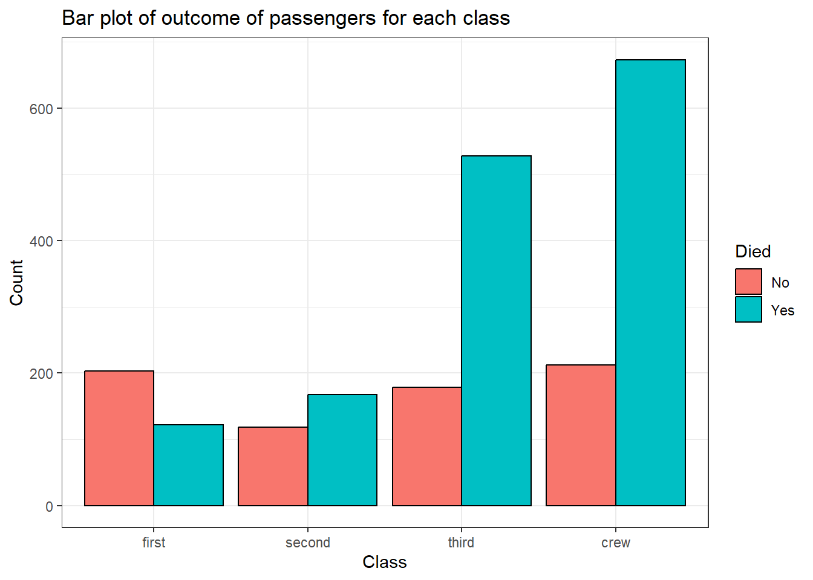
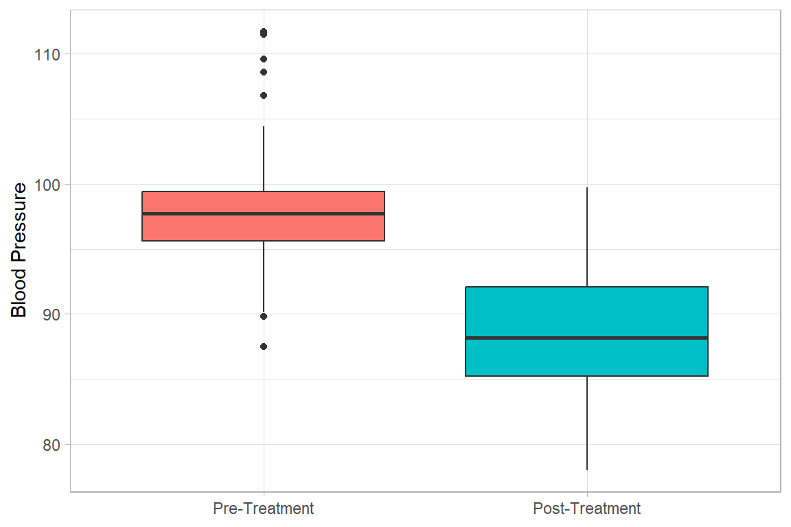

```
── Attaching core tidyverse packages ──── tidyverse 2.0.0 ──
✔ dplyr     1.1.2     ✔ readr     2.1.4
✔ forcats   1.0.0     ✔ stringr   1.5.0
✔ ggplot2   3.4.2     ✔ tibble    3.2.1
✔ lubridate 1.9.2     ✔ tidyr     1.3.0
✔ purrr     1.0.1     
── Conflicts ────────────────────── tidyverse_conflicts() ──
✖ dplyr::filter() masks stats::filter()
✖ dplyr::lag()    masks stats::lag()
ℹ Use the conflicted package (<http://conflicted.r-lib.org/>) to force all conflicts to become errors

Attaching package: 'magrittr'


The following object is masked from 'package:purrr':

    set_names


The following object is masked from 'package:tidyr':

    extract


#Uighur

Setting theme `Compact`
```


# Descriptive Statistics

## Categorical Variable

For this section we use the __Titanic__ data set
 

```r
titanic2 <-  
    haven::read_dta("./Data/titanic2.dta") %>% 
    mutate(sex  = haven::as_factor(sex),
           died = haven::as_factor(died),
           age  = haven::as_factor(age),
           class = haven::as_factor(class)) %>% 
    haven::zap_labels()
```

We visualize the first 6 rows of the data 


```r
titanic2 %>% head()
# A tibble: 6 × 4
  class age   sex   died 
  <fct> <fct> <fct> <fct>
1 first adult male  No   
2 first adult male  No   
3 first adult male  No   
4 first adult male  No   
5 first adult male  No   
6 first adult male  No   
```

And the summarize the entire as below


```r
titanic2 %>% summarytools::dfSummary(graph.col = F)
Data Frame Summary  
titanic2  
Dimensions: 2201 x 4  
Duplicates: 2177  

----------------------------------------------------------------------------------------------------
No   Variable   Label                     Stats / Values   Freqs (% of Valid)   Valid      Missing  
---- ---------- ------------------------- ---------------- -------------------- ---------- ---------
1    class      Passenger's cabin class   1. first         325 (14.8%)          2201       0        
     [factor]                             2. second        285 (12.9%)          (100.0%)   (0.0%)   
                                          3. third         706 (32.1%)                              
                                          4. crew          885 (40.2%)                              

2    age        Age group                 1. child          109 ( 5.0%)         2201       0        
     [factor]                             2. adult         2092 (95.0%)         (100.0%)   (0.0%)   

3    sex        Sex of passenger          1. female         470 (21.4%)         2201       0        
     [factor]                             2. male          1731 (78.6%)         (100.0%)   (0.0%)   

4    died       Died at sea               1. No             711 (32.3%)         2201       0        
     [factor]                             2. Yes           1490 (67.7%)         (100.0%)   (0.0%)   
----------------------------------------------------------------------------------------------------
```

### Single Caregorical Variable

#### Frequencies & Proportions


```r
titanic2 %>% 
    gtsummary::tbl_summary(
        include = class,
        digits = class ~ c(0,1)
    ) %>% 
    gtsummary::bold_labels()
```

```{=html}
<div id="egvtzxsdvx" style="padding-left:0px;padding-right:0px;padding-top:10px;padding-bottom:10px;overflow-x:auto;overflow-y:auto;width:auto;height:auto;">
<style>#egvtzxsdvx table {
  font-family: system-ui, 'Segoe UI', Roboto, Helvetica, Arial, sans-serif, 'Apple Color Emoji', 'Segoe UI Emoji', 'Segoe UI Symbol', 'Noto Color Emoji';
  -webkit-font-smoothing: antialiased;
  -moz-osx-font-smoothing: grayscale;
}

#egvtzxsdvx thead, #egvtzxsdvx tbody, #egvtzxsdvx tfoot, #egvtzxsdvx tr, #egvtzxsdvx td, #egvtzxsdvx th {
  border-style: none;
}

#egvtzxsdvx p {
  margin: 0;
  padding: 0;
}

#egvtzxsdvx .gt_table {
  display: table;
  border-collapse: collapse;
  line-height: normal;
  margin-left: auto;
  margin-right: auto;
  color: #333333;
  font-size: 13px;
  font-weight: normal;
  font-style: normal;
  background-color: #FFFFFF;
  width: auto;
  border-top-style: solid;
  border-top-width: 2px;
  border-top-color: #A8A8A8;
  border-right-style: none;
  border-right-width: 2px;
  border-right-color: #D3D3D3;
  border-bottom-style: solid;
  border-bottom-width: 2px;
  border-bottom-color: #A8A8A8;
  border-left-style: none;
  border-left-width: 2px;
  border-left-color: #D3D3D3;
}

#egvtzxsdvx .gt_caption {
  padding-top: 4px;
  padding-bottom: 4px;
}

#egvtzxsdvx .gt_title {
  color: #333333;
  font-size: 125%;
  font-weight: initial;
  padding-top: 4px;
  padding-bottom: 4px;
  padding-left: 5px;
  padding-right: 5px;
  border-bottom-color: #FFFFFF;
  border-bottom-width: 0;
}

#egvtzxsdvx .gt_subtitle {
  color: #333333;
  font-size: 85%;
  font-weight: initial;
  padding-top: 3px;
  padding-bottom: 5px;
  padding-left: 5px;
  padding-right: 5px;
  border-top-color: #FFFFFF;
  border-top-width: 0;
}

#egvtzxsdvx .gt_heading {
  background-color: #FFFFFF;
  text-align: center;
  border-bottom-color: #FFFFFF;
  border-left-style: none;
  border-left-width: 1px;
  border-left-color: #D3D3D3;
  border-right-style: none;
  border-right-width: 1px;
  border-right-color: #D3D3D3;
}

#egvtzxsdvx .gt_bottom_border {
  border-bottom-style: solid;
  border-bottom-width: 2px;
  border-bottom-color: #D3D3D3;
}

#egvtzxsdvx .gt_col_headings {
  border-top-style: solid;
  border-top-width: 2px;
  border-top-color: #D3D3D3;
  border-bottom-style: solid;
  border-bottom-width: 2px;
  border-bottom-color: #D3D3D3;
  border-left-style: none;
  border-left-width: 1px;
  border-left-color: #D3D3D3;
  border-right-style: none;
  border-right-width: 1px;
  border-right-color: #D3D3D3;
}

#egvtzxsdvx .gt_col_heading {
  color: #333333;
  background-color: #FFFFFF;
  font-size: 100%;
  font-weight: normal;
  text-transform: inherit;
  border-left-style: none;
  border-left-width: 1px;
  border-left-color: #D3D3D3;
  border-right-style: none;
  border-right-width: 1px;
  border-right-color: #D3D3D3;
  vertical-align: bottom;
  padding-top: 5px;
  padding-bottom: 6px;
  padding-left: 5px;
  padding-right: 5px;
  overflow-x: hidden;
}

#egvtzxsdvx .gt_column_spanner_outer {
  color: #333333;
  background-color: #FFFFFF;
  font-size: 100%;
  font-weight: normal;
  text-transform: inherit;
  padding-top: 0;
  padding-bottom: 0;
  padding-left: 4px;
  padding-right: 4px;
}

#egvtzxsdvx .gt_column_spanner_outer:first-child {
  padding-left: 0;
}

#egvtzxsdvx .gt_column_spanner_outer:last-child {
  padding-right: 0;
}

#egvtzxsdvx .gt_column_spanner {
  border-bottom-style: solid;
  border-bottom-width: 2px;
  border-bottom-color: #D3D3D3;
  vertical-align: bottom;
  padding-top: 5px;
  padding-bottom: 5px;
  overflow-x: hidden;
  display: inline-block;
  width: 100%;
}

#egvtzxsdvx .gt_spanner_row {
  border-bottom-style: hidden;
}

#egvtzxsdvx .gt_group_heading {
  padding-top: 1px;
  padding-bottom: 1px;
  padding-left: 5px;
  padding-right: 5px;
  color: #333333;
  background-color: #FFFFFF;
  font-size: 100%;
  font-weight: initial;
  text-transform: inherit;
  border-top-style: solid;
  border-top-width: 2px;
  border-top-color: #D3D3D3;
  border-bottom-style: solid;
  border-bottom-width: 2px;
  border-bottom-color: #D3D3D3;
  border-left-style: none;
  border-left-width: 1px;
  border-left-color: #D3D3D3;
  border-right-style: none;
  border-right-width: 1px;
  border-right-color: #D3D3D3;
  vertical-align: middle;
  text-align: left;
}

#egvtzxsdvx .gt_empty_group_heading {
  padding: 0.5px;
  color: #333333;
  background-color: #FFFFFF;
  font-size: 100%;
  font-weight: initial;
  border-top-style: solid;
  border-top-width: 2px;
  border-top-color: #D3D3D3;
  border-bottom-style: solid;
  border-bottom-width: 2px;
  border-bottom-color: #D3D3D3;
  vertical-align: middle;
}

#egvtzxsdvx .gt_from_md > :first-child {
  margin-top: 0;
}

#egvtzxsdvx .gt_from_md > :last-child {
  margin-bottom: 0;
}

#egvtzxsdvx .gt_row {
  padding-top: 1px;
  padding-bottom: 1px;
  padding-left: 5px;
  padding-right: 5px;
  margin: 10px;
  border-top-style: solid;
  border-top-width: 1px;
  border-top-color: #D3D3D3;
  border-left-style: none;
  border-left-width: 1px;
  border-left-color: #D3D3D3;
  border-right-style: none;
  border-right-width: 1px;
  border-right-color: #D3D3D3;
  vertical-align: middle;
  overflow-x: hidden;
}

#egvtzxsdvx .gt_stub {
  color: #333333;
  background-color: #FFFFFF;
  font-size: 100%;
  font-weight: initial;
  text-transform: inherit;
  border-right-style: solid;
  border-right-width: 2px;
  border-right-color: #D3D3D3;
  padding-left: 5px;
  padding-right: 5px;
}

#egvtzxsdvx .gt_stub_row_group {
  color: #333333;
  background-color: #FFFFFF;
  font-size: 100%;
  font-weight: initial;
  text-transform: inherit;
  border-right-style: solid;
  border-right-width: 2px;
  border-right-color: #D3D3D3;
  padding-left: 5px;
  padding-right: 5px;
  vertical-align: top;
}

#egvtzxsdvx .gt_row_group_first td {
  border-top-width: 2px;
}

#egvtzxsdvx .gt_row_group_first th {
  border-top-width: 2px;
}

#egvtzxsdvx .gt_summary_row {
  color: #333333;
  background-color: #FFFFFF;
  text-transform: inherit;
  padding-top: 1px;
  padding-bottom: 1px;
  padding-left: 5px;
  padding-right: 5px;
}

#egvtzxsdvx .gt_first_summary_row {
  border-top-style: solid;
  border-top-color: #D3D3D3;
}

#egvtzxsdvx .gt_first_summary_row.thick {
  border-top-width: 2px;
}

#egvtzxsdvx .gt_last_summary_row {
  padding-top: 1px;
  padding-bottom: 1px;
  padding-left: 5px;
  padding-right: 5px;
  border-bottom-style: solid;
  border-bottom-width: 2px;
  border-bottom-color: #D3D3D3;
}

#egvtzxsdvx .gt_grand_summary_row {
  color: #333333;
  background-color: #FFFFFF;
  text-transform: inherit;
  padding-top: 1px;
  padding-bottom: 1px;
  padding-left: 5px;
  padding-right: 5px;
}

#egvtzxsdvx .gt_first_grand_summary_row {
  padding-top: 1px;
  padding-bottom: 1px;
  padding-left: 5px;
  padding-right: 5px;
  border-top-style: double;
  border-top-width: 6px;
  border-top-color: #D3D3D3;
}

#egvtzxsdvx .gt_last_grand_summary_row_top {
  padding-top: 1px;
  padding-bottom: 1px;
  padding-left: 5px;
  padding-right: 5px;
  border-bottom-style: double;
  border-bottom-width: 6px;
  border-bottom-color: #D3D3D3;
}

#egvtzxsdvx .gt_striped {
  background-color: rgba(128, 128, 128, 0.05);
}

#egvtzxsdvx .gt_table_body {
  border-top-style: solid;
  border-top-width: 2px;
  border-top-color: #D3D3D3;
  border-bottom-style: solid;
  border-bottom-width: 2px;
  border-bottom-color: #D3D3D3;
}

#egvtzxsdvx .gt_footnotes {
  color: #333333;
  background-color: #FFFFFF;
  border-bottom-style: none;
  border-bottom-width: 2px;
  border-bottom-color: #D3D3D3;
  border-left-style: none;
  border-left-width: 2px;
  border-left-color: #D3D3D3;
  border-right-style: none;
  border-right-width: 2px;
  border-right-color: #D3D3D3;
}

#egvtzxsdvx .gt_footnote {
  margin: 0px;
  font-size: 90%;
  padding-top: 1px;
  padding-bottom: 1px;
  padding-left: 5px;
  padding-right: 5px;
}

#egvtzxsdvx .gt_sourcenotes {
  color: #333333;
  background-color: #FFFFFF;
  border-bottom-style: none;
  border-bottom-width: 2px;
  border-bottom-color: #D3D3D3;
  border-left-style: none;
  border-left-width: 2px;
  border-left-color: #D3D3D3;
  border-right-style: none;
  border-right-width: 2px;
  border-right-color: #D3D3D3;
}

#egvtzxsdvx .gt_sourcenote {
  font-size: 90%;
  padding-top: 1px;
  padding-bottom: 1px;
  padding-left: 5px;
  padding-right: 5px;
}

#egvtzxsdvx .gt_left {
  text-align: left;
}

#egvtzxsdvx .gt_center {
  text-align: center;
}

#egvtzxsdvx .gt_right {
  text-align: right;
  font-variant-numeric: tabular-nums;
}

#egvtzxsdvx .gt_font_normal {
  font-weight: normal;
}

#egvtzxsdvx .gt_font_bold {
  font-weight: bold;
}

#egvtzxsdvx .gt_font_italic {
  font-style: italic;
}

#egvtzxsdvx .gt_super {
  font-size: 65%;
}

#egvtzxsdvx .gt_footnote_marks {
  font-size: 75%;
  vertical-align: 0.4em;
  position: initial;
}

#egvtzxsdvx .gt_asterisk {
  font-size: 100%;
  vertical-align: 0;
}

#egvtzxsdvx .gt_indent_1 {
  text-indent: 5px;
}

#egvtzxsdvx .gt_indent_2 {
  text-indent: 10px;
}

#egvtzxsdvx .gt_indent_3 {
  text-indent: 15px;
}

#egvtzxsdvx .gt_indent_4 {
  text-indent: 20px;
}

#egvtzxsdvx .gt_indent_5 {
  text-indent: 25px;
}
</style>
<table class="gt_table" data-quarto-disable-processing="false" data-quarto-bootstrap="false">
  <thead>
    
    <tr class="gt_col_headings">
      <th class="gt_col_heading gt_columns_bottom_border gt_left" rowspan="1" colspan="1" scope="col" id="&lt;strong&gt;Characteristic&lt;/strong&gt;"><strong>Characteristic</strong></th>
      <th class="gt_col_heading gt_columns_bottom_border gt_center" rowspan="1" colspan="1" scope="col" id="&lt;strong&gt;N = 2,201&lt;/strong&gt;&lt;span class=&quot;gt_footnote_marks&quot; style=&quot;white-space:nowrap;font-style:italic;font-weight:normal;&quot;&gt;&lt;sup&gt;1&lt;/sup&gt;&lt;/span&gt;"><strong>N = 2,201</strong><span class="gt_footnote_marks" style="white-space:nowrap;font-style:italic;font-weight:normal;"><sup>1</sup></span></th>
    </tr>
  </thead>
  <tbody class="gt_table_body">
    <tr><td headers="label" class="gt_row gt_left" style="font-weight: bold;">Passenger's cabin class</td>
<td headers="stat_0" class="gt_row gt_center"></td></tr>
    <tr><td headers="label" class="gt_row gt_left">    first</td>
<td headers="stat_0" class="gt_row gt_center">325 (14.8%)</td></tr>
    <tr><td headers="label" class="gt_row gt_left">    second</td>
<td headers="stat_0" class="gt_row gt_center">285 (12.9%)</td></tr>
    <tr><td headers="label" class="gt_row gt_left">    third</td>
<td headers="stat_0" class="gt_row gt_center">706 (32.1%)</td></tr>
    <tr><td headers="label" class="gt_row gt_left">    crew</td>
<td headers="stat_0" class="gt_row gt_center">885 (40.2%)</td></tr>
  </tbody>
  
  <tfoot class="gt_footnotes">
    <tr>
      <td class="gt_footnote" colspan="2"><span class="gt_footnote_marks" style="white-space:nowrap;font-style:italic;font-weight:normal;"><sup>1</sup></span> n (%)</td>
    </tr>
  </tfoot>
</table>
</div>
```

#### Graph - Barchart

We first summarize the data


```r
bar_data <-
    titanic2 %>% 
    drop_na(class) %>% 
    count(class) %>% 
    mutate(perc = `n` / sum(`n`)) %>% 
    arrange(perc) %>%
    mutate(labels = paste(n, " (", scales::percent(perc), ")", sep=""))

bar_data
# A tibble: 4 × 4
  class      n  perc labels     
  <fct>  <int> <dbl> <chr>      
1 second   285 0.129 285 (12.9%)
2 first    325 0.148 325 (14.8%)
3 third    706 0.321 706 (32.1%)
4 crew     885 0.402 885 (40.2%)
```

And the plot the barplot


```r
bar_data %>% 
    ggplot() +
    geom_bar(stat = "identity", 
             aes(y = n, x = class, fill = class), 
             col = "black", 
             show.legend = F) +
    geom_label(aes(y = n, label = labels, x = class), 
               vjust = 1.2,
               show.legend = FALSE, size=3.5) +
    labs(x = NULL, 
         y = "Count", 
         title = "Distribution of Class of passenger") +
    theme_bw()
```


#### Pie Chart

To do this we use the previously summarized data. Then we draw a customised Pie Chart


```r
bar_data %>% 
    ggplot(aes(x = "", y = perc, fill = class)) +
    geom_col() +
    geom_label(aes(label = labels),
               position = position_stack(vjust = 0.5),
               show.legend = FALSE, size =3) +
    coord_polar(theta = "y", start=0) +
    labs(title = "Distribution of Blood Groups of study participants",
         fill = "Blood Group") +
    theme_void()
```


### Two categorical Variables

#### Frequencies & Proportions


```r
titanic2 %$% 
    gmodels::CrossTable(sex, died, prop.c=F, prop.r=F, prop.t=F, prop.chisq = F)

 
   Cell Contents
|-------------------------|
|                       N |
|-------------------------|

 
Total Observations in Table:  2201 

 
             | died 
         sex |        No |       Yes | Row Total | 
-------------|-----------|-----------|-----------|
      female |       344 |       126 |       470 | 
-------------|-----------|-----------|-----------|
        male |       367 |      1364 |      1731 | 
-------------|-----------|-----------|-----------|
Column Total |       711 |      1490 |      2201 | 
-------------|-----------|-----------|-----------|

 
```

#### Row percentages


```r
titanic2 %$% 
    gmodels::CrossTable(sex, died, prop.c=F, prop.r=T, prop.t=F, prop.chisq = F)

 
   Cell Contents
|-------------------------|
|                       N |
|           N / Row Total |
|-------------------------|

 
Total Observations in Table:  2201 

 
             | died 
         sex |        No |       Yes | Row Total | 
-------------|-----------|-----------|-----------|
      female |       344 |       126 |       470 | 
             |     0.732 |     0.268 |     0.214 | 
-------------|-----------|-----------|-----------|
        male |       367 |      1364 |      1731 | 
             |     0.212 |     0.788 |     0.786 | 
-------------|-----------|-----------|-----------|
Column Total |       711 |      1490 |      2201 | 
-------------|-----------|-----------|-----------|

 
```

#### Column percentages


```r
titanic2 %$% 
    gmodels::CrossTable(sex, died, prop.c=T, prop.r=F, prop.t=F, prop.chisq = F)

 
   Cell Contents
|-------------------------|
|                       N |
|           N / Col Total |
|-------------------------|

 
Total Observations in Table:  2201 

 
             | died 
         sex |        No |       Yes | Row Total | 
-------------|-----------|-----------|-----------|
      female |       344 |       126 |       470 | 
             |     0.484 |     0.085 |           | 
-------------|-----------|-----------|-----------|
        male |       367 |      1364 |      1731 | 
             |     0.516 |     0.915 |           | 
-------------|-----------|-----------|-----------|
Column Total |       711 |      1490 |      2201 | 
             |     0.323 |     0.677 |           | 
-------------|-----------|-----------|-----------|

 
```

#### Table Total Percentages


```r
titanic2 %$% 
    gmodels::CrossTable(sex, died, prop.c=F, prop.r=F, prop.t=T, prop.chisq = F)

 
   Cell Contents
|-------------------------|
|                       N |
|         N / Table Total |
|-------------------------|

 
Total Observations in Table:  2201 

 
             | died 
         sex |        No |       Yes | Row Total | 
-------------|-----------|-----------|-----------|
      female |       344 |       126 |       470 | 
             |     0.156 |     0.057 |           | 
-------------|-----------|-----------|-----------|
        male |       367 |      1364 |      1731 | 
             |     0.167 |     0.620 |           | 
-------------|-----------|-----------|-----------|
Column Total |       711 |      1490 |      2201 | 
-------------|-----------|-----------|-----------|

 
```

#### Bar Chart


```r
titanic2 %>% 
    ggplot(aes(x = class, fill = died)) +
    geom_bar(position = position_dodge(), col = "black") +
    labs(y = "Count", x = "Class", fill = "Died",
          title = "Bar plot of outcome of passengers for each class") +
    theme_bw()
```



## Continuous variables

For this section we will use the `NewDrug_clean.dta` dataset


```r
newdrug <-  
    haven::read_dta("./Data/NewDrug_clean.dta") %>% 
    mutate(sex  = haven::as_factor(sex), treat = haven::as_factor(treat)) %>% 
    haven::zap_labels() 

newdrug
# A tibble: 50 × 7
   id    treat     age sex     bp1   bp2 bpdiff
   <chr> <fct>   <dbl> <fct> <dbl> <dbl>  <dbl>
 1 C1    Control    63 F      97.4  93.1   4.30
 2 C2    Control    56 F      97.2  92.4   4.80
 3 C6    Control    62 F     103.   99.7   3.70
 4 C7    Control    61 F      90.1  88.4   1.70
 5 C9    Control    73 F      96.4  91.1   5.30
 6 C10   Control    57 F      98.6  90.5   8.10
 7 C13   Control    61 F      97.4  93.8   3.60
 8 C14   Control    66 F      97.4  92.6   4.80
 9 A18   Control    51 F      92.2  86.2   6   
10 A20   Control    65 F      96.9  90.4   6.5 
# ℹ 40 more rows

newdrug %>% 
    summarytools::dfSummary(labels.col = F)
Data Frame Summary  
newdrug  
Label: Newdrug Treatment Trial  
Dimensions: 50 x 7  
Duplicates: 0  

--------------------------------------------------------------------------------------------------------
No   Variable      Stats / Values           Freqs (% of Valid)   Graph              Valid      Missing  
---- ------------- ------------------------ -------------------- ------------------ ---------- ---------
1    id            1. A18                    1 ( 2.0%)                              50         0        
     [character]   2. A19                    1 ( 2.0%)                              (100.0%)   (0.0%)   
                   3. A20                    1 ( 2.0%)                                                  
                   4. A21                    1 ( 2.0%)                                                  
                   5. A22                    1 ( 2.0%)                                                  
                   6. C1                     1 ( 2.0%)                                                  
                   7. C10                    1 ( 2.0%)                                                  
                   8. C11                    1 ( 2.0%)                                                  
                   9. C12                    1 ( 2.0%)                                                  
                   10. C13                   1 ( 2.0%)                                                  
                   [ 40 others ]            40 (80.0%)           IIIIIIIIIIIIIIII                       

2    treat         1. Control               22 (44.0%)           IIIIIIII           50         0        
     [factor]      2. Newdrug               28 (56.0%)           IIIIIIIIIII        (100.0%)   (0.0%)   

3    age           Mean (sd) : 61.5 (6.5)   22 distinct values         :            50         0        
     [numeric]     min < med < max:                                    :            (100.0%)   (0.0%)   
                   45 < 63 < 75                                      . :                                
                   IQR (CV) : 7.8 (0.1)                              : : :                              
                                                                 : . : : : .                            

4    sex           1. F                     26 (52.0%)           IIIIIIIIII         50         0        
     [factor]      2. M                     24 (48.0%)           IIIIIIIII          (100.0%)   (0.0%)   

5    bp1           Mean (sd) : 98.3 (5.2)   39 distinct values       :              50         0        
     [numeric]     min < med < max:                                  :              (100.0%)   (0.0%)   
                   87.5 < 97.7 < 111.7                               :                                  
                   IQR (CV) : 3.8 (0.1)                            . :                                  
                                                                 . : : : . .                            

6    bp2           Mean (sd) : 88.6 (4.6)   40 distinct values       :              50         0        
     [numeric]     min < med < max:                                  : :            (100.0%)   (0.0%)   
                   78 < 88.2 < 99.7                                . : :                                
                   IQR (CV) : 6.9 (0.1)                            : : :                                
                                                                   : : : :                              

7    bpdiff        Mean (sd) : 9.7 (6.2)    46 distinct values   : : :              50         0        
     [numeric]     min < med < max:                              : : :              (100.0%)   (0.0%)   
                   0.5 < 8.2 < 26.3                              : : :                                  
                   IQR (CV) : 8.9 (0.6)                          : : : .                                
                                                                 : : : : : .                            
--------------------------------------------------------------------------------------------------------
```


### Single continuous variable

#### Measures of Central tendency & Dispersion

These include mean and median and displayed below


```r
newdrug %>% 
    summarise(mean.bp1 = mean(bp1), median.bp1 = median(bp1), 
              sd.bp1 = sd(bp1), min.bp1 = min(bp1), 
              max.bp1 = max(bp1), iqr = IQR(bp1)) 
# A tibble: 1 × 6
  mean.bp1 median.bp1 sd.bp1 min.bp1 max.bp1   iqr
     <dbl>      <dbl>  <dbl>   <dbl>   <dbl> <dbl>
1     98.3       97.7   5.17    87.5    112.  3.78
```

Alternatively


```r
newdrug %$% 
    psych::describe(bp1)
   vars  n mean   sd median trimmed  mad  min   max range
X1    1 50 98.3 5.17   97.7   97.89 2.97 87.5 111.7  24.2
   skew kurtosis   se
X1  0.7     0.62 0.73
```

And to show the interquartile range we do the following.


```r
newdrug %$% 
    psych::describe(bp1, IQR = TRUE,quant = c(.25, .75))
  vars  n mean   sd median trimmed  mad  min   max range
1    1 50 98.3 5.17   97.7   97.89 2.97 87.5 111.7  24.2
  skew kurtosis   se  IQR Q0.25 Q0.75
1  0.7     0.62 0.73 3.78 95.62  99.4
```

#### Graphs - Histogram 

```r
newdrug %>% 
    ggplot(aes(x = bp1)) + 
    geom_histogram(bins = 7, col="black", alpha = .5, fill = "red") +
    labs(title = "Histogram of Blood Pressure before  intervention",
         x= "BP1")+
    theme_light()
```


#### Graphs - Boxplot and violin plot 


```r
newdrug %>% 
    ggplot(aes(y = bp1)) + 
    geom_boxplot(col="black",  
                 alpha = .2, 
                 fill = "blue", 
                 outlier.fill = "black",
                 outlier.shape = 22) +
    labs(title = "Boxplot of Blood Pressure before  intervention",
         y = "BP1")+
    theme_light()
```


#### Graphs - Density plot

```r
newdrug %>% 
    ggplot(aes(y = bp1)) + 
    geom_density(col="black", fill = "yellow", alpha=.6) +
    labs(title = "Density Plot of Blood Pressure before  intervention",
         y = "Blood Pressure before  intervention")+
    coord_flip() +
    theme_light()
```


#### Graphs - Cumulative Frequency plot


```r
newdrug %>% 
    group_by(bp1) %>% 
    summarize(n = n()) %>% 
    ungroup() %>% 
    mutate(cum = cumsum(n)/sum(n)*100) %>% 
    ggplot(aes(y = cum, x = bp1)) +
    geom_line(col=3, size=1.2)+
    labs(title = "Cumulative Frequency Plot of Blood Pressure before  intervention",
         x = "BP1",
         y = "Cumulative Frequency")+
    theme_light() 
Warning: Using `size` aesthetic for lines was deprecated in ggplot2
3.4.0.
ℹ Please use `linewidth` instead.
This warning is displayed once every 8 hours.
Call `lifecycle::last_lifecycle_warnings()` to see where
this warning was generated.
```


### Multiple Continuous variables

#### Measures of Central tendency & Dispersion


```r
newdrug %>% 
    select(where(is.numeric)) %>% 
    psych::describe()
       vars  n  mean   sd median trimmed  mad  min   max
age       1 50 61.48 6.51  63.00   61.98 4.45 45.0  75.0
bp1       2 50 98.30 5.17  97.70   97.89 2.97 87.5 111.7
bp2       3 50 88.60 4.56  88.15   88.46 4.52 78.0  99.7
bpdiff    4 50  9.70 6.20   8.25    8.95 5.49  0.5  26.3
       range  skew kurtosis   se
age     30.0 -0.60     0.16 0.92
bp1     24.2  0.70     0.62 0.73
bp2     21.7  0.25    -0.24 0.65
bpdiff  25.8  0.93     0.24 0.88
```

To illustrate graphing multiple continuous variables we use the 2 bp variables


```r
bps <- 
    newdrug %>%
    select(bp1, bp2) %>% 
    pivot_longer(cols = c(bp1, bp2),names_to = "measure", values_to = "bp") %>% 
    mutate(measure = fct_recode(measure, 
                                "Pre-Treatment" = "bp1",
                                "Post-Treatment" = "bp2"))
```


```r
bps %>% 
    ggplot(aes(y = measure, x = bp, fill = measure)) +
    ggridges::geom_density_ridges2( col="black", alpha = .5, scale=1, 
                                    show.legend = F) +
    labs(x = "Blood pressure (mmHg)", 
         y = "Density", 
         fill = "Blood Pressure") +
    theme_bw()
Picking joint bandwidth of 1.52
```


```r
bps %>% 
    ggplot(aes(y = measure, x = bp, fill = measure))+
    geom_boxplot(show.legend = FALSE) +
    labs(y = NULL, 
         x = "Blood Pressure", 
         fill = "Blood Pressure") +
    coord_flip()+
    theme_light() 
```




```r
bps %>% 
    ggplot(aes(y = measure, x = bp, fill = measure))+
    geom_violin(show.legend = FALSE) +
    coord_flip()+
    theme_light() 
```


## Continuous by single categorical variable
### Summary

We do this with one variable.

```r
newdrug %>% 
    group_by(treat) %>% 
    summarize(mean.bp1 = mean(bp1),
              sd.bp1 = sd(bp1),
              var.bp1 = var(bp1),
              se.mean.bp1 = sd(bp1)/sqrt(n()),
              median.bp1 = median(bp1),
              min.bp1 = min(bp1),
              max.bp1 = max(bp1)) %>% 
    ungroup()
# A tibble: 2 × 8
  treat   mean.bp1 sd.bp1 var.bp1 se.mean.bp1 median.bp1
  <fct>      <dbl>  <dbl>   <dbl>       <dbl>      <dbl>
1 Control     97.1   3.56    12.7       0.760       97.4
2 Newdrug     99.2   6.05    36.6       1.14        98.2
# ℹ 2 more variables: min.bp1 <dbl>, max.bp1 <dbl>
```

Alternatively we can use

```r
newdrug %>% 
    select(where(is.numeric), treat) %>% 
    psych::describeBy(group = "treat")

 Descriptive statistics by group 
treat: Control
       vars  n  mean   sd median trimmed  mad  min   max
age       1 22 62.09 6.57   63.0   62.17 5.19 48.0  75.0
bp1       2 22 97.13 3.56   97.4   97.28 2.59 89.8 103.4
bp2       3 22 92.19 3.25   91.9   91.94 2.52 86.2  99.7
bpdiff    4 22  4.95 2.25    4.8    4.86 1.70  0.5  11.1
treat*    5 22  1.00 0.00    1.0    1.00 0.00  1.0   1.0
       range  skew kurtosis   se
age     27.0 -0.17    -0.37 1.40
bp1     13.6 -0.33    -0.39 0.76
bp2     13.5  0.66     0.03 0.69
bpdiff  10.6  0.56     0.82 0.48
treat*   0.0   NaN      NaN 0.00
--------------------------------------------- 
treat: Newdrug
       vars  n  mean   sd median trimmed  mad  min   max
age       1 28 61.00 6.54  62.50   61.58 5.19 45.0  70.0
bp1       2 28 99.22 6.05  98.25   98.99 4.15 87.5 111.7
bp2       3 28 85.78 3.29  85.35   85.67 2.22 78.0  94.2
bpdiff    4 28 13.44 5.73  12.45   13.17 4.37  3.8  26.3
treat*    5 28  2.00 0.00   2.00    2.00 0.00  2.0   2.0
       range  skew kurtosis   se
age     25.0 -0.92     0.14 1.24
bp1     24.2  0.54    -0.37 1.14
bp2     16.2  0.38     0.96 0.62
bpdiff  22.5  0.65    -0.25 1.08
treat*   0.0   NaN      NaN 0.00
```

### Graph - Histogram, Boxplot, Density plot and cumlative frequency
The graphs are similar to the aboveso we skip them. 

## Continuous by multiple categorical variables
### Summary
This csn be done as below.


```r
newdrug %>% 
    group_by(treat, sex) %>% 
    summarize(mean.bp1 = mean(bp1),
              sd.bp1 = sd(bp1),
              var.bp1 = var(bp1),
              se.mean.bp1 = sd(bp1)/sqrt(n()),
              median.bp1 = median(bp1),
              min.bp1 = min(bp1),
              max.bp1 = max(bp1)) %>% 
    ungroup()
`summarise()` has grouped output by 'treat'. You can
override using the `.groups` argument.
# A tibble: 4 × 9
  treat sex   mean.bp1 sd.bp1 var.bp1 se.mean.bp1 median.bp1
  <fct> <fct>    <dbl>  <dbl>   <dbl>       <dbl>      <dbl>
1 Cont… F         97.2   3.82    14.6        1.15       97.4
2 Cont… M         97.0   3.47    12.1        1.05       97.5
3 Newd… F         98.6   6.01    36.1        1.55       98.4
4 Newd… M        100.    6.25    39.1        1.73       98.1
# ℹ 2 more variables: min.bp1 <dbl>, max.bp1 <dbl>
```

