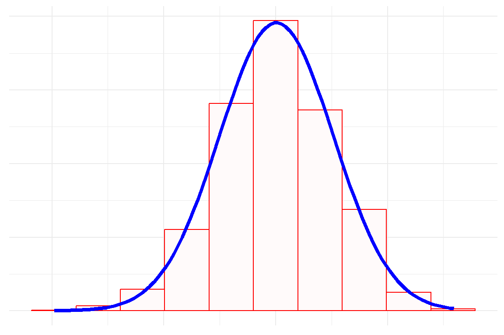
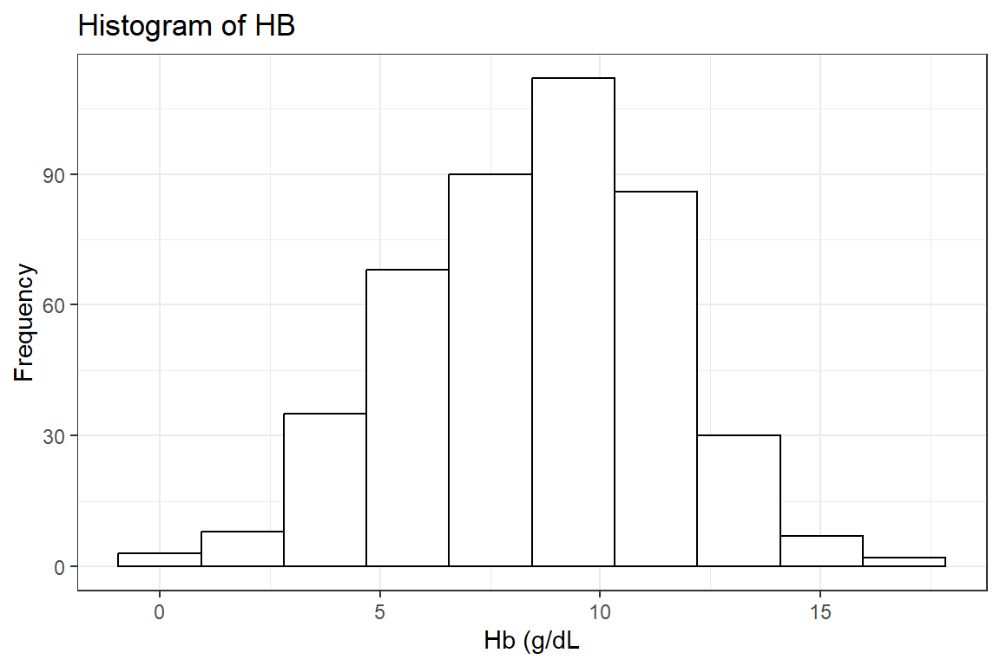
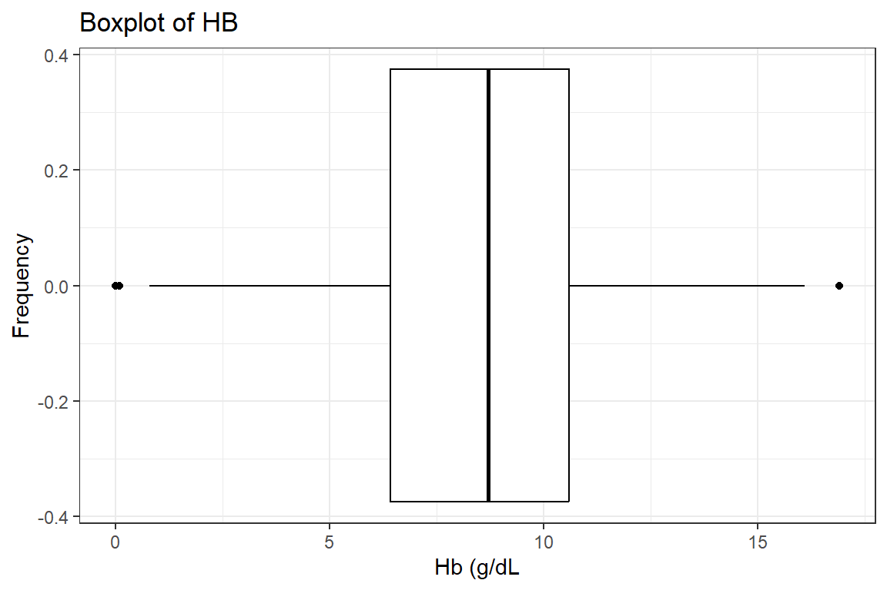

```
Warning: package 'ggplot2' was built under R version 4.3.2
```

# Normality of data

Many of the test statistical tests, specifically the parametric tests are done 
on the premise that numeric data is normally distributed. Unfortunately, this 
is not always so. In this chapter, we look at what is normally distributed data 
and how we can tell if our data is normally distributed. For this section, we 
will use the `hb` variable from the `mps.dta` data. 

## The normal distribution
The normal distribution, also called the Gaussian Distribution or a bell curve, 
is defined by two main statistics. These are the mean and standard deviation. 
The wider the standard deviation, the broader the curve. An example of the 
normal distribution is shown below: 


```r
df_temp <- data.frame(x = rnorm(2000)) 

df_temp %>% 
    ggplot(aes(x = x))+
    geom_histogram(
        aes(y=after_stat(density)), 
        bins=10, fill = "snow", col = "red") +
    stat_function(
        fun = dnorm, 
        args = list(
            mean = mean(df_temp$x, na.rm=T), 
            sd = sd(df_temp$x)), col = "blue",
            linewidth = 1.5) +
    labs(x = NULL, y = NULL) +
    scale_x_continuous(labels = NULL)+
    scale_y_continuous(labels = NULL)+
    theme_minimal()
```




These are some features of the normal distribution:

- It is symmetrical.
- The mean, median and mode are the same.
- Approximately 68% of the data falls within one standard deviation of the mean. 
- Approximately 95% of the data falls within two standard deviations of the mean
- Approximately 99.7% of the data fall within three standard deviations of the mean. 

The normal distribution with a mean of 1 and a standard deviation of 1 is called 
the standard normal distribution.

## Evaluating normality
There are two main modalities for evaluating normality. These are graphical and 
formal hypothesis testing.  

### Graphical evaluation
**Histogram**: Probably the most well-known modality here is the histogram.  
Below we first read  the data and keep only the `hb` variable:


```r
df_mps <- haven::read_dta("./Data/mps.dta")
```

We then draw the histogram of the `hb`.


```r
df_mps %>% 
    drop_na(hb) %>% 
    ggplot(aes(x = hb)) +
    geom_histogram(bins = 10, fill = 'white', col = "black") +
    labs(title = "Histogram of HB", y = "Frequency", x = 'Hb (g/dL') +
    theme_bw()
```



There is near symmetry with a slightly heavier left tail.

**Boxplot**: Our next graphical modality is the boxplot as drawn below.


```r
df_mps %>% 
    drop_na(hb) %>% 
    ggplot(aes(x = hb)) +
    geom_boxplot(fill = 'white', col = "black") +
    labs(title = "Boxplot of HB", y = "Frequency", x = 'Hb (g/dL') +
    theme_bw()
```



The same conclusion of good symmetry and a slightly heavier lower tail is seen 
here.

**Q-Q plot**: Finally, the Q-Q plot with a line. This graphical modality plots 
the actual values of the data against a theoretical normal distribution. Thus, 
if all the dots were to be in a straight line and along the line drawn that would be the ideal normal distribution. We therefore use this principle to determine if 
our data is for instance heavy at the tails, indicating skewness. The Q-Q plot 
of our data is as done below:


```r
df_mps %>%
    drop_na(hb) %>% 
    ggpubr::ggqqplot(x = "hb",title = "Q-Q plot of the HB", conf.int = FALSE)
```


It is seen that apart from a few points mainly on the right tail the rest 
pretty much follow the line.

### Statistical tests for normality
Formal statistical tests are available for testing.
H0:  The data is sampled from a normally distributed population.
Ha: The data is not sampled from a normally distributed population
There are a few of these tests but we will be concentrating on the Shapiro-Wilk 
tests. It is never advisable to do different tests together 
as they use different algorithms and may produce different results and 
conclusions.

**Shapiro-Wilk test**: Below we perform the Shapiro-wilk test for normality.


```r
df_mps %$% 
    shapiro.test(hb) %>% 
    broom::tidy()
```


```{=html}
<table class="huxtable" style="border-collapse: collapse; border: 0px; margin-bottom: 2em; margin-top: 2em; ; margin-left: auto; margin-right: auto;  " id="tab:unnamed-chunk-7">
<caption style="caption-side: top; text-align: center;">(#tab:unnamed-chunk-7) </caption><col><col><col><tr>
<th style="vertical-align: top; text-align: right; white-space: normal; border-style: solid solid solid solid; border-width: 0.4pt 0pt 0.4pt 0pt;    padding: 2pt 6pt 2pt 0pt; font-weight: bold; font-family: Arial, Times New Roman, Times, Serif; font-size: 11pt;">statistic</th><th style="vertical-align: top; text-align: right; white-space: normal; border-style: solid solid solid solid; border-width: 0.4pt 0pt 0.4pt 0pt;    padding: 2pt 6pt 2pt 6pt; font-weight: bold; font-family: Arial, Times New Roman, Times, Serif; font-size: 11pt;">p.value</th><th style="vertical-align: top; text-align: left; white-space: normal; border-style: solid solid solid solid; border-width: 0.4pt 0pt 0.4pt 0pt;    padding: 2pt 0pt 2pt 6pt; font-weight: bold; font-family: Arial, Times New Roman, Times, Serif; font-size: 11pt;">method</th></tr>
<tr>
<td style="vertical-align: top; text-align: right; white-space: normal; border-style: solid solid solid solid; border-width: 0.4pt 0pt 0.4pt 0pt;    padding: 2pt 6pt 2pt 0pt; font-weight: normal; font-family: Arial, Times New Roman, Times, Serif; font-size: 11pt;">0.994</td><td style="vertical-align: top; text-align: right; white-space: normal; border-style: solid solid solid solid; border-width: 0.4pt 0pt 0.4pt 0pt;    padding: 2pt 6pt 2pt 6pt; font-weight: normal; font-family: Arial, Times New Roman, Times, Serif; font-size: 11pt;">0.108</td><td style="vertical-align: top; text-align: left; white-space: normal; border-style: solid solid solid solid; border-width: 0.4pt 0pt 0.4pt 0pt;    padding: 2pt 0pt 2pt 6pt; font-weight: normal; font-family: Arial, Times New Roman, Times, Serif; font-size: 11pt;">Shapiro-Wilk normality test</td></tr>
</table>

```


A p-value greater than 0.05 indicates we reject the Null hypothesis and thus 
conclude our data comes from a normally distributed population. 

## Conclusion
In conclusion, it can be seen from the graphical presentations as well as the 
formal test that the data we have is coming from a normally distributed 
population.

The various tests can give contradictory results so I recommend evaluating 
the normality of a population, one should first plot the histogram, and Q-Q plot, 
and then perform one formal test, and combine these results before making the 
the judgement that numeric data is or is not normally distributed.  


