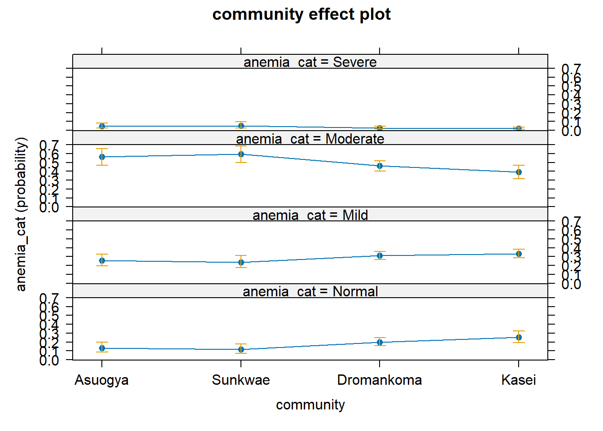

# Ordinal logistic regression


## Importing data

In this presentation we analyse a dataset using ordinal logistic regression. 
We begin by reading in the data and selecting our desired subset.


```r
dataF <- 
    dget("anemia_data") %>% 
    select(sid, anemia_cat, community, fever, sex,
           famsize, moccup2, foccup2, hosp_visit)
```

We then view a summary of the data


```r
dataF %>% glimpse()
Rows: 476
Columns: 9
$ sid        <dbl> 1, 2, 3, 4, 5, 6, 7, 8, 9, 10, 11, 12, …
$ anemia_cat <fct> Mild, Moderate, Normal, Severe, Mild, M…
$ community  <fct> Kasei, Kasei, Kasei, Kasei, Kasei, Kase…
$ fever      <fct> Yes, Yes, Yes, Yes, Yes, No, No, Yes, Y…
$ sex        <fct> Female, Female, Female, Male, Male, Fem…
$ famsize    <dbl> 4, 4, 2, 3, 5, 4, 9, 4, 4, 10, 3, 4, 3,…
$ moccup2    <fct> Farmer, Farmer, Other, Other, Farmer, F…
$ foccup2    <fct> Farmer, Farmer, Other, Farmer, Farmer, …
$ hosp_visit <fct> No, No, No, Yes, Yes, No, No, No, No, Y…
```

Note that the `anemia_cat` variable is an ordered factor variable. 
For completeness the single missing observation for the variable `hosp_adm` 
will be recoded to `No`.


```r
dataF <- dataF %>% 
    mutate(hosp_visit = forcats::fct_explicit_na(hosp_visit, na_level = "No"))
Warning: There was 1 warning in `mutate()`.
ℹ In argument: `hosp_visit =
  forcats::fct_explicit_na(hosp_visit, na_level = "No")`.
Caused by warning:
! `fct_explicit_na()` was deprecated in forcats 1.0.0.
ℹ Please use `fct_na_value_to_level()` instead.
summary(dataF)
      sid           anemia_cat       community   fever    
 Min.   :  1.0   Normal  : 92   Asuogya   : 61   No :160  
 1st Qu.:119.8   Mild    :143   Sunkwae   : 62   Yes:316  
 Median :240.5   Moderate:226   Dromankoma:229            
 Mean   :240.2   Severe  : 15   Kasei     :124            
 3rd Qu.:360.2                                            
 Max.   :501.0                                            
     sex         famsize         moccup2      foccup2   
 Male  :252   Min.   : 0.000   Farmer:314   Farmer:355  
 Female:224   1st Qu.: 4.000   Other :162   Other :121  
              Median : 5.000                            
              Mean   : 5.151                            
              3rd Qu.: 6.000                            
              Max.   :11.000                            
 hosp_visit
 No :320   
 Yes:156   
           
           
           
           
```

## Model specification

Now we begin the ordinal regression by fixing the first model, the Null model.


```r
Model_0 <- ordinal::clm(anemia_cat ~ 1, data = dataF, link = "logit")
summary(Model_0)
formula: anemia_cat ~ 1
data:    dataF

 link  threshold nobs logLik  AIC     niter max.grad
 logit flexible  476  -543.39 1092.77 7(0)  2.15e-13
 cond.H 
 1.4e+01

Threshold coefficients:
                Estimate Std. Error z value
Normal|Mild     -1.42885    0.11608 -12.310
Mild|Moderate   -0.02521    0.09168  -0.275
Moderate|Severe  3.42535    0.26237  13.056
```

Subsequently we introduce the fever variable as independent and express the 
results as OR with 95%CI


```r
Model_1 <- ordinal::clm(anemia_cat ~ fever, data = dataF, link = "logit")

broom::tidy(Model_1, conf.int = TRUE, exponentiate = TRUE)%>% 
    flextable::as_flextable() %>% 
    flextable::colformat_double(
        j = c("estimate", "std.error", "statistic", "p.value", 
              "conf.low", "conf.high"), 
        digits = 3)
```

```{=html}
<div class="tabwid"><style>.cl-ab59ddca{}.cl-ab4c6014{font-family:'Arial';font-size:11pt;font-weight:normal;font-style:normal;text-decoration:none;color:rgba(0, 0, 0, 1.00);background-color:transparent;}.cl-ab4c603c{font-family:'Arial';font-size:11pt;font-weight:normal;font-style:normal;text-decoration:none;color:rgba(153, 153, 153, 1.00);background-color:transparent;}.cl-ab50715e{margin:0;text-align:left;border-bottom: 0 solid rgba(0, 0, 0, 1.00);border-top: 0 solid rgba(0, 0, 0, 1.00);border-left: 0 solid rgba(0, 0, 0, 1.00);border-right: 0 solid rgba(0, 0, 0, 1.00);padding-bottom:5pt;padding-top:5pt;padding-left:5pt;padding-right:5pt;line-height: 1;background-color:transparent;}.cl-ab507168{margin:0;text-align:right;border-bottom: 0 solid rgba(0, 0, 0, 1.00);border-top: 0 solid rgba(0, 0, 0, 1.00);border-left: 0 solid rgba(0, 0, 0, 1.00);border-right: 0 solid rgba(0, 0, 0, 1.00);padding-bottom:5pt;padding-top:5pt;padding-left:5pt;padding-right:5pt;line-height: 1;background-color:transparent;}.cl-ab508a18{width:1.454in;background-color:transparent;vertical-align: middle;border-bottom: 0 solid rgba(102, 102, 102, 1.00);border-top: 1.5pt solid rgba(102, 102, 102, 1.00);border-left: 0 solid rgba(0, 0, 0, 1.00);border-right: 0 solid rgba(0, 0, 0, 1.00);margin-bottom:0;margin-top:0;margin-left:0;margin-right:0;}.cl-ab508a22{width:0.863in;background-color:transparent;vertical-align: middle;border-bottom: 0 solid rgba(102, 102, 102, 1.00);border-top: 1.5pt solid rgba(102, 102, 102, 1.00);border-left: 0 solid rgba(0, 0, 0, 1.00);border-right: 0 solid rgba(0, 0, 0, 1.00);margin-bottom:0;margin-top:0;margin-left:0;margin-right:0;}.cl-ab508a23{width:0.854in;background-color:transparent;vertical-align: middle;border-bottom: 0 solid rgba(102, 102, 102, 1.00);border-top: 1.5pt solid rgba(102, 102, 102, 1.00);border-left: 0 solid rgba(0, 0, 0, 1.00);border-right: 0 solid rgba(0, 0, 0, 1.00);margin-bottom:0;margin-top:0;margin-left:0;margin-right:0;}.cl-ab508a2c{width:0.829in;background-color:transparent;vertical-align: middle;border-bottom: 0 solid rgba(102, 102, 102, 1.00);border-top: 1.5pt solid rgba(102, 102, 102, 1.00);border-left: 0 solid rgba(0, 0, 0, 1.00);border-right: 0 solid rgba(0, 0, 0, 1.00);margin-bottom:0;margin-top:0;margin-left:0;margin-right:0;}.cl-ab508a36{width:0.846in;background-color:transparent;vertical-align: middle;border-bottom: 0 solid rgba(102, 102, 102, 1.00);border-top: 1.5pt solid rgba(102, 102, 102, 1.00);border-left: 0 solid rgba(0, 0, 0, 1.00);border-right: 0 solid rgba(0, 0, 0, 1.00);margin-bottom:0;margin-top:0;margin-left:0;margin-right:0;}.cl-ab508a37{width:0.905in;background-color:transparent;vertical-align: middle;border-bottom: 0 solid rgba(102, 102, 102, 1.00);border-top: 1.5pt solid rgba(102, 102, 102, 1.00);border-left: 0 solid rgba(0, 0, 0, 1.00);border-right: 0 solid rgba(0, 0, 0, 1.00);margin-bottom:0;margin-top:0;margin-left:0;margin-right:0;}.cl-ab508a40{width:0.922in;background-color:transparent;vertical-align: middle;border-bottom: 0 solid rgba(102, 102, 102, 1.00);border-top: 1.5pt solid rgba(102, 102, 102, 1.00);border-left: 0 solid rgba(0, 0, 0, 1.00);border-right: 0 solid rgba(0, 0, 0, 1.00);margin-bottom:0;margin-top:0;margin-left:0;margin-right:0;}.cl-ab508a41{width:1.454in;background-color:transparent;vertical-align: middle;border-bottom: 1.5pt solid rgba(102, 102, 102, 1.00);border-top: 0 solid rgba(102, 102, 102, 1.00);border-left: 0 solid rgba(0, 0, 0, 1.00);border-right: 0 solid rgba(0, 0, 0, 1.00);margin-bottom:0;margin-top:0;margin-left:0;margin-right:0;}.cl-ab508a4a{width:0.863in;background-color:transparent;vertical-align: middle;border-bottom: 1.5pt solid rgba(102, 102, 102, 1.00);border-top: 0 solid rgba(102, 102, 102, 1.00);border-left: 0 solid rgba(0, 0, 0, 1.00);border-right: 0 solid rgba(0, 0, 0, 1.00);margin-bottom:0;margin-top:0;margin-left:0;margin-right:0;}.cl-ab508a4b{width:0.854in;background-color:transparent;vertical-align: middle;border-bottom: 1.5pt solid rgba(102, 102, 102, 1.00);border-top: 0 solid rgba(102, 102, 102, 1.00);border-left: 0 solid rgba(0, 0, 0, 1.00);border-right: 0 solid rgba(0, 0, 0, 1.00);margin-bottom:0;margin-top:0;margin-left:0;margin-right:0;}.cl-ab508a4c{width:0.829in;background-color:transparent;vertical-align: middle;border-bottom: 1.5pt solid rgba(102, 102, 102, 1.00);border-top: 0 solid rgba(102, 102, 102, 1.00);border-left: 0 solid rgba(0, 0, 0, 1.00);border-right: 0 solid rgba(0, 0, 0, 1.00);margin-bottom:0;margin-top:0;margin-left:0;margin-right:0;}.cl-ab508a54{width:0.846in;background-color:transparent;vertical-align: middle;border-bottom: 1.5pt solid rgba(102, 102, 102, 1.00);border-top: 0 solid rgba(102, 102, 102, 1.00);border-left: 0 solid rgba(0, 0, 0, 1.00);border-right: 0 solid rgba(0, 0, 0, 1.00);margin-bottom:0;margin-top:0;margin-left:0;margin-right:0;}.cl-ab508a55{width:0.905in;background-color:transparent;vertical-align: middle;border-bottom: 1.5pt solid rgba(102, 102, 102, 1.00);border-top: 0 solid rgba(102, 102, 102, 1.00);border-left: 0 solid rgba(0, 0, 0, 1.00);border-right: 0 solid rgba(0, 0, 0, 1.00);margin-bottom:0;margin-top:0;margin-left:0;margin-right:0;}.cl-ab508a56{width:0.922in;background-color:transparent;vertical-align: middle;border-bottom: 1.5pt solid rgba(102, 102, 102, 1.00);border-top: 0 solid rgba(102, 102, 102, 1.00);border-left: 0 solid rgba(0, 0, 0, 1.00);border-right: 0 solid rgba(0, 0, 0, 1.00);margin-bottom:0;margin-top:0;margin-left:0;margin-right:0;}.cl-ab508a5e{width:1.454in;background-color:transparent;vertical-align: middle;border-bottom: 0 solid rgba(0, 0, 0, 1.00);border-top: 0 solid rgba(0, 0, 0, 1.00);border-left: 0 solid rgba(0, 0, 0, 1.00);border-right: 0 solid rgba(0, 0, 0, 1.00);margin-bottom:0;margin-top:0;margin-left:0;margin-right:0;}.cl-ab508a5f{width:0.863in;background-color:transparent;vertical-align: middle;border-bottom: 0 solid rgba(0, 0, 0, 1.00);border-top: 0 solid rgba(0, 0, 0, 1.00);border-left: 0 solid rgba(0, 0, 0, 1.00);border-right: 0 solid rgba(0, 0, 0, 1.00);margin-bottom:0;margin-top:0;margin-left:0;margin-right:0;}.cl-ab508a60{width:0.854in;background-color:transparent;vertical-align: middle;border-bottom: 0 solid rgba(0, 0, 0, 1.00);border-top: 0 solid rgba(0, 0, 0, 1.00);border-left: 0 solid rgba(0, 0, 0, 1.00);border-right: 0 solid rgba(0, 0, 0, 1.00);margin-bottom:0;margin-top:0;margin-left:0;margin-right:0;}.cl-ab508a68{width:0.829in;background-color:transparent;vertical-align: middle;border-bottom: 0 solid rgba(0, 0, 0, 1.00);border-top: 0 solid rgba(0, 0, 0, 1.00);border-left: 0 solid rgba(0, 0, 0, 1.00);border-right: 0 solid rgba(0, 0, 0, 1.00);margin-bottom:0;margin-top:0;margin-left:0;margin-right:0;}.cl-ab508a69{width:0.846in;background-color:transparent;vertical-align: middle;border-bottom: 0 solid rgba(0, 0, 0, 1.00);border-top: 0 solid rgba(0, 0, 0, 1.00);border-left: 0 solid rgba(0, 0, 0, 1.00);border-right: 0 solid rgba(0, 0, 0, 1.00);margin-bottom:0;margin-top:0;margin-left:0;margin-right:0;}.cl-ab508a6a{width:0.905in;background-color:transparent;vertical-align: middle;border-bottom: 0 solid rgba(0, 0, 0, 1.00);border-top: 0 solid rgba(0, 0, 0, 1.00);border-left: 0 solid rgba(0, 0, 0, 1.00);border-right: 0 solid rgba(0, 0, 0, 1.00);margin-bottom:0;margin-top:0;margin-left:0;margin-right:0;}.cl-ab508a72{width:0.922in;background-color:transparent;vertical-align: middle;border-bottom: 0 solid rgba(0, 0, 0, 1.00);border-top: 0 solid rgba(0, 0, 0, 1.00);border-left: 0 solid rgba(0, 0, 0, 1.00);border-right: 0 solid rgba(0, 0, 0, 1.00);margin-bottom:0;margin-top:0;margin-left:0;margin-right:0;}.cl-ab508a73{width:1.454in;background-color:transparent;vertical-align: middle;border-bottom: 1.5pt solid rgba(102, 102, 102, 1.00);border-top: 0 solid rgba(0, 0, 0, 1.00);border-left: 0 solid rgba(0, 0, 0, 1.00);border-right: 0 solid rgba(0, 0, 0, 1.00);margin-bottom:0;margin-top:0;margin-left:0;margin-right:0;}.cl-ab508a74{width:0.863in;background-color:transparent;vertical-align: middle;border-bottom: 1.5pt solid rgba(102, 102, 102, 1.00);border-top: 0 solid rgba(0, 0, 0, 1.00);border-left: 0 solid rgba(0, 0, 0, 1.00);border-right: 0 solid rgba(0, 0, 0, 1.00);margin-bottom:0;margin-top:0;margin-left:0;margin-right:0;}.cl-ab508a7c{width:0.854in;background-color:transparent;vertical-align: middle;border-bottom: 1.5pt solid rgba(102, 102, 102, 1.00);border-top: 0 solid rgba(0, 0, 0, 1.00);border-left: 0 solid rgba(0, 0, 0, 1.00);border-right: 0 solid rgba(0, 0, 0, 1.00);margin-bottom:0;margin-top:0;margin-left:0;margin-right:0;}.cl-ab508a7d{width:0.829in;background-color:transparent;vertical-align: middle;border-bottom: 1.5pt solid rgba(102, 102, 102, 1.00);border-top: 0 solid rgba(0, 0, 0, 1.00);border-left: 0 solid rgba(0, 0, 0, 1.00);border-right: 0 solid rgba(0, 0, 0, 1.00);margin-bottom:0;margin-top:0;margin-left:0;margin-right:0;}.cl-ab508a7e{width:0.846in;background-color:transparent;vertical-align: middle;border-bottom: 1.5pt solid rgba(102, 102, 102, 1.00);border-top: 0 solid rgba(0, 0, 0, 1.00);border-left: 0 solid rgba(0, 0, 0, 1.00);border-right: 0 solid rgba(0, 0, 0, 1.00);margin-bottom:0;margin-top:0;margin-left:0;margin-right:0;}.cl-ab508a86{width:0.905in;background-color:transparent;vertical-align: middle;border-bottom: 1.5pt solid rgba(102, 102, 102, 1.00);border-top: 0 solid rgba(0, 0, 0, 1.00);border-left: 0 solid rgba(0, 0, 0, 1.00);border-right: 0 solid rgba(0, 0, 0, 1.00);margin-bottom:0;margin-top:0;margin-left:0;margin-right:0;}.cl-ab508a87{width:0.922in;background-color:transparent;vertical-align: middle;border-bottom: 1.5pt solid rgba(102, 102, 102, 1.00);border-top: 0 solid rgba(0, 0, 0, 1.00);border-left: 0 solid rgba(0, 0, 0, 1.00);border-right: 0 solid rgba(0, 0, 0, 1.00);margin-bottom:0;margin-top:0;margin-left:0;margin-right:0;}</style><table data-quarto-disable-processing='true' class='cl-ab59ddca'><thead><tr style="overflow-wrap:break-word;"><th class="cl-ab508a18"><p class="cl-ab50715e"><span class="cl-ab4c6014">term</span></p></th><th class="cl-ab508a22"><p class="cl-ab507168"><span class="cl-ab4c6014">estimate</span></p></th><th class="cl-ab508a23"><p class="cl-ab507168"><span class="cl-ab4c6014">std.error</span></p></th><th class="cl-ab508a2c"><p class="cl-ab507168"><span class="cl-ab4c6014">statistic</span></p></th><th class="cl-ab508a2c"><p class="cl-ab507168"><span class="cl-ab4c6014">p.value</span></p></th><th class="cl-ab508a36"><p class="cl-ab507168"><span class="cl-ab4c6014">conf.low</span></p></th><th class="cl-ab508a37"><p class="cl-ab507168"><span class="cl-ab4c6014">conf.high</span></p></th><th class="cl-ab508a40"><p class="cl-ab50715e"><span class="cl-ab4c6014">coef.type</span></p></th></tr><tr style="overflow-wrap:break-word;"><th class="cl-ab508a41"><p class="cl-ab50715e"><span class="cl-ab4c603c">character</span></p></th><th class="cl-ab508a4a"><p class="cl-ab507168"><span class="cl-ab4c603c">numeric</span></p></th><th class="cl-ab508a4b"><p class="cl-ab507168"><span class="cl-ab4c603c">numeric</span></p></th><th class="cl-ab508a4c"><p class="cl-ab507168"><span class="cl-ab4c603c">numeric</span></p></th><th class="cl-ab508a4c"><p class="cl-ab507168"><span class="cl-ab4c603c">numeric</span></p></th><th class="cl-ab508a54"><p class="cl-ab507168"><span class="cl-ab4c603c">numeric</span></p></th><th class="cl-ab508a55"><p class="cl-ab507168"><span class="cl-ab4c603c">numeric</span></p></th><th class="cl-ab508a56"><p class="cl-ab50715e"><span class="cl-ab4c603c">character</span></p></th></tr></thead><tbody><tr style="overflow-wrap:break-word;"><td class="cl-ab508a5e"><p class="cl-ab50715e"><span class="cl-ab4c6014">Normal|Mild</span></p></td><td class="cl-ab508a5f"><p class="cl-ab507168"><span class="cl-ab4c6014">0.306</span></p></td><td class="cl-ab508a60"><p class="cl-ab507168"><span class="cl-ab4c6014">0.163</span></p></td><td class="cl-ab508a68"><p class="cl-ab507168"><span class="cl-ab4c6014">-7.268</span></p></td><td class="cl-ab508a68"><p class="cl-ab507168"><span class="cl-ab4c6014">0.000</span></p></td><td class="cl-ab508a69"><p class="cl-ab507168"><span class="cl-ab4c6014"></span></p></td><td class="cl-ab508a6a"><p class="cl-ab507168"><span class="cl-ab4c6014"></span></p></td><td class="cl-ab508a72"><p class="cl-ab50715e"><span class="cl-ab4c6014">intercept</span></p></td></tr><tr style="overflow-wrap:break-word;"><td class="cl-ab508a5e"><p class="cl-ab50715e"><span class="cl-ab4c6014">Mild|Moderate</span></p></td><td class="cl-ab508a5f"><p class="cl-ab507168"><span class="cl-ab4c6014">1.257</span></p></td><td class="cl-ab508a60"><p class="cl-ab507168"><span class="cl-ab4c6014">0.152</span></p></td><td class="cl-ab508a68"><p class="cl-ab507168"><span class="cl-ab4c6014">1.505</span></p></td><td class="cl-ab508a68"><p class="cl-ab507168"><span class="cl-ab4c6014">0.132</span></p></td><td class="cl-ab508a69"><p class="cl-ab507168"><span class="cl-ab4c6014"></span></p></td><td class="cl-ab508a6a"><p class="cl-ab507168"><span class="cl-ab4c6014"></span></p></td><td class="cl-ab508a72"><p class="cl-ab50715e"><span class="cl-ab4c6014">intercept</span></p></td></tr><tr style="overflow-wrap:break-word;"><td class="cl-ab508a5e"><p class="cl-ab50715e"><span class="cl-ab4c6014">Moderate|Severe</span></p></td><td class="cl-ab508a5f"><p class="cl-ab507168"><span class="cl-ab4c6014">40.111</span></p></td><td class="cl-ab508a60"><p class="cl-ab507168"><span class="cl-ab4c6014">0.293</span></p></td><td class="cl-ab508a68"><p class="cl-ab507168"><span class="cl-ab4c6014">12.601</span></p></td><td class="cl-ab508a68"><p class="cl-ab507168"><span class="cl-ab4c6014">0.000</span></p></td><td class="cl-ab508a69"><p class="cl-ab507168"><span class="cl-ab4c6014"></span></p></td><td class="cl-ab508a6a"><p class="cl-ab507168"><span class="cl-ab4c6014"></span></p></td><td class="cl-ab508a72"><p class="cl-ab50715e"><span class="cl-ab4c6014">intercept</span></p></td></tr><tr style="overflow-wrap:break-word;"><td class="cl-ab508a73"><p class="cl-ab50715e"><span class="cl-ab4c6014">feverYes</span></p></td><td class="cl-ab508a74"><p class="cl-ab507168"><span class="cl-ab4c6014">1.461</span></p></td><td class="cl-ab508a7c"><p class="cl-ab507168"><span class="cl-ab4c6014">0.181</span></p></td><td class="cl-ab508a7d"><p class="cl-ab507168"><span class="cl-ab4c6014">2.090</span></p></td><td class="cl-ab508a7d"><p class="cl-ab507168"><span class="cl-ab4c6014">0.037</span></p></td><td class="cl-ab508a7e"><p class="cl-ab507168"><span class="cl-ab4c6014">1.024</span></p></td><td class="cl-ab508a86"><p class="cl-ab507168"><span class="cl-ab4c6014">2.086</span></p></td><td class="cl-ab508a87"><p class="cl-ab50715e"><span class="cl-ab4c6014">location</span></p></td></tr></tbody></table></div>
```

Results indictes a significant association between fever and the degree of anemaia (OR=1.46, 95%CI: 1.02 to 2.09). Performing an anova test to see if there exist a difference between the 2 models yields.


```r
anova(Model_0, Model_1)
Likelihood ratio tests of cumulative link models:
 
        formula:           link: threshold:
Model_0 anemia_cat ~ 1     logit flexible  
Model_1 anemia_cat ~ fever logit flexible  

        no.par    AIC  logLik LR.stat df Pr(>Chisq)  
Model_0      3 1092.8 -543.39                        
Model_1      4 1090.4 -541.20  4.3658  1    0.03667 *
---
Signif. codes:  
0 '***' 0.001 '**' 0.01 '*' 0.05 '.' 0.1 ' ' 1
```

The results indicates adding fever to the Null model significantly improves the null model.

Next we add the community variable


```r
Model_2 <- 
     ordinal::clm(anemia_cat ~ fever + community, data = dataF, link = "logit")

broom::tidy(Model_2, conf.int = TRUE, exponentiate = TRUE)%>% 
    flextable::as_flextable() %>% 
    flextable::colformat_double(
        j = c("estimate", "std.error", "statistic", "p.value", 
              "conf.low", "conf.high"), 
        digits = 3)
```

```{=html}
<div class="tabwid"><style>.cl-abc2d4ec{}.cl-abb4be0c{font-family:'Arial';font-size:11pt;font-weight:normal;font-style:normal;text-decoration:none;color:rgba(0, 0, 0, 1.00);background-color:transparent;}.cl-abb4be20{font-family:'Arial';font-size:11pt;font-weight:normal;font-style:normal;text-decoration:none;color:rgba(153, 153, 153, 1.00);background-color:transparent;}.cl-abb89c48{margin:0;text-align:left;border-bottom: 0 solid rgba(0, 0, 0, 1.00);border-top: 0 solid rgba(0, 0, 0, 1.00);border-left: 0 solid rgba(0, 0, 0, 1.00);border-right: 0 solid rgba(0, 0, 0, 1.00);padding-bottom:5pt;padding-top:5pt;padding-left:5pt;padding-right:5pt;line-height: 1;background-color:transparent;}.cl-abb89c52{margin:0;text-align:right;border-bottom: 0 solid rgba(0, 0, 0, 1.00);border-top: 0 solid rgba(0, 0, 0, 1.00);border-left: 0 solid rgba(0, 0, 0, 1.00);border-right: 0 solid rgba(0, 0, 0, 1.00);padding-bottom:5pt;padding-top:5pt;padding-left:5pt;padding-right:5pt;line-height: 1;background-color:transparent;}.cl-abb8b4a8{width:1.941in;background-color:transparent;vertical-align: middle;border-bottom: 0 solid rgba(102, 102, 102, 1.00);border-top: 1.5pt solid rgba(102, 102, 102, 1.00);border-left: 0 solid rgba(0, 0, 0, 1.00);border-right: 0 solid rgba(0, 0, 0, 1.00);margin-bottom:0;margin-top:0;margin-left:0;margin-right:0;}.cl-abb8b4b2{width:0.863in;background-color:transparent;vertical-align: middle;border-bottom: 0 solid rgba(102, 102, 102, 1.00);border-top: 1.5pt solid rgba(102, 102, 102, 1.00);border-left: 0 solid rgba(0, 0, 0, 1.00);border-right: 0 solid rgba(0, 0, 0, 1.00);margin-bottom:0;margin-top:0;margin-left:0;margin-right:0;}.cl-abb8b4b3{width:0.854in;background-color:transparent;vertical-align: middle;border-bottom: 0 solid rgba(102, 102, 102, 1.00);border-top: 1.5pt solid rgba(102, 102, 102, 1.00);border-left: 0 solid rgba(0, 0, 0, 1.00);border-right: 0 solid rgba(0, 0, 0, 1.00);margin-bottom:0;margin-top:0;margin-left:0;margin-right:0;}.cl-abb8b4bc{width:0.829in;background-color:transparent;vertical-align: middle;border-bottom: 0 solid rgba(102, 102, 102, 1.00);border-top: 1.5pt solid rgba(102, 102, 102, 1.00);border-left: 0 solid rgba(0, 0, 0, 1.00);border-right: 0 solid rgba(0, 0, 0, 1.00);margin-bottom:0;margin-top:0;margin-left:0;margin-right:0;}.cl-abb8b4bd{width:0.846in;background-color:transparent;vertical-align: middle;border-bottom: 0 solid rgba(102, 102, 102, 1.00);border-top: 1.5pt solid rgba(102, 102, 102, 1.00);border-left: 0 solid rgba(0, 0, 0, 1.00);border-right: 0 solid rgba(0, 0, 0, 1.00);margin-bottom:0;margin-top:0;margin-left:0;margin-right:0;}.cl-abb8b4be{width:0.905in;background-color:transparent;vertical-align: middle;border-bottom: 0 solid rgba(102, 102, 102, 1.00);border-top: 1.5pt solid rgba(102, 102, 102, 1.00);border-left: 0 solid rgba(0, 0, 0, 1.00);border-right: 0 solid rgba(0, 0, 0, 1.00);margin-bottom:0;margin-top:0;margin-left:0;margin-right:0;}.cl-abb8b4c6{width:0.922in;background-color:transparent;vertical-align: middle;border-bottom: 0 solid rgba(102, 102, 102, 1.00);border-top: 1.5pt solid rgba(102, 102, 102, 1.00);border-left: 0 solid rgba(0, 0, 0, 1.00);border-right: 0 solid rgba(0, 0, 0, 1.00);margin-bottom:0;margin-top:0;margin-left:0;margin-right:0;}.cl-abb8b4c7{width:1.941in;background-color:transparent;vertical-align: middle;border-bottom: 1.5pt solid rgba(102, 102, 102, 1.00);border-top: 0 solid rgba(102, 102, 102, 1.00);border-left: 0 solid rgba(0, 0, 0, 1.00);border-right: 0 solid rgba(0, 0, 0, 1.00);margin-bottom:0;margin-top:0;margin-left:0;margin-right:0;}.cl-abb8b4d0{width:0.863in;background-color:transparent;vertical-align: middle;border-bottom: 1.5pt solid rgba(102, 102, 102, 1.00);border-top: 0 solid rgba(102, 102, 102, 1.00);border-left: 0 solid rgba(0, 0, 0, 1.00);border-right: 0 solid rgba(0, 0, 0, 1.00);margin-bottom:0;margin-top:0;margin-left:0;margin-right:0;}.cl-abb8b4d1{width:0.854in;background-color:transparent;vertical-align: middle;border-bottom: 1.5pt solid rgba(102, 102, 102, 1.00);border-top: 0 solid rgba(102, 102, 102, 1.00);border-left: 0 solid rgba(0, 0, 0, 1.00);border-right: 0 solid rgba(0, 0, 0, 1.00);margin-bottom:0;margin-top:0;margin-left:0;margin-right:0;}.cl-abb8b4da{width:0.829in;background-color:transparent;vertical-align: middle;border-bottom: 1.5pt solid rgba(102, 102, 102, 1.00);border-top: 0 solid rgba(102, 102, 102, 1.00);border-left: 0 solid rgba(0, 0, 0, 1.00);border-right: 0 solid rgba(0, 0, 0, 1.00);margin-bottom:0;margin-top:0;margin-left:0;margin-right:0;}.cl-abb8b4db{width:0.846in;background-color:transparent;vertical-align: middle;border-bottom: 1.5pt solid rgba(102, 102, 102, 1.00);border-top: 0 solid rgba(102, 102, 102, 1.00);border-left: 0 solid rgba(0, 0, 0, 1.00);border-right: 0 solid rgba(0, 0, 0, 1.00);margin-bottom:0;margin-top:0;margin-left:0;margin-right:0;}.cl-abb8b4e4{width:0.905in;background-color:transparent;vertical-align: middle;border-bottom: 1.5pt solid rgba(102, 102, 102, 1.00);border-top: 0 solid rgba(102, 102, 102, 1.00);border-left: 0 solid rgba(0, 0, 0, 1.00);border-right: 0 solid rgba(0, 0, 0, 1.00);margin-bottom:0;margin-top:0;margin-left:0;margin-right:0;}.cl-abb8b4e5{width:0.922in;background-color:transparent;vertical-align: middle;border-bottom: 1.5pt solid rgba(102, 102, 102, 1.00);border-top: 0 solid rgba(102, 102, 102, 1.00);border-left: 0 solid rgba(0, 0, 0, 1.00);border-right: 0 solid rgba(0, 0, 0, 1.00);margin-bottom:0;margin-top:0;margin-left:0;margin-right:0;}.cl-abb8b4ee{width:1.941in;background-color:transparent;vertical-align: middle;border-bottom: 0 solid rgba(0, 0, 0, 1.00);border-top: 0 solid rgba(0, 0, 0, 1.00);border-left: 0 solid rgba(0, 0, 0, 1.00);border-right: 0 solid rgba(0, 0, 0, 1.00);margin-bottom:0;margin-top:0;margin-left:0;margin-right:0;}.cl-abb8b4ef{width:0.863in;background-color:transparent;vertical-align: middle;border-bottom: 0 solid rgba(0, 0, 0, 1.00);border-top: 0 solid rgba(0, 0, 0, 1.00);border-left: 0 solid rgba(0, 0, 0, 1.00);border-right: 0 solid rgba(0, 0, 0, 1.00);margin-bottom:0;margin-top:0;margin-left:0;margin-right:0;}.cl-abb8b4f8{width:0.854in;background-color:transparent;vertical-align: middle;border-bottom: 0 solid rgba(0, 0, 0, 1.00);border-top: 0 solid rgba(0, 0, 0, 1.00);border-left: 0 solid rgba(0, 0, 0, 1.00);border-right: 0 solid rgba(0, 0, 0, 1.00);margin-bottom:0;margin-top:0;margin-left:0;margin-right:0;}.cl-abb8b4f9{width:0.829in;background-color:transparent;vertical-align: middle;border-bottom: 0 solid rgba(0, 0, 0, 1.00);border-top: 0 solid rgba(0, 0, 0, 1.00);border-left: 0 solid rgba(0, 0, 0, 1.00);border-right: 0 solid rgba(0, 0, 0, 1.00);margin-bottom:0;margin-top:0;margin-left:0;margin-right:0;}.cl-abb8b502{width:0.846in;background-color:transparent;vertical-align: middle;border-bottom: 0 solid rgba(0, 0, 0, 1.00);border-top: 0 solid rgba(0, 0, 0, 1.00);border-left: 0 solid rgba(0, 0, 0, 1.00);border-right: 0 solid rgba(0, 0, 0, 1.00);margin-bottom:0;margin-top:0;margin-left:0;margin-right:0;}.cl-abb8b503{width:0.905in;background-color:transparent;vertical-align: middle;border-bottom: 0 solid rgba(0, 0, 0, 1.00);border-top: 0 solid rgba(0, 0, 0, 1.00);border-left: 0 solid rgba(0, 0, 0, 1.00);border-right: 0 solid rgba(0, 0, 0, 1.00);margin-bottom:0;margin-top:0;margin-left:0;margin-right:0;}.cl-abb8b50c{width:0.922in;background-color:transparent;vertical-align: middle;border-bottom: 0 solid rgba(0, 0, 0, 1.00);border-top: 0 solid rgba(0, 0, 0, 1.00);border-left: 0 solid rgba(0, 0, 0, 1.00);border-right: 0 solid rgba(0, 0, 0, 1.00);margin-bottom:0;margin-top:0;margin-left:0;margin-right:0;}.cl-abb8b50d{width:1.941in;background-color:transparent;vertical-align: middle;border-bottom: 0 solid rgba(0, 0, 0, 1.00);border-top: 0 solid rgba(0, 0, 0, 1.00);border-left: 0 solid rgba(0, 0, 0, 1.00);border-right: 0 solid rgba(0, 0, 0, 1.00);margin-bottom:0;margin-top:0;margin-left:0;margin-right:0;}.cl-abb8b516{width:0.863in;background-color:transparent;vertical-align: middle;border-bottom: 0 solid rgba(0, 0, 0, 1.00);border-top: 0 solid rgba(0, 0, 0, 1.00);border-left: 0 solid rgba(0, 0, 0, 1.00);border-right: 0 solid rgba(0, 0, 0, 1.00);margin-bottom:0;margin-top:0;margin-left:0;margin-right:0;}.cl-abb8b517{width:0.854in;background-color:transparent;vertical-align: middle;border-bottom: 0 solid rgba(0, 0, 0, 1.00);border-top: 0 solid rgba(0, 0, 0, 1.00);border-left: 0 solid rgba(0, 0, 0, 1.00);border-right: 0 solid rgba(0, 0, 0, 1.00);margin-bottom:0;margin-top:0;margin-left:0;margin-right:0;}.cl-abb8b518{width:0.829in;background-color:transparent;vertical-align: middle;border-bottom: 0 solid rgba(0, 0, 0, 1.00);border-top: 0 solid rgba(0, 0, 0, 1.00);border-left: 0 solid rgba(0, 0, 0, 1.00);border-right: 0 solid rgba(0, 0, 0, 1.00);margin-bottom:0;margin-top:0;margin-left:0;margin-right:0;}.cl-abb8b520{width:0.846in;background-color:transparent;vertical-align: middle;border-bottom: 0 solid rgba(0, 0, 0, 1.00);border-top: 0 solid rgba(0, 0, 0, 1.00);border-left: 0 solid rgba(0, 0, 0, 1.00);border-right: 0 solid rgba(0, 0, 0, 1.00);margin-bottom:0;margin-top:0;margin-left:0;margin-right:0;}.cl-abb8b521{width:0.905in;background-color:transparent;vertical-align: middle;border-bottom: 0 solid rgba(0, 0, 0, 1.00);border-top: 0 solid rgba(0, 0, 0, 1.00);border-left: 0 solid rgba(0, 0, 0, 1.00);border-right: 0 solid rgba(0, 0, 0, 1.00);margin-bottom:0;margin-top:0;margin-left:0;margin-right:0;}.cl-abb8b52a{width:0.922in;background-color:transparent;vertical-align: middle;border-bottom: 0 solid rgba(0, 0, 0, 1.00);border-top: 0 solid rgba(0, 0, 0, 1.00);border-left: 0 solid rgba(0, 0, 0, 1.00);border-right: 0 solid rgba(0, 0, 0, 1.00);margin-bottom:0;margin-top:0;margin-left:0;margin-right:0;}.cl-abb8b52b{width:1.941in;background-color:transparent;vertical-align: middle;border-bottom: 0 solid rgba(0, 0, 0, 1.00);border-top: 0 solid rgba(0, 0, 0, 1.00);border-left: 0 solid rgba(0, 0, 0, 1.00);border-right: 0 solid rgba(0, 0, 0, 1.00);margin-bottom:0;margin-top:0;margin-left:0;margin-right:0;}.cl-abb8b52c{width:0.863in;background-color:transparent;vertical-align: middle;border-bottom: 0 solid rgba(0, 0, 0, 1.00);border-top: 0 solid rgba(0, 0, 0, 1.00);border-left: 0 solid rgba(0, 0, 0, 1.00);border-right: 0 solid rgba(0, 0, 0, 1.00);margin-bottom:0;margin-top:0;margin-left:0;margin-right:0;}.cl-abb8b534{width:0.854in;background-color:transparent;vertical-align: middle;border-bottom: 0 solid rgba(0, 0, 0, 1.00);border-top: 0 solid rgba(0, 0, 0, 1.00);border-left: 0 solid rgba(0, 0, 0, 1.00);border-right: 0 solid rgba(0, 0, 0, 1.00);margin-bottom:0;margin-top:0;margin-left:0;margin-right:0;}.cl-abb8b53e{width:0.829in;background-color:transparent;vertical-align: middle;border-bottom: 0 solid rgba(0, 0, 0, 1.00);border-top: 0 solid rgba(0, 0, 0, 1.00);border-left: 0 solid rgba(0, 0, 0, 1.00);border-right: 0 solid rgba(0, 0, 0, 1.00);margin-bottom:0;margin-top:0;margin-left:0;margin-right:0;}.cl-abb8b53f{width:0.846in;background-color:transparent;vertical-align: middle;border-bottom: 0 solid rgba(0, 0, 0, 1.00);border-top: 0 solid rgba(0, 0, 0, 1.00);border-left: 0 solid rgba(0, 0, 0, 1.00);border-right: 0 solid rgba(0, 0, 0, 1.00);margin-bottom:0;margin-top:0;margin-left:0;margin-right:0;}.cl-abb8b548{width:0.905in;background-color:transparent;vertical-align: middle;border-bottom: 0 solid rgba(0, 0, 0, 1.00);border-top: 0 solid rgba(0, 0, 0, 1.00);border-left: 0 solid rgba(0, 0, 0, 1.00);border-right: 0 solid rgba(0, 0, 0, 1.00);margin-bottom:0;margin-top:0;margin-left:0;margin-right:0;}.cl-abb8b549{width:0.922in;background-color:transparent;vertical-align: middle;border-bottom: 0 solid rgba(0, 0, 0, 1.00);border-top: 0 solid rgba(0, 0, 0, 1.00);border-left: 0 solid rgba(0, 0, 0, 1.00);border-right: 0 solid rgba(0, 0, 0, 1.00);margin-bottom:0;margin-top:0;margin-left:0;margin-right:0;}.cl-abb8b552{width:1.941in;background-color:transparent;vertical-align: middle;border-bottom: 1.5pt solid rgba(102, 102, 102, 1.00);border-top: 0 solid rgba(0, 0, 0, 1.00);border-left: 0 solid rgba(0, 0, 0, 1.00);border-right: 0 solid rgba(0, 0, 0, 1.00);margin-bottom:0;margin-top:0;margin-left:0;margin-right:0;}.cl-abb8b55c{width:0.863in;background-color:transparent;vertical-align: middle;border-bottom: 1.5pt solid rgba(102, 102, 102, 1.00);border-top: 0 solid rgba(0, 0, 0, 1.00);border-left: 0 solid rgba(0, 0, 0, 1.00);border-right: 0 solid rgba(0, 0, 0, 1.00);margin-bottom:0;margin-top:0;margin-left:0;margin-right:0;}.cl-abb8b55d{width:0.854in;background-color:transparent;vertical-align: middle;border-bottom: 1.5pt solid rgba(102, 102, 102, 1.00);border-top: 0 solid rgba(0, 0, 0, 1.00);border-left: 0 solid rgba(0, 0, 0, 1.00);border-right: 0 solid rgba(0, 0, 0, 1.00);margin-bottom:0;margin-top:0;margin-left:0;margin-right:0;}.cl-abb8b55e{width:0.829in;background-color:transparent;vertical-align: middle;border-bottom: 1.5pt solid rgba(102, 102, 102, 1.00);border-top: 0 solid rgba(0, 0, 0, 1.00);border-left: 0 solid rgba(0, 0, 0, 1.00);border-right: 0 solid rgba(0, 0, 0, 1.00);margin-bottom:0;margin-top:0;margin-left:0;margin-right:0;}.cl-abb8b566{width:0.846in;background-color:transparent;vertical-align: middle;border-bottom: 1.5pt solid rgba(102, 102, 102, 1.00);border-top: 0 solid rgba(0, 0, 0, 1.00);border-left: 0 solid rgba(0, 0, 0, 1.00);border-right: 0 solid rgba(0, 0, 0, 1.00);margin-bottom:0;margin-top:0;margin-left:0;margin-right:0;}.cl-abb8b567{width:0.905in;background-color:transparent;vertical-align: middle;border-bottom: 1.5pt solid rgba(102, 102, 102, 1.00);border-top: 0 solid rgba(0, 0, 0, 1.00);border-left: 0 solid rgba(0, 0, 0, 1.00);border-right: 0 solid rgba(0, 0, 0, 1.00);margin-bottom:0;margin-top:0;margin-left:0;margin-right:0;}.cl-abb8b568{width:0.922in;background-color:transparent;vertical-align: middle;border-bottom: 1.5pt solid rgba(102, 102, 102, 1.00);border-top: 0 solid rgba(0, 0, 0, 1.00);border-left: 0 solid rgba(0, 0, 0, 1.00);border-right: 0 solid rgba(0, 0, 0, 1.00);margin-bottom:0;margin-top:0;margin-left:0;margin-right:0;}</style><table data-quarto-disable-processing='true' class='cl-abc2d4ec'><thead><tr style="overflow-wrap:break-word;"><th class="cl-abb8b4a8"><p class="cl-abb89c48"><span class="cl-abb4be0c">term</span></p></th><th class="cl-abb8b4b2"><p class="cl-abb89c52"><span class="cl-abb4be0c">estimate</span></p></th><th class="cl-abb8b4b3"><p class="cl-abb89c52"><span class="cl-abb4be0c">std.error</span></p></th><th class="cl-abb8b4bc"><p class="cl-abb89c52"><span class="cl-abb4be0c">statistic</span></p></th><th class="cl-abb8b4bc"><p class="cl-abb89c52"><span class="cl-abb4be0c">p.value</span></p></th><th class="cl-abb8b4bd"><p class="cl-abb89c52"><span class="cl-abb4be0c">conf.low</span></p></th><th class="cl-abb8b4be"><p class="cl-abb89c52"><span class="cl-abb4be0c">conf.high</span></p></th><th class="cl-abb8b4c6"><p class="cl-abb89c48"><span class="cl-abb4be0c">coef.type</span></p></th></tr><tr style="overflow-wrap:break-word;"><th class="cl-abb8b4c7"><p class="cl-abb89c48"><span class="cl-abb4be20">character</span></p></th><th class="cl-abb8b4d0"><p class="cl-abb89c52"><span class="cl-abb4be20">numeric</span></p></th><th class="cl-abb8b4d1"><p class="cl-abb89c52"><span class="cl-abb4be20">numeric</span></p></th><th class="cl-abb8b4da"><p class="cl-abb89c52"><span class="cl-abb4be20">numeric</span></p></th><th class="cl-abb8b4da"><p class="cl-abb89c52"><span class="cl-abb4be20">numeric</span></p></th><th class="cl-abb8b4db"><p class="cl-abb89c52"><span class="cl-abb4be20">numeric</span></p></th><th class="cl-abb8b4e4"><p class="cl-abb89c52"><span class="cl-abb4be20">numeric</span></p></th><th class="cl-abb8b4e5"><p class="cl-abb89c48"><span class="cl-abb4be20">character</span></p></th></tr></thead><tbody><tr style="overflow-wrap:break-word;"><td class="cl-abb8b4ee"><p class="cl-abb89c48"><span class="cl-abb4be0c">Normal|Mild</span></p></td><td class="cl-abb8b4ef"><p class="cl-abb89c52"><span class="cl-abb4be0c">0.191</span></p></td><td class="cl-abb8b4f8"><p class="cl-abb89c52"><span class="cl-abb4be0c">0.286</span></p></td><td class="cl-abb8b4f9"><p class="cl-abb89c52"><span class="cl-abb4be0c">-5.789</span></p></td><td class="cl-abb8b4f9"><p class="cl-abb89c52"><span class="cl-abb4be0c">0.000</span></p></td><td class="cl-abb8b502"><p class="cl-abb89c52"><span class="cl-abb4be0c"></span></p></td><td class="cl-abb8b503"><p class="cl-abb89c52"><span class="cl-abb4be0c"></span></p></td><td class="cl-abb8b50c"><p class="cl-abb89c48"><span class="cl-abb4be0c">intercept</span></p></td></tr><tr style="overflow-wrap:break-word;"><td class="cl-abb8b4ee"><p class="cl-abb89c48"><span class="cl-abb4be0c">Mild|Moderate</span></p></td><td class="cl-abb8b4ef"><p class="cl-abb89c52"><span class="cl-abb4be0c">0.808</span></p></td><td class="cl-abb8b4f8"><p class="cl-abb89c52"><span class="cl-abb4be0c">0.274</span></p></td><td class="cl-abb8b4f9"><p class="cl-abb89c52"><span class="cl-abb4be0c">-0.775</span></p></td><td class="cl-abb8b4f9"><p class="cl-abb89c52"><span class="cl-abb4be0c">0.438</span></p></td><td class="cl-abb8b502"><p class="cl-abb89c52"><span class="cl-abb4be0c"></span></p></td><td class="cl-abb8b503"><p class="cl-abb89c52"><span class="cl-abb4be0c"></span></p></td><td class="cl-abb8b50c"><p class="cl-abb89c48"><span class="cl-abb4be0c">intercept</span></p></td></tr><tr style="overflow-wrap:break-word;"><td class="cl-abb8b4ee"><p class="cl-abb89c48"><span class="cl-abb4be0c">Moderate|Severe</span></p></td><td class="cl-abb8b4ef"><p class="cl-abb89c52"><span class="cl-abb4be0c">27.058</span></p></td><td class="cl-abb8b4f8"><p class="cl-abb89c52"><span class="cl-abb4be0c">0.367</span></p></td><td class="cl-abb8b4f9"><p class="cl-abb89c52"><span class="cl-abb4be0c">8.985</span></p></td><td class="cl-abb8b4f9"><p class="cl-abb89c52"><span class="cl-abb4be0c">0.000</span></p></td><td class="cl-abb8b502"><p class="cl-abb89c52"><span class="cl-abb4be0c"></span></p></td><td class="cl-abb8b503"><p class="cl-abb89c52"><span class="cl-abb4be0c"></span></p></td><td class="cl-abb8b50c"><p class="cl-abb89c48"><span class="cl-abb4be0c">intercept</span></p></td></tr><tr style="overflow-wrap:break-word;"><td class="cl-abb8b50d"><p class="cl-abb89c48"><span class="cl-abb4be0c">feverYes</span></p></td><td class="cl-abb8b516"><p class="cl-abb89c52"><span class="cl-abb4be0c">1.373</span></p></td><td class="cl-abb8b517"><p class="cl-abb89c52"><span class="cl-abb4be0c">0.183</span></p></td><td class="cl-abb8b518"><p class="cl-abb89c52"><span class="cl-abb4be0c">1.728</span></p></td><td class="cl-abb8b518"><p class="cl-abb89c52"><span class="cl-abb4be0c">0.084</span></p></td><td class="cl-abb8b520"><p class="cl-abb89c52"><span class="cl-abb4be0c">0.958</span></p></td><td class="cl-abb8b521"><p class="cl-abb89c52"><span class="cl-abb4be0c">1.966</span></p></td><td class="cl-abb8b52a"><p class="cl-abb89c48"><span class="cl-abb4be0c">location</span></p></td></tr><tr style="overflow-wrap:break-word;"><td class="cl-abb8b4ee"><p class="cl-abb89c48"><span class="cl-abb4be0c">communitySunkwae</span></p></td><td class="cl-abb8b4ef"><p class="cl-abb89c52"><span class="cl-abb4be0c">1.179</span></p></td><td class="cl-abb8b4f8"><p class="cl-abb89c52"><span class="cl-abb4be0c">0.343</span></p></td><td class="cl-abb8b4f9"><p class="cl-abb89c52"><span class="cl-abb4be0c">0.479</span></p></td><td class="cl-abb8b4f9"><p class="cl-abb89c52"><span class="cl-abb4be0c">0.632</span></p></td><td class="cl-abb8b502"><p class="cl-abb89c52"><span class="cl-abb4be0c">0.602</span></p></td><td class="cl-abb8b503"><p class="cl-abb89c52"><span class="cl-abb4be0c">2.314</span></p></td><td class="cl-abb8b50c"><p class="cl-abb89c48"><span class="cl-abb4be0c">location</span></p></td></tr><tr style="overflow-wrap:break-word;"><td class="cl-abb8b52b"><p class="cl-abb89c48"><span class="cl-abb4be0c">communityDromankoma</span></p></td><td class="cl-abb8b52c"><p class="cl-abb89c52"><span class="cl-abb4be0c">0.626</span></p></td><td class="cl-abb8b534"><p class="cl-abb89c52"><span class="cl-abb4be0c">0.268</span></p></td><td class="cl-abb8b53e"><p class="cl-abb89c52"><span class="cl-abb4be0c">-1.747</span></p></td><td class="cl-abb8b53e"><p class="cl-abb89c52"><span class="cl-abb4be0c">0.081</span></p></td><td class="cl-abb8b53f"><p class="cl-abb89c52"><span class="cl-abb4be0c">0.368</span></p></td><td class="cl-abb8b548"><p class="cl-abb89c52"><span class="cl-abb4be0c">1.054</span></p></td><td class="cl-abb8b549"><p class="cl-abb89c48"><span class="cl-abb4be0c">location</span></p></td></tr><tr style="overflow-wrap:break-word;"><td class="cl-abb8b552"><p class="cl-abb89c48"><span class="cl-abb4be0c">communityKasei</span></p></td><td class="cl-abb8b55c"><p class="cl-abb89c52"><span class="cl-abb4be0c">0.463</span></p></td><td class="cl-abb8b55d"><p class="cl-abb89c52"><span class="cl-abb4be0c">0.289</span></p></td><td class="cl-abb8b55e"><p class="cl-abb89c52"><span class="cl-abb4be0c">-2.659</span></p></td><td class="cl-abb8b55e"><p class="cl-abb89c52"><span class="cl-abb4be0c">0.008</span></p></td><td class="cl-abb8b566"><p class="cl-abb89c52"><span class="cl-abb4be0c">0.261</span></p></td><td class="cl-abb8b567"><p class="cl-abb89c52"><span class="cl-abb4be0c">0.813</span></p></td><td class="cl-abb8b568"><p class="cl-abb89c48"><span class="cl-abb4be0c">location</span></p></td></tr></tbody></table></div>
```

## Checking proportioinal odds assumption for the model

Here we check the proportional odd assumption for out second model


```r
ordinal::nominal_test(Model_2)
Tests of nominal effects

formula: anemia_cat ~ fever + community
          Df  logLik    AIC     LRT Pr(>Chi)   
<none>       -534.53 1083.1                    
fever      2 -534.34 1086.7  0.3792 0.827302   
community  6 -525.17 1076.3 18.7124 0.004678 **
---
Signif. codes:  
0 '***' 0.001 '**' 0.01 '*' 0.05 '.' 0.1 ' ' 1
```

The significant p-value for the `community` variable indicates a breech of the proportional odd assumption

## Prediction
In this section we will use the model created above to predict an observation being in a specific anemia severity group. First we bigin by forming the prediction data we call `newData`.


```r
NewData <- expand.grid(community = levels(dataF$community),
                       fever = levels(dataF$fever))
NewData
   community fever
1    Asuogya    No
2    Sunkwae    No
3 Dromankoma    No
4      Kasei    No
5    Asuogya   Yes
6    Sunkwae   Yes
7 Dromankoma   Yes
8      Kasei   Yes
```

We now predict the probability that the specific predictor combination falls within the specific outcome category (anemia category)


```r
(preds <- predict(Model_2, newdata = NewData, type = "prob"))
$fit
     Normal      Mild  Moderate     Severe
1 0.1601782 0.2868320 0.5173493 0.03564053
2 0.1392894 0.2675468 0.5514246 0.04173921
3 0.2335081 0.3300308 0.4138463 0.02261481
4 0.2915487 0.3440404 0.3475709 0.01684010
5 0.1220012 0.2486393 0.5810802 0.04827929
6 0.1054658 0.2277287 0.6103913 0.05641416
7 0.1816335 0.3030775 0.4845071 0.03078186
8 0.2306604 0.3289444 0.4174245 0.02297070
```

For better visualiszation we bind the original data with the predictions


```r
bind_cols(NewData, preds$fit) %>% 
    kableExtra::kbl(caption = "Probabilities", booktabs = T, digits = 3) %>%
    kableExtra::kable_classic(full_width = F, html_font = "Cambria") %>% 
    kableExtra::kable_styling(bootstrap_options = c("striped", "hover"))
```

<table class=" lightable-classic table table-striped table-hover" style="font-family: Cambria; width: auto !important; margin-left: auto; margin-right: auto; margin-left: auto; margin-right: auto;">
<caption>(\#tab:unnamed-chunk-12)Probabilities</caption>
 <thead>
  <tr>
   <th style="text-align:left;"> community </th>
   <th style="text-align:left;"> fever </th>
   <th style="text-align:right;"> Normal </th>
   <th style="text-align:right;"> Mild </th>
   <th style="text-align:right;"> Moderate </th>
   <th style="text-align:right;"> Severe </th>
  </tr>
 </thead>
<tbody>
  <tr>
   <td style="text-align:left;"> Asuogya </td>
   <td style="text-align:left;"> No </td>
   <td style="text-align:right;"> 0.160 </td>
   <td style="text-align:right;"> 0.287 </td>
   <td style="text-align:right;"> 0.517 </td>
   <td style="text-align:right;"> 0.036 </td>
  </tr>
  <tr>
   <td style="text-align:left;"> Sunkwae </td>
   <td style="text-align:left;"> No </td>
   <td style="text-align:right;"> 0.139 </td>
   <td style="text-align:right;"> 0.268 </td>
   <td style="text-align:right;"> 0.551 </td>
   <td style="text-align:right;"> 0.042 </td>
  </tr>
  <tr>
   <td style="text-align:left;"> Dromankoma </td>
   <td style="text-align:left;"> No </td>
   <td style="text-align:right;"> 0.234 </td>
   <td style="text-align:right;"> 0.330 </td>
   <td style="text-align:right;"> 0.414 </td>
   <td style="text-align:right;"> 0.023 </td>
  </tr>
  <tr>
   <td style="text-align:left;"> Kasei </td>
   <td style="text-align:left;"> No </td>
   <td style="text-align:right;"> 0.292 </td>
   <td style="text-align:right;"> 0.344 </td>
   <td style="text-align:right;"> 0.348 </td>
   <td style="text-align:right;"> 0.017 </td>
  </tr>
  <tr>
   <td style="text-align:left;"> Asuogya </td>
   <td style="text-align:left;"> Yes </td>
   <td style="text-align:right;"> 0.122 </td>
   <td style="text-align:right;"> 0.249 </td>
   <td style="text-align:right;"> 0.581 </td>
   <td style="text-align:right;"> 0.048 </td>
  </tr>
  <tr>
   <td style="text-align:left;"> Sunkwae </td>
   <td style="text-align:left;"> Yes </td>
   <td style="text-align:right;"> 0.105 </td>
   <td style="text-align:right;"> 0.228 </td>
   <td style="text-align:right;"> 0.610 </td>
   <td style="text-align:right;"> 0.056 </td>
  </tr>
  <tr>
   <td style="text-align:left;"> Dromankoma </td>
   <td style="text-align:left;"> Yes </td>
   <td style="text-align:right;"> 0.182 </td>
   <td style="text-align:right;"> 0.303 </td>
   <td style="text-align:right;"> 0.485 </td>
   <td style="text-align:right;"> 0.031 </td>
  </tr>
  <tr>
   <td style="text-align:left;"> Kasei </td>
   <td style="text-align:left;"> Yes </td>
   <td style="text-align:right;"> 0.231 </td>
   <td style="text-align:right;"> 0.329 </td>
   <td style="text-align:right;"> 0.417 </td>
   <td style="text-align:right;"> 0.023 </td>
  </tr>
</tbody>
</table>

## Visualising the model

Below we visualize the model by using the `MASS` and `effects` packages. We begin by fitting the model again with `polr` function.


```r
pol_model.1 <- MASS::polr(anemia_cat ~ community, data = dataF)
pol_model.2 <- MASS::polr(anemia_cat ~ fever*community, data = dataF)
```

And the we visualise the probablitly of having the various forms of anemia giving one belongs to the various groups.


```r
M1 <- effects::Effect(focal.predictors = "community", mod=pol_model.1)

Re-fitting to get Hessian
M2 <- effects::Effect(focal.predictors = c("community", "fever"), mod=pol_model.2)

Re-fitting to get Hessian
plot(M1)
```



```r
plot(M2)
```


