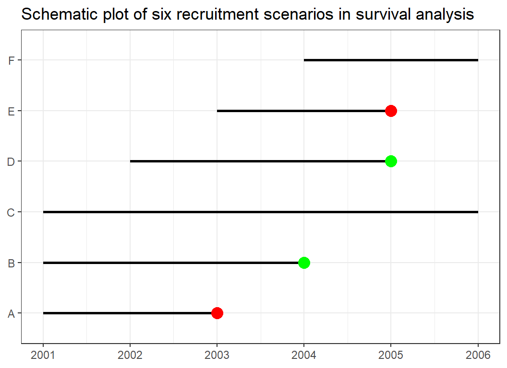
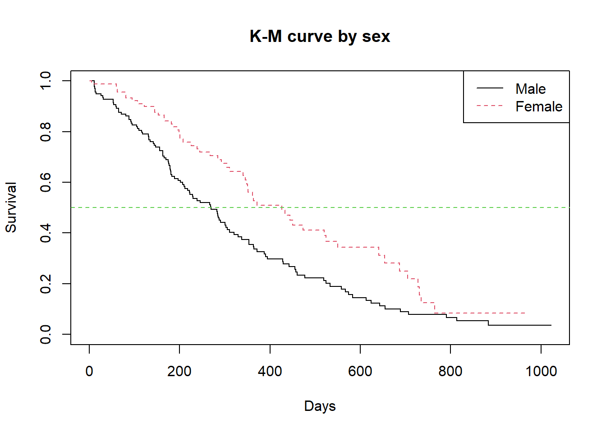

# Survival analysis

All the aforementioned analysis deals with the presence or absence of an outcome. They do not take into consideration how long it took the outcome to occur. Survival analysis is designed for this purpose, analysis of time to events. For instance, analysing how long it takes for a car to develop a faulty engine, for a person to develop a heart attack and divorce after marriage will require survival analysis.

## Terminologies
In survival analysis, subjects are usually followed for a period of time with our main interest being the duration it takes for the event to occur. To understand survival analysis we need to familiarise ourselves with a few terminologies. Consider Figure 42. At the beginning of the year 2001, a study was initiated to determine the survival of women treated for breast cancer. The six horizontal lines represent six patients recruited for this study and indicate their time of recruitment into the study, how long they were in the study and their outcome.



**Survival**: This is generally termed as the probability that an individual or a subject survives from the beginning of say a study or observation (where t0 = 0) to a specific time (t) without experiencing the event. So in a study where one is determining the survival of breast cancer patients, the five-year survival is the probability that a patient will be alive at five years after
diagnosis or observation. This is also called the survival function and is often represented by S(t).

**Hazard**: The hazard on the other hand is the probability that an individual who has been under observation from time t0 has the event at time t. Relating this to our breast cancer example the
hazard at five years is the probability that a patient would be dead at five years. The hazard function is often represented by $h(t)$ or $\lambda(t)$. Note that the survivor function deals with the event (death) not occurring while the hazard function deals with the event (death) occurring.

**Event**: The event we are interested in is death. In this example, death is the event of interest but this could be divorce, relapse of cancer, etc. depending on the outcome of the interest being
studied. In our diagram, the event (death) is coloured red. Patient A was recruited in 2001 but died in 2003 while E was recruited into the study in 2003 but died in 2005. Hence both patients
were in the study for about 2 years and experienced the event of death.

**Censor**: Patients who do not experience the event are usually said to be censored, literally meaning the time they will develop the event cannot be determined within the study period.
Patient B for instance was recruited at the beginning of the study but lost to follow-up (green dot) in 2004. Patient D was recruited into the study in 2002 but was also lost to follow up in
2005. Patients C and F both stayed in the study till the end without experiencing the event. For patients B, C, D, and F we have no idea at the end of the the follow-up period when their events will
occur. For these, their outcome is termed as censored. These six lines give us the characteristic scenarios that may occur in the right censored data.

**Median Survival**: It is the time when half the study subjects are expected to have experienced the event. In other words, the chance of surviving (or not experiencing the event) beyond that
time is 50% for a population with the disease or exposure being studied.

In this section, we will use the lung data from the survival package. First, we have a look at the details of the lung data by using 


```r
library(survival)
lung %>% head()
```


```{=html}
<table class="huxtable" style="border-collapse: collapse; border: 0px; margin-bottom: 2em; margin-top: 2em; ; margin-left: auto; margin-right: auto;  " id="tab:unnamed-chunk-3">
<caption style="caption-side: top; text-align: center;">(#tab:unnamed-chunk-3) </caption><col><col><col><col><col><col><col><col><col><col><tr>
<th style="vertical-align: top; text-align: right; white-space: normal; border-style: solid solid solid solid; border-width: 0.4pt 0pt 0.4pt 0pt;    padding: 2pt 6pt 2pt 0pt; font-weight: bold; font-family: Arial, Times New Roman, Times, Serif; font-size: 11pt;">inst</th><th style="vertical-align: top; text-align: right; white-space: normal; border-style: solid solid solid solid; border-width: 0.4pt 0pt 0.4pt 0pt;    padding: 2pt 6pt 2pt 6pt; font-weight: bold; font-family: Arial, Times New Roman, Times, Serif; font-size: 11pt;">time</th><th style="vertical-align: top; text-align: right; white-space: normal; border-style: solid solid solid solid; border-width: 0.4pt 0pt 0.4pt 0pt;    padding: 2pt 6pt 2pt 6pt; font-weight: bold; font-family: Arial, Times New Roman, Times, Serif; font-size: 11pt;">status</th><th style="vertical-align: top; text-align: right; white-space: normal; border-style: solid solid solid solid; border-width: 0.4pt 0pt 0.4pt 0pt;    padding: 2pt 6pt 2pt 6pt; font-weight: bold; font-family: Arial, Times New Roman, Times, Serif; font-size: 11pt;">age</th><th style="vertical-align: top; text-align: right; white-space: normal; border-style: solid solid solid solid; border-width: 0.4pt 0pt 0.4pt 0pt;    padding: 2pt 6pt 2pt 6pt; font-weight: bold; font-family: Arial, Times New Roman, Times, Serif; font-size: 11pt;">sex</th><th style="vertical-align: top; text-align: right; white-space: normal; border-style: solid solid solid solid; border-width: 0.4pt 0pt 0.4pt 0pt;    padding: 2pt 6pt 2pt 6pt; font-weight: bold; font-family: Arial, Times New Roman, Times, Serif; font-size: 11pt;">ph.ecog</th><th style="vertical-align: top; text-align: right; white-space: normal; border-style: solid solid solid solid; border-width: 0.4pt 0pt 0.4pt 0pt;    padding: 2pt 6pt 2pt 6pt; font-weight: bold; font-family: Arial, Times New Roman, Times, Serif; font-size: 11pt;">ph.karno</th><th style="vertical-align: top; text-align: right; white-space: normal; border-style: solid solid solid solid; border-width: 0.4pt 0pt 0.4pt 0pt;    padding: 2pt 6pt 2pt 6pt; font-weight: bold; font-family: Arial, Times New Roman, Times, Serif; font-size: 11pt;">pat.karno</th><th style="vertical-align: top; text-align: right; white-space: normal; border-style: solid solid solid solid; border-width: 0.4pt 0pt 0.4pt 0pt;    padding: 2pt 6pt 2pt 6pt; font-weight: bold; font-family: Arial, Times New Roman, Times, Serif; font-size: 11pt;">meal.cal</th><th style="vertical-align: top; text-align: right; white-space: normal; border-style: solid solid solid solid; border-width: 0.4pt 0pt 0.4pt 0pt;    padding: 2pt 0pt 2pt 6pt; font-weight: bold; font-family: Arial, Times New Roman, Times, Serif; font-size: 11pt;">wt.loss</th></tr>
<tr>
<td style="vertical-align: top; text-align: right; white-space: normal; border-style: solid solid solid solid; border-width: 0.4pt 0pt 0pt 0pt;    padding: 2pt 6pt 2pt 0pt; font-weight: normal; font-family: Arial, Times New Roman, Times, Serif; font-size: 11pt;">3</td><td style="vertical-align: top; text-align: right; white-space: normal; border-style: solid solid solid solid; border-width: 0.4pt 0pt 0pt 0pt;    padding: 2pt 6pt 2pt 6pt; font-weight: normal; font-family: Arial, Times New Roman, Times, Serif; font-size: 11pt;">306</td><td style="vertical-align: top; text-align: right; white-space: normal; border-style: solid solid solid solid; border-width: 0.4pt 0pt 0pt 0pt;    padding: 2pt 6pt 2pt 6pt; font-weight: normal; font-family: Arial, Times New Roman, Times, Serif; font-size: 11pt;">2</td><td style="vertical-align: top; text-align: right; white-space: normal; border-style: solid solid solid solid; border-width: 0.4pt 0pt 0pt 0pt;    padding: 2pt 6pt 2pt 6pt; font-weight: normal; font-family: Arial, Times New Roman, Times, Serif; font-size: 11pt;">74</td><td style="vertical-align: top; text-align: right; white-space: normal; border-style: solid solid solid solid; border-width: 0.4pt 0pt 0pt 0pt;    padding: 2pt 6pt 2pt 6pt; font-weight: normal; font-family: Arial, Times New Roman, Times, Serif; font-size: 11pt;">1</td><td style="vertical-align: top; text-align: right; white-space: normal; border-style: solid solid solid solid; border-width: 0.4pt 0pt 0pt 0pt;    padding: 2pt 6pt 2pt 6pt; font-weight: normal; font-family: Arial, Times New Roman, Times, Serif; font-size: 11pt;">1</td><td style="vertical-align: top; text-align: right; white-space: normal; border-style: solid solid solid solid; border-width: 0.4pt 0pt 0pt 0pt;    padding: 2pt 6pt 2pt 6pt; font-weight: normal; font-family: Arial, Times New Roman, Times, Serif; font-size: 11pt;">90</td><td style="vertical-align: top; text-align: right; white-space: normal; border-style: solid solid solid solid; border-width: 0.4pt 0pt 0pt 0pt;    padding: 2pt 6pt 2pt 6pt; font-weight: normal; font-family: Arial, Times New Roman, Times, Serif; font-size: 11pt;">100</td><td style="vertical-align: top; text-align: right; white-space: normal; border-style: solid solid solid solid; border-width: 0.4pt 0pt 0pt 0pt;    padding: 2pt 6pt 2pt 6pt; font-weight: normal; font-family: Arial, Times New Roman, Times, Serif; font-size: 11pt;">1175</td><td style="vertical-align: top; text-align: right; white-space: normal; border-style: solid solid solid solid; border-width: 0.4pt 0pt 0pt 0pt;    padding: 2pt 0pt 2pt 6pt; font-weight: normal; font-family: Arial, Times New Roman, Times, Serif; font-size: 11pt;"></td></tr>
<tr>
<td style="vertical-align: top; text-align: right; white-space: normal; border-style: solid solid solid solid; border-width: 0pt 0pt 0pt 0pt;    padding: 2pt 6pt 2pt 0pt; font-weight: normal; font-family: Arial, Times New Roman, Times, Serif; font-size: 11pt;">3</td><td style="vertical-align: top; text-align: right; white-space: normal; border-style: solid solid solid solid; border-width: 0pt 0pt 0pt 0pt;    padding: 2pt 6pt 2pt 6pt; font-weight: normal; font-family: Arial, Times New Roman, Times, Serif; font-size: 11pt;">455</td><td style="vertical-align: top; text-align: right; white-space: normal; border-style: solid solid solid solid; border-width: 0pt 0pt 0pt 0pt;    padding: 2pt 6pt 2pt 6pt; font-weight: normal; font-family: Arial, Times New Roman, Times, Serif; font-size: 11pt;">2</td><td style="vertical-align: top; text-align: right; white-space: normal; border-style: solid solid solid solid; border-width: 0pt 0pt 0pt 0pt;    padding: 2pt 6pt 2pt 6pt; font-weight: normal; font-family: Arial, Times New Roman, Times, Serif; font-size: 11pt;">68</td><td style="vertical-align: top; text-align: right; white-space: normal; border-style: solid solid solid solid; border-width: 0pt 0pt 0pt 0pt;    padding: 2pt 6pt 2pt 6pt; font-weight: normal; font-family: Arial, Times New Roman, Times, Serif; font-size: 11pt;">1</td><td style="vertical-align: top; text-align: right; white-space: normal; border-style: solid solid solid solid; border-width: 0pt 0pt 0pt 0pt;    padding: 2pt 6pt 2pt 6pt; font-weight: normal; font-family: Arial, Times New Roman, Times, Serif; font-size: 11pt;">0</td><td style="vertical-align: top; text-align: right; white-space: normal; border-style: solid solid solid solid; border-width: 0pt 0pt 0pt 0pt;    padding: 2pt 6pt 2pt 6pt; font-weight: normal; font-family: Arial, Times New Roman, Times, Serif; font-size: 11pt;">90</td><td style="vertical-align: top; text-align: right; white-space: normal; border-style: solid solid solid solid; border-width: 0pt 0pt 0pt 0pt;    padding: 2pt 6pt 2pt 6pt; font-weight: normal; font-family: Arial, Times New Roman, Times, Serif; font-size: 11pt;">90</td><td style="vertical-align: top; text-align: right; white-space: normal; border-style: solid solid solid solid; border-width: 0pt 0pt 0pt 0pt;    padding: 2pt 6pt 2pt 6pt; font-weight: normal; font-family: Arial, Times New Roman, Times, Serif; font-size: 11pt;">1225</td><td style="vertical-align: top; text-align: right; white-space: normal; border-style: solid solid solid solid; border-width: 0pt 0pt 0pt 0pt;    padding: 2pt 0pt 2pt 6pt; font-weight: normal; font-family: Arial, Times New Roman, Times, Serif; font-size: 11pt;">15</td></tr>
<tr>
<td style="vertical-align: top; text-align: right; white-space: normal; border-style: solid solid solid solid; border-width: 0pt 0pt 0pt 0pt;    padding: 2pt 6pt 2pt 0pt; font-weight: normal; font-family: Arial, Times New Roman, Times, Serif; font-size: 11pt;">3</td><td style="vertical-align: top; text-align: right; white-space: normal; border-style: solid solid solid solid; border-width: 0pt 0pt 0pt 0pt;    padding: 2pt 6pt 2pt 6pt; font-weight: normal; font-family: Arial, Times New Roman, Times, Serif; font-size: 11pt;">1010</td><td style="vertical-align: top; text-align: right; white-space: normal; border-style: solid solid solid solid; border-width: 0pt 0pt 0pt 0pt;    padding: 2pt 6pt 2pt 6pt; font-weight: normal; font-family: Arial, Times New Roman, Times, Serif; font-size: 11pt;">1</td><td style="vertical-align: top; text-align: right; white-space: normal; border-style: solid solid solid solid; border-width: 0pt 0pt 0pt 0pt;    padding: 2pt 6pt 2pt 6pt; font-weight: normal; font-family: Arial, Times New Roman, Times, Serif; font-size: 11pt;">56</td><td style="vertical-align: top; text-align: right; white-space: normal; border-style: solid solid solid solid; border-width: 0pt 0pt 0pt 0pt;    padding: 2pt 6pt 2pt 6pt; font-weight: normal; font-family: Arial, Times New Roman, Times, Serif; font-size: 11pt;">1</td><td style="vertical-align: top; text-align: right; white-space: normal; border-style: solid solid solid solid; border-width: 0pt 0pt 0pt 0pt;    padding: 2pt 6pt 2pt 6pt; font-weight: normal; font-family: Arial, Times New Roman, Times, Serif; font-size: 11pt;">0</td><td style="vertical-align: top; text-align: right; white-space: normal; border-style: solid solid solid solid; border-width: 0pt 0pt 0pt 0pt;    padding: 2pt 6pt 2pt 6pt; font-weight: normal; font-family: Arial, Times New Roman, Times, Serif; font-size: 11pt;">90</td><td style="vertical-align: top; text-align: right; white-space: normal; border-style: solid solid solid solid; border-width: 0pt 0pt 0pt 0pt;    padding: 2pt 6pt 2pt 6pt; font-weight: normal; font-family: Arial, Times New Roman, Times, Serif; font-size: 11pt;">90</td><td style="vertical-align: top; text-align: right; white-space: normal; border-style: solid solid solid solid; border-width: 0pt 0pt 0pt 0pt;    padding: 2pt 6pt 2pt 6pt; font-weight: normal; font-family: Arial, Times New Roman, Times, Serif; font-size: 11pt;"></td><td style="vertical-align: top; text-align: right; white-space: normal; border-style: solid solid solid solid; border-width: 0pt 0pt 0pt 0pt;    padding: 2pt 0pt 2pt 6pt; font-weight: normal; font-family: Arial, Times New Roman, Times, Serif; font-size: 11pt;">15</td></tr>
<tr>
<td style="vertical-align: top; text-align: right; white-space: normal; border-style: solid solid solid solid; border-width: 0pt 0pt 0pt 0pt;    padding: 2pt 6pt 2pt 0pt; font-weight: normal; font-family: Arial, Times New Roman, Times, Serif; font-size: 11pt;">5</td><td style="vertical-align: top; text-align: right; white-space: normal; border-style: solid solid solid solid; border-width: 0pt 0pt 0pt 0pt;    padding: 2pt 6pt 2pt 6pt; font-weight: normal; font-family: Arial, Times New Roman, Times, Serif; font-size: 11pt;">210</td><td style="vertical-align: top; text-align: right; white-space: normal; border-style: solid solid solid solid; border-width: 0pt 0pt 0pt 0pt;    padding: 2pt 6pt 2pt 6pt; font-weight: normal; font-family: Arial, Times New Roman, Times, Serif; font-size: 11pt;">2</td><td style="vertical-align: top; text-align: right; white-space: normal; border-style: solid solid solid solid; border-width: 0pt 0pt 0pt 0pt;    padding: 2pt 6pt 2pt 6pt; font-weight: normal; font-family: Arial, Times New Roman, Times, Serif; font-size: 11pt;">57</td><td style="vertical-align: top; text-align: right; white-space: normal; border-style: solid solid solid solid; border-width: 0pt 0pt 0pt 0pt;    padding: 2pt 6pt 2pt 6pt; font-weight: normal; font-family: Arial, Times New Roman, Times, Serif; font-size: 11pt;">1</td><td style="vertical-align: top; text-align: right; white-space: normal; border-style: solid solid solid solid; border-width: 0pt 0pt 0pt 0pt;    padding: 2pt 6pt 2pt 6pt; font-weight: normal; font-family: Arial, Times New Roman, Times, Serif; font-size: 11pt;">1</td><td style="vertical-align: top; text-align: right; white-space: normal; border-style: solid solid solid solid; border-width: 0pt 0pt 0pt 0pt;    padding: 2pt 6pt 2pt 6pt; font-weight: normal; font-family: Arial, Times New Roman, Times, Serif; font-size: 11pt;">90</td><td style="vertical-align: top; text-align: right; white-space: normal; border-style: solid solid solid solid; border-width: 0pt 0pt 0pt 0pt;    padding: 2pt 6pt 2pt 6pt; font-weight: normal; font-family: Arial, Times New Roman, Times, Serif; font-size: 11pt;">60</td><td style="vertical-align: top; text-align: right; white-space: normal; border-style: solid solid solid solid; border-width: 0pt 0pt 0pt 0pt;    padding: 2pt 6pt 2pt 6pt; font-weight: normal; font-family: Arial, Times New Roman, Times, Serif; font-size: 11pt;">1150</td><td style="vertical-align: top; text-align: right; white-space: normal; border-style: solid solid solid solid; border-width: 0pt 0pt 0pt 0pt;    padding: 2pt 0pt 2pt 6pt; font-weight: normal; font-family: Arial, Times New Roman, Times, Serif; font-size: 11pt;">11</td></tr>
<tr>
<td style="vertical-align: top; text-align: right; white-space: normal; border-style: solid solid solid solid; border-width: 0pt 0pt 0pt 0pt;    padding: 2pt 6pt 2pt 0pt; font-weight: normal; font-family: Arial, Times New Roman, Times, Serif; font-size: 11pt;">1</td><td style="vertical-align: top; text-align: right; white-space: normal; border-style: solid solid solid solid; border-width: 0pt 0pt 0pt 0pt;    padding: 2pt 6pt 2pt 6pt; font-weight: normal; font-family: Arial, Times New Roman, Times, Serif; font-size: 11pt;">883</td><td style="vertical-align: top; text-align: right; white-space: normal; border-style: solid solid solid solid; border-width: 0pt 0pt 0pt 0pt;    padding: 2pt 6pt 2pt 6pt; font-weight: normal; font-family: Arial, Times New Roman, Times, Serif; font-size: 11pt;">2</td><td style="vertical-align: top; text-align: right; white-space: normal; border-style: solid solid solid solid; border-width: 0pt 0pt 0pt 0pt;    padding: 2pt 6pt 2pt 6pt; font-weight: normal; font-family: Arial, Times New Roman, Times, Serif; font-size: 11pt;">60</td><td style="vertical-align: top; text-align: right; white-space: normal; border-style: solid solid solid solid; border-width: 0pt 0pt 0pt 0pt;    padding: 2pt 6pt 2pt 6pt; font-weight: normal; font-family: Arial, Times New Roman, Times, Serif; font-size: 11pt;">1</td><td style="vertical-align: top; text-align: right; white-space: normal; border-style: solid solid solid solid; border-width: 0pt 0pt 0pt 0pt;    padding: 2pt 6pt 2pt 6pt; font-weight: normal; font-family: Arial, Times New Roman, Times, Serif; font-size: 11pt;">0</td><td style="vertical-align: top; text-align: right; white-space: normal; border-style: solid solid solid solid; border-width: 0pt 0pt 0pt 0pt;    padding: 2pt 6pt 2pt 6pt; font-weight: normal; font-family: Arial, Times New Roman, Times, Serif; font-size: 11pt;">100</td><td style="vertical-align: top; text-align: right; white-space: normal; border-style: solid solid solid solid; border-width: 0pt 0pt 0pt 0pt;    padding: 2pt 6pt 2pt 6pt; font-weight: normal; font-family: Arial, Times New Roman, Times, Serif; font-size: 11pt;">90</td><td style="vertical-align: top; text-align: right; white-space: normal; border-style: solid solid solid solid; border-width: 0pt 0pt 0pt 0pt;    padding: 2pt 6pt 2pt 6pt; font-weight: normal; font-family: Arial, Times New Roman, Times, Serif; font-size: 11pt;"></td><td style="vertical-align: top; text-align: right; white-space: normal; border-style: solid solid solid solid; border-width: 0pt 0pt 0pt 0pt;    padding: 2pt 0pt 2pt 6pt; font-weight: normal; font-family: Arial, Times New Roman, Times, Serif; font-size: 11pt;">0</td></tr>
<tr>
<td style="vertical-align: top; text-align: right; white-space: normal; border-style: solid solid solid solid; border-width: 0pt 0pt 0.4pt 0pt;    padding: 2pt 6pt 2pt 0pt; font-weight: normal; font-family: Arial, Times New Roman, Times, Serif; font-size: 11pt;">12</td><td style="vertical-align: top; text-align: right; white-space: normal; border-style: solid solid solid solid; border-width: 0pt 0pt 0.4pt 0pt;    padding: 2pt 6pt 2pt 6pt; font-weight: normal; font-family: Arial, Times New Roman, Times, Serif; font-size: 11pt;">1022</td><td style="vertical-align: top; text-align: right; white-space: normal; border-style: solid solid solid solid; border-width: 0pt 0pt 0.4pt 0pt;    padding: 2pt 6pt 2pt 6pt; font-weight: normal; font-family: Arial, Times New Roman, Times, Serif; font-size: 11pt;">1</td><td style="vertical-align: top; text-align: right; white-space: normal; border-style: solid solid solid solid; border-width: 0pt 0pt 0.4pt 0pt;    padding: 2pt 6pt 2pt 6pt; font-weight: normal; font-family: Arial, Times New Roman, Times, Serif; font-size: 11pt;">74</td><td style="vertical-align: top; text-align: right; white-space: normal; border-style: solid solid solid solid; border-width: 0pt 0pt 0.4pt 0pt;    padding: 2pt 6pt 2pt 6pt; font-weight: normal; font-family: Arial, Times New Roman, Times, Serif; font-size: 11pt;">1</td><td style="vertical-align: top; text-align: right; white-space: normal; border-style: solid solid solid solid; border-width: 0pt 0pt 0.4pt 0pt;    padding: 2pt 6pt 2pt 6pt; font-weight: normal; font-family: Arial, Times New Roman, Times, Serif; font-size: 11pt;">1</td><td style="vertical-align: top; text-align: right; white-space: normal; border-style: solid solid solid solid; border-width: 0pt 0pt 0.4pt 0pt;    padding: 2pt 6pt 2pt 6pt; font-weight: normal; font-family: Arial, Times New Roman, Times, Serif; font-size: 11pt;">50</td><td style="vertical-align: top; text-align: right; white-space: normal; border-style: solid solid solid solid; border-width: 0pt 0pt 0.4pt 0pt;    padding: 2pt 6pt 2pt 6pt; font-weight: normal; font-family: Arial, Times New Roman, Times, Serif; font-size: 11pt;">80</td><td style="vertical-align: top; text-align: right; white-space: normal; border-style: solid solid solid solid; border-width: 0pt 0pt 0.4pt 0pt;    padding: 2pt 6pt 2pt 6pt; font-weight: normal; font-family: Arial, Times New Roman, Times, Serif; font-size: 11pt;">513</td><td style="vertical-align: top; text-align: right; white-space: normal; border-style: solid solid solid solid; border-width: 0pt 0pt 0.4pt 0pt;    padding: 2pt 0pt 2pt 6pt; font-weight: normal; font-family: Arial, Times New Roman, Times, Serif; font-size: 11pt;">0</td></tr>
</table>

```


For a good understanding of the lung data readers are advised to read the help page revealed by the help() function above. Note that time is the duration each participant was followed up
while in the study. status on the other hand indicates if the patient experienced the outcome, in this case, death while being followed up or was censored, indicating death never occurred during the follow-up period.

## The survival object
The initial step in survival analysis in R (and for that matter many other statistical software) is the creation of the survival object. This is achieved in R with the function `Surv()` from the survival package. The function requires at least two arguments to be supplied. These include the time, indicating the duration each subject was in the study and status indicating whether the event occurred or not. This is demonstrated below using the "lung" dataset in the survival package.


```r
Surv.1 <- Surv(time=lung$time, event=lung$status==2)
Surv.1
 [1]  306   455  1010+  210   883  1022+  310   361   218   166   170   654 
[13]  728    71   567   144   613   707    61    88   301    81   624   371 
[25]  394   520   574   118   390    12   473    26   533   107    53   122 
[37]  814   965+   93   731   460   153   433   145   583    95   303   519 
[49]  643   765   735   189    53   246   689    65     5   132   687   345 
[61]  444   223   175    60   163    65   208   821+  428   230   840+  305 
[73]   11   132   226   426   705   363    11   176   791    95   196+  167 
[85]  806+  284   641   147   740+  163 
 [ reached getOption("max.print") -- omitted 138 entries ]
```

In the Surv()function above time is supplied as a numeric variable while the event is either expressed as 0 (for no event or censored) and 1 (for the event occurring) or FALSE (for no event or censoring) and TRUE (for the occurrence of the event). Our command above used the logical version (TRUE/FALSE) and created a vector of TRUE (for status of 2) and FALSE (for status otherwise).

The survival object is essentially a conversion of the time into an object that incorporates both the time and the status. Below we combine the time and status from the lung dataset and the survival object. It can be seen that the time variable is the same as the survival object if the patient died but in patients with censored outcomes, a plus (+) sign is attached.


```r
cbind(lung[,2:3], Surv.1) %>% head()
Warning in value[[jj]][ri] <- if (is.factor(xij)) as.vector(xij) else xij:
number of items to replace is not a multiple of replacement length
```


```{=html}
<table class="huxtable" style="border-collapse: collapse; border: 0px; margin-bottom: 2em; margin-top: 2em; ; margin-left: auto; margin-right: auto;  " id="tab:unnamed-chunk-5">
<caption style="caption-side: top; text-align: center;">(#tab:unnamed-chunk-5) </caption><col><col><col><tr>
<th style="vertical-align: top; text-align: right; white-space: normal; border-style: solid solid solid solid; border-width: 0.4pt 0pt 0.4pt 0pt;    padding: 2pt 6pt 2pt 0pt; font-weight: bold; font-family: Arial, Times New Roman, Times, Serif; font-size: 11pt;">time</th><th style="vertical-align: top; text-align: right; white-space: normal; border-style: solid solid solid solid; border-width: 0.4pt 0pt 0.4pt 0pt;    padding: 2pt 6pt 2pt 6pt; font-weight: bold; font-family: Arial, Times New Roman, Times, Serif; font-size: 11pt;">status</th><th style="vertical-align: top; text-align: left; white-space: normal; border-style: solid solid solid solid; border-width: 0.4pt 0pt 0.4pt 0pt;    padding: 2pt 0pt 2pt 6pt; font-weight: bold; font-family: Arial, Times New Roman, Times, Serif; font-size: 11pt;">Surv0.1</th></tr>
<tr>
<td style="vertical-align: top; text-align: right; white-space: normal; border-style: solid solid solid solid; border-width: 0.4pt 0pt 0pt 0pt;    padding: 2pt 6pt 2pt 0pt; font-weight: normal; font-family: Arial, Times New Roman, Times, Serif; font-size: 11pt;">306</td><td style="vertical-align: top; text-align: right; white-space: normal; border-style: solid solid solid solid; border-width: 0.4pt 0pt 0pt 0pt;    padding: 2pt 6pt 2pt 6pt; font-weight: normal; font-family: Arial, Times New Roman, Times, Serif; font-size: 11pt;">2</td><td style="vertical-align: top; text-align: left; white-space: normal; border-style: solid solid solid solid; border-width: 0.4pt 0pt 0pt 0pt;    padding: 2pt 0pt 2pt 6pt; font-weight: normal; font-family: Arial, Times New Roman, Times, Serif; font-size: 11pt;">306</td></tr>
<tr>
<td style="vertical-align: top; text-align: right; white-space: normal; border-style: solid solid solid solid; border-width: 0pt 0pt 0pt 0pt;    padding: 2pt 6pt 2pt 0pt; font-weight: normal; font-family: Arial, Times New Roman, Times, Serif; font-size: 11pt;">455</td><td style="vertical-align: top; text-align: right; white-space: normal; border-style: solid solid solid solid; border-width: 0pt 0pt 0pt 0pt;    padding: 2pt 6pt 2pt 6pt; font-weight: normal; font-family: Arial, Times New Roman, Times, Serif; font-size: 11pt;">2</td><td style="vertical-align: top; text-align: left; white-space: normal; border-style: solid solid solid solid; border-width: 0pt 0pt 0pt 0pt;    padding: 2pt 0pt 2pt 6pt; font-weight: normal; font-family: Arial, Times New Roman, Times, Serif; font-size: 11pt;">455</td></tr>
<tr>
<td style="vertical-align: top; text-align: right; white-space: normal; border-style: solid solid solid solid; border-width: 0pt 0pt 0pt 0pt;    padding: 2pt 6pt 2pt 0pt; font-weight: normal; font-family: Arial, Times New Roman, Times, Serif; font-size: 11pt;">1010</td><td style="vertical-align: top; text-align: right; white-space: normal; border-style: solid solid solid solid; border-width: 0pt 0pt 0pt 0pt;    padding: 2pt 6pt 2pt 6pt; font-weight: normal; font-family: Arial, Times New Roman, Times, Serif; font-size: 11pt;">1</td><td style="vertical-align: top; text-align: left; white-space: normal; border-style: solid solid solid solid; border-width: 0pt 0pt 0pt 0pt;    padding: 2pt 0pt 2pt 6pt; font-weight: normal; font-family: Arial, Times New Roman, Times, Serif; font-size: 11pt;">1010</td></tr>
<tr>
<td style="vertical-align: top; text-align: right; white-space: normal; border-style: solid solid solid solid; border-width: 0pt 0pt 0pt 0pt;    padding: 2pt 6pt 2pt 0pt; font-weight: normal; font-family: Arial, Times New Roman, Times, Serif; font-size: 11pt;">210</td><td style="vertical-align: top; text-align: right; white-space: normal; border-style: solid solid solid solid; border-width: 0pt 0pt 0pt 0pt;    padding: 2pt 6pt 2pt 6pt; font-weight: normal; font-family: Arial, Times New Roman, Times, Serif; font-size: 11pt;">2</td><td style="vertical-align: top; text-align: left; white-space: normal; border-style: solid solid solid solid; border-width: 0pt 0pt 0pt 0pt;    padding: 2pt 0pt 2pt 6pt; font-weight: normal; font-family: Arial, Times New Roman, Times, Serif; font-size: 11pt;">210</td></tr>
<tr>
<td style="vertical-align: top; text-align: right; white-space: normal; border-style: solid solid solid solid; border-width: 0pt 0pt 0pt 0pt;    padding: 2pt 6pt 2pt 0pt; font-weight: normal; font-family: Arial, Times New Roman, Times, Serif; font-size: 11pt;">883</td><td style="vertical-align: top; text-align: right; white-space: normal; border-style: solid solid solid solid; border-width: 0pt 0pt 0pt 0pt;    padding: 2pt 6pt 2pt 6pt; font-weight: normal; font-family: Arial, Times New Roman, Times, Serif; font-size: 11pt;">2</td><td style="vertical-align: top; text-align: left; white-space: normal; border-style: solid solid solid solid; border-width: 0pt 0pt 0pt 0pt;    padding: 2pt 0pt 2pt 6pt; font-weight: normal; font-family: Arial, Times New Roman, Times, Serif; font-size: 11pt;">883</td></tr>
<tr>
<td style="vertical-align: top; text-align: right; white-space: normal; border-style: solid solid solid solid; border-width: 0pt 0pt 0.4pt 0pt;    padding: 2pt 6pt 2pt 0pt; font-weight: normal; font-family: Arial, Times New Roman, Times, Serif; font-size: 11pt;">1022</td><td style="vertical-align: top; text-align: right; white-space: normal; border-style: solid solid solid solid; border-width: 0pt 0pt 0.4pt 0pt;    padding: 2pt 6pt 2pt 6pt; font-weight: normal; font-family: Arial, Times New Roman, Times, Serif; font-size: 11pt;">1</td><td style="vertical-align: top; text-align: left; white-space: normal; border-style: solid solid solid solid; border-width: 0pt 0pt 0.4pt 0pt;    padding: 2pt 0pt 2pt 6pt; font-weight: normal; font-family: Arial, Times New Roman, Times, Serif; font-size: 11pt;">1022</td></tr>
</table>

```


## The survival fit object
Next, a survival object is created in accordance with the analysis intended to be done. The non-stratified analysis is currently fitted with a 1 on the right side of the formula as shown below
while stratified survival is done with the stratifying variable on the right side of the formula.

In the analysis below we try to determine the median survival time for all persons included in the study


```r
sfit.1 <- survfit(Surv.1 ~ 1)
sfit.1
Call: survfit(formula = Surv.1 ~ 1)

       n events median 0.95LCL 0.95UCL
[1,] 228    165    310     285     363
```

The survival fit object sfit.1 like a linear regression or logistic regression object has very little but important information at first hand. It shows the number of records used, the median survival time (the time at which it is expected that half the patients would have the event) and its confidence interval. Our analysis indicates that after 310 days half the patients would have died! The output is simple but there is more that can be revealed in the attributes. These are displayed
below


```r
attributes(sfit.1)
$names
 [1] "n"         "time"      "n.risk"    "n.event"   "n.censor"  "surv"     
 [7] "std.err"   "cumhaz"    "std.chaz"  "type"      "logse"     "conf.int" 
[13] "conf.type" "lower"     "upper"     "call"     

$class
[1] "survfit"
```

## Kaplan-Meier life table 
For a compact view of these attributes, we summarise the survfit object. This is displayed below


```r
summary(sfit.1)
Call: survfit(formula = Surv.1 ~ 1)

 time n.risk n.event survival std.err lower 95% CI upper 95% CI
    5    228       1   0.9956 0.00438       0.9871        1.000
   11    227       3   0.9825 0.00869       0.9656        1.000
   12    224       1   0.9781 0.00970       0.9592        0.997
   13    223       2   0.9693 0.01142       0.9472        0.992
   15    221       1   0.9649 0.01219       0.9413        0.989
   26    220       1   0.9605 0.01290       0.9356        0.986
   30    219       1   0.9561 0.01356       0.9299        0.983
   31    218       1   0.9518 0.01419       0.9243        0.980
   53    217       2   0.9430 0.01536       0.9134        0.974
   54    215       1   0.9386 0.01590       0.9079        0.970
   59    214       1   0.9342 0.01642       0.9026        0.967
   60    213       2   0.9254 0.01740       0.8920        0.960
 [ reached getOption("max.print") -- omitted 127 rows ]
```

The long table produced in this output is called the Kaplan-Meier life table. It contains the individual survival probabilities with their 95% confidence intervals at every point in time of the study. For instance, the proportion that survived to the end of day 30 is about 0.9561 (95%CI: 0.9299 to 0.983). The rather long life table can be significantly compacted to show only specific times. For instance, if we decide to show the survival in a life table for every 90 days we can specify these times below


```r
summary(sfit.1, times=seq(0,900,90))
Call: survfit(formula = Surv.1 ~ 1)

 time n.risk n.event survival std.err lower 95% CI upper 95% CI
    0    228       0   1.0000  0.0000       1.0000        1.000
   90    201      27   0.8816  0.0214       0.8406        0.925
  180    160      36   0.7217  0.0298       0.6655        0.783
  270    108      30   0.5753  0.0338       0.5128        0.645
  360     70      24   0.4340  0.0358       0.3693        0.510
  450     48      16   0.3287  0.0356       0.2659        0.406
  540     33      10   0.2554  0.0344       0.1962        0.333
  630     22       7   0.1958  0.0330       0.1407        0.272
  720     14       8   0.1246  0.0290       0.0789        0.197
  810      7       5   0.0783  0.0246       0.0423        0.145
  900      3       2   0.0503  0.0228       0.0207        0.123
```

## Kaplan-Meier curve
The Kaplan-Meier life table can be plotted to give it a graphical representation called the Kaplan-Meier curve. The resulting curve is a plot of the Survival probability against the time. An example is shown in the figure below and plotted with


```r
survminer::ggsurvplot(
    sfit.1, 
    data = lung,
    palette= 'blue',
    surv.median.line = "hv",
    censor =F,
    title = "Kaplan-Meier Curve with 95% CI",
    ggtheme = theme_bw())
```


The green dotted line in the plot cuts the curve at the median survival time. Also, the plot has the confidence interval superimposed (dotted red lines).

## Survival for subgroups
To determine the survival separately for subgroups we need to fit the survival object specifying our requisite group. For instance, to determine survival among the different sexes we fit the object as below. First, we make sure the sex variable is in the right format, a factor.


```r
lung <- 
    lung %>% 
    mutate(sex = factor(sex, levels = 1:2, labels = c("Male", "Female")))
```

And then fit the appropriate survfit object. Note that the right-hand side of the formula this time is sex and not 1.


```r
sfit.2 <- survfit(Surv.1 ~ lung$sex)
sfit.2
Call: survfit(formula = Surv.1 ~ lung$sex)

                  n events median 0.95LCL 0.95UCL
lung$sex=Male   138    112    270     212     310
lung$sex=Female  90     53    426     348     550
```

Once again we are presented with the survfit object displaying the records, the number of events, the median survival and the confidence intervals. These statistics however are separate for each
sex. For instance, we realise that the number of deaths in males was more than twice that for females and the median survival time for males of 270 days is lesser than that for females. As before, for a complete life table, we summarise the survfit object.


```r
summary(sfit.2)
Call: survfit(formula = Surv.1 ~ lung$sex)

                lung$sex=Male 
 time n.risk n.event survival std.err lower 95% CI upper 95% CI
   11    138       3   0.9783  0.0124       0.9542        1.000
   12    135       1   0.9710  0.0143       0.9434        0.999
   13    134       2   0.9565  0.0174       0.9231        0.991
   15    132       1   0.9493  0.0187       0.9134        0.987
   26    131       1   0.9420  0.0199       0.9038        0.982
   30    130       1   0.9348  0.0210       0.8945        0.977
   31    129       1   0.9275  0.0221       0.8853        0.972
   53    128       2   0.9130  0.0240       0.8672        0.961
   54    126       1   0.9058  0.0249       0.8583        0.956
   59    125       1   0.8986  0.0257       0.8496        0.950
   60    124       1   0.8913  0.0265       0.8409        0.945
   65    123       2   0.8768  0.0280       0.8237        0.933
 [ reached getOption("max.print") -- omitted 87 rows ]

                lung$sex=Female 
 time n.risk n.event survival std.err lower 95% CI upper 95% CI
    5     90       1   0.9889  0.0110       0.9675        1.000
   60     89       1   0.9778  0.0155       0.9478        1.000
   61     88       1   0.9667  0.0189       0.9303        1.000
   62     87       1   0.9556  0.0217       0.9139        0.999
   79     86       1   0.9444  0.0241       0.8983        0.993
   81     85       1   0.9333  0.0263       0.8832        0.986
   95     83       1   0.9221  0.0283       0.8683        0.979
  107     81       1   0.9107  0.0301       0.8535        0.972
  122     80       1   0.8993  0.0318       0.8390        0.964
  145     79       2   0.8766  0.0349       0.8108        0.948
  153     77       1   0.8652  0.0362       0.7970        0.939
  166     76       1   0.8538  0.0375       0.7834        0.931
 [ reached getOption("max.print") -- omitted 39 rows ]
```

The rather long life table can best be appreciated with a KM curve. We further go ahead to plot the Kaplan-Meier curve for the two sexes as shown in Figure 44 and plot with


```r
plot(
    sfit.2, 
    col=1:2, 
    lty=1:2, 
    mark.time=F,
    main="K-M curve by sex",
    xlab = "Days", ylab="Survival")
legend("topright", c("Male","Female"), lty=1:2, col=1:2)
abline(h=0.5, lty=2, col=3)
```




```r
survminer::ggsurvplot(
    sfit.2, 
    data = lung,
    surv.median.line = "hv",
    censor = F,
    title = "Kaplan-Meier Curve by sex (with 95% CI)",
    ggtheme = theme_bw(),
    conf.int = T,
    xlab = "Days")
```


The figure above shows the KM survival curve separately for males and females. It can be seen that the two plots are completely separate, a sign that the survival is not the same in both sexes. The steeper curve for the males indicates they have a relatively worse outcome over time than the females. The median survival time for instance (indicated by the green dotted line) intersects the males' curve much earlier than the females indicating a much lower median survival time for the males compared to the females.

## Cumulative Incidence (Hazard)
Another way of expressing the relationship between time to an outcome and the outcome is with the Cumulative Incidence (CI). The CI at any point in time is a measure of the frequency of the outcome over a period of time. This can be determined in R as below. First, we fit the survival object.


```r
sfit.3 <- 
    survfit(
        Surv(
            time = time, 
            event = status==2, 
            type = "mstate") ~ 1, 
        data=lung)
sfit.3
Call: survfit(formula = Surv(time = time, event = status == 2, type = "mstate") ~ 
    1, data = lung)

       n nevent   rmean*
(s0) 228      0 376.2747
TRUE 228    165 645.7253
   *restricted mean time in state (max time = 1022 )
```

The survival object is similar to that done previously but this time in fitting it we used the argument `type="mstate"` to specify our preference for the cumulative incidence. We further use the summary() function on the survfit object to generate the CI table.


```r
sfit.3 %>% broom::tidy() %>% head(10)
```


```{=html}
<table class="huxtable" style="border-collapse: collapse; border: 0px; margin-bottom: 2em; margin-top: 2em; ; margin-left: auto; margin-right: auto;  " id="tab:unnamed-chunk-17">
<caption style="caption-side: top; text-align: center;">(#tab:unnamed-chunk-17) </caption><col><col><col><col><col><col><col><col><col><tr>
<th style="vertical-align: top; text-align: right; white-space: normal; border-style: solid solid solid solid; border-width: 0.4pt 0pt 0.4pt 0pt;    padding: 2pt 6pt 2pt 0pt; font-weight: bold; font-family: Arial, Times New Roman, Times, Serif; font-size: 11pt;">time</th><th style="vertical-align: top; text-align: right; white-space: normal; border-style: solid solid solid solid; border-width: 0.4pt 0pt 0.4pt 0pt;    padding: 2pt 6pt 2pt 6pt; font-weight: bold; font-family: Arial, Times New Roman, Times, Serif; font-size: 11pt;">n.risk</th><th style="vertical-align: top; text-align: right; white-space: normal; border-style: solid solid solid solid; border-width: 0.4pt 0pt 0.4pt 0pt;    padding: 2pt 6pt 2pt 6pt; font-weight: bold; font-family: Arial, Times New Roman, Times, Serif; font-size: 11pt;">n.event</th><th style="vertical-align: top; text-align: right; white-space: normal; border-style: solid solid solid solid; border-width: 0.4pt 0pt 0.4pt 0pt;    padding: 2pt 6pt 2pt 6pt; font-weight: bold; font-family: Arial, Times New Roman, Times, Serif; font-size: 11pt;">n.censor</th><th style="vertical-align: top; text-align: right; white-space: normal; border-style: solid solid solid solid; border-width: 0.4pt 0pt 0.4pt 0pt;    padding: 2pt 6pt 2pt 6pt; font-weight: bold; font-family: Arial, Times New Roman, Times, Serif; font-size: 11pt;">estimate</th><th style="vertical-align: top; text-align: right; white-space: normal; border-style: solid solid solid solid; border-width: 0.4pt 0pt 0.4pt 0pt;    padding: 2pt 6pt 2pt 6pt; font-weight: bold; font-family: Arial, Times New Roman, Times, Serif; font-size: 11pt;">std.error</th><th style="vertical-align: top; text-align: right; white-space: normal; border-style: solid solid solid solid; border-width: 0.4pt 0pt 0.4pt 0pt;    padding: 2pt 6pt 2pt 6pt; font-weight: bold; font-family: Arial, Times New Roman, Times, Serif; font-size: 11pt;">conf.high</th><th style="vertical-align: top; text-align: right; white-space: normal; border-style: solid solid solid solid; border-width: 0.4pt 0pt 0.4pt 0pt;    padding: 2pt 6pt 2pt 6pt; font-weight: bold; font-family: Arial, Times New Roman, Times, Serif; font-size: 11pt;">conf.low</th><th style="vertical-align: top; text-align: left; white-space: normal; border-style: solid solid solid solid; border-width: 0.4pt 0pt 0.4pt 0pt;    padding: 2pt 0pt 2pt 6pt; font-weight: bold; font-family: Arial, Times New Roman, Times, Serif; font-size: 11pt;">state</th></tr>
<tr>
<td style="vertical-align: top; text-align: right; white-space: normal; border-style: solid solid solid solid; border-width: 0.4pt 0pt 0pt 0pt;    padding: 2pt 6pt 2pt 0pt; font-weight: normal; font-family: Arial, Times New Roman, Times, Serif; font-size: 11pt;">5</td><td style="vertical-align: top; text-align: right; white-space: normal; border-style: solid solid solid solid; border-width: 0.4pt 0pt 0pt 0pt;    padding: 2pt 6pt 2pt 6pt; font-weight: normal; font-family: Arial, Times New Roman, Times, Serif; font-size: 11pt;">228</td><td style="vertical-align: top; text-align: right; white-space: normal; border-style: solid solid solid solid; border-width: 0.4pt 0pt 0pt 0pt;    padding: 2pt 6pt 2pt 6pt; font-weight: normal; font-family: Arial, Times New Roman, Times, Serif; font-size: 11pt;">0</td><td style="vertical-align: top; text-align: right; white-space: normal; border-style: solid solid solid solid; border-width: 0.4pt 0pt 0pt 0pt;    padding: 2pt 6pt 2pt 6pt; font-weight: normal; font-family: Arial, Times New Roman, Times, Serif; font-size: 11pt;">0</td><td style="vertical-align: top; text-align: right; white-space: normal; border-style: solid solid solid solid; border-width: 0.4pt 0pt 0pt 0pt;    padding: 2pt 6pt 2pt 6pt; font-weight: normal; font-family: Arial, Times New Roman, Times, Serif; font-size: 11pt;">0.995614</td><td style="vertical-align: top; text-align: right; white-space: normal; border-style: solid solid solid solid; border-width: 0.4pt 0pt 0pt 0pt;    padding: 2pt 6pt 2pt 6pt; font-weight: normal; font-family: Arial, Times New Roman, Times, Serif; font-size: 11pt;">0.00437634</td><td style="vertical-align: top; text-align: right; white-space: normal; border-style: solid solid solid solid; border-width: 0.4pt 0pt 0pt 0pt;    padding: 2pt 6pt 2pt 6pt; font-weight: normal; font-family: Arial, Times New Roman, Times, Serif; font-size: 11pt;">1&nbsp;&nbsp;&nbsp;&nbsp;&nbsp;&nbsp;&nbsp;</td><td style="vertical-align: top; text-align: right; white-space: normal; border-style: solid solid solid solid; border-width: 0.4pt 0pt 0pt 0pt;    padding: 2pt 6pt 2pt 6pt; font-weight: normal; font-family: Arial, Times New Roman, Times, Serif; font-size: 11pt;">0.987073</td><td style="vertical-align: top; text-align: left; white-space: normal; border-style: solid solid solid solid; border-width: 0.4pt 0pt 0pt 0pt;    padding: 2pt 0pt 2pt 6pt; font-weight: normal; font-family: Arial, Times New Roman, Times, Serif; font-size: 11pt;">(s0)</td></tr>
<tr>
<td style="vertical-align: top; text-align: right; white-space: normal; border-style: solid solid solid solid; border-width: 0pt 0pt 0pt 0pt;    padding: 2pt 6pt 2pt 0pt; font-weight: normal; font-family: Arial, Times New Roman, Times, Serif; font-size: 11pt;">11</td><td style="vertical-align: top; text-align: right; white-space: normal; border-style: solid solid solid solid; border-width: 0pt 0pt 0pt 0pt;    padding: 2pt 6pt 2pt 6pt; font-weight: normal; font-family: Arial, Times New Roman, Times, Serif; font-size: 11pt;">227</td><td style="vertical-align: top; text-align: right; white-space: normal; border-style: solid solid solid solid; border-width: 0pt 0pt 0pt 0pt;    padding: 2pt 6pt 2pt 6pt; font-weight: normal; font-family: Arial, Times New Roman, Times, Serif; font-size: 11pt;">0</td><td style="vertical-align: top; text-align: right; white-space: normal; border-style: solid solid solid solid; border-width: 0pt 0pt 0pt 0pt;    padding: 2pt 6pt 2pt 6pt; font-weight: normal; font-family: Arial, Times New Roman, Times, Serif; font-size: 11pt;">0</td><td style="vertical-align: top; text-align: right; white-space: normal; border-style: solid solid solid solid; border-width: 0pt 0pt 0pt 0pt;    padding: 2pt 6pt 2pt 6pt; font-weight: normal; font-family: Arial, Times New Roman, Times, Serif; font-size: 11pt;">0.982456</td><td style="vertical-align: top; text-align: right; white-space: normal; border-style: solid solid solid solid; border-width: 0pt 0pt 0pt 0pt;    padding: 2pt 6pt 2pt 6pt; font-weight: normal; font-family: Arial, Times New Roman, Times, Serif; font-size: 11pt;">0.00869464</td><td style="vertical-align: top; text-align: right; white-space: normal; border-style: solid solid solid solid; border-width: 0pt 0pt 0pt 0pt;    padding: 2pt 6pt 2pt 6pt; font-weight: normal; font-family: Arial, Times New Roman, Times, Serif; font-size: 11pt;">0.999646</td><td style="vertical-align: top; text-align: right; white-space: normal; border-style: solid solid solid solid; border-width: 0pt 0pt 0pt 0pt;    padding: 2pt 6pt 2pt 6pt; font-weight: normal; font-family: Arial, Times New Roman, Times, Serif; font-size: 11pt;">0.965562</td><td style="vertical-align: top; text-align: left; white-space: normal; border-style: solid solid solid solid; border-width: 0pt 0pt 0pt 0pt;    padding: 2pt 0pt 2pt 6pt; font-weight: normal; font-family: Arial, Times New Roman, Times, Serif; font-size: 11pt;">(s0)</td></tr>
<tr>
<td style="vertical-align: top; text-align: right; white-space: normal; border-style: solid solid solid solid; border-width: 0pt 0pt 0pt 0pt;    padding: 2pt 6pt 2pt 0pt; font-weight: normal; font-family: Arial, Times New Roman, Times, Serif; font-size: 11pt;">12</td><td style="vertical-align: top; text-align: right; white-space: normal; border-style: solid solid solid solid; border-width: 0pt 0pt 0pt 0pt;    padding: 2pt 6pt 2pt 6pt; font-weight: normal; font-family: Arial, Times New Roman, Times, Serif; font-size: 11pt;">224</td><td style="vertical-align: top; text-align: right; white-space: normal; border-style: solid solid solid solid; border-width: 0pt 0pt 0pt 0pt;    padding: 2pt 6pt 2pt 6pt; font-weight: normal; font-family: Arial, Times New Roman, Times, Serif; font-size: 11pt;">0</td><td style="vertical-align: top; text-align: right; white-space: normal; border-style: solid solid solid solid; border-width: 0pt 0pt 0pt 0pt;    padding: 2pt 6pt 2pt 6pt; font-weight: normal; font-family: Arial, Times New Roman, Times, Serif; font-size: 11pt;">0</td><td style="vertical-align: top; text-align: right; white-space: normal; border-style: solid solid solid solid; border-width: 0pt 0pt 0pt 0pt;    padding: 2pt 6pt 2pt 6pt; font-weight: normal; font-family: Arial, Times New Roman, Times, Serif; font-size: 11pt;">0.97807&nbsp;</td><td style="vertical-align: top; text-align: right; white-space: normal; border-style: solid solid solid solid; border-width: 0pt 0pt 0pt 0pt;    padding: 2pt 6pt 2pt 6pt; font-weight: normal; font-family: Arial, Times New Roman, Times, Serif; font-size: 11pt;">0.00969918</td><td style="vertical-align: top; text-align: right; white-space: normal; border-style: solid solid solid solid; border-width: 0pt 0pt 0pt 0pt;    padding: 2pt 6pt 2pt 6pt; font-weight: normal; font-family: Arial, Times New Roman, Times, Serif; font-size: 11pt;">0.997266</td><td style="vertical-align: top; text-align: right; white-space: normal; border-style: solid solid solid solid; border-width: 0pt 0pt 0pt 0pt;    padding: 2pt 6pt 2pt 6pt; font-weight: normal; font-family: Arial, Times New Roman, Times, Serif; font-size: 11pt;">0.959244</td><td style="vertical-align: top; text-align: left; white-space: normal; border-style: solid solid solid solid; border-width: 0pt 0pt 0pt 0pt;    padding: 2pt 0pt 2pt 6pt; font-weight: normal; font-family: Arial, Times New Roman, Times, Serif; font-size: 11pt;">(s0)</td></tr>
<tr>
<td style="vertical-align: top; text-align: right; white-space: normal; border-style: solid solid solid solid; border-width: 0pt 0pt 0pt 0pt;    padding: 2pt 6pt 2pt 0pt; font-weight: normal; font-family: Arial, Times New Roman, Times, Serif; font-size: 11pt;">13</td><td style="vertical-align: top; text-align: right; white-space: normal; border-style: solid solid solid solid; border-width: 0pt 0pt 0pt 0pt;    padding: 2pt 6pt 2pt 6pt; font-weight: normal; font-family: Arial, Times New Roman, Times, Serif; font-size: 11pt;">223</td><td style="vertical-align: top; text-align: right; white-space: normal; border-style: solid solid solid solid; border-width: 0pt 0pt 0pt 0pt;    padding: 2pt 6pt 2pt 6pt; font-weight: normal; font-family: Arial, Times New Roman, Times, Serif; font-size: 11pt;">0</td><td style="vertical-align: top; text-align: right; white-space: normal; border-style: solid solid solid solid; border-width: 0pt 0pt 0pt 0pt;    padding: 2pt 6pt 2pt 6pt; font-weight: normal; font-family: Arial, Times New Roman, Times, Serif; font-size: 11pt;">0</td><td style="vertical-align: top; text-align: right; white-space: normal; border-style: solid solid solid solid; border-width: 0pt 0pt 0pt 0pt;    padding: 2pt 6pt 2pt 6pt; font-weight: normal; font-family: Arial, Times New Roman, Times, Serif; font-size: 11pt;">0.969298</td><td style="vertical-align: top; text-align: right; white-space: normal; border-style: solid solid solid solid; border-width: 0pt 0pt 0pt 0pt;    padding: 2pt 6pt 2pt 6pt; font-weight: normal; font-family: Arial, Times New Roman, Times, Serif; font-size: 11pt;">0.0114246&nbsp;</td><td style="vertical-align: top; text-align: right; white-space: normal; border-style: solid solid solid solid; border-width: 0pt 0pt 0pt 0pt;    padding: 2pt 6pt 2pt 6pt; font-weight: normal; font-family: Arial, Times New Roman, Times, Serif; font-size: 11pt;">0.991951</td><td style="vertical-align: top; text-align: right; white-space: normal; border-style: solid solid solid solid; border-width: 0pt 0pt 0pt 0pt;    padding: 2pt 6pt 2pt 6pt; font-weight: normal; font-family: Arial, Times New Roman, Times, Serif; font-size: 11pt;">0.947163</td><td style="vertical-align: top; text-align: left; white-space: normal; border-style: solid solid solid solid; border-width: 0pt 0pt 0pt 0pt;    padding: 2pt 0pt 2pt 6pt; font-weight: normal; font-family: Arial, Times New Roman, Times, Serif; font-size: 11pt;">(s0)</td></tr>
<tr>
<td style="vertical-align: top; text-align: right; white-space: normal; border-style: solid solid solid solid; border-width: 0pt 0pt 0pt 0pt;    padding: 2pt 6pt 2pt 0pt; font-weight: normal; font-family: Arial, Times New Roman, Times, Serif; font-size: 11pt;">15</td><td style="vertical-align: top; text-align: right; white-space: normal; border-style: solid solid solid solid; border-width: 0pt 0pt 0pt 0pt;    padding: 2pt 6pt 2pt 6pt; font-weight: normal; font-family: Arial, Times New Roman, Times, Serif; font-size: 11pt;">221</td><td style="vertical-align: top; text-align: right; white-space: normal; border-style: solid solid solid solid; border-width: 0pt 0pt 0pt 0pt;    padding: 2pt 6pt 2pt 6pt; font-weight: normal; font-family: Arial, Times New Roman, Times, Serif; font-size: 11pt;">0</td><td style="vertical-align: top; text-align: right; white-space: normal; border-style: solid solid solid solid; border-width: 0pt 0pt 0pt 0pt;    padding: 2pt 6pt 2pt 6pt; font-weight: normal; font-family: Arial, Times New Roman, Times, Serif; font-size: 11pt;">0</td><td style="vertical-align: top; text-align: right; white-space: normal; border-style: solid solid solid solid; border-width: 0pt 0pt 0pt 0pt;    padding: 2pt 6pt 2pt 6pt; font-weight: normal; font-family: Arial, Times New Roman, Times, Serif; font-size: 11pt;">0.964912</td><td style="vertical-align: top; text-align: right; white-space: normal; border-style: solid solid solid solid; border-width: 0pt 0pt 0pt 0pt;    padding: 2pt 6pt 2pt 6pt; font-weight: normal; font-family: Arial, Times New Roman, Times, Serif; font-size: 11pt;">0.0121858&nbsp;</td><td style="vertical-align: top; text-align: right; white-space: normal; border-style: solid solid solid solid; border-width: 0pt 0pt 0pt 0pt;    padding: 2pt 6pt 2pt 6pt; font-weight: normal; font-family: Arial, Times New Roman, Times, Serif; font-size: 11pt;">0.989094</td><td style="vertical-align: top; text-align: right; white-space: normal; border-style: solid solid solid solid; border-width: 0pt 0pt 0pt 0pt;    padding: 2pt 6pt 2pt 6pt; font-weight: normal; font-family: Arial, Times New Roman, Times, Serif; font-size: 11pt;">0.941322</td><td style="vertical-align: top; text-align: left; white-space: normal; border-style: solid solid solid solid; border-width: 0pt 0pt 0pt 0pt;    padding: 2pt 0pt 2pt 6pt; font-weight: normal; font-family: Arial, Times New Roman, Times, Serif; font-size: 11pt;">(s0)</td></tr>
<tr>
<td style="vertical-align: top; text-align: right; white-space: normal; border-style: solid solid solid solid; border-width: 0pt 0pt 0pt 0pt;    padding: 2pt 6pt 2pt 0pt; font-weight: normal; font-family: Arial, Times New Roman, Times, Serif; font-size: 11pt;">26</td><td style="vertical-align: top; text-align: right; white-space: normal; border-style: solid solid solid solid; border-width: 0pt 0pt 0pt 0pt;    padding: 2pt 6pt 2pt 6pt; font-weight: normal; font-family: Arial, Times New Roman, Times, Serif; font-size: 11pt;">220</td><td style="vertical-align: top; text-align: right; white-space: normal; border-style: solid solid solid solid; border-width: 0pt 0pt 0pt 0pt;    padding: 2pt 6pt 2pt 6pt; font-weight: normal; font-family: Arial, Times New Roman, Times, Serif; font-size: 11pt;">0</td><td style="vertical-align: top; text-align: right; white-space: normal; border-style: solid solid solid solid; border-width: 0pt 0pt 0pt 0pt;    padding: 2pt 6pt 2pt 6pt; font-weight: normal; font-family: Arial, Times New Roman, Times, Serif; font-size: 11pt;">0</td><td style="vertical-align: top; text-align: right; white-space: normal; border-style: solid solid solid solid; border-width: 0pt 0pt 0pt 0pt;    padding: 2pt 6pt 2pt 6pt; font-weight: normal; font-family: Arial, Times New Roman, Times, Serif; font-size: 11pt;">0.960526</td><td style="vertical-align: top; text-align: right; white-space: normal; border-style: solid solid solid solid; border-width: 0pt 0pt 0pt 0pt;    padding: 2pt 6pt 2pt 6pt; font-weight: normal; font-family: Arial, Times New Roman, Times, Serif; font-size: 11pt;">0.0128956&nbsp;</td><td style="vertical-align: top; text-align: right; white-space: normal; border-style: solid solid solid solid; border-width: 0pt 0pt 0pt 0pt;    padding: 2pt 6pt 2pt 6pt; font-weight: normal; font-family: Arial, Times New Roman, Times, Serif; font-size: 11pt;">0.986137</td><td style="vertical-align: top; text-align: right; white-space: normal; border-style: solid solid solid solid; border-width: 0pt 0pt 0pt 0pt;    padding: 2pt 6pt 2pt 6pt; font-weight: normal; font-family: Arial, Times New Roman, Times, Serif; font-size: 11pt;">0.935581</td><td style="vertical-align: top; text-align: left; white-space: normal; border-style: solid solid solid solid; border-width: 0pt 0pt 0pt 0pt;    padding: 2pt 0pt 2pt 6pt; font-weight: normal; font-family: Arial, Times New Roman, Times, Serif; font-size: 11pt;">(s0)</td></tr>
<tr>
<td style="vertical-align: top; text-align: right; white-space: normal; border-style: solid solid solid solid; border-width: 0pt 0pt 0pt 0pt;    padding: 2pt 6pt 2pt 0pt; font-weight: normal; font-family: Arial, Times New Roman, Times, Serif; font-size: 11pt;">30</td><td style="vertical-align: top; text-align: right; white-space: normal; border-style: solid solid solid solid; border-width: 0pt 0pt 0pt 0pt;    padding: 2pt 6pt 2pt 6pt; font-weight: normal; font-family: Arial, Times New Roman, Times, Serif; font-size: 11pt;">219</td><td style="vertical-align: top; text-align: right; white-space: normal; border-style: solid solid solid solid; border-width: 0pt 0pt 0pt 0pt;    padding: 2pt 6pt 2pt 6pt; font-weight: normal; font-family: Arial, Times New Roman, Times, Serif; font-size: 11pt;">0</td><td style="vertical-align: top; text-align: right; white-space: normal; border-style: solid solid solid solid; border-width: 0pt 0pt 0pt 0pt;    padding: 2pt 6pt 2pt 6pt; font-weight: normal; font-family: Arial, Times New Roman, Times, Serif; font-size: 11pt;">0</td><td style="vertical-align: top; text-align: right; white-space: normal; border-style: solid solid solid solid; border-width: 0pt 0pt 0pt 0pt;    padding: 2pt 6pt 2pt 6pt; font-weight: normal; font-family: Arial, Times New Roman, Times, Serif; font-size: 11pt;">0.95614&nbsp;</td><td style="vertical-align: top; text-align: right; white-space: normal; border-style: solid solid solid solid; border-width: 0pt 0pt 0pt 0pt;    padding: 2pt 6pt 2pt 6pt; font-weight: normal; font-family: Arial, Times New Roman, Times, Serif; font-size: 11pt;">0.0135621&nbsp;</td><td style="vertical-align: top; text-align: right; white-space: normal; border-style: solid solid solid solid; border-width: 0pt 0pt 0pt 0pt;    padding: 2pt 6pt 2pt 6pt; font-weight: normal; font-family: Arial, Times New Roman, Times, Serif; font-size: 11pt;">0.983094</td><td style="vertical-align: top; text-align: right; white-space: normal; border-style: solid solid solid solid; border-width: 0pt 0pt 0pt 0pt;    padding: 2pt 6pt 2pt 6pt; font-weight: normal; font-family: Arial, Times New Roman, Times, Serif; font-size: 11pt;">0.929925</td><td style="vertical-align: top; text-align: left; white-space: normal; border-style: solid solid solid solid; border-width: 0pt 0pt 0pt 0pt;    padding: 2pt 0pt 2pt 6pt; font-weight: normal; font-family: Arial, Times New Roman, Times, Serif; font-size: 11pt;">(s0)</td></tr>
<tr>
<td style="vertical-align: top; text-align: right; white-space: normal; border-style: solid solid solid solid; border-width: 0pt 0pt 0pt 0pt;    padding: 2pt 6pt 2pt 0pt; font-weight: normal; font-family: Arial, Times New Roman, Times, Serif; font-size: 11pt;">31</td><td style="vertical-align: top; text-align: right; white-space: normal; border-style: solid solid solid solid; border-width: 0pt 0pt 0pt 0pt;    padding: 2pt 6pt 2pt 6pt; font-weight: normal; font-family: Arial, Times New Roman, Times, Serif; font-size: 11pt;">218</td><td style="vertical-align: top; text-align: right; white-space: normal; border-style: solid solid solid solid; border-width: 0pt 0pt 0pt 0pt;    padding: 2pt 6pt 2pt 6pt; font-weight: normal; font-family: Arial, Times New Roman, Times, Serif; font-size: 11pt;">0</td><td style="vertical-align: top; text-align: right; white-space: normal; border-style: solid solid solid solid; border-width: 0pt 0pt 0pt 0pt;    padding: 2pt 6pt 2pt 6pt; font-weight: normal; font-family: Arial, Times New Roman, Times, Serif; font-size: 11pt;">0</td><td style="vertical-align: top; text-align: right; white-space: normal; border-style: solid solid solid solid; border-width: 0pt 0pt 0pt 0pt;    padding: 2pt 6pt 2pt 6pt; font-weight: normal; font-family: Arial, Times New Roman, Times, Serif; font-size: 11pt;">0.951754</td><td style="vertical-align: top; text-align: right; white-space: normal; border-style: solid solid solid solid; border-width: 0pt 0pt 0pt 0pt;    padding: 2pt 6pt 2pt 6pt; font-weight: normal; font-family: Arial, Times New Roman, Times, Serif; font-size: 11pt;">0.0141914&nbsp;</td><td style="vertical-align: top; text-align: right; white-space: normal; border-style: solid solid solid solid; border-width: 0pt 0pt 0pt 0pt;    padding: 2pt 6pt 2pt 6pt; font-weight: normal; font-family: Arial, Times New Roman, Times, Serif; font-size: 11pt;">0.979979</td><td style="vertical-align: top; text-align: right; white-space: normal; border-style: solid solid solid solid; border-width: 0pt 0pt 0pt 0pt;    padding: 2pt 6pt 2pt 6pt; font-weight: normal; font-family: Arial, Times New Roman, Times, Serif; font-size: 11pt;">0.924342</td><td style="vertical-align: top; text-align: left; white-space: normal; border-style: solid solid solid solid; border-width: 0pt 0pt 0pt 0pt;    padding: 2pt 0pt 2pt 6pt; font-weight: normal; font-family: Arial, Times New Roman, Times, Serif; font-size: 11pt;">(s0)</td></tr>
<tr>
<td style="vertical-align: top; text-align: right; white-space: normal; border-style: solid solid solid solid; border-width: 0pt 0pt 0pt 0pt;    padding: 2pt 6pt 2pt 0pt; font-weight: normal; font-family: Arial, Times New Roman, Times, Serif; font-size: 11pt;">53</td><td style="vertical-align: top; text-align: right; white-space: normal; border-style: solid solid solid solid; border-width: 0pt 0pt 0pt 0pt;    padding: 2pt 6pt 2pt 6pt; font-weight: normal; font-family: Arial, Times New Roman, Times, Serif; font-size: 11pt;">217</td><td style="vertical-align: top; text-align: right; white-space: normal; border-style: solid solid solid solid; border-width: 0pt 0pt 0pt 0pt;    padding: 2pt 6pt 2pt 6pt; font-weight: normal; font-family: Arial, Times New Roman, Times, Serif; font-size: 11pt;">0</td><td style="vertical-align: top; text-align: right; white-space: normal; border-style: solid solid solid solid; border-width: 0pt 0pt 0pt 0pt;    padding: 2pt 6pt 2pt 6pt; font-weight: normal; font-family: Arial, Times New Roman, Times, Serif; font-size: 11pt;">0</td><td style="vertical-align: top; text-align: right; white-space: normal; border-style: solid solid solid solid; border-width: 0pt 0pt 0pt 0pt;    padding: 2pt 6pt 2pt 6pt; font-weight: normal; font-family: Arial, Times New Roman, Times, Serif; font-size: 11pt;">0.942982</td><td style="vertical-align: top; text-align: right; white-space: normal; border-style: solid solid solid solid; border-width: 0pt 0pt 0pt 0pt;    padding: 2pt 6pt 2pt 6pt; font-weight: normal; font-family: Arial, Times New Roman, Times, Serif; font-size: 11pt;">0.0153564&nbsp;</td><td style="vertical-align: top; text-align: right; white-space: normal; border-style: solid solid solid solid; border-width: 0pt 0pt 0pt 0pt;    padding: 2pt 6pt 2pt 6pt; font-weight: normal; font-family: Arial, Times New Roman, Times, Serif; font-size: 11pt;">0.973566</td><td style="vertical-align: top; text-align: right; white-space: normal; border-style: solid solid solid solid; border-width: 0pt 0pt 0pt 0pt;    padding: 2pt 6pt 2pt 6pt; font-weight: normal; font-family: Arial, Times New Roman, Times, Serif; font-size: 11pt;">0.91336&nbsp;</td><td style="vertical-align: top; text-align: left; white-space: normal; border-style: solid solid solid solid; border-width: 0pt 0pt 0pt 0pt;    padding: 2pt 0pt 2pt 6pt; font-weight: normal; font-family: Arial, Times New Roman, Times, Serif; font-size: 11pt;">(s0)</td></tr>
<tr>
<td style="vertical-align: top; text-align: right; white-space: normal; border-style: solid solid solid solid; border-width: 0pt 0pt 0.4pt 0pt;    padding: 2pt 6pt 2pt 0pt; font-weight: normal; font-family: Arial, Times New Roman, Times, Serif; font-size: 11pt;">54</td><td style="vertical-align: top; text-align: right; white-space: normal; border-style: solid solid solid solid; border-width: 0pt 0pt 0.4pt 0pt;    padding: 2pt 6pt 2pt 6pt; font-weight: normal; font-family: Arial, Times New Roman, Times, Serif; font-size: 11pt;">215</td><td style="vertical-align: top; text-align: right; white-space: normal; border-style: solid solid solid solid; border-width: 0pt 0pt 0.4pt 0pt;    padding: 2pt 6pt 2pt 6pt; font-weight: normal; font-family: Arial, Times New Roman, Times, Serif; font-size: 11pt;">0</td><td style="vertical-align: top; text-align: right; white-space: normal; border-style: solid solid solid solid; border-width: 0pt 0pt 0.4pt 0pt;    padding: 2pt 6pt 2pt 6pt; font-weight: normal; font-family: Arial, Times New Roman, Times, Serif; font-size: 11pt;">0</td><td style="vertical-align: top; text-align: right; white-space: normal; border-style: solid solid solid solid; border-width: 0pt 0pt 0.4pt 0pt;    padding: 2pt 6pt 2pt 6pt; font-weight: normal; font-family: Arial, Times New Roman, Times, Serif; font-size: 11pt;">0.938596</td><td style="vertical-align: top; text-align: right; white-space: normal; border-style: solid solid solid solid; border-width: 0pt 0pt 0.4pt 0pt;    padding: 2pt 6pt 2pt 6pt; font-weight: normal; font-family: Arial, Times New Roman, Times, Serif; font-size: 11pt;">0.015899&nbsp;&nbsp;</td><td style="vertical-align: top; text-align: right; white-space: normal; border-style: solid solid solid solid; border-width: 0pt 0pt 0.4pt 0pt;    padding: 2pt 6pt 2pt 6pt; font-weight: normal; font-family: Arial, Times New Roman, Times, Serif; font-size: 11pt;">0.970281</td><td style="vertical-align: top; text-align: right; white-space: normal; border-style: solid solid solid solid; border-width: 0pt 0pt 0.4pt 0pt;    padding: 2pt 6pt 2pt 6pt; font-weight: normal; font-family: Arial, Times New Roman, Times, Serif; font-size: 11pt;">0.907947</td><td style="vertical-align: top; text-align: left; white-space: normal; border-style: solid solid solid solid; border-width: 0pt 0pt 0.4pt 0pt;    padding: 2pt 0pt 2pt 6pt; font-weight: normal; font-family: Arial, Times New Roman, Times, Serif; font-size: 11pt;">(s0)</td></tr>
</table>

```


Similar to the survival the cumulative incidence table can be drawn as above. The obvious addition here is the presence of the prevalence column, indicating the cumulative prevalence of the outcome at each time point.

A pictorial overview of the cumulative incidence can also obtained using the commands below and shown in the figure below.

## Comparing survival between two or more groups
It often arises that survival or hazard between two or more groups is compared. For instance in a randomised controlled trial to determine the survival in patients with a chronic disease 3 drugs can be given to three randomly selected groups. After a period of follow-up, one would want to compare which group survived best. To do this various non-parametric tests are available to help. Standing tall among them is the log-rank test (Peto et al, 1977) which we are going to apply.

### The Log-Rank test
The idea behind the log-rank test is to test the proportional hazards among the groups to be compared. The test has a null hypothesis that the hazard is equal in all the populations under consideration. The p-value generated is the probability that the hazard is equal in all populations under consideration. Hence a small p-value indicates some differences exist at least between two members of the group. Below we use the log-rank test to determine if the hazards in the two sexes are significantly different for our lung cancer patients. Remember pictorially and by comparison of the median survival we already know that the females seem to do better than the males but here we put it to a formal test. This is done in R using `survdiff()` and the initial survival object created.


```r
survdiff(Surv.1 ~ lung$sex)
Call:
survdiff(formula = Surv.1 ~ lung$sex)

                  N Observed Expected (O-E)^2/E (O-E)^2/V
lung$sex=Male   138      112     91.6      4.55      10.3
lung$sex=Female  90       53     73.4      5.68      10.3

 Chisq= 10.3  on 1 degrees of freedom, p= 0.001 
```
The small p-value above (p= 0.00131) leads us to the conclusion that the hazards within the two groups significantly differ.


### Stratified Log-Rank test
In trying to figure out why females tend to do better than males with lung cancer we ask ourselves a few questions. One of these could be: Could it be because there is a difference in ages between the two sexes that took part in the study? To begin to evaluate this assertion we compare the ages of the two sexes.


```r
lung %>% 
    group_by(sex) %>% 
    meantables::mean_table(.x=age)
```


```{=html}
<table class="huxtable" style="border-collapse: collapse; border: 0px; margin-bottom: 2em; margin-top: 2em; ; margin-left: auto; margin-right: auto;  " id="tab:unnamed-chunk-19">
<caption style="caption-side: top; text-align: center;">(#tab:unnamed-chunk-19) </caption><col><col><col><col><col><col><col><col><col><col><col><tr>
<th style="vertical-align: top; text-align: left; white-space: normal; border-style: solid solid solid solid; border-width: 0.4pt 0pt 0.4pt 0pt;    padding: 2pt 6pt 2pt 0pt; font-weight: bold; font-family: Arial, Times New Roman, Times, Serif; font-size: 11pt;">response_var</th><th style="vertical-align: top; text-align: left; white-space: normal; border-style: solid solid solid solid; border-width: 0.4pt 0pt 0.4pt 0pt;    padding: 2pt 6pt 2pt 6pt; font-weight: bold; font-family: Arial, Times New Roman, Times, Serif; font-size: 11pt;">group_var</th><th style="vertical-align: top; text-align: left; white-space: normal; border-style: solid solid solid solid; border-width: 0.4pt 0pt 0.4pt 0pt;    padding: 2pt 6pt 2pt 6pt; font-weight: bold; font-family: Arial, Times New Roman, Times, Serif; font-size: 11pt;">group_cat</th><th style="vertical-align: top; text-align: right; white-space: normal; border-style: solid solid solid solid; border-width: 0.4pt 0pt 0.4pt 0pt;    padding: 2pt 6pt 2pt 6pt; font-weight: bold; font-family: Arial, Times New Roman, Times, Serif; font-size: 11pt;">n</th><th style="vertical-align: top; text-align: right; white-space: normal; border-style: solid solid solid solid; border-width: 0.4pt 0pt 0.4pt 0pt;    padding: 2pt 6pt 2pt 6pt; font-weight: bold; font-family: Arial, Times New Roman, Times, Serif; font-size: 11pt;">mean</th><th style="vertical-align: top; text-align: right; white-space: normal; border-style: solid solid solid solid; border-width: 0.4pt 0pt 0.4pt 0pt;    padding: 2pt 6pt 2pt 6pt; font-weight: bold; font-family: Arial, Times New Roman, Times, Serif; font-size: 11pt;">sd</th><th style="vertical-align: top; text-align: right; white-space: normal; border-style: solid solid solid solid; border-width: 0.4pt 0pt 0.4pt 0pt;    padding: 2pt 6pt 2pt 6pt; font-weight: bold; font-family: Arial, Times New Roman, Times, Serif; font-size: 11pt;">sem</th><th style="vertical-align: top; text-align: right; white-space: normal; border-style: solid solid solid solid; border-width: 0.4pt 0pt 0.4pt 0pt;    padding: 2pt 6pt 2pt 6pt; font-weight: bold; font-family: Arial, Times New Roman, Times, Serif; font-size: 11pt;">lcl</th><th style="vertical-align: top; text-align: right; white-space: normal; border-style: solid solid solid solid; border-width: 0.4pt 0pt 0.4pt 0pt;    padding: 2pt 6pt 2pt 6pt; font-weight: bold; font-family: Arial, Times New Roman, Times, Serif; font-size: 11pt;">ucl</th><th style="vertical-align: top; text-align: right; white-space: normal; border-style: solid solid solid solid; border-width: 0.4pt 0pt 0.4pt 0pt;    padding: 2pt 6pt 2pt 6pt; font-weight: bold; font-family: Arial, Times New Roman, Times, Serif; font-size: 11pt;">min</th><th style="vertical-align: top; text-align: right; white-space: normal; border-style: solid solid solid solid; border-width: 0.4pt 0pt 0.4pt 0pt;    padding: 2pt 0pt 2pt 6pt; font-weight: bold; font-family: Arial, Times New Roman, Times, Serif; font-size: 11pt;">max</th></tr>
<tr>
<td style="vertical-align: top; text-align: left; white-space: normal; border-style: solid solid solid solid; border-width: 0.4pt 0pt 0pt 0pt;    padding: 2pt 6pt 2pt 0pt; font-weight: normal; font-family: Arial, Times New Roman, Times, Serif; font-size: 11pt;">age</td><td style="vertical-align: top; text-align: left; white-space: normal; border-style: solid solid solid solid; border-width: 0.4pt 0pt 0pt 0pt;    padding: 2pt 6pt 2pt 6pt; font-weight: normal; font-family: Arial, Times New Roman, Times, Serif; font-size: 11pt;">sex</td><td style="vertical-align: top; text-align: left; white-space: normal; border-style: solid solid solid solid; border-width: 0.4pt 0pt 0pt 0pt;    padding: 2pt 6pt 2pt 6pt; font-weight: normal; font-family: Arial, Times New Roman, Times, Serif; font-size: 11pt;">Male</td><td style="vertical-align: top; text-align: right; white-space: normal; border-style: solid solid solid solid; border-width: 0.4pt 0pt 0pt 0pt;    padding: 2pt 6pt 2pt 6pt; font-weight: normal; font-family: Arial, Times New Roman, Times, Serif; font-size: 11pt;">138</td><td style="vertical-align: top; text-align: right; white-space: normal; border-style: solid solid solid solid; border-width: 0.4pt 0pt 0pt 0pt;    padding: 2pt 6pt 2pt 6pt; font-weight: normal; font-family: Arial, Times New Roman, Times, Serif; font-size: 11pt;">63.34</td><td style="vertical-align: top; text-align: right; white-space: normal; border-style: solid solid solid solid; border-width: 0.4pt 0pt 0pt 0pt;    padding: 2pt 6pt 2pt 6pt; font-weight: normal; font-family: Arial, Times New Roman, Times, Serif; font-size: 11pt;">9.14</td><td style="vertical-align: top; text-align: right; white-space: normal; border-style: solid solid solid solid; border-width: 0.4pt 0pt 0pt 0pt;    padding: 2pt 6pt 2pt 6pt; font-weight: normal; font-family: Arial, Times New Roman, Times, Serif; font-size: 11pt;">0.777983</td><td style="vertical-align: top; text-align: right; white-space: normal; border-style: solid solid solid solid; border-width: 0.4pt 0pt 0pt 0pt;    padding: 2pt 6pt 2pt 6pt; font-weight: normal; font-family: Arial, Times New Roman, Times, Serif; font-size: 11pt;">61.8&nbsp;</td><td style="vertical-align: top; text-align: right; white-space: normal; border-style: solid solid solid solid; border-width: 0.4pt 0pt 0pt 0pt;    padding: 2pt 6pt 2pt 6pt; font-weight: normal; font-family: Arial, Times New Roman, Times, Serif; font-size: 11pt;">64.88</td><td style="vertical-align: top; text-align: right; white-space: normal; border-style: solid solid solid solid; border-width: 0.4pt 0pt 0pt 0pt;    padding: 2pt 6pt 2pt 6pt; font-weight: normal; font-family: Arial, Times New Roman, Times, Serif; font-size: 11pt;">39</td><td style="vertical-align: top; text-align: right; white-space: normal; border-style: solid solid solid solid; border-width: 0.4pt 0pt 0pt 0pt;    padding: 2pt 0pt 2pt 6pt; font-weight: normal; font-family: Arial, Times New Roman, Times, Serif; font-size: 11pt;">82</td></tr>
<tr>
<td style="vertical-align: top; text-align: left; white-space: normal; border-style: solid solid solid solid; border-width: 0pt 0pt 0.4pt 0pt;    padding: 2pt 6pt 2pt 0pt; font-weight: normal; font-family: Arial, Times New Roman, Times, Serif; font-size: 11pt;">age</td><td style="vertical-align: top; text-align: left; white-space: normal; border-style: solid solid solid solid; border-width: 0pt 0pt 0.4pt 0pt;    padding: 2pt 6pt 2pt 6pt; font-weight: normal; font-family: Arial, Times New Roman, Times, Serif; font-size: 11pt;">sex</td><td style="vertical-align: top; text-align: left; white-space: normal; border-style: solid solid solid solid; border-width: 0pt 0pt 0.4pt 0pt;    padding: 2pt 6pt 2pt 6pt; font-weight: normal; font-family: Arial, Times New Roman, Times, Serif; font-size: 11pt;">Female</td><td style="vertical-align: top; text-align: right; white-space: normal; border-style: solid solid solid solid; border-width: 0pt 0pt 0.4pt 0pt;    padding: 2pt 6pt 2pt 6pt; font-weight: normal; font-family: Arial, Times New Roman, Times, Serif; font-size: 11pt;">90</td><td style="vertical-align: top; text-align: right; white-space: normal; border-style: solid solid solid solid; border-width: 0pt 0pt 0.4pt 0pt;    padding: 2pt 6pt 2pt 6pt; font-weight: normal; font-family: Arial, Times New Roman, Times, Serif; font-size: 11pt;">61.08</td><td style="vertical-align: top; text-align: right; white-space: normal; border-style: solid solid solid solid; border-width: 0pt 0pt 0.4pt 0pt;    padding: 2pt 6pt 2pt 6pt; font-weight: normal; font-family: Arial, Times New Roman, Times, Serif; font-size: 11pt;">8.85</td><td style="vertical-align: top; text-align: right; white-space: normal; border-style: solid solid solid solid; border-width: 0pt 0pt 0.4pt 0pt;    padding: 2pt 6pt 2pt 6pt; font-weight: normal; font-family: Arial, Times New Roman, Times, Serif; font-size: 11pt;">0.932588</td><td style="vertical-align: top; text-align: right; white-space: normal; border-style: solid solid solid solid; border-width: 0pt 0pt 0.4pt 0pt;    padding: 2pt 6pt 2pt 6pt; font-weight: normal; font-family: Arial, Times New Roman, Times, Serif; font-size: 11pt;">59.22</td><td style="vertical-align: top; text-align: right; white-space: normal; border-style: solid solid solid solid; border-width: 0pt 0pt 0.4pt 0pt;    padding: 2pt 6pt 2pt 6pt; font-weight: normal; font-family: Arial, Times New Roman, Times, Serif; font-size: 11pt;">62.93</td><td style="vertical-align: top; text-align: right; white-space: normal; border-style: solid solid solid solid; border-width: 0pt 0pt 0.4pt 0pt;    padding: 2pt 6pt 2pt 6pt; font-weight: normal; font-family: Arial, Times New Roman, Times, Serif; font-size: 11pt;">41</td><td style="vertical-align: top; text-align: right; white-space: normal; border-style: solid solid solid solid; border-width: 0pt 0pt 0.4pt 0pt;    padding: 2pt 0pt 2pt 6pt; font-weight: normal; font-family: Arial, Times New Roman, Times, Serif; font-size: 11pt;">77</td></tr>
</table>

```


Well, it appears the males are on average older than the females. Could this be the reason why the males did worse? To remove the possibility of age being the reason why males may be doing worse we perform a stratified log-rank test below


```r
survdiff(Surv.1 ~ lung$sex + strata(lung$age))
Call:
survdiff(formula = Surv.1 ~ lung$sex + strata(lung$age))

                  N Observed Expected (O-E)^2/E (O-E)^2/V
lung$sex=Male   138      112     96.6      2.47      9.42
lung$sex=Female  90       53     68.4      3.48      9.42

 Chisq= 9.4  on 1 degrees of freedom, p= 0.002 
```

The analysis above asks the question: Assuming the ages of all the sexes were equal among both sexes, would the survival still depend on the sex of the patient? After the analysis, it appears the age difference is not the reason for the difference in hazards observed. The significant p-value is hardly affected when we stratify by age.


## Cox regression
Similar to our observation when we performed the chi-squared test in categorical data analysis, we only generated a p-value but no comparable effect like the odds ratio and risk ratio when we used the log-rank test. We cannot for instance say that the hazard in the males is twice that of the females. This is where Cox regression analysis kicks in. Cox regression analysis generates the Hazard Ratio (HR) a ratio similar to the odds ratio but this time compares the hazards in the various groups. Like the OR, HR has a null value of 1, when the hazard is equal
in both groups being compared.
Cox regression has the added advantage of being able to determine the HR for more than one variable at a time thereby correcting for their respective effects and stratifying at the same time.
Cox proportional modelling is implemented in R using the function coxph(). Below we determine again the association between sex and the hazard in the lung data.


```r
cox.1 <- coxph(Surv.1 ~ sex, data = lung)
cox.1 %>% 
    broom::tidy(exponentiate = TRUE, conf.int = TRUE)
```


```{=html}
<table class="huxtable" style="border-collapse: collapse; border: 0px; margin-bottom: 2em; margin-top: 2em; ; margin-left: auto; margin-right: auto;  " id="tab:unnamed-chunk-22">
<caption style="caption-side: top; text-align: center;">(#tab:unnamed-chunk-22) </caption><col><col><col><col><col><col><col><tr>
<th style="vertical-align: top; text-align: left; white-space: normal; border-style: solid solid solid solid; border-width: 0.4pt 0pt 0.4pt 0pt;    padding: 2pt 6pt 2pt 0pt; font-weight: bold; font-family: Arial, Times New Roman, Times, Serif; font-size: 11pt;">term</th><th style="vertical-align: top; text-align: right; white-space: normal; border-style: solid solid solid solid; border-width: 0.4pt 0pt 0.4pt 0pt;    padding: 2pt 6pt 2pt 6pt; font-weight: bold; font-family: Arial, Times New Roman, Times, Serif; font-size: 11pt;">estimate</th><th style="vertical-align: top; text-align: right; white-space: normal; border-style: solid solid solid solid; border-width: 0.4pt 0pt 0.4pt 0pt;    padding: 2pt 6pt 2pt 6pt; font-weight: bold; font-family: Arial, Times New Roman, Times, Serif; font-size: 11pt;">std.error</th><th style="vertical-align: top; text-align: right; white-space: normal; border-style: solid solid solid solid; border-width: 0.4pt 0pt 0.4pt 0pt;    padding: 2pt 6pt 2pt 6pt; font-weight: bold; font-family: Arial, Times New Roman, Times, Serif; font-size: 11pt;">statistic</th><th style="vertical-align: top; text-align: right; white-space: normal; border-style: solid solid solid solid; border-width: 0.4pt 0pt 0.4pt 0pt;    padding: 2pt 6pt 2pt 6pt; font-weight: bold; font-family: Arial, Times New Roman, Times, Serif; font-size: 11pt;">p.value</th><th style="vertical-align: top; text-align: right; white-space: normal; border-style: solid solid solid solid; border-width: 0.4pt 0pt 0.4pt 0pt;    padding: 2pt 6pt 2pt 6pt; font-weight: bold; font-family: Arial, Times New Roman, Times, Serif; font-size: 11pt;">conf.low</th><th style="vertical-align: top; text-align: right; white-space: normal; border-style: solid solid solid solid; border-width: 0.4pt 0pt 0.4pt 0pt;    padding: 2pt 0pt 2pt 6pt; font-weight: bold; font-family: Arial, Times New Roman, Times, Serif; font-size: 11pt;">conf.high</th></tr>
<tr>
<td style="vertical-align: top; text-align: left; white-space: normal; border-style: solid solid solid solid; border-width: 0.4pt 0pt 0.4pt 0pt;    padding: 2pt 6pt 2pt 0pt; font-weight: normal; font-family: Arial, Times New Roman, Times, Serif; font-size: 11pt;">sexFemale</td><td style="vertical-align: top; text-align: right; white-space: normal; border-style: solid solid solid solid; border-width: 0.4pt 0pt 0.4pt 0pt;    padding: 2pt 6pt 2pt 6pt; font-weight: normal; font-family: Arial, Times New Roman, Times, Serif; font-size: 11pt;">0.588003</td><td style="vertical-align: top; text-align: right; white-space: normal; border-style: solid solid solid solid; border-width: 0.4pt 0pt 0.4pt 0pt;    padding: 2pt 6pt 2pt 6pt; font-weight: normal; font-family: Arial, Times New Roman, Times, Serif; font-size: 11pt;">0.167179</td><td style="vertical-align: top; text-align: right; white-space: normal; border-style: solid solid solid solid; border-width: 0.4pt 0pt 0.4pt 0pt;    padding: 2pt 6pt 2pt 6pt; font-weight: normal; font-family: Arial, Times New Roman, Times, Serif; font-size: 11pt;">-3.17638</td><td style="vertical-align: top; text-align: right; white-space: normal; border-style: solid solid solid solid; border-width: 0.4pt 0pt 0.4pt 0pt;    padding: 2pt 6pt 2pt 6pt; font-weight: normal; font-family: Arial, Times New Roman, Times, Serif; font-size: 11pt;">0.00149123</td><td style="vertical-align: top; text-align: right; white-space: normal; border-style: solid solid solid solid; border-width: 0.4pt 0pt 0.4pt 0pt;    padding: 2pt 6pt 2pt 6pt; font-weight: normal; font-family: Arial, Times New Roman, Times, Serif; font-size: 11pt;">0.423718</td><td style="vertical-align: top; text-align: right; white-space: normal; border-style: solid solid solid solid; border-width: 0.4pt 0pt 0.4pt 0pt;    padding: 2pt 0pt 2pt 6pt; font-weight: normal; font-family: Arial, Times New Roman, Times, Serif; font-size: 11pt;">0.815985</td></tr>
</table>

```


Just like other regression functions in R, the output is scanty. However, the negative coeff indicated that the hazard is less in females compared to males (the referent group). Exponentiating the coefficient gives the hazard ratio. This is shown as the second column of the matrix with the heading exp(coef) and with a value of 0.588. This value indicates that females have about half the hazard of males. This is in concert with what we already know. The last column is the respective p-value associated with the coefficient or hazard ratio. It tests the hypothesis that the hazard ratio is equal to 1 (the null value). Therefore a small p-value makes this a significant finding. The last 2 columns are the confidence interval.

As was mentioned one of the advantages of using the Cox proportional regression is our ability to put in more than one variable at a time. Below we determine the hazard ratios for both sex and age concurrently and after correcting for each other.


```r
cox.2 <- coxph(Surv.1 ~ sex + age, data = lung)
cox.2 %>% 
    broom::tidy(exponentiate = TRUE, conf.int = TRUE)
```


```{=html}
<table class="huxtable" style="border-collapse: collapse; border: 0px; margin-bottom: 2em; margin-top: 2em; ; margin-left: auto; margin-right: auto;  " id="tab:unnamed-chunk-23">
<caption style="caption-side: top; text-align: center;">(#tab:unnamed-chunk-23) </caption><col><col><col><col><col><col><col><tr>
<th style="vertical-align: top; text-align: left; white-space: normal; border-style: solid solid solid solid; border-width: 0.4pt 0pt 0.4pt 0pt;    padding: 2pt 6pt 2pt 0pt; font-weight: bold; font-family: Arial, Times New Roman, Times, Serif; font-size: 11pt;">term</th><th style="vertical-align: top; text-align: right; white-space: normal; border-style: solid solid solid solid; border-width: 0.4pt 0pt 0.4pt 0pt;    padding: 2pt 6pt 2pt 6pt; font-weight: bold; font-family: Arial, Times New Roman, Times, Serif; font-size: 11pt;">estimate</th><th style="vertical-align: top; text-align: right; white-space: normal; border-style: solid solid solid solid; border-width: 0.4pt 0pt 0.4pt 0pt;    padding: 2pt 6pt 2pt 6pt; font-weight: bold; font-family: Arial, Times New Roman, Times, Serif; font-size: 11pt;">std.error</th><th style="vertical-align: top; text-align: right; white-space: normal; border-style: solid solid solid solid; border-width: 0.4pt 0pt 0.4pt 0pt;    padding: 2pt 6pt 2pt 6pt; font-weight: bold; font-family: Arial, Times New Roman, Times, Serif; font-size: 11pt;">statistic</th><th style="vertical-align: top; text-align: right; white-space: normal; border-style: solid solid solid solid; border-width: 0.4pt 0pt 0.4pt 0pt;    padding: 2pt 6pt 2pt 6pt; font-weight: bold; font-family: Arial, Times New Roman, Times, Serif; font-size: 11pt;">p.value</th><th style="vertical-align: top; text-align: right; white-space: normal; border-style: solid solid solid solid; border-width: 0.4pt 0pt 0.4pt 0pt;    padding: 2pt 6pt 2pt 6pt; font-weight: bold; font-family: Arial, Times New Roman, Times, Serif; font-size: 11pt;">conf.low</th><th style="vertical-align: top; text-align: right; white-space: normal; border-style: solid solid solid solid; border-width: 0.4pt 0pt 0.4pt 0pt;    padding: 2pt 0pt 2pt 6pt; font-weight: bold; font-family: Arial, Times New Roman, Times, Serif; font-size: 11pt;">conf.high</th></tr>
<tr>
<td style="vertical-align: top; text-align: left; white-space: normal; border-style: solid solid solid solid; border-width: 0.4pt 0pt 0pt 0pt;    padding: 2pt 6pt 2pt 0pt; font-weight: normal; font-family: Arial, Times New Roman, Times, Serif; font-size: 11pt;">sexFemale</td><td style="vertical-align: top; text-align: right; white-space: normal; border-style: solid solid solid solid; border-width: 0.4pt 0pt 0pt 0pt;    padding: 2pt 6pt 2pt 6pt; font-weight: normal; font-family: Arial, Times New Roman, Times, Serif; font-size: 11pt;">0.598566</td><td style="vertical-align: top; text-align: right; white-space: normal; border-style: solid solid solid solid; border-width: 0.4pt 0pt 0pt 0pt;    padding: 2pt 6pt 2pt 6pt; font-weight: normal; font-family: Arial, Times New Roman, Times, Serif; font-size: 11pt;">0.167458&nbsp;&nbsp;</td><td style="vertical-align: top; text-align: right; white-space: normal; border-style: solid solid solid solid; border-width: 0.4pt 0pt 0pt 0pt;    padding: 2pt 6pt 2pt 6pt; font-weight: normal; font-family: Arial, Times New Roman, Times, Serif; font-size: 11pt;">-3.06476</td><td style="vertical-align: top; text-align: right; white-space: normal; border-style: solid solid solid solid; border-width: 0.4pt 0pt 0pt 0pt;    padding: 2pt 6pt 2pt 6pt; font-weight: normal; font-family: Arial, Times New Roman, Times, Serif; font-size: 11pt;">0.00217845</td><td style="vertical-align: top; text-align: right; white-space: normal; border-style: solid solid solid solid; border-width: 0.4pt 0pt 0pt 0pt;    padding: 2pt 6pt 2pt 6pt; font-weight: normal; font-family: Arial, Times New Roman, Times, Serif; font-size: 11pt;">0.431094</td><td style="vertical-align: top; text-align: right; white-space: normal; border-style: solid solid solid solid; border-width: 0.4pt 0pt 0pt 0pt;    padding: 2pt 0pt 2pt 6pt; font-weight: normal; font-family: Arial, Times New Roman, Times, Serif; font-size: 11pt;">0.831099</td></tr>
<tr>
<td style="vertical-align: top; text-align: left; white-space: normal; border-style: solid solid solid solid; border-width: 0pt 0pt 0.4pt 0pt;    padding: 2pt 6pt 2pt 0pt; font-weight: normal; font-family: Arial, Times New Roman, Times, Serif; font-size: 11pt;">age</td><td style="vertical-align: top; text-align: right; white-space: normal; border-style: solid solid solid solid; border-width: 0pt 0pt 0.4pt 0pt;    padding: 2pt 6pt 2pt 6pt; font-weight: normal; font-family: Arial, Times New Roman, Times, Serif; font-size: 11pt;">1.01719&nbsp;</td><td style="vertical-align: top; text-align: right; white-space: normal; border-style: solid solid solid solid; border-width: 0pt 0pt 0.4pt 0pt;    padding: 2pt 6pt 2pt 6pt; font-weight: normal; font-family: Arial, Times New Roman, Times, Serif; font-size: 11pt;">0.00922327</td><td style="vertical-align: top; text-align: right; white-space: normal; border-style: solid solid solid solid; border-width: 0pt 0pt 0.4pt 0pt;    padding: 2pt 6pt 2pt 6pt; font-weight: normal; font-family: Arial, Times New Roman, Times, Serif; font-size: 11pt;">1.84808</td><td style="vertical-align: top; text-align: right; white-space: normal; border-style: solid solid solid solid; border-width: 0pt 0pt 0.4pt 0pt;    padding: 2pt 6pt 2pt 6pt; font-weight: normal; font-family: Arial, Times New Roman, Times, Serif; font-size: 11pt;">0.064591&nbsp;&nbsp;</td><td style="vertical-align: top; text-align: right; white-space: normal; border-style: solid solid solid solid; border-width: 0pt 0pt 0.4pt 0pt;    padding: 2pt 6pt 2pt 6pt; font-weight: normal; font-family: Arial, Times New Roman, Times, Serif; font-size: 11pt;">0.998969</td><td style="vertical-align: top; text-align: right; white-space: normal; border-style: solid solid solid solid; border-width: 0pt 0pt 0.4pt 0pt;    padding: 2pt 0pt 2pt 6pt; font-weight: normal; font-family: Arial, Times New Roman, Times, Serif; font-size: 11pt;">1.03575&nbsp;</td></tr>
</table>

```


And then finally we determine the HRs while stratifying for the ECOG performance score (0=good 5=dead)


```r
cox.3 <- coxph(Surv.1 ~ sex + age + strata(ph.ecog), data = lung)
cox.3 %>% 
    broom::tidy(exponentiate = TRUE, conf.int = TRUE)
```


```{=html}
<table class="huxtable" style="border-collapse: collapse; border: 0px; margin-bottom: 2em; margin-top: 2em; ; margin-left: auto; margin-right: auto;  " id="tab:unnamed-chunk-24">
<caption style="caption-side: top; text-align: center;">(#tab:unnamed-chunk-24) </caption><col><col><col><col><col><col><col><tr>
<th style="vertical-align: top; text-align: left; white-space: normal; border-style: solid solid solid solid; border-width: 0.4pt 0pt 0.4pt 0pt;    padding: 2pt 6pt 2pt 0pt; font-weight: bold; font-family: Arial, Times New Roman, Times, Serif; font-size: 11pt;">term</th><th style="vertical-align: top; text-align: right; white-space: normal; border-style: solid solid solid solid; border-width: 0.4pt 0pt 0.4pt 0pt;    padding: 2pt 6pt 2pt 6pt; font-weight: bold; font-family: Arial, Times New Roman, Times, Serif; font-size: 11pt;">estimate</th><th style="vertical-align: top; text-align: right; white-space: normal; border-style: solid solid solid solid; border-width: 0.4pt 0pt 0.4pt 0pt;    padding: 2pt 6pt 2pt 6pt; font-weight: bold; font-family: Arial, Times New Roman, Times, Serif; font-size: 11pt;">std.error</th><th style="vertical-align: top; text-align: right; white-space: normal; border-style: solid solid solid solid; border-width: 0.4pt 0pt 0.4pt 0pt;    padding: 2pt 6pt 2pt 6pt; font-weight: bold; font-family: Arial, Times New Roman, Times, Serif; font-size: 11pt;">statistic</th><th style="vertical-align: top; text-align: right; white-space: normal; border-style: solid solid solid solid; border-width: 0.4pt 0pt 0.4pt 0pt;    padding: 2pt 6pt 2pt 6pt; font-weight: bold; font-family: Arial, Times New Roman, Times, Serif; font-size: 11pt;">p.value</th><th style="vertical-align: top; text-align: right; white-space: normal; border-style: solid solid solid solid; border-width: 0.4pt 0pt 0.4pt 0pt;    padding: 2pt 6pt 2pt 6pt; font-weight: bold; font-family: Arial, Times New Roman, Times, Serif; font-size: 11pt;">conf.low</th><th style="vertical-align: top; text-align: right; white-space: normal; border-style: solid solid solid solid; border-width: 0.4pt 0pt 0.4pt 0pt;    padding: 2pt 0pt 2pt 6pt; font-weight: bold; font-family: Arial, Times New Roman, Times, Serif; font-size: 11pt;">conf.high</th></tr>
<tr>
<td style="vertical-align: top; text-align: left; white-space: normal; border-style: solid solid solid solid; border-width: 0.4pt 0pt 0pt 0pt;    padding: 2pt 6pt 2pt 0pt; font-weight: normal; font-family: Arial, Times New Roman, Times, Serif; font-size: 11pt;">sexFemale</td><td style="vertical-align: top; text-align: right; white-space: normal; border-style: solid solid solid solid; border-width: 0.4pt 0pt 0pt 0pt;    padding: 2pt 6pt 2pt 6pt; font-weight: normal; font-family: Arial, Times New Roman, Times, Serif; font-size: 11pt;">0.574924</td><td style="vertical-align: top; text-align: right; white-space: normal; border-style: solid solid solid solid; border-width: 0.4pt 0pt 0pt 0pt;    padding: 2pt 6pt 2pt 6pt; font-weight: normal; font-family: Arial, Times New Roman, Times, Serif; font-size: 11pt;">0.170873&nbsp;</td><td style="vertical-align: top; text-align: right; white-space: normal; border-style: solid solid solid solid; border-width: 0.4pt 0pt 0pt 0pt;    padding: 2pt 6pt 2pt 6pt; font-weight: normal; font-family: Arial, Times New Roman, Times, Serif; font-size: 11pt;">-3.23935</td><td style="vertical-align: top; text-align: right; white-space: normal; border-style: solid solid solid solid; border-width: 0.4pt 0pt 0pt 0pt;    padding: 2pt 6pt 2pt 6pt; font-weight: normal; font-family: Arial, Times New Roman, Times, Serif; font-size: 11pt;">0.00119802</td><td style="vertical-align: top; text-align: right; white-space: normal; border-style: solid solid solid solid; border-width: 0.4pt 0pt 0pt 0pt;    padding: 2pt 6pt 2pt 6pt; font-weight: normal; font-family: Arial, Times New Roman, Times, Serif; font-size: 11pt;">0.411304</td><td style="vertical-align: top; text-align: right; white-space: normal; border-style: solid solid solid solid; border-width: 0.4pt 0pt 0pt 0pt;    padding: 2pt 0pt 2pt 6pt; font-weight: normal; font-family: Arial, Times New Roman, Times, Serif; font-size: 11pt;">0.803633</td></tr>
<tr>
<td style="vertical-align: top; text-align: left; white-space: normal; border-style: solid solid solid solid; border-width: 0pt 0pt 0.4pt 0pt;    padding: 2pt 6pt 2pt 0pt; font-weight: normal; font-family: Arial, Times New Roman, Times, Serif; font-size: 11pt;">age</td><td style="vertical-align: top; text-align: right; white-space: normal; border-style: solid solid solid solid; border-width: 0pt 0pt 0.4pt 0pt;    padding: 2pt 6pt 2pt 6pt; font-weight: normal; font-family: Arial, Times New Roman, Times, Serif; font-size: 11pt;">1.01083&nbsp;</td><td style="vertical-align: top; text-align: right; white-space: normal; border-style: solid solid solid solid; border-width: 0pt 0pt 0.4pt 0pt;    padding: 2pt 6pt 2pt 6pt; font-weight: normal; font-family: Arial, Times New Roman, Times, Serif; font-size: 11pt;">0.0092538</td><td style="vertical-align: top; text-align: right; white-space: normal; border-style: solid solid solid solid; border-width: 0pt 0pt 0.4pt 0pt;    padding: 2pt 6pt 2pt 6pt; font-weight: normal; font-family: Arial, Times New Roman, Times, Serif; font-size: 11pt;">1.16408</td><td style="vertical-align: top; text-align: right; white-space: normal; border-style: solid solid solid solid; border-width: 0pt 0pt 0.4pt 0pt;    padding: 2pt 6pt 2pt 6pt; font-weight: normal; font-family: Arial, Times New Roman, Times, Serif; font-size: 11pt;">0.244392&nbsp;&nbsp;</td><td style="vertical-align: top; text-align: right; white-space: normal; border-style: solid solid solid solid; border-width: 0pt 0pt 0.4pt 0pt;    padding: 2pt 6pt 2pt 6pt; font-weight: normal; font-family: Arial, Times New Roman, Times, Serif; font-size: 11pt;">0.992662</td><td style="vertical-align: top; text-align: right; white-space: normal; border-style: solid solid solid solid; border-width: 0pt 0pt 0.4pt 0pt;    padding: 2pt 0pt 2pt 6pt; font-weight: normal; font-family: Arial, Times New Roman, Times, Serif; font-size: 11pt;">1.02933&nbsp;</td></tr>
</table>

```


Putting all three into one Cox's regression equation we have the table below


```r
lung %>%
    select(sex, ph.ecog, age, status, time) %>%
    survival::coxph(
        survival::Surv(event = status==2, time = time) ~ ., 
        data = .) %>%
    gtsummary::tbl_regression(
        label = list(
            age ~ "Age (years)",
            sex ~ "Sex",
            ph.ecog = "PH.ECOG"),
        pvalue_fun = ~ gtsummary::style_pvalue(.x, digits = 3),
        exponentiate = TRUE) %>%
    gtsummary::bold_labels() %>%
    gtsummary::bold_p()
```


```{=html}
<div id="dyyoypcjjx" style="padding-left:0px;padding-right:0px;padding-top:10px;padding-bottom:10px;overflow-x:auto;overflow-y:auto;width:auto;height:auto;">
<style>#dyyoypcjjx table {
  font-family: system-ui, 'Segoe UI', Roboto, Helvetica, Arial, sans-serif, 'Apple Color Emoji', 'Segoe UI Emoji', 'Segoe UI Symbol', 'Noto Color Emoji';
  -webkit-font-smoothing: antialiased;
  -moz-osx-font-smoothing: grayscale;
}

#dyyoypcjjx thead, #dyyoypcjjx tbody, #dyyoypcjjx tfoot, #dyyoypcjjx tr, #dyyoypcjjx td, #dyyoypcjjx th {
  border-style: none;
}

#dyyoypcjjx p {
  margin: 0;
  padding: 0;
}

#dyyoypcjjx .gt_table {
  display: table;
  border-collapse: collapse;
  line-height: normal;
  margin-left: auto;
  margin-right: auto;
  color: #333333;
  font-size: 16px;
  font-weight: normal;
  font-style: normal;
  background-color: #FFFFFF;
  width: auto;
  border-top-style: solid;
  border-top-width: 2px;
  border-top-color: #A8A8A8;
  border-right-style: none;
  border-right-width: 2px;
  border-right-color: #D3D3D3;
  border-bottom-style: solid;
  border-bottom-width: 2px;
  border-bottom-color: #A8A8A8;
  border-left-style: none;
  border-left-width: 2px;
  border-left-color: #D3D3D3;
}

#dyyoypcjjx .gt_caption {
  padding-top: 4px;
  padding-bottom: 4px;
}

#dyyoypcjjx .gt_title {
  color: #333333;
  font-size: 125%;
  font-weight: initial;
  padding-top: 4px;
  padding-bottom: 4px;
  padding-left: 5px;
  padding-right: 5px;
  border-bottom-color: #FFFFFF;
  border-bottom-width: 0;
}

#dyyoypcjjx .gt_subtitle {
  color: #333333;
  font-size: 85%;
  font-weight: initial;
  padding-top: 3px;
  padding-bottom: 5px;
  padding-left: 5px;
  padding-right: 5px;
  border-top-color: #FFFFFF;
  border-top-width: 0;
}

#dyyoypcjjx .gt_heading {
  background-color: #FFFFFF;
  text-align: center;
  border-bottom-color: #FFFFFF;
  border-left-style: none;
  border-left-width: 1px;
  border-left-color: #D3D3D3;
  border-right-style: none;
  border-right-width: 1px;
  border-right-color: #D3D3D3;
}

#dyyoypcjjx .gt_bottom_border {
  border-bottom-style: solid;
  border-bottom-width: 2px;
  border-bottom-color: #D3D3D3;
}

#dyyoypcjjx .gt_col_headings {
  border-top-style: solid;
  border-top-width: 2px;
  border-top-color: #D3D3D3;
  border-bottom-style: solid;
  border-bottom-width: 2px;
  border-bottom-color: #D3D3D3;
  border-left-style: none;
  border-left-width: 1px;
  border-left-color: #D3D3D3;
  border-right-style: none;
  border-right-width: 1px;
  border-right-color: #D3D3D3;
}

#dyyoypcjjx .gt_col_heading {
  color: #333333;
  background-color: #FFFFFF;
  font-size: 100%;
  font-weight: normal;
  text-transform: inherit;
  border-left-style: none;
  border-left-width: 1px;
  border-left-color: #D3D3D3;
  border-right-style: none;
  border-right-width: 1px;
  border-right-color: #D3D3D3;
  vertical-align: bottom;
  padding-top: 5px;
  padding-bottom: 6px;
  padding-left: 5px;
  padding-right: 5px;
  overflow-x: hidden;
}

#dyyoypcjjx .gt_column_spanner_outer {
  color: #333333;
  background-color: #FFFFFF;
  font-size: 100%;
  font-weight: normal;
  text-transform: inherit;
  padding-top: 0;
  padding-bottom: 0;
  padding-left: 4px;
  padding-right: 4px;
}

#dyyoypcjjx .gt_column_spanner_outer:first-child {
  padding-left: 0;
}

#dyyoypcjjx .gt_column_spanner_outer:last-child {
  padding-right: 0;
}

#dyyoypcjjx .gt_column_spanner {
  border-bottom-style: solid;
  border-bottom-width: 2px;
  border-bottom-color: #D3D3D3;
  vertical-align: bottom;
  padding-top: 5px;
  padding-bottom: 5px;
  overflow-x: hidden;
  display: inline-block;
  width: 100%;
}

#dyyoypcjjx .gt_spanner_row {
  border-bottom-style: hidden;
}

#dyyoypcjjx .gt_group_heading {
  padding-top: 8px;
  padding-bottom: 8px;
  padding-left: 5px;
  padding-right: 5px;
  color: #333333;
  background-color: #FFFFFF;
  font-size: 100%;
  font-weight: initial;
  text-transform: inherit;
  border-top-style: solid;
  border-top-width: 2px;
  border-top-color: #D3D3D3;
  border-bottom-style: solid;
  border-bottom-width: 2px;
  border-bottom-color: #D3D3D3;
  border-left-style: none;
  border-left-width: 1px;
  border-left-color: #D3D3D3;
  border-right-style: none;
  border-right-width: 1px;
  border-right-color: #D3D3D3;
  vertical-align: middle;
  text-align: left;
}

#dyyoypcjjx .gt_empty_group_heading {
  padding: 0.5px;
  color: #333333;
  background-color: #FFFFFF;
  font-size: 100%;
  font-weight: initial;
  border-top-style: solid;
  border-top-width: 2px;
  border-top-color: #D3D3D3;
  border-bottom-style: solid;
  border-bottom-width: 2px;
  border-bottom-color: #D3D3D3;
  vertical-align: middle;
}

#dyyoypcjjx .gt_from_md > :first-child {
  margin-top: 0;
}

#dyyoypcjjx .gt_from_md > :last-child {
  margin-bottom: 0;
}

#dyyoypcjjx .gt_row {
  padding-top: 8px;
  padding-bottom: 8px;
  padding-left: 5px;
  padding-right: 5px;
  margin: 10px;
  border-top-style: solid;
  border-top-width: 1px;
  border-top-color: #D3D3D3;
  border-left-style: none;
  border-left-width: 1px;
  border-left-color: #D3D3D3;
  border-right-style: none;
  border-right-width: 1px;
  border-right-color: #D3D3D3;
  vertical-align: middle;
  overflow-x: hidden;
}

#dyyoypcjjx .gt_stub {
  color: #333333;
  background-color: #FFFFFF;
  font-size: 100%;
  font-weight: initial;
  text-transform: inherit;
  border-right-style: solid;
  border-right-width: 2px;
  border-right-color: #D3D3D3;
  padding-left: 5px;
  padding-right: 5px;
}

#dyyoypcjjx .gt_stub_row_group {
  color: #333333;
  background-color: #FFFFFF;
  font-size: 100%;
  font-weight: initial;
  text-transform: inherit;
  border-right-style: solid;
  border-right-width: 2px;
  border-right-color: #D3D3D3;
  padding-left: 5px;
  padding-right: 5px;
  vertical-align: top;
}

#dyyoypcjjx .gt_row_group_first td {
  border-top-width: 2px;
}

#dyyoypcjjx .gt_row_group_first th {
  border-top-width: 2px;
}

#dyyoypcjjx .gt_summary_row {
  color: #333333;
  background-color: #FFFFFF;
  text-transform: inherit;
  padding-top: 8px;
  padding-bottom: 8px;
  padding-left: 5px;
  padding-right: 5px;
}

#dyyoypcjjx .gt_first_summary_row {
  border-top-style: solid;
  border-top-color: #D3D3D3;
}

#dyyoypcjjx .gt_first_summary_row.thick {
  border-top-width: 2px;
}

#dyyoypcjjx .gt_last_summary_row {
  padding-top: 8px;
  padding-bottom: 8px;
  padding-left: 5px;
  padding-right: 5px;
  border-bottom-style: solid;
  border-bottom-width: 2px;
  border-bottom-color: #D3D3D3;
}

#dyyoypcjjx .gt_grand_summary_row {
  color: #333333;
  background-color: #FFFFFF;
  text-transform: inherit;
  padding-top: 8px;
  padding-bottom: 8px;
  padding-left: 5px;
  padding-right: 5px;
}

#dyyoypcjjx .gt_first_grand_summary_row {
  padding-top: 8px;
  padding-bottom: 8px;
  padding-left: 5px;
  padding-right: 5px;
  border-top-style: double;
  border-top-width: 6px;
  border-top-color: #D3D3D3;
}

#dyyoypcjjx .gt_last_grand_summary_row_top {
  padding-top: 8px;
  padding-bottom: 8px;
  padding-left: 5px;
  padding-right: 5px;
  border-bottom-style: double;
  border-bottom-width: 6px;
  border-bottom-color: #D3D3D3;
}

#dyyoypcjjx .gt_striped {
  background-color: rgba(128, 128, 128, 0.05);
}

#dyyoypcjjx .gt_table_body {
  border-top-style: solid;
  border-top-width: 2px;
  border-top-color: #D3D3D3;
  border-bottom-style: solid;
  border-bottom-width: 2px;
  border-bottom-color: #D3D3D3;
}

#dyyoypcjjx .gt_footnotes {
  color: #333333;
  background-color: #FFFFFF;
  border-bottom-style: none;
  border-bottom-width: 2px;
  border-bottom-color: #D3D3D3;
  border-left-style: none;
  border-left-width: 2px;
  border-left-color: #D3D3D3;
  border-right-style: none;
  border-right-width: 2px;
  border-right-color: #D3D3D3;
}

#dyyoypcjjx .gt_footnote {
  margin: 0px;
  font-size: 90%;
  padding-top: 4px;
  padding-bottom: 4px;
  padding-left: 5px;
  padding-right: 5px;
}

#dyyoypcjjx .gt_sourcenotes {
  color: #333333;
  background-color: #FFFFFF;
  border-bottom-style: none;
  border-bottom-width: 2px;
  border-bottom-color: #D3D3D3;
  border-left-style: none;
  border-left-width: 2px;
  border-left-color: #D3D3D3;
  border-right-style: none;
  border-right-width: 2px;
  border-right-color: #D3D3D3;
}

#dyyoypcjjx .gt_sourcenote {
  font-size: 90%;
  padding-top: 4px;
  padding-bottom: 4px;
  padding-left: 5px;
  padding-right: 5px;
}

#dyyoypcjjx .gt_left {
  text-align: left;
}

#dyyoypcjjx .gt_center {
  text-align: center;
}

#dyyoypcjjx .gt_right {
  text-align: right;
  font-variant-numeric: tabular-nums;
}

#dyyoypcjjx .gt_font_normal {
  font-weight: normal;
}

#dyyoypcjjx .gt_font_bold {
  font-weight: bold;
}

#dyyoypcjjx .gt_font_italic {
  font-style: italic;
}

#dyyoypcjjx .gt_super {
  font-size: 65%;
}

#dyyoypcjjx .gt_footnote_marks {
  font-size: 75%;
  vertical-align: 0.4em;
  position: initial;
}

#dyyoypcjjx .gt_asterisk {
  font-size: 100%;
  vertical-align: 0;
}

#dyyoypcjjx .gt_indent_1 {
  text-indent: 5px;
}

#dyyoypcjjx .gt_indent_2 {
  text-indent: 10px;
}

#dyyoypcjjx .gt_indent_3 {
  text-indent: 15px;
}

#dyyoypcjjx .gt_indent_4 {
  text-indent: 20px;
}

#dyyoypcjjx .gt_indent_5 {
  text-indent: 25px;
}
</style>
<table class="gt_table" data-quarto-disable-processing="false" data-quarto-bootstrap="false">
  <thead>
    
    <tr class="gt_col_headings">
      <th class="gt_col_heading gt_columns_bottom_border gt_left" rowspan="1" colspan="1" scope="col" id="&lt;strong&gt;Characteristic&lt;/strong&gt;"><strong>Characteristic</strong></th>
      <th class="gt_col_heading gt_columns_bottom_border gt_center" rowspan="1" colspan="1" scope="col" id="&lt;strong&gt;HR&lt;/strong&gt;&lt;span class=&quot;gt_footnote_marks&quot; style=&quot;white-space:nowrap;font-style:italic;font-weight:normal;&quot;&gt;&lt;sup&gt;1&lt;/sup&gt;&lt;/span&gt;"><strong>HR</strong><span class="gt_footnote_marks" style="white-space:nowrap;font-style:italic;font-weight:normal;"><sup>1</sup></span></th>
      <th class="gt_col_heading gt_columns_bottom_border gt_center" rowspan="1" colspan="1" scope="col" id="&lt;strong&gt;95% CI&lt;/strong&gt;&lt;span class=&quot;gt_footnote_marks&quot; style=&quot;white-space:nowrap;font-style:italic;font-weight:normal;&quot;&gt;&lt;sup&gt;1&lt;/sup&gt;&lt;/span&gt;"><strong>95% CI</strong><span class="gt_footnote_marks" style="white-space:nowrap;font-style:italic;font-weight:normal;"><sup>1</sup></span></th>
      <th class="gt_col_heading gt_columns_bottom_border gt_center" rowspan="1" colspan="1" scope="col" id="&lt;strong&gt;p-value&lt;/strong&gt;"><strong>p-value</strong></th>
    </tr>
  </thead>
  <tbody class="gt_table_body">
    <tr><td headers="label" class="gt_row gt_left" style="font-weight: bold;">Sex</td>
<td headers="estimate" class="gt_row gt_center"></td>
<td headers="ci" class="gt_row gt_center"></td>
<td headers="p.value" class="gt_row gt_center"></td></tr>
    <tr><td headers="label" class="gt_row gt_left">Male</td>
<td headers="estimate" class="gt_row gt_center"></td>
<td headers="ci" class="gt_row gt_center"></td>
<td headers="p.value" class="gt_row gt_center"></td></tr>
    <tr><td headers="label" class="gt_row gt_left">Female</td>
<td headers="estimate" class="gt_row gt_center">0.58</td>
<td headers="ci" class="gt_row gt_center">0.41, 0.80</td>
<td headers="p.value" class="gt_row gt_center" style="font-weight: bold;"><0.001</td></tr>
    <tr><td headers="label" class="gt_row gt_left" style="font-weight: bold;">PH.ECOG</td>
<td headers="estimate" class="gt_row gt_center">1.59</td>
<td headers="ci" class="gt_row gt_center">1.27, 1.99</td>
<td headers="p.value" class="gt_row gt_center" style="font-weight: bold;"><0.001</td></tr>
    <tr><td headers="label" class="gt_row gt_left" style="font-weight: bold;">Age (years)</td>
<td headers="estimate" class="gt_row gt_center">1.01</td>
<td headers="ci" class="gt_row gt_center">0.99, 1.03</td>
<td headers="p.value" class="gt_row gt_center">0.232</td></tr>
  </tbody>
  
  <tfoot class="gt_footnotes">
    <tr>
      <td class="gt_footnote" colspan="4"><span class="gt_footnote_marks" style="white-space:nowrap;font-style:italic;font-weight:normal;"><sup>1</sup></span> HR = Hazard Ratio, CI = Confidence Interval</td>
    </tr>
  </tfoot>
</table>
</div>
```


**Conclusion**: It can be concluded that the hazards differ significantly between the two sexes,
with females surviving better than males with lung cancer. Though the ages of the males in our
study were relatively higher than the females this difference in age could not explain completely
why males did worse than females. In other words, the difference in survival for the two sexes is
irrespective of their age.


